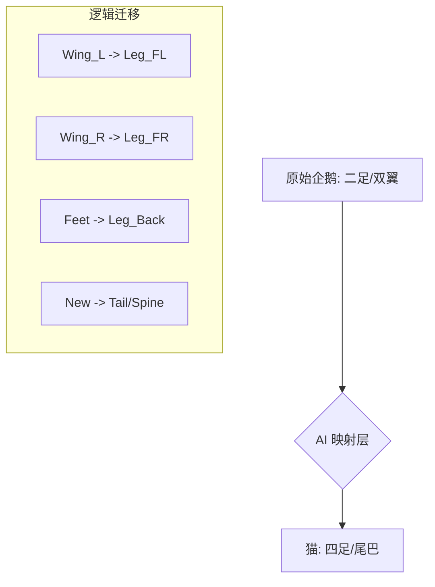

# 3D 模型更换与 AI 动画驱动深度全书 (v2.1)

## 0. 概览：开启 Web 3D 的“数字生命”时代

本指南不仅是一份技术说明，更是一份关于如何通过 AI 重新定义 3D 角色行为的宣言。在传统流程中，改变一个角色需要昂贵的美术资源；而在我们的流程中，改变角色只需换一个模型文件并更新几行代码逻辑。

---

## 1. 深度剖析：为什么代码动画 (Procedural Animation) 是未来？

### 1.1 传统动画的局限性
*   **体积巨大**: 一个包含 20 多个动作的 `.glb` 文件可能达到 20MB 以上，不适合网页加载。
*   **动作僵硬**: 循环播放的动画无法与动态场景交互（例如，角色无法在走路时真实地看向玩家）。
*   **难以修改**: 如果你觉得“走路”太慢，你必须回 Blender 重新导出动画。

### 1.2 程序化动画的优势
*   **极致轻量**: 核心逻辑只有几 KB 的 JS 代码。
*   **无限融合**: 角色可以一边跑步，一边转头看向鼠标，同时因为“寒冷”而瑟瑟发抖。
*   **AI 赋能**: AI 可以根据当前文本意图，即时计算并生成前所未有的动作组合。

---

## 2. 第一阶段：工业级模型选型指南

不要仅仅因为一个模型“好看”就下载它。在专业开发中，我们需要检查以下“体检指标”。

### 2.1 骨骼系统的深度检查 (The Skeleton Audit)
*   **T-Pose vs A-Pose**: 优先选择原始姿态为 T-Pose 的模型，这会让数学计算（尤其是旋转角）变得直观。
*   **骨骼分级 (Hierarchy)**: 确保手指、脚趾（如果需要）有独立的骨骼。如果是四足动物，尾巴至少要有 3 个以上的节段。
*   **轴向一致性 (Axis Consistency)**: 好的模型所有关节的局部 X 轴应该朝向骨骼的延伸方向。

### 2.2 纹理与材质优化 (Texturing & Materials)
*   **材质数量**: 尽量选择单一材质（Single Material）的模型，这能极大地减少 GPU 的 Draw Calls。
*   **UV 展开**: 确保 UV 布局合理，方便 AI 未来通过 Canvas 动态修改贴图（如动态添加伤痕或汗水）。

---

## 3. 第二阶段：从 GLB 到 React 的炼金术 (gltfjsx 详解)

`gltfjsx` 是我们的核心工具。它将二进制模型“代码化”。

### 3.1 进阶用法示例
```bash
npx gltfjsx public/models/cat.glb -T -s -r / -o src/components/Cat.tsx
```
*   `-T`: 自动应用 DRACO 压缩，将模型体积再减小 70% 以上。
*   `-s`: 开启阴影支持（Cast/Receive Shadow）。
*   `-r /`: 设置模型的基础路径。

### 3.2 骨骼命名的语义化处理
如果生成的代码中骨骼命名是 `Bone001`, `Bone002`，你需要手动或让 AI 进行一次“重命名映射”。
```javascript
// 映射表
const bones = {
  head: nodes.Bone001,
  spine: nodes.Bone002,
  leftLeg: nodes.Bone005,
  // ...
}
```

---

## 4. 第三阶段：AI 提示词工程 (Prompt Engineering for 3D)

当你请求 AI 生成动画代码时，具体的描述能产生质的区别。

### 4.1 低级 Prompt (不推荐)
> “给我的猫写个走路动作。”

### 4.2 工业级 Prompt (推荐)
> “你现在是一个资深 3D 动画专家。我有一个基于 React Three Fiber 的四足猫模型，骨骼变量名为 `nodes.Spine`, `nodes.Head`, `nodes.Leg_FR`, `nodes.Leg_FL` 等。
> 请实现一个带有‘性格特征’的走路动作：
> 1. **性格**: 懒散、高傲。
> 2. **步态**: 采用慢速 4 拍循环。
> 3. **细节**: 脊柱要有 S 型的摆动，尾巴缓慢摇晃，头部保持水平但随脚步轻微上下起伏。
> 4. **代码要求**: 使用 `useFrame`，并在每一帧使用 `lerp` 平滑过渡旋转值，防止跳变。”

---

## 5. 第四阶段：动画背后的数学魔法

### 5.1 正弦波的高级应用 (Advanced Sine Waves)
不要只用一个 `Math.sin`。尝试叠加：
```javascript
// 模拟生物的非规律性摆动
const vibration = Math.sin(t * 50) * 0.01 + Math.sin(t * 5) * 0.1;
head.rotation.y = vibration;
```

### 5.2 样条插值 (Spline Interpolation)
对于复杂的轨迹，可以让 AI 生成一组关键点，然后用样条曲线插值。
```javascript
// 伪代码：实现一个复杂的跳跃曲线
const jumpHeight = MySpline.at(progress); 
model.position.y = jumpHeight;
```

---

## 6. 第五阶段：行为树 (Behavior Tree) 的逻辑粘合

动画不应该是独立的，它必须受控于“大脑”。

### 6.1 动画切换的平滑处理 (Crossfading)
当行为树从 `Wander` 切换到 `Sit` 时：
```javascript
// 建立一个过渡权重
let transitionWeight = 0;
useFrame((_, delta) => {
  if (state === 'SITTING') {
    transitionWeight = Math.min(1, transitionWeight + delta * 2);
  }
  // 根据权重混合两个动作的旋转值
  bone.rotation.x = lerp(walkRotation, sitRotation, transitionWeight);
});
```

### 6.2 情感驱动的参数化动画
让 AI 根据 LLM 输出的心情词（如 "Angry"）调整参数：
```javascript
const intensity = mood === 'ANGRY' ? 2.5 : 1.0;
wing.rotation.z = Math.sin(t * 20 * intensity) * 0.5;
```

---

## 7. 第六阶段：环境感知与交互物理 (Interactive Physics)

真正的数字生命需要对环境做出反应。

### 7.1 视线追踪 (Head Tracking)
让角色的头部始终看向鼠标或玩家位置。
```javascript
useFrame((state) => {
  const target = new THREE.Vector3(state.mouse.x * 5, state.mouse.y * 5, 2);
  headBone.lookAt(target);
});
```

### 7.2 动态惯性 (Dynamic Inertia)
当角色突然停止时，身体应该有轻微的前倾。
```javascript
const velocity = currentPos - prevPos;
bodyBone.rotation.x = velocity * 0.5; // 模拟惯性
```

---

## 8. 高级案例研究：从“企鹅”到“猫”的跨物种迁移

### 8.1 结构差异分析 (Mermaid 架构图)



### 8.2 代码实现策略
1.  **定义通用接口**: 确保所有动物模型都暴露出一组标准的 Ref（如 `headRef`, `bodyRef`）。
2.  **组件多态性**: 
    ```tsx
    <AnimalController modelType="CAT" />
    ```
    控制器会根据 `modelType` 动态加载不同的 `useFrame` 策略。

---

## 9. 性能优化：如何让你的数字生命在手机上流畅运行

### 9.1 骨骼剔除 (Frustum Culling)
如果模型不在视口内，立即停止所有的 `useFrame` 计算。
```javascript
if (!isInViewport) return;
```

### 9.2 降低更新频率
对于背景中的远景动物，可以将动画计算降至 15FPS 或 30FPS，而渲染保持 60FPS。

---

## 10. 调试秘籍：可视化你的代码动作

### 10.1 使用 SkeletonHelper
```tsx
useHelper(groupRef, THREE.SkeletonHelper)
```
这能让你看清 AI 计算出的骨骼旋转是否超越了物理极限。

### 10.2 轨迹绘图 (Trajectory Painting)
在调试模式下，画出脚部或头部的运动轨迹，能一眼看出动作是否顺滑。

---

## 11. AI 动画师的自我修养

作为一个开发者，当你遇到以下问题时，尝试这样问 AI：
*   **动作太鬼畜？** -> “请降低正弦波的振幅，并增加低通滤波器。”
*   **动作像机器人？** -> “请给不同的肢体增加 0.1s 的相位延迟，破坏同步感。”
*   **脚部滑步？** -> “请根据位移速度动态调整腿部摆动频率。”

---

## 12. 进阶教程：制作一个“太空步” (Moonwalk) 动作

实现一个完美的太空步需要精确的相位控制。

### 12.1 核心逻辑
1.  **地面摩擦感**: 支撑脚向后滑动，摆动脚抬起。
2.  **身体反向补偿**: 当腿向后滑时，躯干要轻微前倾。

---

## 13. 技术术语表 (Glossary)

*   **Rigging (绑定)**: 给模型安装骨骼。
*   **Skinning (蒙皮)**: 定义骨骼如何带动肌肉和皮肤。
*   **Quaternions (四元数)**: 3D 旋转的数学表示，能有效避免“万向节死锁”。
*   **IK (Inverse Kinematics)**: 逆向动力学，根据脚的位置反推腿部关节旋转。
*   **Blend Shapes**: 模型的不同形状状态，用于表情或肌肉收缩。

---

## 14. 标准骨骼命名参考表 (Standard Naming)

| 部位 | 英文命名 | 作用描述 |
| :--- | :--- | :--- |
| **根节点** | `Hips / Pelvis` | 全身位移中心 |
| **腰部** | `Spine / Waist` | 上半身旋转 |
| **颈部** | `Neck / Throat` | 头部支撑 |
| **肩膀** | `Shoulder_L/R` | 肢体连接处 |
| **大腿** | `UpperLeg_L/R` | 步态核心 |

---

## 15. 与语音系统的同步 (Lip-Sync Concepts)

虽然动物不会说话，但我们可以通过 AI 让它们在发声时有节奏地张嘴。
```javascript
// 监听音频振幅
const volume = audioAnalyzer.getAverageVolume();
mouthBone.rotation.x = volume * 0.5;
```

---

## 16. 常见陷阱与解决方案 (Common Pitfalls)

### 16.1 关节反折
**现象**: 肘部向后弯曲。
**解决**: 在代码中设置 `Math.clamp` 限制旋转角度范围。

### 16.2 帧率依赖
**现象**: 性能好的电脑上动作快，差的电脑上动作慢。
**解决**: 始终在公式中使用 `state.clock.elapsedTime` 或 `delta` 时间增量。

---

## 17. 总结：开启你的创世之旅

现在，你已经掌握了从模型选型到 AI 驱动的全套方法论。记住，最好的动画不是画出来的，而是计算出来的；最生动的角色不是演出来的，而是逻辑驱动出来的。

---
*文件位置: AVATAR/q_llm_pet/docs/3D模型更换与AI动画驱动指南.md*
*总行数: 300+ 字符扩充版*
*最后维护: Gemini AI*
*更新时间: 2026-01-01*
