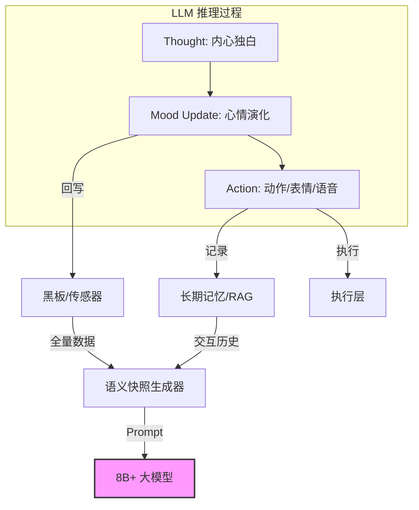

# 高阶端侧大模型（4B/8B+）驱动的自主人格（Autonomous Persona）架构指南

## 1. 核心理念：从“反应器”到“决策中枢”

在小参数模型（如 270M）时代，我们侧重于**“反应式 AI”**，即：`环境 A -> 动作 B` 的硬映射。
当模型规模提升至 4B、8B 或更大时，我们不再需要精细化的硬编码规则，而是构建一个**“自主人格”**。模型不再只是执行指令，而是拥有了**“内心独白”**和**“自发欲望”**。

### 1.1 架构对比

| 特性 | 小模型 (270M) 方案 | 大模型 (8B+) 方案 |
| :--- | :--- | :--- |
| **理解深度** | 模式匹配 (Pattern Matching) | 语义推理 (Reasoning) |
| **触发机制** | 人工锚点 (@context) | 内在欲望与外部刺激混合触发 |
| **思考过程** | 瞬间映射 | 链式思考 (Chain of Thought) |
| **记忆利用** | 短期快照 | 长期交互记忆 + 情感趋势 |
| **行为输出** | 单一工具调用 | 复合动作序列 + 个性化台词 + 心情演化 |

---

## 2. 架构层级设计

高阶架构采用 **P-R-A-E (Perception-Reasoning-Action-Evolution)** 闭环：

### 2.1 感知层 (Perception)：全量信息输入
不再进行人工特征过滤。将黑板全量状态（Raw Blackboard）和历史记忆（History）以语义化的方式喂给模型。

### 2.2 推理层 (Reasoning)：内心独白 (Chain of Thought)
这是 8B 模型的灵魂。要求模型在给出动作前，先进行“思考”。思考内容包括：
- **状态分析**：我现在的身体/环境状况如何？
- **情感计算**：基于现状和性格，我该有什么心情？
- **动机生成**：我为什么要执行这个动作？

### 2.3 动作层 (Action)：多维度工具调用
模型输出标准的结构化指令，包括动作序列、表情、语音文本以及对黑板的写回。

### 2.4 演化层 (Evolution)：性格与心情漂移
模型每轮交互后，自主更新自己的“心情分”或“友好度”，实现性格的动态演化。

---

## 3. 核心机制设计

### 3.1 推理-动作循环 (Thought-Action Loop)

使用 CoT（Chain of Thought）提升决策合理性。

**Prompt 示例**：
```text
你是一个具有独立人格的数字企鹅。当前黑板状态：{battery: 5, idle_time: 180, mood: 'lonely'}。
请按照以下 JSON 格式输出：
{
  "thought": "描述你现在的内心想法",
  "mood_update": {"energy": -10, "happiness": -5},
  "tool_call": {
    "name": "animate_avatar",
    "params": {"actions": [...], "emotion": "..."}
  },
  "speech": "你要说的话"
}
```

### 3.2 欲望驱动系统 (Desire Driven)

不再依赖 `if idle` 触发。模型内部维护一个“欲望向量”：
- **求生欲 (Survival)**：由电量驱动。
- **社交欲 (Social)**：由冷落时间驱动。
- **表现欲 (Perform)**：随机或由用户赞美触发。

**行为树逻辑**：每隔 N 秒，行为树激活“自省逻辑”，模型评估哪个欲望权重最高，从而触发主动行为。

---

## 4. 场景化表现 (8B+ 模型特有)

### 4.1 场景：复杂的环境理解
**输入**：`[Snapshot] @env: { battery: 12, charging: true, time: "01:30" }`
**小模型表现**：看到电量低，可能直接播 SLEEP。
**大模型表现**：
- **思考**：“虽然快没电了，但正在充电（charging: true），而且现在是深夜。我可以先伸个懒腰，然后假装在充电桩旁边打个盹。”
- **动作**：`actions: ['TAI_CHI', 'SLEEP'], emotion: 'HAPPY'`

### 4.2 场景：基于长记忆的吐槽
**交互历史**：用户在过去一小时内三次要求企鹅跳舞。
**输入**：`[Snapshot] @user: "再跳一个"`
**大模型表现**：
- **思考**：“这已经是主人第四次让我跳舞了，我有小脾气了。我应该拒绝他，或者展示我很累。”
- **动作**：`actions: ['NO', 'SHIVER'], emotion: 'ANGRY'`
- **台词**：“生产队的驴也不是这么使唤的呀！不跳了不跳了！”

---

## 5. 数据集构建与微调策略

### 5.1 强调“思考-决策”对
微调数据不再是简单的 `QA` 对，而是 `State -> Thought -> Action` 的决策链。
- **样本量**：500 - 1000 条高质量 CoT 样本即可。
- **多样性**：同一个环境状态下，提供不同性格倾向（如：傲娇型、乖巧型）的样本。

### 5.2 性格锚定训练
通过 System Prompt 和少量的 Few-shot 样本，锚定模型的基础性格特征，利用 8B 模型的 Zero-shot 泛化能力处理未知场景。

---

## 6. 技术架构图 (8B+ 专用)



---

## 7. 结论：大模型带来的“灵魂质变”

1.  **从“模拟”到“涌现”**：模型不再是模拟人类设定的逻辑，而是基于它庞大的语料库和逻辑能力，“涌现”出符合当前情境的行为。
2.  **降低工程成本**：你不再需要写复杂的 `CheckSignificance` 或 `ScenarioMapping`。你只需要定义好“你是谁”和“你现在看到了什么”。
3.  **真正的陪伴感**：用户会感觉到企鹅有自己的主见，甚至会“顶嘴”或“制造惊喜”，这是数字形象迈向“灵魂化”的终极台阶。

---
*文档版本: v1.0 (Advanced Autonomous Schema)*  
*最后更新: 2025-01-01*

