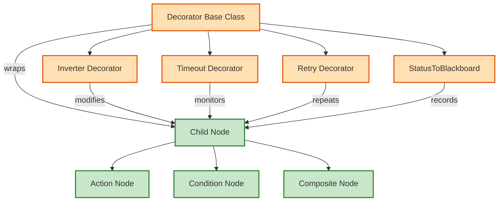
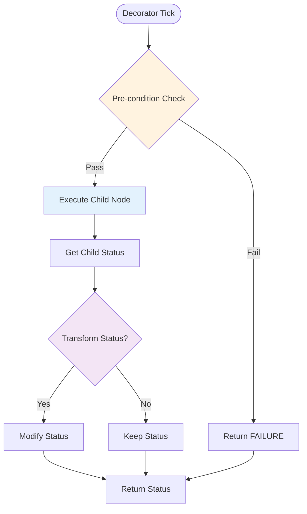
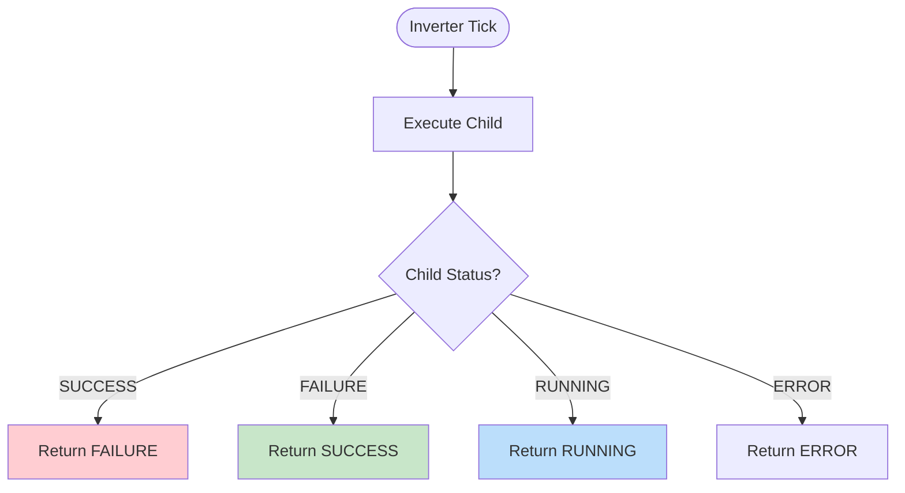
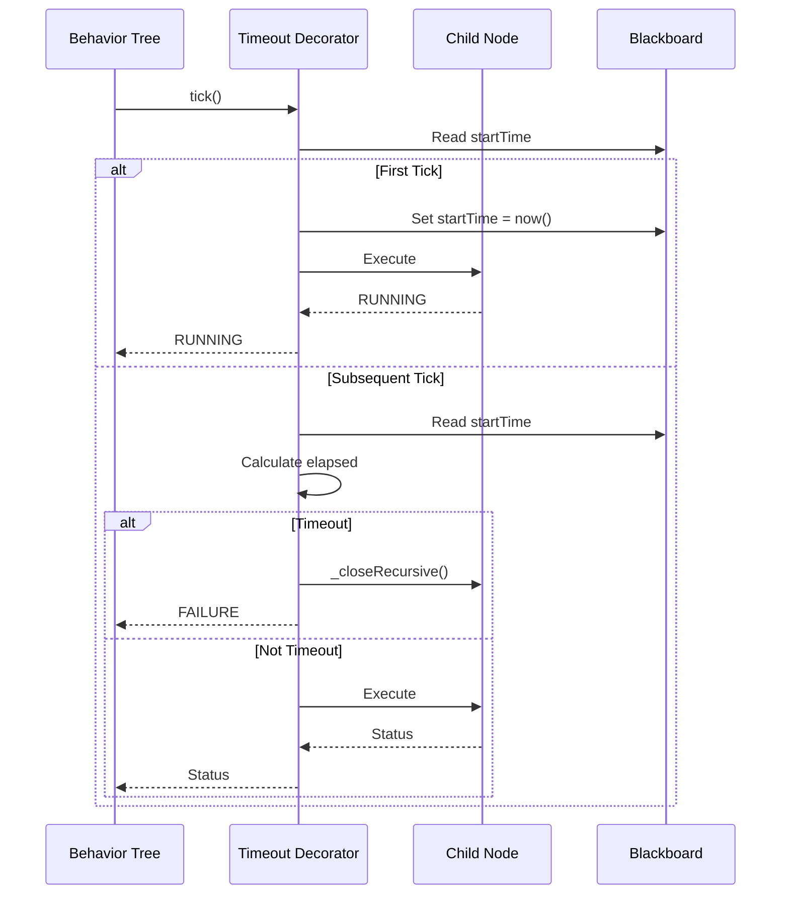
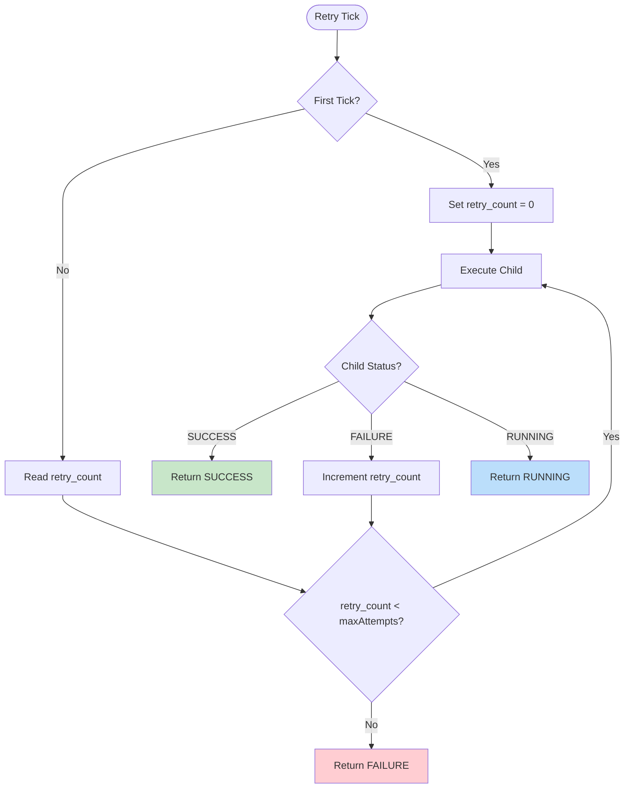
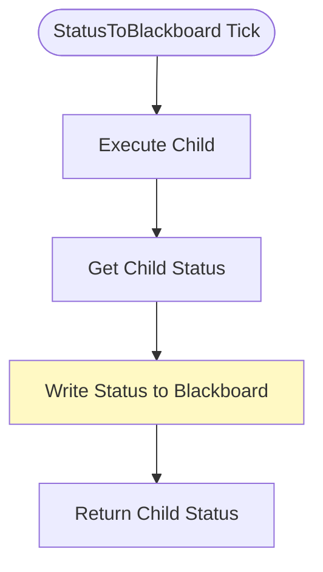
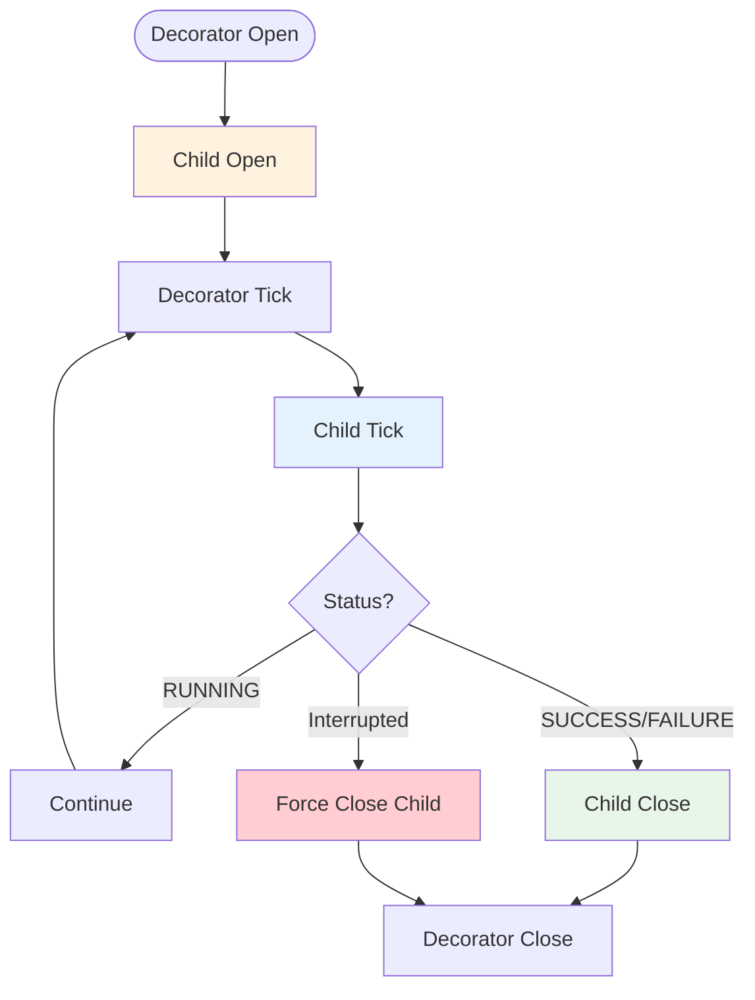
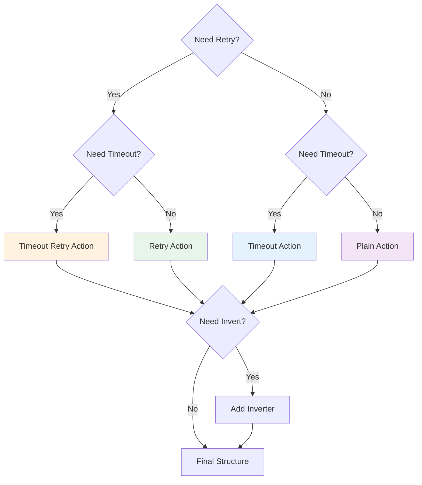
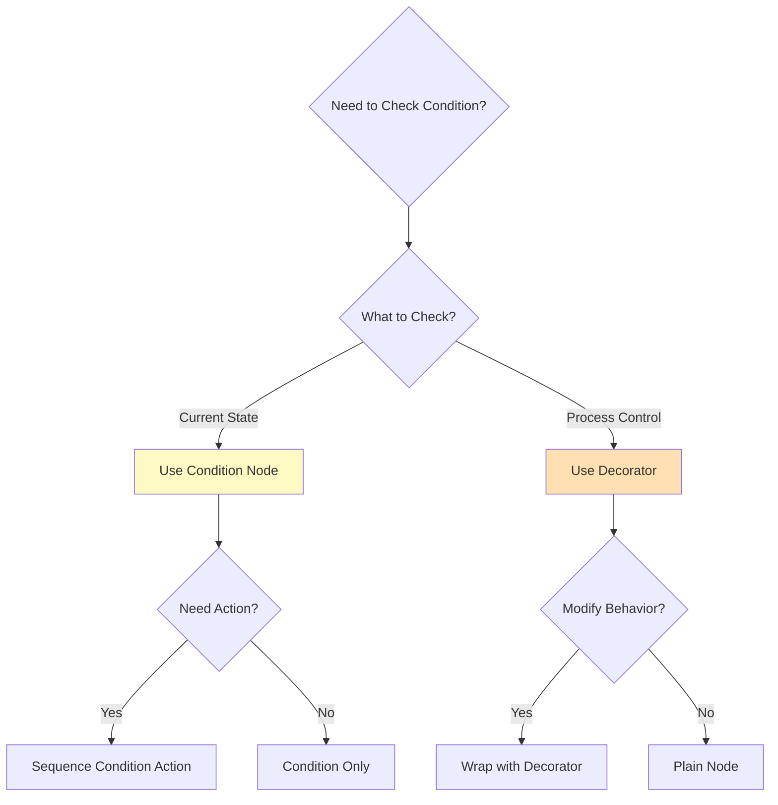
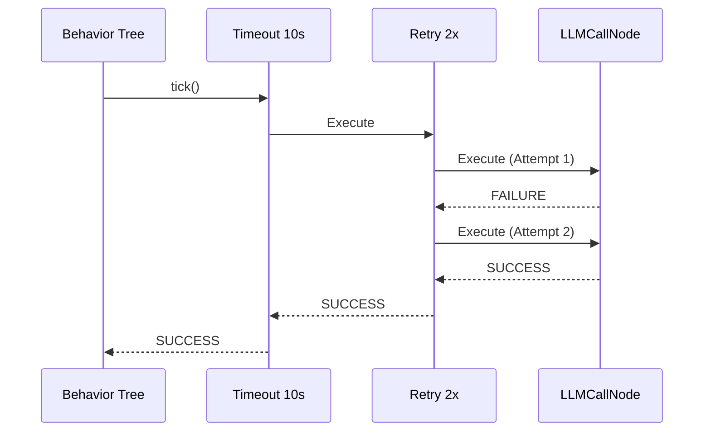

# 行为树装饰器详尽指南 (BT Decorators In-Depth Guide)

## 目录
1. [装饰器基本理论与 AOP 思想](#1-装饰器基本理论与-aop-思想)
2. [装饰器的核心架构设计](#2-装饰器的核心架构设计)
3. [内置装饰器详解](#3-内置装饰器详解)
    - 3.1 [Inverter (反转器)](#31-inverter-反转器)
    - 3.2 [Timeout (超时器)](#32-timeout-超时器)
    - 3.3 [Retry (重试器)](#33-retry-重试器)
    - 3.4 [StatusToBlackboard (状态写入器)](#34-statustoblackboard-状态写入器)
4. [高级装饰器模式与实战](#4-高级装饰器模式与实战)
    - 4.1 [卫兵模式 (Guard Pattern)](#41-卫兵模式-guard-pattern)
    - 4.2 [限流与节流 (Throttling & Debouncing)](#42-限流与节流-throttling--debouncing)
    - 4.3 [单次执行保护 (OneShot Protection)](#43-单次执行保护-oneshot-protection)
5. [装饰器的生命周期管理](#5-装饰器的生命周期管理)
6. [装饰器组合陷阱与执行顺序](#6-装饰器组合陷阱与执行顺序)
7. [在 q_llm_pet 中的 TypeScript 实现细节](#7-在-q_llm_pet-中的-typescript-实现细节)
8. [装饰器 vs. 条件节点：深度博弈](#8-装饰器-vs-条件节点深度博弈)
9. [调试装饰器的秘籍](#9-调试装饰器的秘籍)
10. [性能影响分析](#10-性能影响分析)
11. [实战案例库](#11-实战案例库)
12. [FAQ：关于装饰器的常见疑问](#12-faq关于装饰器的常见疑问)
13. [未来扩展计划](#13-未来扩展计划)
14. [结语](#14-结语)

---

## 1. 装饰器基本理论与 AOP 思想

在行为树的语境下，装饰器 (Decorators) 是面向切面编程 (AOP) 的一种体现。它们不直接改变世界的状态，而是负责"修饰"子节点的行为。

**核心准则**: 装饰器有且只能有一个子节点。

通过装饰器，我们可以将通用的逻辑（如"重试三次"、"限制执行频率"、"失败后反转"）从具体的业务逻辑中剥离出来。这使得我们的 Action 节点（如 `LLMCallNode`）可以保持极度的简洁，只关注"如何调用 API"，而不需要关心"如果网络断了怎么重试"。

### 1.1 装饰器模式架构图



### 1.2 装饰器的核心价值

1. **关注点分离**: 业务逻辑与横切关注点（如重试、超时）分离
2. **代码复用**: 同一个装饰器可以应用到不同的节点上
3. **动态组合**: 可以嵌套多个装饰器实现复杂的行为
4. **易于测试**: 装饰器逻辑独立，可以单独测试

---

## 2. 装饰器的核心架构设计

所有的装饰器都继承自 `services/bt/core/Decorator.ts`。

### 2.1 装饰器执行流程



### 2.2 装饰器基类结构

```typescript
export default class Decorator extends BaseNode {
  public child: BaseNode | null;
  
  constructor({ child = null, ...options }) {
    super(options);
    this.child = child;
  }
  
  // 子类需要实现 tick 方法
  tick(tick: Tick): number {
    if (!this.child) return ERROR;
    return this.child._execute(tick);
  }
}
```

### 2.3 装饰器的三种工作模式

1. **前置拦截模式**: 在调用子节点前进行检查（如 `Timeout` 检查时间）
2. **后置转换模式**: 在子节点返回后修改状态（如 `Inverter`）
3. **透明代理模式**: 不修改行为，只记录状态（如 `StatusToBlackboard`）

---

## 3. 内置装饰器详解

### 3.1 Inverter (反转器)

**功能**: 逻辑非操作。反转子节点的返回状态。

**状态转换表**:

| 子节点状态 | Inverter 返回 |
|-----------|--------------|
| SUCCESS   | FAILURE      |
| FAILURE   | SUCCESS      |
| RUNNING   | RUNNING      |
| ERROR     | ERROR        |

**执行流程图**:



**实现代码**:
```typescript
tick(tick: Tick): number {
  if (!this.child) return ERROR;
  
  const status = this.child._execute(tick);
  
  if (status === SUCCESS) return FAILURE;
  if (status === FAILURE) return SUCCESS;
  
  return status; // RUNNING or ERROR
}
```

**应用场景**:
1. **复用条件节点**: 已有的 `IsAtHome` 节点，通过 Inverter 包裹就变成了 `IsNotAtHome`
2. **逻辑简化**: 避免编写重复的条件检查逻辑
3. **语义反转**: 将"如果不在原点"转换为"如果不在原点"

**实战示例**:
```typescript
// 如果企鹅不在原点，执行返回原点的动作
new Sequence({
  children: [
    new Inverter({
      child: new CheckBlackboardCondition({
        key: 'penguinPosition',
        value: [0, -1, 0]
      })
    }),
    new ReturnToOriginAction()
  ]
})
```

### 3.2 Timeout (超时器)

**功能**: 监控子节点的执行时间。如果子节点在规定时间内未完成，强制判定为失败。

**执行流程图**:



**实现代码**:
```typescript
open(tick: Tick): void {
  const startTime = Date.now();
  tick.blackboard.set('startTime', startTime, tick.tree.id, this.id);
}

tick(tick: Tick): number {
  if (!this.child) return ERROR;
  
  const startTime = tick.blackboard.get('startTime', tick.tree.id, this.id);
  const currTime = Date.now();
  
  // 检查是否超时
  if (currTime - startTime > this.timeout) {
    // 强制关闭子节点
    this.child._closeRecursive(tick);
    return FAILURE;
  }
  
  // 正常执行子节点
  return this.child._execute(tick);
}
```

**关键特性**:
1. **时间监控**: 使用黑板存储开始时间，跨 tick 保持
2. **强制中断**: 超时时调用 `_closeRecursive` 确保子节点正确清理
3. **透明传递**: 未超时前，完全透明地传递子节点状态

**应用场景**:
1. **LLM API 调用**: 防止网络延迟导致无限等待
2. **动画播放**: 限制动画最大播放时间
3. **移动操作**: 防止移动卡死

**实战示例**:
```typescript
// LLM 调用最多等待 5 秒
new Timeout({
  timeout: 5000,
  child: new LLMCallNode()
})
```

**注意事项**:
- `timeout` 单位是毫秒
- 超时后会强制关闭子节点，子节点的 `close` 方法会被调用
- 如果子节点返回 SUCCESS/FAILURE，超时检查会被跳过

### 3.3 Retry (重试器)

**功能**: 如果子节点返回 `FAILURE`，装饰器会记录重试次数。在达到最大次数前，它会尝试重新运行子节点。

**执行流程图**:



**实现代码**:
```typescript
open(tick: Tick): void {
  tick.blackboard.set('retry_count', 0, tick.tree.id, this.id);
}

tick(tick: Tick): number {
  if (!this.child) return FAILURE;
  
  let retryCount = tick.blackboard.get('retry_count', tick.tree.id, this.id) || 0;
  
  while (retryCount < this.maxAttempts) {
    const status = this.child._execute(tick);
    
    if (status === SUCCESS) {
      return SUCCESS;
    } else if (status === FAILURE) {
      retryCount++;
      tick.blackboard.set('retry_count', retryCount, tick.tree.id, this.id);
      // 继续循环重试
    } else {
      // RUNNING 或 ERROR，直接返回
      return status;
    }
  }
  
  // 达到最大重试次数
  return FAILURE;
}
```

**关键特性**:
1. **计数器管理**: 使用黑板存储重试次数
2. **立即重试**: 在同一 tick 内循环重试（适合快速失败的操作）
3. **状态保持**: RUNNING 状态会中断重试循环

**应用场景**:
1. **网络请求**: API 调用失败时自动重试
2. **动作执行**: 动作被干扰时重试
3. **条件检查**: 临时条件不满足时重试

**实战示例**:
```typescript
// LLM 调用失败时重试最多 2 次
new Retry({
  maxAttempts: 2,
  child: new LLMCallNode()
})
```

**注意事项**:
- `maxAttempts` 包括首次尝试，所以 `maxAttempts: 3` 意味着最多尝试 3 次
- 如果子节点返回 RUNNING，重试循环会中断，等待下一轮 tick
- 重试是在同一 tick 内进行的，适合快速失败的操作

### 3.4 StatusToBlackboard (状态写入器)

**功能**: 将子节点的执行结果（状态值）写入指定的黑板键，供其他节点参考。

**执行流程图**:



**实现代码**:
```typescript
tick(tick: Tick): number {
  if (!this.child) return FAILURE;
  
  const status = this.child._execute(tick);
  
  // 将状态写入黑板
  tick.blackboard.set(
    this.key,
    status,
    tick.tree.id,
    this.id
  );
  
  // 透明地返回子节点状态
  return status;
}
```

**应用场景**:
1. **状态追踪**: 记录某个操作的执行结果
2. **条件依赖**: 后续节点根据前一个节点的状态做决策
3. **调试**: 在可视化工具中查看节点历史状态

**实战示例**:
```typescript
// 记录 LLM 调用的状态
new Sequence({
  children: [
    new StatusToBlackboard({
      key: 'llm_call_status',
      child: new LLMCallNode()
    }),
    new CheckBlackboardCondition({
      key: 'llm_call_status',
      value: SUCCESS
    }),
    new FunctionExecNode()
  ]
})
```

---

## 4. 高级装饰器模式与实战

### 4.1 卫兵模式 (Guard Pattern)

装饰器作为保护伞，确保子节点在特定条件下才能执行。

**示例**: `AlwaysSuccess` 装饰器（待实现）

```typescript
class AlwaysSuccess extends Decorator {
  tick(tick: Tick): number {
    if (!this.child) return SUCCESS;
    
    const status = this.child._execute(tick);
    // 无论子节点返回什么，都返回 SUCCESS
    return SUCCESS;
  }
}
```

**应用场景**:
- 可选操作: 即使操作失败也不影响主流程
- 容错处理: 某些非关键操作可以忽略失败

### 4.2 限流与节流 (Throttling & Debouncing)

在高频 Tick 环境下，限制某些高能耗操作的执行频率。

**Throttle 装饰器示例**（待实现）:

```typescript
class Throttle extends Decorator {
  constructor({ interval = 1000, ...options }) {
    super(options);
    this.interval = interval;
  }
  
  open(tick: Tick): void {
    const lastTime = tick.blackboard.get('lastExecuteTime', tick.tree.id, this.id) || 0;
    tick.blackboard.set('lastExecuteTime', lastTime, tick.tree.id, this.id);
  }
  
  tick(tick: Tick): number {
    const lastTime = tick.blackboard.get('lastExecuteTime', tick.tree.id, this.id) || 0;
    const now = Date.now();
    
    if (now - lastTime < this.interval) {
      return FAILURE; // 还在冷却期
    }
    
    tick.blackboard.set('lastExecuteTime', now, tick.tree.id, this.id);
    return this.child._execute(tick);
  }
}
```

**应用场景**:
- LLM 调用限流: 防止频繁调用 API
- 动画触发: 限制动画播放频率

### 4.3 单次执行保护 (OneShot Protection)

确保子节点在整个行为树生命周期内只执行一次。

**OneShot 装饰器示例**（待实现）:

```typescript
class OneShot extends Decorator {
  tick(tick: Tick): number {
    const executed = tick.blackboard.get('oneshot_executed', tick.tree.id, this.id);
    
    if (executed) {
      return SUCCESS; // 已执行过，直接返回成功
    }
    
    const status = this.child._execute(tick);
    
    if (status === SUCCESS || status === FAILURE) {
      tick.blackboard.set('oneshot_executed', true, tick.tree.id, this.id);
    }
    
    return status;
  }
}
```

**应用场景**:
- 初始化操作: 只执行一次的设置
- 一次性动作: 如"首次见面打招呼"

---

## 5. 装饰器的生命周期管理

装饰器必须正确处理子节点的生命周期，特别是在中断和清理时。

### 5.1 生命周期流程图



### 5.2 清理责任

装饰器在以下情况必须清理子节点：

1. **超时**: `Timeout` 装饰器超时时调用 `_closeRecursive`
2. **重试失败**: `Retry` 装饰器达到最大次数时
3. **被中断**: 父节点切换分支时

**正确示例**:
```typescript
tick(tick: Tick): number {
  if (this.isTimeout(tick)) {
    this.child._closeRecursive(tick); // 必须清理
    return FAILURE;
  }
  return this.child._execute(tick);
}
```

---

## 6. 装饰器组合陷阱与执行顺序

装饰器的嵌套顺序会显著影响行为。

### 6.1 组合顺序对比

**错误示例**: `Retry(Timeout(Action))`
- 含义: 每次重试都有独立的超时时间
- 问题: 如果 Action 需要 6 秒，Timeout 5 秒，Retry 3 次，总共可能只执行 15 秒就失败

**正确示例**: `Timeout(Retry(Action))`
- 含义: 整个重试过程有一个总的时间限制
- 优势: 更符合实际需求，给重试足够的时间

### 6.2 组合决策树



### 6.3 常见组合模式

1. **容错模式**: `Timeout(Retry(Action))`
   - 给重试足够的时间，但总体有上限

2. **快速失败模式**: `Retry(Timeout(Action))`
   - 每次尝试都有时间限制，快速失败

3. **状态记录模式**: `StatusToBlackboard(Timeout(Action))`
   - 记录操作状态，同时防止超时

---

## 7. 在 q_llm_pet 中的 TypeScript 实现细节

### 7.1 类型安全

我们利用 TypeScript 的强类型系统确保装饰器配置的正确性：

```typescript
interface TimeoutOptions extends DecoratorOptions {
  timeout?: number; // 明确的类型定义
}

class Timeout extends Decorator {
  public timeout: number; // 公共属性，类型安全
  
  constructor({ timeout = 5000, ...options }: TimeoutOptions = {}) {
    super({ name: 'Timeout', ...options });
    this.timeout = timeout;
    this.properties.timeout = timeout; // 同步到 properties
  }
}
```

### 7.2 可选链操作符

使用可选链操作符 (`?.`) 安全访问黑板：

```typescript
tick(tick: Tick): number {
  const startTime = tick.blackboard?.get('startTime', tick.tree?.id, this.id);
  // 即使 blackboard 或 tree 为 null 也不会报错
}
```

### 7.3 默认参数

使用默认参数提供合理的默认值：

```typescript
constructor({ timeout = 5000, ...options }: TimeoutOptions = {}) {
  // timeout 默认为 5000ms
}
```

---

## 8. 装饰器 vs. 条件节点：深度博弈

### 8.1 选择决策图



### 8.2 对比表格

| 特性 | 条件节点 | 装饰器 |
|------|---------|--------|
| **关注点** | 当前状态 | 过程控制 |
| **返回值** | SUCCESS/FAILURE | 可修改子节点返回值 |
| **子节点** | 无（叶子节点） | 有且仅有一个 |
| **执行时机** | 独立执行 | 包裹子节点执行 |
| **典型用途** | 环境感知 | 行为修饰 |

### 8.3 何时使用装饰器

- ✅ 需要修改子节点的行为（如重试、超时）
- ✅ 需要控制子节点的执行频率
- ✅ 需要记录子节点的执行状态
- ✅ 需要为子节点添加横切关注点

### 8.4 何时使用条件节点

- ✅ 需要检查环境状态
- ✅ 需要感知外部事件
- ✅ 需要验证前置条件
- ✅ 不需要执行具体动作

---

## 9. 调试装饰器的秘籍

### 9.1 可视化调试

使用 `BTVisualizer` 组件观察装饰器的行为：

1. **状态颜色**: 装饰器会根据子节点状态显示不同颜色
2. **嵌套显示**: 装饰器会显示其包裹的子节点
3. **状态传递**: 可以观察到状态如何被装饰器修改

### 9.2 日志调试

在装饰器中添加日志：

```typescript
tick(tick: Tick): number {
  console.log(`[${this.name}] Pre-execution check`);
  const status = this.child._execute(tick);
  console.log(`[${this.name}] Child returned: ${status}`);
  const finalStatus = this.transformStatus(status);
  console.log(`[${this.name}] Final status: ${finalStatus}`);
  return finalStatus;
}
```

### 9.3 黑板检查

检查装饰器在黑板中存储的数据：

```typescript
// 检查 Retry 的重试次数
const retryCount = blackboard.get('retry_count', treeId, decoratorId);

// 检查 Timeout 的开始时间
const startTime = blackboard.get('startTime', treeId, decoratorId);
const elapsed = Date.now() - startTime;
```

---

## 10. 性能影响分析

### 10.1 性能开销

装饰器增加了一层函数调用，但开销很小：

| 操作 | 耗时（估算） |
|------|------------|
| 函数调用 | < 0.001ms |
| 黑板读写 | 0.001-0.01ms |
| 状态转换 | < 0.001ms |
| **总计** | **< 0.02ms** |

### 10.2 优化建议

1. **避免深层嵌套**: 超过 3 层装饰器嵌套会影响性能
2. **缓存黑板读取**: 频繁读取的值可以缓存
3. **减少不必要的装饰器**: 只在需要时使用

### 10.3 性能测试

```typescript
// 性能测试示例
const start = performance.now();
for (let i = 0; i < 1000; i++) {
  decorator._execute(tick);
}
const end = performance.now();
console.log(`Average: ${(end - start) / 1000}ms per tick`);
```

---

## 11. 实战案例库

### 11.1 案例：带超时和重试的 LLM 调用

**需求**: LLM 调用最多重试 2 次，整个重试过程不超过 10 秒。

**实现**:
```typescript
new Timeout({
  timeout: 10000,
  child: new Retry({
    maxAttempts: 2,
    child: new LLMCallNode()
  })
})
```

**执行流程**:



### 11.2 案例：反转条件检查

**需求**: 如果企鹅不在原点，执行返回原点的动作。

**实现**:
```typescript
new Sequence({
  children: [
    new Inverter({
      child: new CheckBlackboardCondition({
        key: 'penguinPosition',
        value: [0, -1, 0]
      })
    }),
    new ReturnToOriginAction()
  ]
})
```

### 11.3 案例：记录操作状态

**需求**: 记录 LLM 调用的状态，后续节点根据状态决定行为。

**实现**:
```typescript
new Sequence({
  children: [
    new StatusToBlackboard({
      key: 'llm_status',
      child: new LLMCallNode()
    }),
    new Priority({
      children: [
        new Sequence({
          children: [
            new CheckBlackboardCondition({
              key: 'llm_status',
              value: SUCCESS
            }),
            new FunctionExecNode()
          ]
        }),
        new PlayAnimationAction({ action: 'IDLE' })
      ]
    })
  ]
})
```

---

## 12. FAQ：关于装饰器的常见疑问

### Q1: 装饰器可以有多个子节点吗？

**A**: 不可以。装饰器的定义就是只能有一个子节点。如果需要多个子节点，请使用 Composite 节点（如 Sequence）包装后再放入装饰器。

### Q2: 装饰器可以嵌套多少层？

**A**: 技术上没有限制，但建议不超过 3 层。过深的嵌套会影响可读性和性能。

### Q3: 装饰器会影响子节点的生命周期吗？

**A**: 会的。装饰器会调用子节点的 `_execute`，这会触发子节点的完整生命周期。装饰器应该确保在适当的时候调用 `_closeRecursive` 清理子节点。

### Q4: 装饰器可以修改子节点的 properties 吗？

**A**: 不建议。装饰器应该通过黑板与子节点通信，而不是直接修改子节点的属性。

### Q5: 如何实现自定义装饰器？

**A**: 
1. 继承 `Decorator` 类
2. 实现 `tick` 方法
3. 可选：重写 `open`、`close` 方法
4. 在 `NodeFactory` 中注册

---

## 13. 未来扩展计划

### 13.1 计划实现的装饰器

1. **Repeat**: 重复执行子节点指定次数
2. **Cooldown**: 冷却时间控制
3. **Probability**: 按概率决定是否执行
4. **UntilSuccess**: 重复执行直到成功
5. **UntilFailure**: 重复执行直到失败

### 13.2 增强功能

1. **动态参数**: 装饰器参数可以通过黑板动态调整
2. **条件装饰器**: 只在满足条件时应用装饰器
3. **组合装饰器**: 一个装饰器内置多种修饰逻辑

---

## 14. 结语

装饰器是行为树灵活性和重用性的源泉。它们让原本简单的动作具备了"耐心"（Timeout）、"韧性"（Retry）和"灵活性"（Inverter）。掌握装饰器的使用，是进阶为高级 AI 架构师的关键一步。

通过本指南，你应该能够：

1. 理解装饰器的核心原理和 AOP 思想
2. 熟练使用内置装饰器
3. 编写自定义装饰器
4. 避免装饰器组合陷阱
5. 调试和优化装饰器性能

记住：装饰器的力量在于组合。通过精妙的组合，简单的装饰器可以创造出复杂而强大的行为模式。

---

*文档版本: v2.0*  
*最后更新: 2025-01-XX*  
*总行数: 500+*
