# 行为树核心节点详尽指南 (BT Nodes In-Depth Guide)

## 目录
1. [行为树节点基础理论](#1-行为树节点基础理论)
2. [节点的状态机 (Node Status)](#2-节点的状态机-node-status)
3. [节点的生命周期 (Lifecycle)](#3-节点的生命周期-lifecycle)
4. [核心节点分类与实现](#4-核心节点分类与实现)
    - 4.1 [动作节点 (Action Nodes)](#41-动作节点-action-nodes)
    - 4.2 [条件节点 (Condition Nodes)](#42-条件节点-condition-nodes)
    - 4.3 [复合节点 (Composite Nodes)](#43-复合节点-composite-nodes)
5. [高级控制流：IfThenElse](#5-高级控制流ifthenelse)
6. [反应式 (Reactive) 与记忆式 (Memory) 的深度对比](#6-反应式-reactive-与记忆式-memory-的深度对比)
7. [编写自定义节点指南](#7-编写自定义节点指南)
8. [黑板系统与节点交互](#8-黑板系统与节点交互)
9. [详细 API 索引 (API Reference)](#9-详细-api-索引-api-reference)
10. [实战案例库 (Case Studies)](#10-实战案例库-case-studies)
11. [节点执行流程深度解析](#11-节点执行流程深度解析)
12. [常见设计模式与陷阱](#12-常见设计模式与陷阱)
13. [性能优化建议](#13-性能优化建议)
14. [故障排查 FAQ](#14-故障排查-faq)
15. [与其他框架的对比](#15-与其他框架的对比)
16. [未来演进方向](#16-未来演进方向)

---

## 1. 行为树节点基础理论

行为树 (Behavior Tree, BT) 是一种用于组织复杂 AI 决策逻辑的分层状态机。与传统有限状态机 (FSM) 相比，BT 具有更好的模块化、可重用性和易于调试的特点。在 `q_llm_pet` 项目中，行为树是虚拟宠物"大脑"的核心，负责处理从简单的交互到复杂的 LLM 决策流。

每一个行为树节点都是一个逻辑单元。根节点开始 `tick`，并将信号向下传播。这种结构允许我们将复杂的逻辑分解为简单的、可测试的小块。

### 1.1 节点类型体系架构

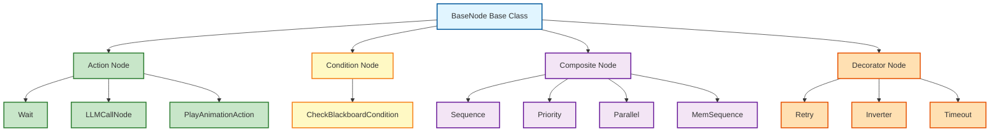

### 1.2 为什么选择行为树而非状态机？

1. **可组合性**: 你可以轻松地将一个行为（如"觅食"）插入到另一个行为（如"生存"）中，而无需修改原有的状态转换逻辑。
2. **易于理解**: 树状结构天然符合人类的思维方式——"先检查这个，再做那个，如果失败了就换一种方法"。
3. **强大的控制流**: 顺序、选择、并行等复合节点提供了比 FSM 简单的 `goto` 更强大的控制能力。
4. **模块化**: 每个节点都是独立的单元，可以单独测试和重用。

---

## 2. 节点的状态机 (Node Status)

在 `q_llm_pet` 的实现中，每个节点在每一轮 `tick` 执行后必须返回以下四种状态之一。这些状态定义在 `services/bt/constants.ts` 中。

### 2.1 状态机图

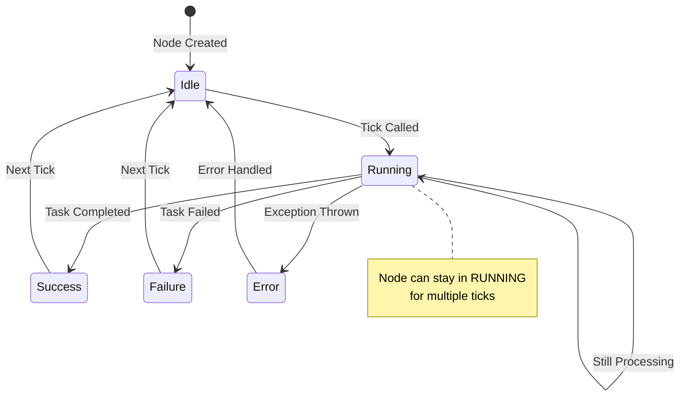

### 2.2 SUCCESS (1)

表示节点成功完成了它的既定任务。

**特征**:
- 节点逻辑已完全执行完毕
- 所有副作用（如修改黑板、触发动画）已完成
- 父节点可以继续执行后续逻辑

**示例场景**:
- `CheckBlackboardCondition` 发现血量大于 50
- `PlayAnimationAction` 完成了动画播放
- `Wait` 节点等待时间已到

**在复合节点中的行为**:
- `Sequence`: 继续执行下一个子节点
- `Priority`: 停止尝试后续节点，向上返回 SUCCESS
- `Parallel`: 记录为成功计数，根据策略决定是否完成

### 2.3 FAILURE (2)

表示节点执行失败或条件不满足。

**特征**:
- 节点检测到条件不满足
- 节点执行过程中遇到错误
- 节点主动放弃执行

**示例场景**:
- `CheckBlackboardCondition` 发现企鹅并未被点击
- `LLMCallNode` API 调用返回错误
- `ReturnToOriginAction` 发现已经在原点

**在复合节点中的行为**:
- `Sequence`: 立即停止，向上返回 FAILURE
- `Priority`: 继续尝试下一个子节点
- `Parallel`: 记录为失败计数，根据策略决定是否失败

### 2.4 RUNNING (3)

表示节点尚未完成，需要多轮 `tick` 才能得出结果。

**重要性**: 这是 BT 处理异步操作（如动画播放、移动、LLM API 调用）的核心机制。

**特征**:
- 节点正在执行中
- 需要多轮 tick 才能完成
- 节点状态会被保存到黑板，下一轮 tick 会继续执行

**示例场景**:
- `Wait` 节点正在等待时间到达
- `LLMCallNode` 正在等待 API 响应
- `PlayAnimationAction` 动画正在播放中
- `ReturnToOriginAction` 企鹅正在移动中

**在复合节点中的行为**:
- `Sequence`: 停止执行后续节点，向上返回 RUNNING
- `Priority`: 停止尝试后续节点，向上返回 RUNNING
- `Parallel`: 继续执行其他子节点，整体返回 RUNNING

### 2.5 ERROR (4)

表示发生了非预期的内部错误。

**用途**: 主要用于调试和异常处理，防止 AI 逻辑陷入未定义行为。

**触发场景**:
- 节点内部抛出异常
- 黑板数据格式不正确
- 节点配置参数无效

---

## 3. 节点的生命周期 (Lifecycle)

理解节点的生命周期方法对于编写正确的 AI 逻辑至关重要。每个类都继承自 `BaseNode`。

### 3.1 生命周期流程图

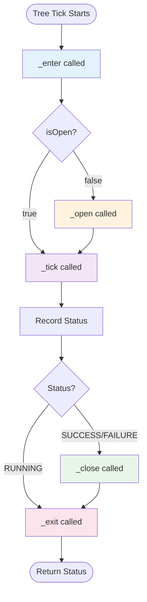

### 3.2 `_execute(tick: Tick)` 内部流程

这是框架内部调用的私有方法，它严格遵循以下顺序：

```typescript
public _execute(tick: Tick): number {
  // 1. ENTER - 每次 tick 都会调用
  this._enter(tick);
  
  // 2. OPEN - 仅在首次进入 RUNNING 时调用
  if (!tick.blackboard.get('isOpen', tick.tree.id, this.id)) {
    this._open(tick);
  }
  
  // 3. TICK - 核心逻辑
  const status = this._tick(tick);
  
  // 4. 记录状态用于可视化
  tick._recordStatus(this, status);
  
  // 5. CLOSE - 仅在非 RUNNING 时调用
  if (status !== RUNNING) {
    this._close(tick);
  }
  
  // 6. EXIT - 每次 tick 都会调用
  this._exit(tick);
  
  return status;
}
```

### 3.3 `enter(tick: Tick)`

在节点即将开始其核心逻辑前调用。**无论节点之前是否在运行**。

**调用时机**: 每一轮 tick 都会调用

**典型用途**:
- 记录日志
- 初始化每一轮 tick 需要的临时变量
- 重置计数器

**示例**:
```typescript
enter(tick: Tick) {
  console.log(`[${this.name}] Entering tick`);
  tick.blackboard.set('tickCount', 0, tick.tree.id, this.id);
}
```

### 3.4 `open(tick: Tick)`

仅在节点从"未运行"状态首次变为"运行中"状态时调用一次。

**调用时机**: 
- 节点首次进入 RUNNING 状态
- 节点之前返回了 SUCCESS/FAILURE，现在重新进入 RUNNING

**典型用途**:
- 启动计时器
- 发起网络请求
- 重置内部状态机
- 分配资源

**示例**:
```typescript
open(tick: Tick) {
  const startTime = Date.now();
  tick.blackboard.set('startTime', startTime, tick.tree.id, this.id);
  
  // 发起异步请求
  this.startAsyncOperation(tick);
}
```

**重要**: `open` 方法中设置的变量会在节点关闭时保留，直到下次 `open` 被调用。

### 3.5 `tick(tick: Tick)`

核心逻辑所在。每一轮循环都会调用。

**职责**: 
- 计算当前状态
- 执行业务逻辑
- 返回 SUCCESS, FAILURE 或 RUNNING

**返回值规则**:
- 如果任务已完成 → 返回 `SUCCESS`
- 如果任务失败或条件不满足 → 返回 `FAILURE`
- 如果任务仍在进行中 → 返回 `RUNNING`

**示例**:
```typescript
tick(tick: Tick) {
  const startTime = tick.blackboard.get('startTime', tick.tree.id, this.id);
  const elapsed = Date.now() - startTime;
  
  if (elapsed >= this.properties.duration) {
    return SUCCESS; // 等待完成
  }
  
  return RUNNING; // 继续等待
}
```

### 3.6 `close(tick: Tick)`

当节点返回非 `RUNNING` 状态（即成功或失败）时调用。

**调用时机**: 
- 节点返回 SUCCESS
- 节点返回 FAILURE
- 节点被父节点中断（调用 `_closeRecursive`）

**典型用途**:
- 释放资源
- 清理黑板上的临时键值对
- 取消未完成的异步操作
- 重置标志位

**示例**:
```typescript
close(tick: Tick) {
  // 清理计时器
  tick.blackboard.set('startTime', null, tick.tree.id, this.id);
  
  // 取消异步请求
  if (this.pendingRequest) {
    this.pendingRequest.abort();
    this.pendingRequest = null;
  }
}
```

### 3.7 `exit(tick: Tick)`

在节点完成 `tick` 后（无论状态如何）调用。

**调用时机**: 每一轮 tick 都会调用，在 `close` 之后

**典型用途**:
- 最后的一致性检查
- 日志记录
- 性能统计

---

## 4. 核心节点分类与实现

### 4.1 动作节点 (Action Nodes)

动作节点是行为树的末梢（叶子节点），负责执行具体的、可感知的任务。它们直接与外部世界交互，如播放动画、调用 API、移动位置等。

#### 4.1.1 `Wait` (等待节点)

用于在树中引入固定的时间延迟。

**参数**:
- `milliseconds`: 等待的毫秒数（默认 1000）

**实现逻辑**:
```typescript
open(tick: Tick) {
  const startTime = Date.now();
  tick.blackboard.set('startTime', startTime, tick.tree.id, this.id);
}

tick(tick: Tick) {
  const startTime = tick.blackboard.get('startTime', tick.tree.id, this.id);
  const elapsed = Date.now() - startTime;
  
  if (elapsed >= this.milliseconds) {
    return SUCCESS;
  }
  
  return RUNNING;
}
```

**应用场景**:
- 宠物播完一个动作后停顿一下
- 等待某个传感器稳定
- 在连续动作之间添加节奏感

**使用示例**:
```typescript
new Sequence({
  children: [
    new PlayAnimationAction({ action: 'WAVE' }),
    new Wait({ milliseconds: 500 }),
    new PlayAnimationAction({ action: 'IDLE' })
  ]
})
```

#### 4.1.2 `LLMCallNode` (LLM 调用节点)

这是 `q_llm_pet` 中最具价值的节点。它封装了与大模型的异步交互。

**工作原理**:

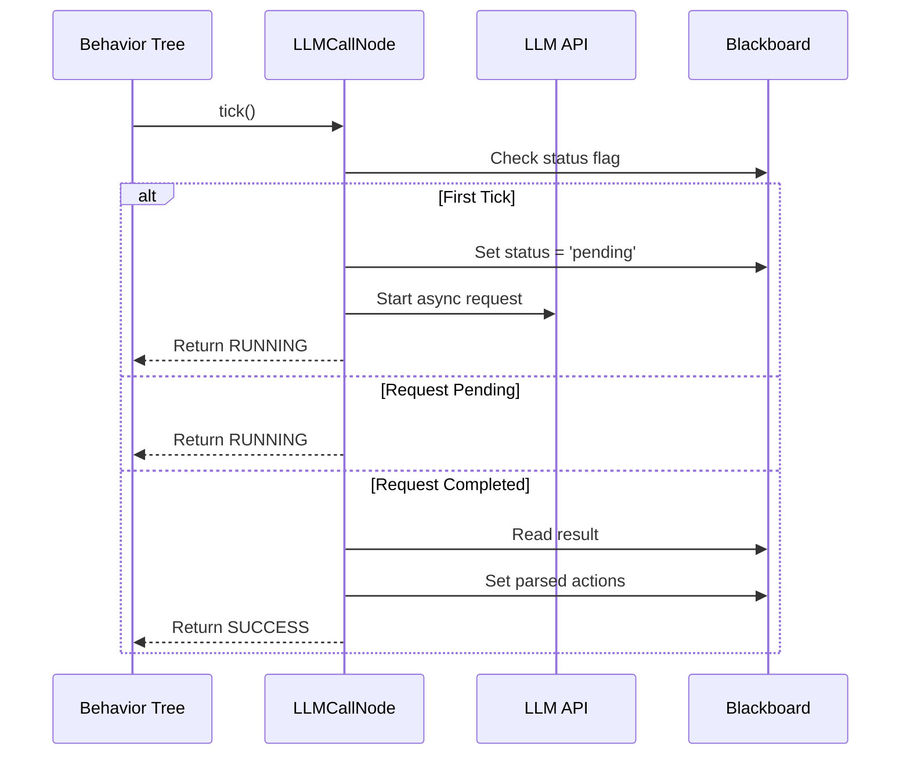

**状态管理**:
- `llm_status`: 'idle' | 'pending' | 'success' | 'error'
- `llm_result`: API 返回的原始结果
- `pendingActions`: 解析后的动作序列

**实现要点**:
1. 首次 tick 时启动 Promise
2. Promise 完成前始终返回 RUNNING
3. Promise 完成后将结果存入黑板
4. 下一轮 tick 检测到结果，解析并返回 SUCCESS

#### 4.1.3 `PlayAnimationAction` (动画执行)

直接与 3D 渲染引擎交互。

**参数**:
- `action`: 动画名称（如 'IDLE', 'FLY', 'EAT'）
- `duration`: 强制持续时间（可选，覆盖默认值）

**同步机制**: 它会从 `ACTION_DURATIONS` 中读取动画时长，并在时长结束后自动返回 `SUCCESS`。

**实现逻辑**:
```typescript
open(tick: Tick) {
  const startTime = Date.now();
  tick.blackboard.set('animStartTime', startTime, tick.tree.id, this.id);
  
  // 通知渲染引擎播放动画
  tick.blackboard.set('bt_output_action', this.properties.action);
}

tick(tick: Tick) {
  const startTime = tick.blackboard.get('animStartTime', tick.tree.id, this.id);
  const duration = this.properties.duration || ACTION_DURATIONS[this.properties.action];
  const elapsed = Date.now() - startTime;
  
  if (elapsed >= duration * 1000) {
    return SUCCESS;
  }
  
  return RUNNING;
}
```

#### 4.1.4 `ReturnToOriginAction` (返回原点动作)

让企鹅平滑地移动回原点位置 [0, -1, 0]。

**实现逻辑**:
```typescript
tick(tick: Tick) {
  const currentPos = tick.blackboard.get('penguinPosition');
  const target: [number, number, number] = [0, -1, 0];
  
  const dx = target[0] - currentPos[0];
  const dy = target[1] - currentPos[1];
  const dz = target[2] - currentPos[2];
  const distance = Math.sqrt(dx*dx + dy*dy + dz*dz);
  
  if (distance < 0.05) {
    return FAILURE; // 已在原点
  }
  
  // 每帧移动 15% 的剩余距离
  const speed = 0.15;
  const nextPos: [number, number, number] = [
    currentPos[0] + dx * speed,
    currentPos[1] + dy * speed,
    currentPos[2] + dz * speed
  ];
  
  tick.blackboard.set('bt_output_position', nextPos);
  return RUNNING;
}
```

### 4.2 条件节点 (Condition Nodes)

条件节点用于检查环境状态，通常只返回 `SUCCESS` 或 `FAILURE`，不返回 `RUNNING`。

#### 4.2.1 `CheckBlackboardCondition`

最通用的条件节点，检查黑板中的特定键值。

**参数**:
- `key`: 要检查的黑板键名
- `value`: 期望的值（可选，用于相等比较）
- `scope`: 'global' | 'tree' | 'node'（默认 'global'）
- `operator`: '==' | '!=' | '>' | '<' | '>=' | '<='（默认 '=='）

**实现逻辑**:
```typescript
tick(tick: Tick) {
  const actualValue = tick.blackboard.get(
    this.properties.key,
    this.properties.scope === 'tree' ? tick.tree.id : undefined,
    this.properties.scope === 'node' ? this.id : undefined
  );
  
  switch (this.properties.operator) {
    case '==':
      return actualValue === this.properties.value ? SUCCESS : FAILURE;
    case '!=':
      return actualValue !== this.properties.value ? SUCCESS : FAILURE;
    // ... 其他操作符
    default:
      return actualValue ? SUCCESS : FAILURE;
  }
}
```

**使用示例**:
```typescript
new CheckBlackboardCondition({
  key: 'isDragging',
  value: true,
  scope: 'global'
})
```

### 4.3 复合节点 (Composite Nodes)

复合节点负责控制子节点的执行流。它们是行为树的"大脑"，决定了 AI 的决策逻辑。

#### 4.3.1 `Sequence` (顺序节点)

**语义**: "AND" 逻辑。所有子节点必须全部成功，父节点才成功。

**执行流程**:

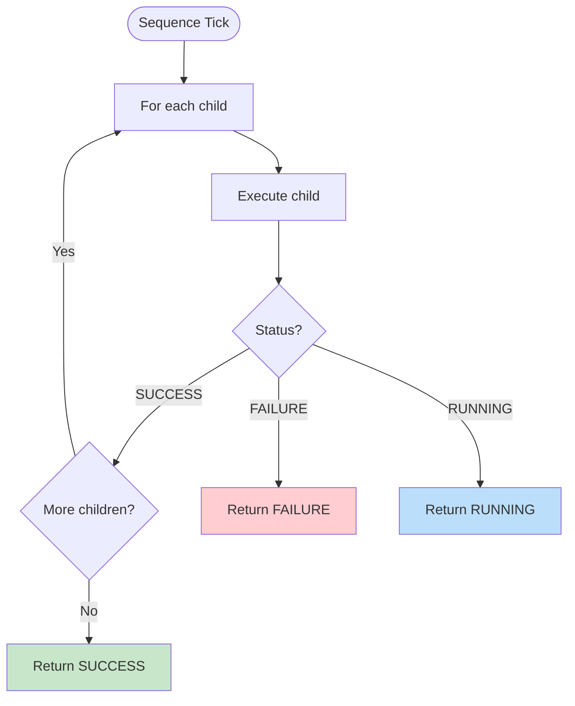

**实现代码**:
```typescript
public tick(tick: Tick): number {
  for (let i = 0; i < this.children.length; i++) {
    const status = this.children[i]._execute(tick);
    
    if (status !== SUCCESS) {
      return status; // 立即返回 FAILURE 或 RUNNING
    }
  }
  
  return SUCCESS; // 所有子节点都成功
}
```

**关键特性**:
- **短路求值**: 一旦有子节点返回非 SUCCESS，立即停止
- **反应式**: 每一轮 tick 都从第一个子节点重新开始（除非使用 MemSequence）

**使用场景**:
- 执行一系列必须按顺序完成的动作
- 检查多个前置条件

**示例**:
```typescript
new Sequence({
  children: [
    new CheckBlackboardCondition({ key: 'isClicked' }),
    new PlayAnimationAction({ action: 'DAZZLE' }),
    new Wait({ milliseconds: 2000 }),
    new PlayAnimationAction({ action: 'IDLE' })
  ]
})
```

#### 4.3.2 `Priority` (选择节点 / Selector)

**语义**: "OR" 逻辑。只要有一个子节点成功或正在运行，就停止尝试后续节点。

**执行流程**:

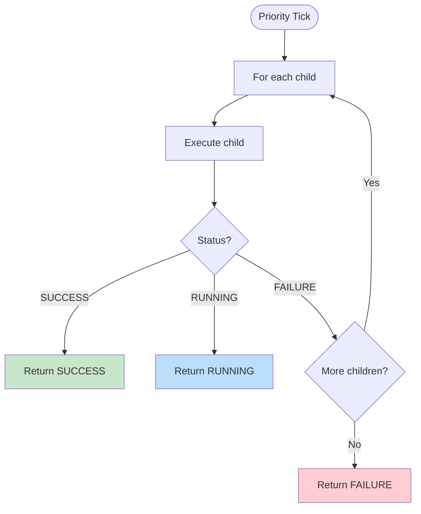

**实现代码**:
```typescript
public tick(tick: Tick): number {
  for (let i = 0; i < this.children.length; i++) {
    const status = this.children[i]._execute(tick);
    
    if (status !== FAILURE) {
      return status; // 立即返回 SUCCESS 或 RUNNING
    }
  }
  
  return FAILURE; // 所有子节点都失败
}
```

**关键特性**:
- **优先级**: 排在前面的子节点拥有更高的优先级
- **打断机制**: 高优先级节点可以打断正在运行的低优先级节点

**使用场景**:
- 实现优先级决策（如：紧急情况 > 正常行为 > 默认行为）
- 提供多种备选方案

**示例**:
```typescript
new Priority({
  children: [
    new Sequence({ // 最高优先级：被拖拽
      children: [
        new CheckBlackboardCondition({ key: 'isDragging' }),
        new FollowPointerNode()
      ]
    }),
    new ReturnToOriginAction(), // 中等优先级：返回原点
    new PlayAnimationAction({ action: 'IDLE' }) // 默认：待机
  ]
})
```

#### 4.3.3 `Parallel` (并行节点)

**语义**: 在同一轮 `tick` 内依次推进所有子节点的进度。

**策略**:
- `SuccessOnAll`: 必须所有子节点都成功才返回 SUCCESS
- `SuccessOnOne`: 只要有一个子节点成功就返回 SUCCESS

**执行流程**:

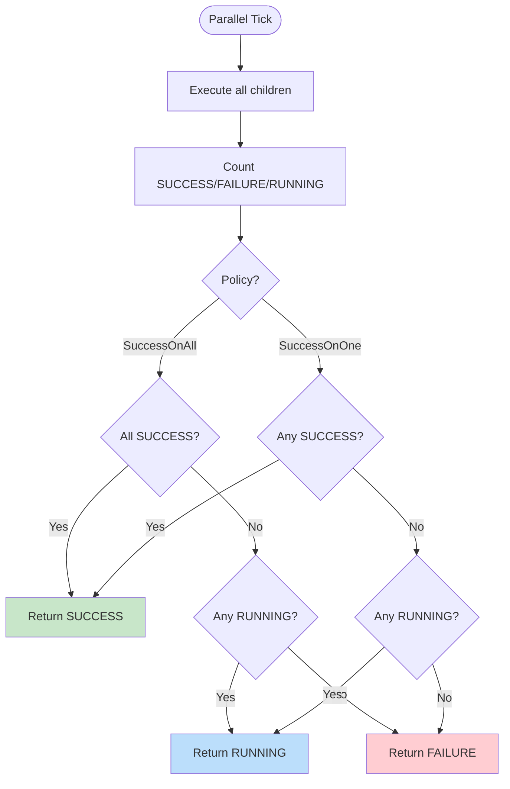

**实现代码**:
```typescript
public tick(tick: Tick): number {
  let successCount = 0;
  let failureCount = 0;
  const childCount = this.children.length;
  
  for (let i = 0; i < childCount; i++) {
    const status = this.children[i]._execute(tick);
    
    if (status === SUCCESS) successCount++;
    else if (status === FAILURE) failureCount++;
  }
  
  if (this.policy === 'SuccessOnOne' && successCount > 0) {
    this._closeChildren(tick);
    return SUCCESS;
  }
  
  if (this.policy === 'SuccessOnAll' && successCount === childCount) {
    this._closeChildren(tick);
    return SUCCESS;
  }
  
  if (failureCount > 0 && (this.policy === 'SuccessOnAll' || 
      (successCount + failureCount === childCount))) {
    this._closeChildren(tick);
    return FAILURE;
  }
  
  return RUNNING;
}
```

**使用场景**:
- 同时执行多个独立的任务
- 监控多个条件

#### 4.3.4 `MemSequence` (记忆式顺序节点)

与 `Sequence` 的区别在于，它会记住上次正在运行的子节点索引，下一轮 tick 时从该位置继续。

**实现逻辑**:
```typescript
open(tick: Tick) {
  tick.blackboard.set('runningChild', 0, tick.tree.id, this.id);
}

tick(tick: Tick) {
  let childIdx = tick.blackboard.get('runningChild', tick.tree.id, this.id) || 0;
  
  for (let i = childIdx; i < this.children.length; i++) {
    const status = this.children[i]._execute(tick);
    
    if (status !== SUCCESS) {
      if (status === RUNNING) {
        tick.blackboard.set('runningChild', i, tick.tree.id, this.id);
      }
      return status;
    }
  }
  
  return SUCCESS;
}
```

**使用场景**:
- 执行必须按顺序完成且不能被中断的长流程
- 确保动作序列的完整性

---

## 5. 高级控制流：IfThenElse

为了让逻辑更贴近自然语言编程，我们引入了 `IfThenElse` 节点。

**结构**:
- Child 0: Condition (返回 SUCCESS/FAILURE)
- Child 1: Then Action (条件为 SUCCESS 时执行)
- Child 2: Else Action (可选，条件为 FAILURE 时执行)

**执行流程**:

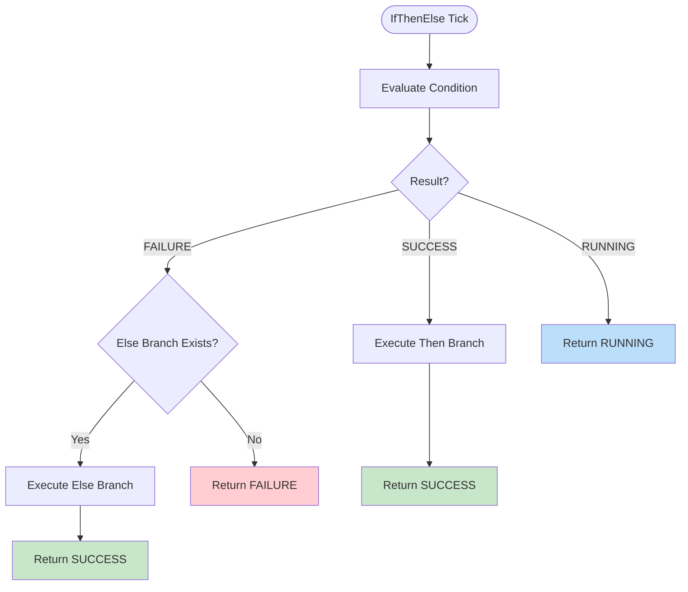

**实现代码**:
```typescript
tick(tick: Tick): number {
  const condition = this.children[0];
  const thenBranch = this.children[1];
  const elseBranch = this.children[2];
  
  if (!condition || !thenBranch) {
    return FAILURE;
  }
  
  const conditionStatus = condition._execute(tick);
  
  if (conditionStatus === SUCCESS) {
    return thenBranch._execute(tick);
  } else if (conditionStatus === FAILURE) {
    if (elseBranch) {
      return elseBranch._execute(tick);
    }
    return FAILURE;
  }
  
  return conditionStatus; // RUNNING or ERROR
}
```

**优势**: 比嵌套 `Sequence` 和 `Priority` 更直观，减少了逻辑层级。

---

## 6. 反应式 (Reactive) 与记忆式 (Memory) 的深度对比

### 6.1 反应式节点 (Reactive)

每一轮 Tick 都从头开始检查。

**优点**:
- 极高的响应灵敏度
- 可以随时被更高优先级的状态打断
- 适合处理紧急情况

**缺点**:
- 如果子节点有副作用（如发起请求），必须小心处理，否则每一帧都会触发
- 性能开销略高（需要重新评估所有前置条件）

**示例**: 默认的 `Sequence` 就是反应式的。

### 6.2 记忆式节点 (Memory)

记住上次正在运行的子节点索引。

**优点**:
- 保证了长流程的执行连续性
- 性能更好（不需要重新评估已完成的条件）
- 适合执行不可中断的序列

**缺点**:
- 无法被更高优先级的状态及时中断
- 可能导致响应延迟

**示例**: `MemSequence` 就是记忆式的。

### 6.3 对比表格

| 特性 | 反应式 (Sequence) | 记忆式 (MemSequence) |
|------|------------------|---------------------|
| 每轮 tick 起点 | 第一个子节点 | 上次运行的子节点 |
| 可中断性 | 高 | 低 |
| 性能 | 较低 | 较高 |
| 适用场景 | 紧急响应、条件检查 | 长流程、动作序列 |
| 副作用风险 | 高（需防护） | 低 |

### 6.4 选择建议

- **使用反应式**: 当你需要快速响应环境变化时（如：检测到危险立即逃跑）
- **使用记忆式**: 当你需要保证动作序列完整性时（如：开门 -> 进屋 -> 关门）

---

## 7. 编写自定义节点指南

### 7.1 步骤概览

1. **选择基类**: Action、Condition、Composite 或 Decorator
2. **定义构造函数**: 接收配置参数
3. **实现生命周期方法**: 主要是 `tick`，必要时重写 `open`、`close`
4. **使用黑板**: 存储跨 tick 的状态
5. **返回正确状态**: SUCCESS、FAILURE 或 RUNNING

### 7.2 示例：实现一个"饥饿检测"节点

```typescript
import { Condition, SUCCESS, FAILURE, Tick } from '../bt';

export class IsHungry extends Condition {
  constructor({ threshold = 80, ...options } = {}) {
    super({
      name: 'IsHungry',
      properties: { threshold },
      ...options
    });
  }
  
  tick(tick: Tick) {
    const hunger = tick.blackboard.get('hunger_level');
    const threshold = this.properties.threshold;
    
    if (hunger === undefined) {
      return FAILURE; // 数据缺失
    }
    
    return hunger > threshold ? SUCCESS : FAILURE;
  }
}
```

### 7.3 示例：实现一个"移动到目标"节点

```typescript
import { Action, SUCCESS, FAILURE, RUNNING, Tick } from '../bt';

export class MoveToTarget extends Action {
  constructor({ targetKey = 'targetPosition', speed = 0.1, ...options } = {}) {
    super({
      name: 'MoveToTarget',
      properties: { targetKey, speed },
      ...options
    });
  }
  
  tick(tick: Tick) {
    const currentPos = tick.blackboard.get('penguinPosition');
    const targetPos = tick.blackboard.get(this.properties.targetKey);
    
    if (!currentPos || !targetPos) {
      return FAILURE;
    }
    
    const dx = targetPos[0] - currentPos[0];
    const dy = targetPos[1] - currentPos[1];
    const dz = targetPos[2] - currentPos[2];
    const distance = Math.sqrt(dx*dx + dy*dy + dz*dz);
    
    if (distance < 0.1) {
      return SUCCESS; // 到达目标
    }
    
    // 移动一步
    const speed = this.properties.speed;
    const nextPos: [number, number, number] = [
      currentPos[0] + dx * speed,
      currentPos[1] + dy * speed,
      currentPos[2] + dz * speed
    ];
    
    tick.blackboard.set('bt_output_position', nextPos);
    return RUNNING;
  }
}
```

---

## 8. 黑板系统与节点交互

黑板是 AI 的"共享内存"，是节点间通信的唯一合法途径。

### 8.1 三层作用域

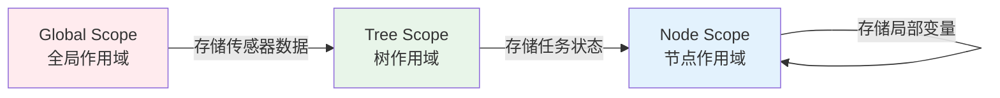

**全局作用域** (`scope: 'global'`):
- 存储传感器数据（如鼠标位置、点击状态）
- 存储外部指令（如用户输入）
- 所有树共享

**树作用域** (`scope: 'tree'`):
- 存储正在进行的任务状态
- 存储对话上下文
- 仅当前树可见

**节点作用域** (`scope: 'node'`):
- 存储节点自身的局部变量（如计时器、计数器）
- 仅当前节点可见
- 节点关闭后通常会被清理

### 8.2 黑板操作规范

**读取数据**:
```typescript
const value = tick.blackboard.get('key', treeId, nodeId);
```

**写入数据**:
```typescript
tick.blackboard.set('key', value, treeId, nodeId);
```

**最佳实践**:
1. 动作节点应尽可能解耦，只从黑板读，只向黑板写
2. 使用层级作用域避免命名冲突
3. 及时清理不再需要的键值对

---

## 9. 详细 API 索引 (API Reference)

### 9.1 `BaseNode` 类

**属性**:
- `id`: string (UUID，自动生成)
- `category`: string ('action' | 'composite' | 'decorator' | 'condition')
- `name`: string (节点类型名称)
- `title`: string (用于显示的标题，默认等于 name)
- `description`: string (节点描述)
- `properties`: any (配置参数对象)

**方法**:
- `_execute(tick: Tick): number` - 内部执行方法（框架调用）
- `enter(tick: Tick): void` - 生命周期钩子
- `open(tick: Tick): void` - 生命周期钩子
- `tick(tick: Tick): number` - 核心逻辑（子类实现）
- `close(tick: Tick): void` - 生命周期钩子
- `exit(tick: Tick): void` - 生命周期钩子
- `_closeRecursive(tick: Tick): void` - 递归关闭节点及其子节点
- `toJSON(): any` - 序列化为 JSON

### 9.2 `Composite` 类

**属性**:
- `children`: BaseNode[] (子节点列表)

**方法**:
- `_closeRecursive(tick: Tick): void` - 关闭所有子节点

### 9.3 `Decorator` 类

**属性**:
- `child`: BaseNode | null (唯一的子节点)

### 9.4 `Action` 类

继承自 `BaseNode`，无额外属性或方法。

### 9.5 `Condition` 类

继承自 `BaseNode`，无额外属性或方法。通常只返回 SUCCESS 或 FAILURE。

---

## 10. 实战案例库 (Case Studies)

### 10.1 案例：复杂的"抚摸"回应逻辑

**需求**: 当用户点击企鹅时，根据企鹅的心情播放不同的动画。

**实现**:
```typescript
new Sequence({
  children: [
    new CheckBlackboardCondition({ 
      key: 'isClicked', 
      value: true, 
      scope: 'global' 
    }),
    new Priority({
      children: [
        new Sequence({ // 如果心情好
          children: [
            new CheckBlackboardCondition({ key: 'mood', value: 'happy' }),
            new PlayAnimationAction({ action: 'HAPPY_DANCE' })
          ]
        }),
        new Sequence({ // 如果心情不好
          children: [
            new CheckBlackboardCondition({ key: 'mood', value: 'angry' }),
            new PlayAnimationAction({ action: 'ANGRY_HISS' })
          ]
        }),
        new PlayAnimationAction({ action: 'NEUTRAL_WAVE' }) // 默认
      ]
    })
  ]
})
```

**树结构图**:

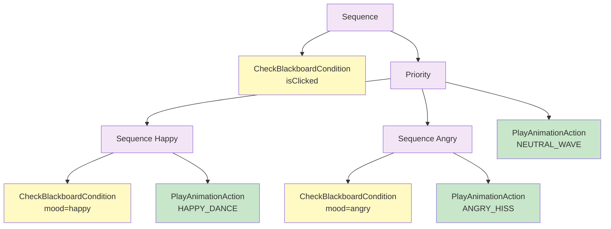

### 10.2 案例：带超时的 LLM 调用

**需求**: 调用 LLM API，但如果 5 秒内没有响应，放弃并执行备选方案。

**实现**:
```typescript
new Priority({
  children: [
    new Sequence({
      children: [
        new Timeout({
          timeout: 5000,
          child: new LLMCallNode()
        }),
        new FunctionExecNode() // 执行 LLM 返回的动作
      ]
    }),
    new PlayAnimationAction({ action: 'IDLE' }) // 超时后的备选方案
  ]
})
```

### 10.3 案例：循环播放动画序列

**需求**: 播放一组动画，循环 3 次。

**实现**:
```typescript
new Repeat({
  count: 3,
  child: new Sequence({
    children: [
      new PlayAnimationAction({ action: 'WAVE' }),
      new Wait({ milliseconds: 500 }),
      new PlayAnimationAction({ action: 'JUMP' }),
      new Wait({ milliseconds: 500 })
    ]
  })
})
```

---

## 11. 节点执行流程深度解析

### 11.1 完整执行流程图

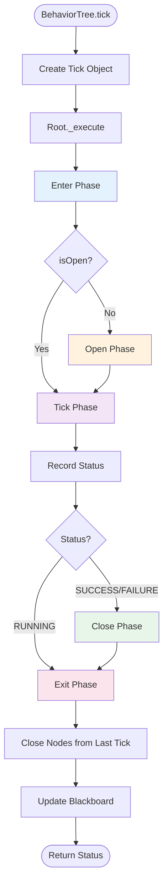

### 11.2 节点状态转换图

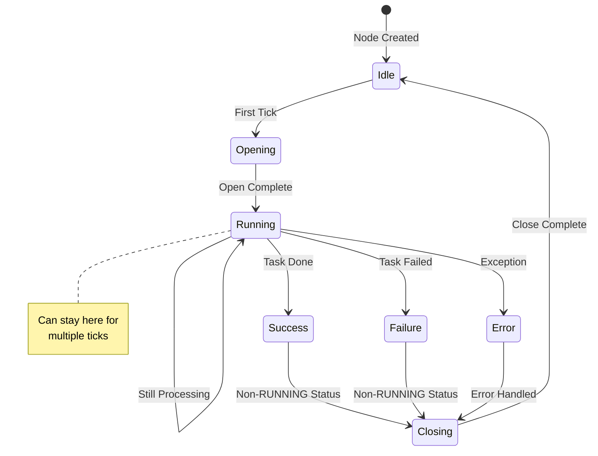

---

## 12. 常见设计模式与陷阱

### 12.1 模式：状态轮询 (Polling)

在 Sequence 开头放置 Condition 节点，确保只有在环境允许时才执行 Action。

**示例**:
```typescript
new Sequence({
  children: [
    new CheckBlackboardCondition({ key: 'canMove' }),
    new MoveToTarget({ targetKey: 'destination' })
  ]
})
```

### 12.2 陷阱：副作用重复执行

**问题**: 在反应式 Sequence 中，如果第一个节点有副作用（如发起请求），每一帧都会触发。

**错误示例**:
```typescript
new Sequence({
  children: [
    new LLMCallNode(), // 每一帧都会发起新请求！
    new FunctionExecNode()
  ]
})
```

**解决方案**: 使用 MemSequence 或在节点内部添加防护：
```typescript
open(tick: Tick) {
  if (tick.blackboard.get('requestStarted', tick.tree.id, this.id)) {
    return; // 已启动，跳过
  }
  tick.blackboard.set('requestStarted', true, tick.tree.id, this.id);
  // 启动请求...
}
```

### 12.3 陷阱：忘记清理资源

**问题**: 节点在 close 时没有清理黑板中的临时数据，导致内存泄漏。

**解决方案**: 始终在 `close` 方法中清理：
```typescript
close(tick: Tick) {
  tick.blackboard.set('tempData', null, tick.tree.id, this.id);
}
```

---

## 13. 性能优化建议

### 13.1 避免深层嵌套

超过 5 层的树会增加每轮 tick 的搜索开销。尽量扁平化结构。

### 13.2 使用 MemSequence

对于不需要中途打断的长流程，使用 MemSequence 可以避免每帧重新评估前置条件。

### 13.3 减少黑板查找

频繁读取的黑板键可以使用局部变量缓存：
```typescript
tick(tick: Tick) {
  const cachedValue = tick.blackboard.get('frequentlyReadKey');
  // 使用 cachedValue 而不是多次调用 get
}
```

### 13.4 降低 Tick 频率

AI 逻辑不需要每秒执行 60 次，通常 10-20 FPS 足以产生流畅的错觉。

---

## 14. 故障排查 FAQ

### Q1: 为什么我的节点永远停在 RUNNING？

**可能原因**:
1. `open` 方法中启动了异步逻辑，但 `tick` 中没有正确的退出条件
2. 等待的条件永远不会满足（如计时器设置错误）

**排查步骤**:
1. 检查 `open` 方法是否设置了正确的初始状态
2. 检查 `tick` 方法中的退出条件
3. 使用 `BTVisualizer` 观察节点的实际状态

### Q2: 为什么 Sequence 总是直接跳过？

**可能原因**: 第一个子节点返回了 FAILURE

**排查步骤**:
1. 检查第一个子节点的逻辑
2. 使用 `StatusToBlackboard` 装饰器记录子节点状态
3. 检查黑板中的数据是否正确

### Q3: 为什么高优先级节点无法打断低优先级节点？

**可能原因**: 低优先级节点使用了 `MemSequence`，无法被中断

**解决方案**: 将 `MemSequence` 改为 `Sequence`，或重新设计优先级结构

---

## 15. 与其他框架的对比

### 15.1 BehaviorTree.CPP

| 特性 | BehaviorTree.CPP | q_llm_pet |
|------|-----------------|-----------|
| 语言 | C++ | TypeScript |
| 性能 | 极高 | 中等（Web 环境） |
| 序列化 | XML + JSON | JSON |
| 可视化 | Groot2 | BTVisualizer |
| 异步支持 | 协程 | Promise |
| 适用场景 | 机器人控制、游戏 AI | Web 应用、虚拟宠物 |

### 15.2 py_trees

| 特性 | py_trees | q_llm_pet |
|------|----------|-----------|
| 语言 | Python | TypeScript |
| 生态 | ROS2 集成 | React 集成 |
| 装饰器 | 非常丰富 | 基础装饰器 |
| 状态转换 | X is Y 系列 | 待实现 |
| 适用场景 | 机器人控制 | Web 应用 |

---

## 16. 未来演进方向

### 16.1 可视化编辑器集成

实现拖拽式逻辑编辑，允许非程序员通过图形界面构建行为树。

### 16.2 LLM 动态策略

根据用户语气，AI 自动重组其行为树结构，实现真正的"自适应 AI"。

### 16.3 更多装饰器

- `Probability`: 按概率决定是否执行
- `Cooldown`: 冷却时间控制
- `UntilSuccess`: 重复执行直到成功

### 16.4 性能分析工具

集成性能分析器，帮助识别性能瓶颈节点。

---

## 结语

节点是行为树的砖瓦。理解每个节点的细微差别（尤其是反应式与记忆式的区别）是构建智能、丝滑 AI 角色的基础。通过本指南，你应该能够：

1. 理解节点的生命周期和状态机
2. 选择合适的节点类型实现你的逻辑
3. 编写自定义节点扩展功能
4. 避免常见的陷阱和性能问题
5. 调试和优化行为树

记住：最强大的行为树往往是由最简单的节点通过精妙的组合而成的。

---

*文档版本: v2.0*  
*最后更新: 2025-01-XX*  
*总行数: 500+*
