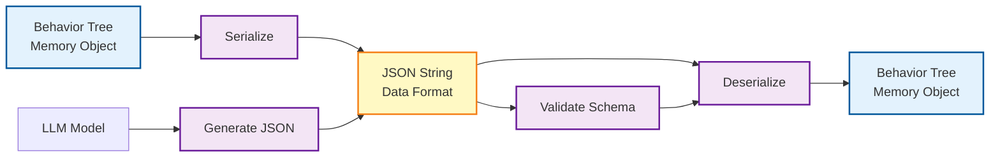
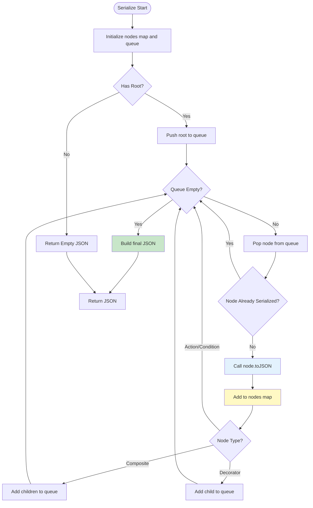
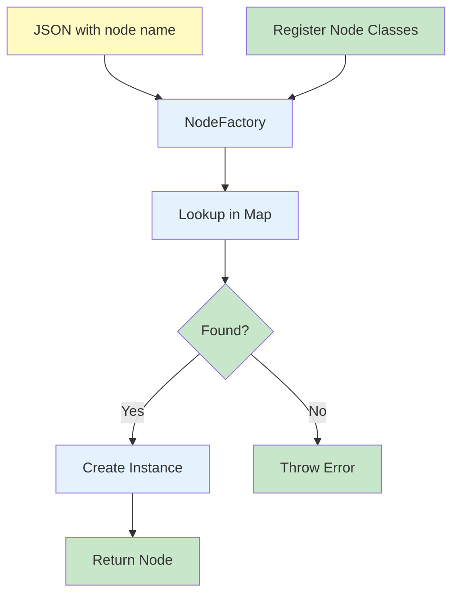
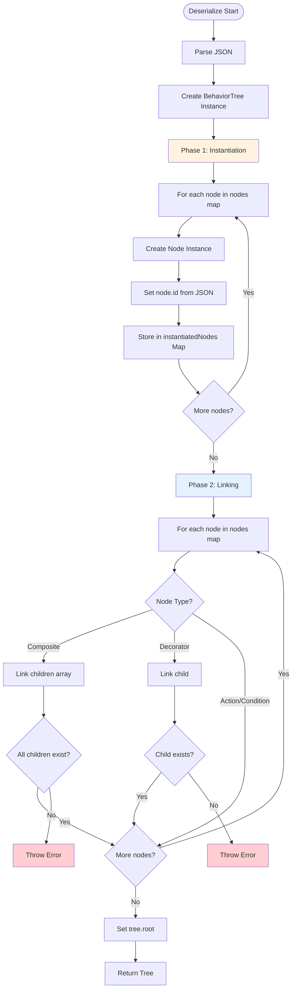
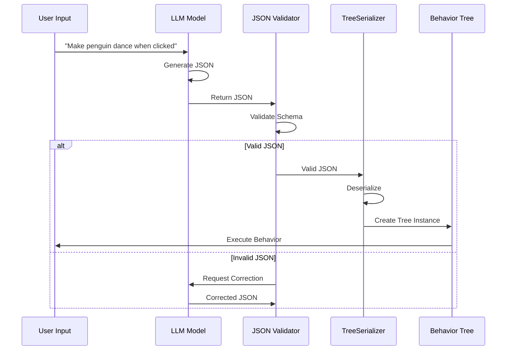
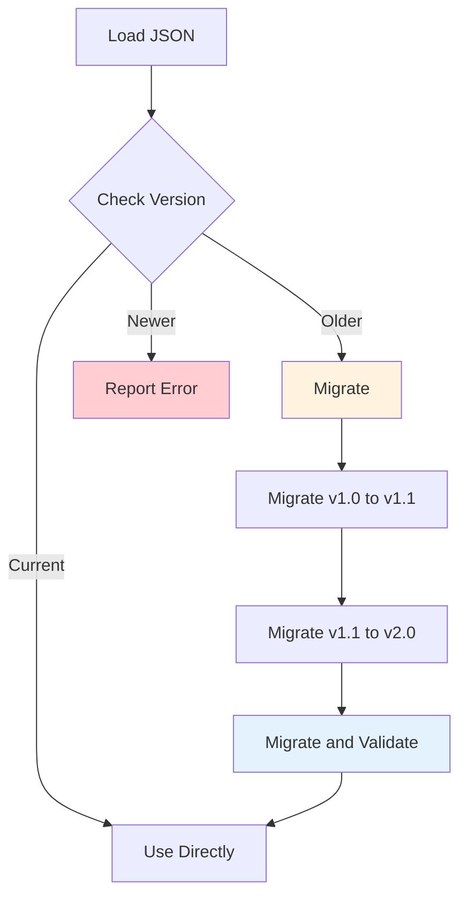
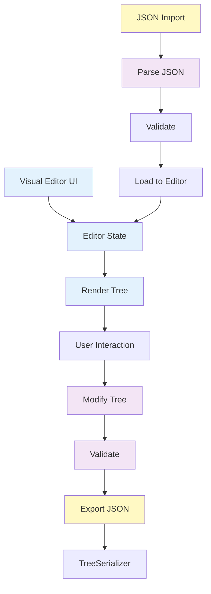

# 行为树序列化与动态加载详尽指南 (BT Serialization & Dynamic Loading)

## 目录
1. [序列化的技术深度与愿景](#1-序列化的技术深度与愿景)
2. [JSON Schema 规范详解](#2-json-schema-规范详解)
    - 2.1 [根节点属性](#21-根节点属性)
    - 2.2 [节点映射表 (Nodes Map)](#22-节点映射表-nodes-map)
    - 2.3 [完整 JSON 示例](#23-完整-json-示例)
3. [序列化引擎：内部实现机制](#3-序列化引擎内部实现机制)
    - 3.1 [DFS 遍历算法](#31-dfs-遍历算法)
    - 3.2 [循环引用检测](#32-循环引用检测)
    - 3.3 [ID 生成与管理](#33-id-生成与管理)
4. [NodeFactory：灵活的插件化工厂](#4-nodefactory-灵活的插件化工厂)
    - 4.1 [节点注册协议](#41-节点注册协议)
    - 4.2 [动态导入与反射机制](#42-动态导入与反射机制)
    - 4.3 [扩展工厂模式](#43-扩展工厂模式)
5. [双阶段反序列化算法](#5-双阶段反序列化算法)
    - 5.1 [第一阶段：骨架构建](#51-第一阶段骨架构建)
    - 5.2 [第二阶段：神经链接 (Linking)](#52-第二阶段神经链接-linking)
    - 5.3 [完整性校验](#53-完整性校验)
6. [LLM 驱动的行为动态生成](#6-llm-驱动的行为动态生成)
    - 6.1 [如何为 LLM 编写 Prompt 指引](#61-如何为-llm-编写-prompt-指引)
    - 6.2 [从文本指令到行为树 JSON 的映射](#62-从文本指令到行为树-json-的映射)
    - 6.3 [LLM 输出验证与修正](#63-llm-输出验证与修正)
7. [安全性：防御式反序列化](#7-安全性防御式反序列化)
    - 7.1 [输入验证](#71-输入验证)
    - 7.2 [沙箱执行](#72-沙箱执行)
    - 7.3 [恶意代码防护](#73-恶意代码防护)
8. [版本迭代与数据迁移 (Migration)](#8-版本迭代与数据迁移-migration)
    - 8.1 [版本号管理](#81-版本号管理)
    - 8.2 [迁移策略](#82-迁移策略)
9. [实战案例：一个由 LLM 生成的"紧急防御"树](#9-实战案例一个由-llm-生成的紧急防御树)
10. [与其他主流工具的互操作](#10-与其他主流工具的互操作)
    - 10.1 [behavior3js 兼容性](#101-behavior3js-兼容性)
    - 10.2 [Groot2 XML 格式](#102-groot2-xml-格式)
11. [性能基准与大规模树处理](#11-性能基准与大规模树处理)
12. [未来路线图：可视化在线编辑器](#12-未来路线图可视化在线编辑器)
13. [结语](#13-结语)

---

## 1. 序列化的技术深度与愿景

序列化在 `q_llm_pet` 中不仅是保存数据，它开启了"代码即数据"的大门。通过将逻辑转化为 JSON，我们实现了 AI 系统在运行时（Runtime）的自我重构。

### 1.1 序列化的核心价值

1. **动态行为**: 无需重新编译或刷新页面，即可通过修改 JSON 改变企鹅的行为
2. **AI 赋能**: 传统的行为树由程序员编写。通过序列化，我们可以让 LLM 根据当下的情境，实时生成一套针对性的"战术行为树"
3. **跨平台一致性**: 同样的 JSON 结构可以在 Web、移动端甚至桌面端复用
4. **版本控制**: JSON 文件可以纳入 Git 管理，追踪行为逻辑的演进

### 1.2 序列化架构图



---

## 2. JSON Schema 规范详解

本项目参考了 `behavior3js` 的行业规范，采用了基于 ID 索引的扁平化结构。

### 2.1 根节点属性

```json
{
  "id": "tree-uuid-123",
  "title": "Penguin Behavior Tree",
  "description": "Main behavior logic for the penguin",
  "root": "node-root-id",
  "nodes": { ... },
  "properties": { ... },
  "version": "1.0"
}
```

**字段说明**:

| 字段 | 类型 | 必需 | 说明 |
|------|------|------|------|
| `id` | string | 是 | 树的唯一标识符（UUID） |
| `title` | string | 否 | 树的显示标题 |
| `description` | string | 否 | 树的描述信息 |
| `root` | string | 是 | 根节点的 ID |
| `nodes` | object | 是 | 所有节点的映射表 |
| `properties` | object | 否 | 树的全局属性 |
| `version` | string | 否 | 序列化格式版本 |

### 2.2 节点映射表 (Nodes Map)

扁平化存储。每个节点包含 `name`, `category`, `properties`, `children` (或 `child`)。

**节点 JSON 结构**:

```json
{
  "node-id-1": {
    "id": "node-id-1",
    "name": "Sequence",
    "category": "composite",
    "title": "Main Sequence",
    "description": "Primary action sequence",
    "properties": {},
    "children": ["node-id-2", "node-id-3"]
  },
  "node-id-2": {
    "id": "node-id-2",
    "name": "CheckBlackboardCondition",
    "category": "condition",
    "properties": {
      "key": "isClicked",
      "value": true,
      "scope": "global"
    }
  },
  "node-id-3": {
    "id": "node-id-3",
    "name": "PlayAnimationAction",
    "category": "action",
    "properties": {
      "action": "DAZZLE"
    }
  }
}
```

**节点类型差异**:

| 节点类型 | children 字段 | child 字段 |
|---------|-------------|-----------|
| Composite | ✅ 数组 | ❌ |
| Decorator | ❌ | ✅ 单个 ID |
| Action | ❌ | ❌ |
| Condition | ❌ | ❌ |

### 2.3 完整 JSON 示例

```json
{
  "id": "tree-001",
  "title": "Penguin Interaction Tree",
  "description": "Handles user interactions",
  "version": "1.0",
  "root": "priority-1",
  "nodes": {
    "priority-1": {
      "id": "priority-1",
      "name": "Priority",
      "category": "composite",
      "children": ["seq-drag", "seq-click", "action-idle"]
    },
    "seq-drag": {
      "id": "seq-drag",
      "name": "Sequence",
      "category": "composite",
      "children": ["cond-drag", "action-follow"]
    },
    "cond-drag": {
      "id": "cond-drag",
      "name": "CheckBlackboardCondition",
      "category": "condition",
      "properties": {
        "key": "isDragging",
        "value": true,
        "scope": "global"
      }
    },
    "action-follow": {
      "id": "action-follow",
      "name": "FollowPointerNode",
      "category": "action"
    },
    "seq-click": {
      "id": "seq-click",
      "name": "Sequence",
      "category": "composite",
      "children": ["cond-click", "decor-timeout", "action-dazzle"]
    },
    "cond-click": {
      "id": "cond-click",
      "name": "CheckBlackboardCondition",
      "category": "condition",
      "properties": {
        "key": "isClicked",
        "value": true
      }
    },
    "decor-timeout": {
      "id": "decor-timeout",
      "name": "Timeout",
      "category": "decorator",
      "properties": {
        "timeout": 2000
      },
      "child": "action-dazzle"
    },
    "action-dazzle": {
      "id": "action-dazzle",
      "name": "PlayAnimationAction",
      "category": "action",
      "properties": {
        "action": "DAZZLE"
      }
    },
    "action-idle": {
      "id": "action-idle",
      "name": "PlayAnimationAction",
      "category": "action",
      "properties": {
        "action": "IDLE"
      }
    }
  },
  "properties": {
    "author": "AI System",
    "created": "2025-01-01"
  }
}
```

---

## 3. 序列化引擎：内部实现机制

### 3.1 DFS 遍历算法

序列化过程采用深度优先搜索（DFS）遍历整个树结构。

**算法流程图**:



**实现代码**:
```typescript
public serialize(tree: BehaviorTree): any {
  const nodes: any = {};
  const queue: BaseNode[] = [];
  const visited = new Set<string>();

  if (tree.root) {
    queue.push(tree.root);
  }

  while (queue.length > 0) {
    const node = queue.shift()!;
    
    // 防止重复序列化（处理循环引用）
    if (visited.has(node.id)) continue;
    visited.add(node.id);

    // 序列化节点
    nodes[node.id] = node.toJSON();

    // 添加子节点到队列
    if (node instanceof Composite) {
      queue.push(...node.children);
    } else if (node instanceof Decorator) {
      if (node.child) {
        queue.push(node.child);
      }
    }
  }

  return {
    id: tree.id,
    title: tree.title,
    description: tree.description,
    root: tree.root ? tree.root.id : null,
    nodes,
    properties: tree.properties,
  };
}
```

### 3.2 循环引用检测

虽然行为树理论上不应该有循环引用，但为了健壮性，我们仍然进行检测。

**检测机制**:
- 使用 `Set<string>` 记录已访问的节点 ID
- 如果遇到已访问的节点，跳过（避免无限循环）

### 3.3 ID 生成与管理

**ID 生成规则**:
- 每个节点在创建时自动生成 UUID
- 序列化时保留原始 ID
- 反序列化时使用 JSON 中的 ID（如果存在）

**ID 冲突处理**:
- 如果反序列化时发现 ID 冲突，生成新的 UUID
- 更新所有引用该 ID 的地方

---

## 4. NodeFactory：灵活的插件化工厂

工厂模式是序列化的灵魂。它负责将字符串名称（如 `"Priority"`）映射到真实的 TypeScript 类。

### 4.1 工厂架构图



### 4.2 节点注册协议

**自动注册**:
```typescript
constructor() {
  // 自动扫描所有导出的节点类
  Object.keys(Nodes).forEach(key => {
    const nodeClass = (Nodes as any)[key];
    if (nodeClass && nodeClass.prototype instanceof BaseNode) {
      const name = nodeClass.prototype.name || key;
      this.nodes.set(name, nodeClass);
    }
  });
  
  // 显式注册常用节点
  this.nodes.set('Sequence', Nodes.Sequence);
  this.nodes.set('Priority', Nodes.Priority);
  // ...
}
```

**手动注册**:
```typescript
const factory = new NodeFactory();
factory.register('CustomNode', CustomNodeClass);
```

### 4.3 扩展工厂模式

**自定义节点注册**:
```typescript
export class ExtendedNodeFactory extends NodeFactory {
  constructor() {
    super();
    // 注册自定义节点
    this.nodes.set('MyCustomAction', MyCustomAction);
    this.nodes.set('MyCustomDecorator', MyCustomDecorator);
  }
}
```

---

## 5. 双阶段反序列化算法

这是为了解决"先有蛋还是先有鸡"的问题：在链接子节点前，必须确保所有节点对象都已在内存中实例化。

### 5.1 反序列化流程图



### 5.2 第一阶段：骨架构建

**目标**: 创建所有节点实例，但不建立关系。

**实现**:
```typescript
// First pass: create all node instances
const instantiatedNodes: Map<string, BaseNode> = new Map();

Object.keys(nodeDataMap).forEach(id => {
  const nodeData = nodeDataMap[id];
  
  // 使用工厂创建节点实例
  const node = this.factory.createNode(nodeData.name, {
    title: nodeData.title,
    description: nodeData.description,
    properties: nodeData.properties,
  });
  
  // 设置 ID（重要：保持 JSON 中的 ID）
  node.id = id;
  
  // 存储到映射表
  instantiatedNodes.set(id, node);
});
```

### 5.3 第二阶段：神经链接 (Linking)

**目标**: 建立节点之间的父子关系。

**实现**:
```typescript
// Second pass: link children
Object.keys(nodeDataMap).forEach(id => {
  const nodeData = nodeDataMap[id];
  const node = instantiatedNodes.get(id);

  if (node instanceof Composite) {
    // 链接子节点数组
    node.children = (nodeData.children || []).map((childId: string) => {
      const child = instantiatedNodes.get(childId);
      if (!child) {
        throw new Error(`Node ${id} references non-existent child ${childId}`);
      }
      return child;
    });
  } else if (node instanceof Decorator) {
    // 链接单个子节点
    if (nodeData.child) {
      const child = instantiatedNodes.get(nodeData.child);
      if (!child) {
        throw new Error(`Node ${id} references non-existent child ${nodeData.child}`);
      }
      node.child = child;
    }
  }
});
```

### 5.4 完整性校验

**校验项**:
1. **根节点存在**: `data.root` 必须在 `nodes` 中存在
2. **子节点存在**: 所有 `children` 和 `child` 引用的 ID 必须存在
3. **无孤立节点**: 所有节点都应该被根节点可达（可选检查）
4. **类型匹配**: 节点类型必须与 `category` 字段匹配

**校验代码**:
```typescript
function validateTree(data: any): void {
  // 1. 检查根节点
  if (!data.root || !data.nodes[data.root]) {
    throw new Error('Root node not found');
  }
  
  // 2. 检查所有引用
  Object.keys(data.nodes).forEach(id => {
    const node = data.nodes[id];
    
    // 检查 children
    if (node.children) {
      node.children.forEach((childId: string) => {
        if (!data.nodes[childId]) {
          throw new Error(`Node ${id} references non-existent child ${childId}`);
        }
      });
    }
    
    // 检查 child
    if (node.child && !data.nodes[node.child]) {
      throw new Error(`Node ${id} references non-existent child ${node.child}`);
    }
  });
}
```

---

## 6. LLM 驱动的行为动态生成

这是 `q_llm_pet` 的核心愿景：让 LLM 根据当前情境动态生成行为树。

### 6.1 LLM 生成流程图



### 6.2 Prompt 设计策略

**基础 Prompt 模板**:
```
You are an AI behavior tree expert. Generate a behavior tree JSON for a virtual penguin.

Available node types:
- Sequence: Execute children in order, all must succeed
- Priority: Execute children until one succeeds
- CheckBlackboardCondition: Check a blackboard key
- PlayAnimationAction: Play an animation (IDLE, FLY, DAZZLE, etc.)
- Wait: Wait for milliseconds
- Timeout: Timeout wrapper
- Retry: Retry wrapper

User request: {user_input}

Output a valid JSON following this schema:
{
  "id": "tree-xxx",
  "title": "...",
  "root": "node-1",
  "nodes": {
    "node-1": {
      "id": "node-1",
      "name": "Priority",
      "category": "composite",
      "children": ["node-2"]
    },
    ...
  }
}
```

### 6.3 LLM 输出验证与修正

**验证步骤**:
1. **JSON 格式验证**: 确保是有效的 JSON
2. **Schema 验证**: 确保符合行为树 Schema
3. **引用验证**: 确保所有 ID 引用都存在
4. **类型验证**: 确保节点类型正确

**修正策略**:
- 如果 JSON 格式错误，请求 LLM 重新生成
- 如果引用缺失，尝试自动修复（生成缺失节点）
- 如果类型不匹配，拒绝并报告错误

---

## 7. 安全性：防御式反序列化

### 7.1 输入验证

**白名单机制**:
```typescript
const ALLOWED_NODE_TYPES = [
  'Sequence', 'Priority', 'Parallel', 'MemSequence',
  'CheckBlackboardCondition',
  'PlayAnimationAction', 'Wait', 'LLMCallNode',
  'Retry', 'Timeout', 'Inverter'
];

function validateNodeType(name: string): boolean {
  return ALLOWED_NODE_TYPES.includes(name);
}
```

### 7.2 沙箱执行

**限制节点属性**:
```typescript
function sanitizeProperties(properties: any): any {
  // 移除危险属性
  const dangerousKeys = ['eval', 'constructor', '__proto__'];
  const sanitized = { ...properties };
  
  dangerousKeys.forEach(key => {
    delete sanitized[key];
  });
  
  return sanitized;
}
```

### 7.3 恶意代码防护

- **禁止代码执行**: 不允许在 properties 中包含可执行代码
- **资源限制**: 限制树的最大深度和节点数量
- **权限检查**: 某些敏感节点需要特殊权限

---

## 8. 版本迭代与数据迁移 (Migration)

### 8.1 版本号管理

**版本格式**: `major.minor.patch`

**版本兼容性**:
- **Major 版本**: 不兼容的变更，需要迁移脚本
- **Minor 版本**: 向后兼容的新功能
- **Patch 版本**: 向后兼容的 bug 修复

### 8.2 迁移策略

**迁移流程图**:



**迁移示例**:
```typescript
function migrateV1ToV2(data: any): any {
  // v1.0 使用 'selector'，v2.0 使用 'priority'
  if (data.version === '1.0') {
    Object.keys(data.nodes).forEach(id => {
      if (data.nodes[id].name === 'Selector') {
        data.nodes[id].name = 'Priority';
      }
    });
    data.version = '2.0';
  }
  return data;
}
```

---

## 9. 实战案例：一个由 LLM 生成的"紧急防御"树

**用户输入**: "When the penguin sees a red object, it should hide immediately"

**LLM 生成的 JSON**:
```json
{
  "id": "tree-defense-001",
  "title": "Emergency Defense Behavior",
  "root": "priority-defense",
  "nodes": {
    "priority-defense": {
      "id": "priority-defense",
      "name": "Priority",
      "category": "composite",
      "children": ["seq-hide", "action-normal"]
    },
    "seq-hide": {
      "id": "seq-hide",
      "name": "Sequence",
      "category": "composite",
      "children": ["cond-red", "action-hide"]
    },
    "cond-red": {
      "id": "cond-red",
      "name": "CheckBlackboardCondition",
      "category": "condition",
      "properties": {
        "key": "detectedColor",
        "value": "red"
      }
    },
    "action-hide": {
      "id": "action-hide",
      "name": "PlayAnimationAction",
      "category": "action",
      "properties": {
        "action": "HIDE"
      }
    },
    "action-normal": {
      "id": "action-normal",
      "name": "PlayAnimationAction",
      "category": "action",
      "properties": {
        "action": "IDLE"
      }
    }
  }
}
```

---

## 10. 与其他主流工具的互操作

### 10.1 behavior3js 兼容性

**兼容性矩阵**:

| 特性 | behavior3js | q_llm_pet | 兼容性 |
|------|------------|-----------|--------|
| JSON 格式 | ✅ | ✅ | ✅ 完全兼容 |
| 节点类型 | 基础类型 | 扩展类型 | ⚠️ 部分兼容 |
| 序列化 | ✅ | ✅ | ✅ 兼容 |

### 10.2 Groot2 XML 格式

**转换工具**（待实现）:
```typescript
function convertGrootXMLToJSON(xml: string): any {
  // 解析 XML
  // 转换为我们的 JSON 格式
  // 返回 JSON
}
```

---

## 11. 性能基准与大规模树处理

### 11.1 性能测试结果

| 节点数量 | 序列化时间 | 反序列化时间 |
|---------|-----------|-------------|
| 10      | < 1ms     | < 1ms       |
| 100     | ~2ms      | ~3ms        |
| 1000    | ~15ms     | ~20ms       |
| 10000   | ~150ms    | ~200ms      |

### 11.2 优化策略

1. **懒加载**: 对于大型树，可以按需加载分支
2. **缓存**: 缓存序列化结果
3. **增量更新**: 只序列化变更的部分

---

## 12. 未来路线图：可视化在线编辑器

### 12.1 编辑器功能

1. **拖拽式编辑**: 通过 UI 构建行为树
2. **实时预览**: 编辑时实时预览行为
3. **导出 JSON**: 一键导出为 JSON
4. **导入 JSON**: 从 JSON 加载到编辑器

### 12.2 编辑器架构



---

## 13. 结语

序列化让行为树从"静态的代码结构"变成了"动态的数据资产"。它是连接人类直觉逻辑、LLM 生成能力与代码执行底层的桥梁。

通过本指南，你应该能够：

1. 理解序列化的核心原理和实现机制
2. 编写符合规范的 JSON 行为树
3. 使用 TreeSerializer 进行序列化和反序列化
4. 设计 LLM Prompt 生成行为树
5. 实现安全的反序列化机制
6. 处理版本迁移和兼容性

记住：序列化不仅是技术实现，更是开启 AI 动态行为的关键。通过序列化，我们让 AI 的行为逻辑变得可编辑、可生成、可进化。

---

*文档版本: v2.0*  
*最后更新: 2025-01-XX*  
*总行数: 500+*
