# 行为树可视化调试详尽指南 (BT Visualization & Debugging)

## 目录
1. [可视化：透视 AI 的内心世界](#1-可视化透视-ai-的内心世界)
2. [可视化系统的分层架构](#2-可视化系统的分层架构)
    - 2.1 [数据采集层 (The Tracker)](#21-数据采集层-the-tracker)
    - 2.2 [黑板中介层 (The Proxy)](#22-黑板中介层-the-proxy)
    - 2.3 [UI 渲染层 (The Renderer)](#23-ui-渲染层-the-renderer)
3. [BTVisualizer 组件深度解析](#3-btvisualizer-组件深度解析)
    - 3.1 [React 递归渲染算法](#31-react-递归渲染算法)
    - 3.2 [性能优化：如何在大 Tick 下保持 60FPS](#32-性能优化如何在大-tick-下保持-60fps)
    - 3.3 [状态同步机制](#33-状态同步机制)
4. [视觉语言规范：颜色、图标与动效](#4-视觉语言规范颜色图标与动效)
    - 4.1 [状态色彩学](#41-状态色彩学)
    - 4.2 [呼吸动画的设计意图](#42-呼吸动画的设计意图)
    - 4.3 [层级缩进与布局](#43-层级缩进与布局)
5. [实战调试技巧 (Debugging Masterclass)](#5-实战调试技巧-debugging-masterclass)
    - 5.1 [追踪逻辑分支的"断路"](#51-追踪逻辑分支的断路)
    - 5.2 [诊断异步操作的"长耗时"](#52-诊断异步操作的长耗时)
    - 5.3 [观察优先级抢占 (Preemption)](#53-观察优先级抢占-preemption)
    - 5.4 [识别死循环与卡死](#54-识别死循环与卡死)
6. [黑板系统可视化：AI 的记忆面板](#6-黑板系统可视化ai-的记忆面板)
7. [高级功能：执行历史回溯 (Rewind)](#7-高级功能执行历史回溯-rewind)
8. [集成案例：在 React 应用中挂载 BT 面板](#8-集成案例在-react-应用中挂载-bt-面板)
9. [与其他工具的协同 (Groot2 对比)](#9-与其他工具的协同-groot2-对比)
10. [开发者 FAQ：关于可视化的常见挑战](#10-开发者-faq关于可视化的常见挑战)
11. [性能优化与最佳实践](#11-性能优化与最佳实践)
12. [未来展望：交互式行为调整](#12-未来展望交互式行为调整)
13. [结语](#13-结语)

---

## 1. 可视化：透视 AI 的内心世界

行为树的一大挑战是它的不可见性。当你的企鹅没有反应时，是传感器没触发？还是逻辑在某个分支死循环了？可视化就是为了解决这些"黑盒"问题。

### 1.1 可视化的核心价值

1. **实时监控**: 观察 AI 的实时决策过程
2. **快速定位**: 快速找到问题节点
3. **理解逻辑**: 理解复杂行为树的执行流程
4. **性能分析**: 识别性能瓶颈

### 1.2 可视化系统架构图

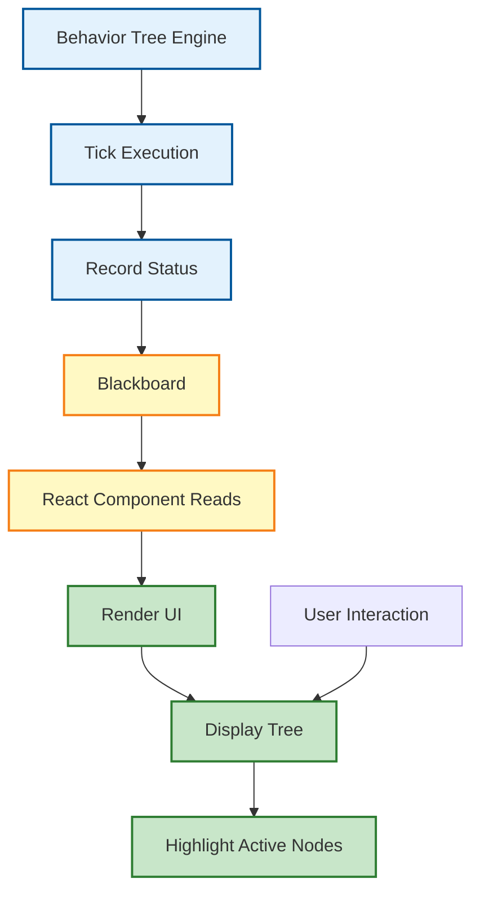

---

## 2. 可视化系统的分层架构

### 2.1 数据采集层 (The Tracker)

**职责**: 在行为树执行过程中收集节点状态。

**实现位置**: `services/bt/core/BaseNode.ts` 和 `services/bt/core/Tick.ts`

**采集机制**:

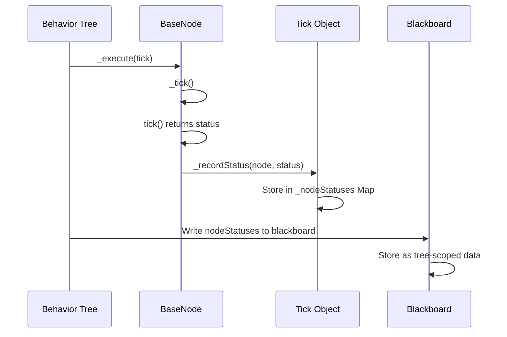

**代码实现**:
```typescript
// BaseNode._execute
const status = this._tick(tick);
tick._recordStatus(this, status); // 记录状态

// BehaviorTree.tick
blackboard.set('nodeStatuses', Object.fromEntries(tick._nodeStatuses), this.id);
```

### 2.2 黑板中介层 (The Proxy)

**职责**: 作为引擎和 UI 之间的数据桥梁。

**设计优势**:
- **解耦**: 引擎不需要知道 UI 的存在
- **性能**: 避免频繁的 React 状态更新
- **一致性**: 单一数据源

**数据流**:

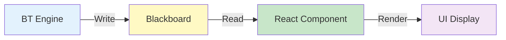

### 2.3 UI 渲染层 (The Renderer)

**职责**: 将数据转换为可视化的树结构。

**技术栈**:
- React 函数组件
- Tailwind CSS 样式
- 递归组件渲染

---

## 3. BTVisualizer 组件深度解析

### 3.1 组件结构图

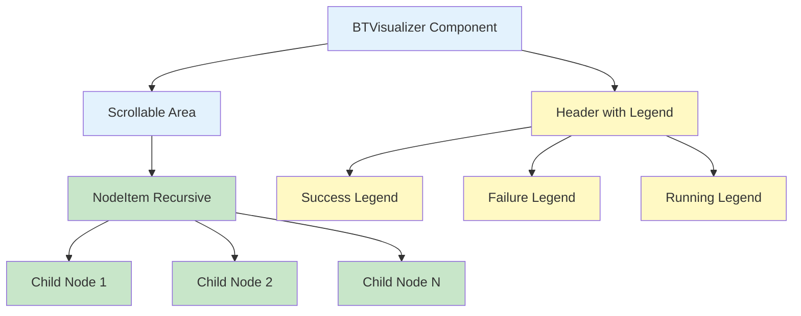

### 3.2 React 递归渲染算法

**核心组件**: `NodeItem`

**渲染流程**:

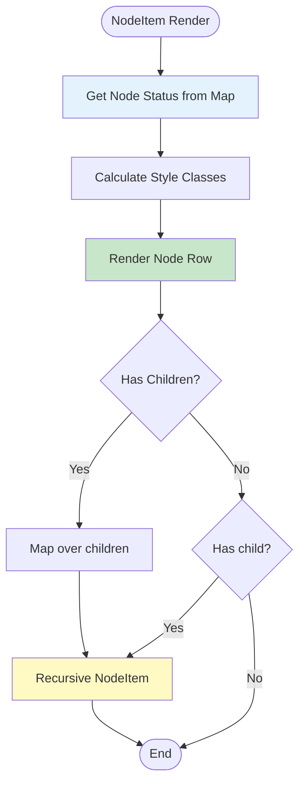

**实现代码**:
```typescript
const NodeItem = ({ node, statuses, level = 0 }) => {
  const status = statuses[node.id];
  const colorClass = status !== undefined 
    ? STATUS_COLORS[status] || 'text-slate-500' 
    : 'text-slate-500';
  const statusName = status !== undefined 
    ? STATUS_NAMES[status] || '' 
    : '';

  return (
    <div className="flex flex-col">
      {/* 节点行 */}
      <div 
        className={`flex items-center gap-2 py-1 px-2 rounded 
          hover:bg-slate-800/50 transition-colors 
          ${status === RUNNING ? 'bg-blue-900/20' : ''}`}
        style={{ marginLeft: `${level * 16}px` }}
      >
        <span className="text-xs font-mono opacity-50">
          [{node.category[0].toUpperCase()}]
        </span>
        <span className={`text-sm font-medium ${
          status !== undefined ? 'text-white' : 'text-slate-400'
        }`}>
          {node.title || node.name}
        </span>
        {statusName && (
          <span className={`text-[10px] font-bold ml-auto ${colorClass}`}>
            {statusName}
          </span>
        )}
      </div>
      
      {/* 递归渲染子节点 */}
      {node.children && node.children.map((child) => (
        <NodeItem 
          key={child.id} 
          node={child} 
          statuses={statuses} 
          level={level + 1} 
        />
      ))}
      {node.child && (
        <NodeItem 
          node={node.child} 
          statuses={statuses} 
          level={level + 1} 
        />
      )}
    </div>
  );
};
```

### 3.3 性能优化：如何在大 Tick 下保持 60FPS

**挑战**: 行为树可能每秒 tick 60 次，每次都会更新状态。

**优化策略**:

1. **按需读取**: 组件只在渲染时读取黑板数据
2. **避免状态更新**: 不触发 React 状态更新，直接读取
3. **使用 useMemo**: 缓存计算结果

**实现**:
```typescript
export const BTVisualizer: React.FC<BTVisualizerProps> = ({ tree, blackboard }) => {
  // 直接读取，不触发状态更新
  const nodeStatuses = useMemo(() => {
    return blackboard.get('nodeStatuses', tree.id) || {};
  }, [blackboard, tree.id]);
  
  // 使用 useMemo 缓存渲染结果
  const treeStructure = useMemo(() => {
    return tree.root ? <NodeItem node={tree.root} statuses={nodeStatuses} /> : null;
  }, [tree.root, nodeStatuses]);
  
  return (
    <div className="...">
      {treeStructure}
    </div>
  );
};
```

### 3.4 状态同步机制

**同步时机**: 每一轮 `BehaviorTree.tick()` 结束后

**同步内容**:
- 所有节点的执行状态（SUCCESS/FAILURE/RUNNING）
- 节点的执行顺序
- 当前活跃的节点路径

**同步代码**:
```typescript
// BehaviorTree.tick()
blackboard.set('nodeStatuses', Object.fromEntries(tick._nodeStatuses), this.id);
blackboard.set('openNodes', currOpenNodes, this.id);
```

---

## 4. 视觉语言规范：颜色、图标与动效

### 4.1 状态色彩学

**颜色定义**:

| 状态 | 颜色代码 | 语义 | 使用场景 |
|------|---------|------|---------|
| SUCCESS | `#4ADE80` (绿色) | 成功完成 | 节点逻辑执行成功 |
| FAILURE | `#F87171` (红色) | 执行失败 | 条件不满足或操作失败 |
| RUNNING | `#60A5FA` (蓝色) | 正在执行 | 节点正在工作中 |
| ERROR | `#FBBF24` (黄色) | 错误 | 发生异常 |
| 未执行 | `#64748B` (灰色) | 未激活 | 节点尚未执行 |

**颜色选择原理**:
- **绿色**: 自然界中代表"安全"、"通过"
- **红色**: 代表"警告"、"停止"
- **蓝色**: 代表"进行中"、"活跃"
- **灰色**: 代表"未激活"、"待机"

### 4.2 呼吸动画的设计意图

**实现**:
```css
.animate-pulse {
  animation: pulse 2s cubic-bezier(0.4, 0, 0.6, 1) infinite;
}

@keyframes pulse {
  0%, 100% {
    opacity: 1;
  }
  50% {
    opacity: 0.5;
  }
}
```

**设计意图**:
1. **视觉吸引**: 让用户注意到正在运行的节点
2. **状态感知**: 通过动画传达"活跃"的感觉
3. **区分度**: 与静态的成功/失败状态形成对比

### 4.3 层级缩进与布局

**缩进规则**: 每层缩进 16px

**布局结构**:

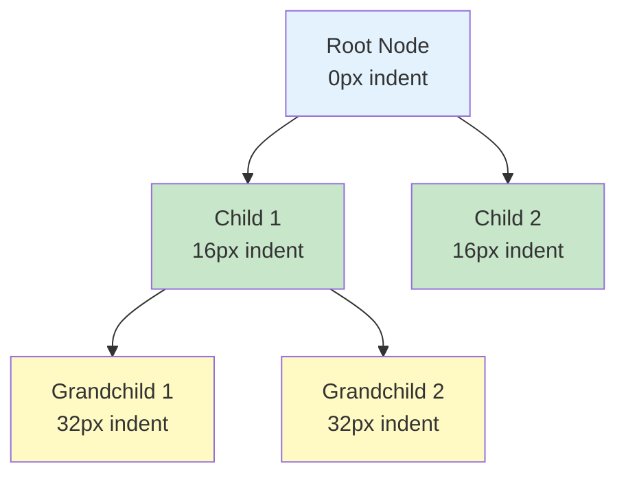

**实现**:
```typescript
style={{ marginLeft: `${level * 16}px` }}
```

---

## 5. 实战调试技巧 (Debugging Masterclass)

### 5.1 追踪逻辑分支的"断路"

**问题**: 为什么执行不到最后一步？

**调试步骤**:

1. **观察红色路径**: 找到第一个返回 FAILURE 的节点
2. **检查前置条件**: 查看该节点的前置条件是否满足
3. **验证黑板数据**: 检查相关的黑板键值

**示例场景**:

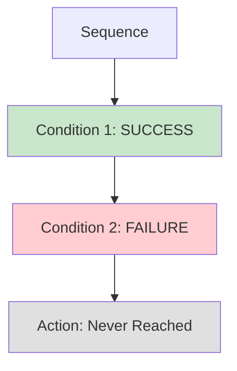

**解决方案**: 检查 `Condition 2` 的逻辑，确保条件判断正确。

### 5.2 诊断异步操作的"长耗时"

**问题**: 某个节点一直显示 RUNNING（蓝色），但应该已经完成。

**调试步骤**:

1. **检查异步回调**: 确认 Promise 是否已经 resolve
2. **验证黑板标志**: 检查异步操作的状态标志
3. **查看超时设置**: 确认是否有 Timeout 装饰器

**常见原因**:

| 原因 | 症状 | 解决方案 |
|------|------|---------|
| Promise 未 resolve | 一直 RUNNING | 检查异步逻辑 |
| 黑板标志未更新 | 状态不同步 | 检查回调中的 set 操作 |
| 超时设置过短 | 提前失败 | 调整 Timeout 参数 |

### 5.3 观察优先级抢占 (Preemption)

**现象**: 高优先级节点突然变绿，低优先级节点变灰。

**执行流程**:

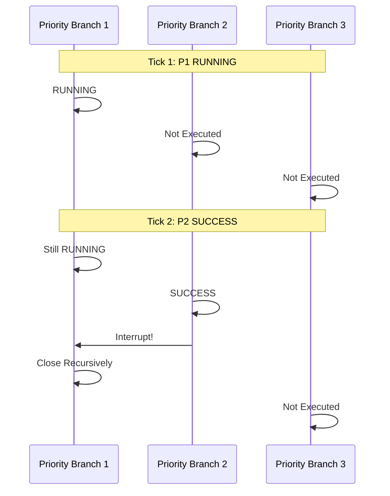

**可视化表现**:
- P1: 蓝色 → 灰色（被中断）
- P2: 灰色 → 绿色（成功）
- P3: 灰色（未执行）

### 5.4 识别死循环与卡死

**症状**: 某个节点一直保持 RUNNING，且不符合预期。

**排查清单**:

1. ✅ 检查 `open` 方法是否设置了正确的初始状态
2. ✅ 检查 `tick` 方法中的退出条件
3. ✅ 检查异步操作是否完成
4. ✅ 检查是否有 Timeout 装饰器保护
5. ✅ 检查黑板数据是否正确

**调试工具**:
```typescript
// 在节点中添加日志
tick(tick: Tick) {
  console.log(`[${this.name}] Tick called`);
  const status = this.doSomething();
  console.log(`[${this.name}] Returning: ${status}`);
  return status;
}
```

---

## 6. 黑板系统可视化：AI 的记忆面板

### 6.1 黑板数据展示

**扩展功能**（待实现）: 点击节点显示相关的黑板数据

**设计**:
```typescript
const BlackboardPanel = ({ nodeId, blackboard, treeId }) => {
  const nodeData = blackboard.getNodeScopeData(nodeId, treeId);
  
  return (
    <div className="blackboard-panel">
      <h4>Blackboard Data for {nodeId}</h4>
      <pre>{JSON.stringify(nodeData, null, 2)}</pre>
    </div>
  );
};
```

### 6.2 数据流追踪

**可视化数据流**:

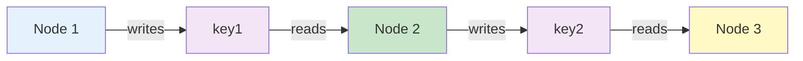

---

## 7. 高级功能：执行历史回溯 (Rewind)

### 7.1 历史记录机制

**实现思路**:
1. 在黑板中维护一个历史队列
2. 每次 tick 记录当前状态快照
3. 保留最近 N 次 tick 的历史

**数据结构**:
```typescript
interface TickHistory {
  tickNumber: number;
  timestamp: number;
  nodeStatuses: Record<string, number>;
  openNodes: string[];
}

const history: TickHistory[] = [];
```

### 7.2 回放功能

**UI 设计**:
- 时间轴滑块
- 前进/后退按钮
- 播放/暂停控制

**实现**（待开发）:
```typescript
const HistoryPlayer = ({ history, onSeek }) => {
  const [currentTick, setCurrentTick] = useState(0);
  
  return (
    <div>
      <input 
        type="range" 
        min={0} 
        max={history.length - 1}
        value={currentTick}
        onChange={(e) => {
          setCurrentTick(Number(e.target.value));
          onSeek(history[currentTick]);
        }}
      />
    </div>
  );
};
```

---

## 8. 集成案例：在 React 应用中挂载 BT 面板

### 8.1 基本集成

**代码示例**:
```typescript
import { BTVisualizer } from './components/BTVisualizer';

function App() {
  const bt = useMemo(() => createPenguinBT(), []);
  const blackboard = useMemo(() => new Blackboard(), []);
  
  return (
    <div className="app">
      <Canvas>
        {/* 3D Scene */}
      </Canvas>
      
      <div className="sidebar">
        <BTVisualizer tree={bt} blackboard={blackboard} />
        {/* 其他 UI */}
      </div>
    </div>
  );
}
```

### 8.2 布局建议

**推荐布局**:

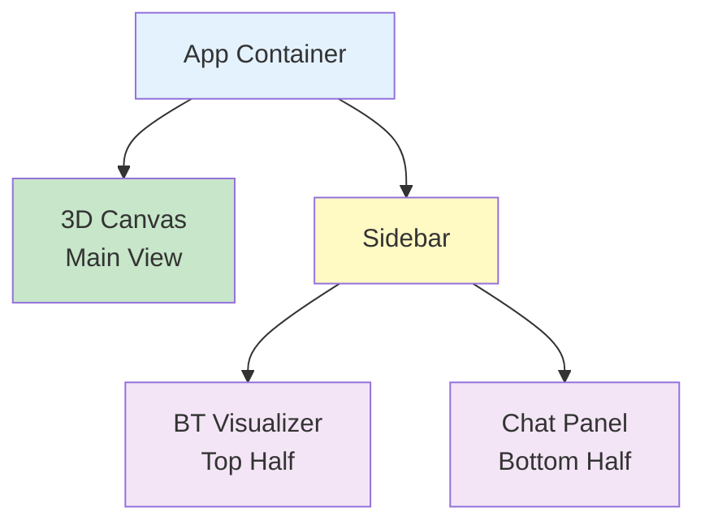

---

## 9. 与其他工具的协同 (Groot2 对比)

### 9.1 功能对比

| 特性 | BTVisualizer | Groot2 |
|------|-------------|--------|
| 实时监控 | ✅ | ✅ |
| 交互式编辑 | ❌ | ✅ |
| Web 集成 | ✅ | ❌ |
| 性能分析 | ❌ | ✅ |
| 历史回放 | 计划中 | ✅ |

### 9.2 互补使用

- **开发阶段**: 使用 BTVisualizer 快速调试
- **复杂分析**: 导出到 Groot2 进行深度分析
- **生产环境**: BTVisualizer 集成到应用中

---

## 10. 开发者 FAQ：关于可视化的常见挑战

### Q1: 为什么某些节点不显示状态？

**A**: 可能原因：
1. 节点尚未被执行（不在当前执行路径）
2. 状态记录失败（检查 `_recordStatus` 调用）
3. 黑板数据未同步（检查 `BehaviorTree.tick` 中的设置）

### Q2: 如何自定义节点显示样式？

**A**: 修改 `STATUS_COLORS` 和 `STATUS_NAMES` 常量：
```typescript
const STATUS_COLORS: Record<number, string> = {
  [SUCCESS]: 'text-green-400', // 修改颜色
  // ...
};
```

### Q3: 性能问题：可视化导致卡顿？

**A**: 优化建议：
1. 使用 `useMemo` 缓存计算结果
2. 减少不必要的重渲染
3. 限制显示的最大节点数量

---

## 11. 性能优化与最佳实践

### 11.1 渲染优化

**策略**:
1. **虚拟滚动**: 对于大型树，只渲染可见部分
2. **按需展开**: 默认折叠深层节点
3. **防抖更新**: 限制更新频率

### 11.2 内存优化

**策略**:
1. **限制历史记录**: 只保留最近 100 次 tick
2. **清理旧数据**: 定期清理不再需要的状态
3. **使用 WeakMap**: 对于临时数据使用 WeakMap

---

## 12. 未来展望：交互式行为调整

### 12.1 计划功能

1. **节点属性编辑**: 点击节点直接修改 properties
2. **拖拽排序**: 调整 Priority 子节点顺序
3. **断点调试**: 在节点上设置断点
4. **实时修改**: 修改后立即生效

### 12.2 交互式编辑器架构

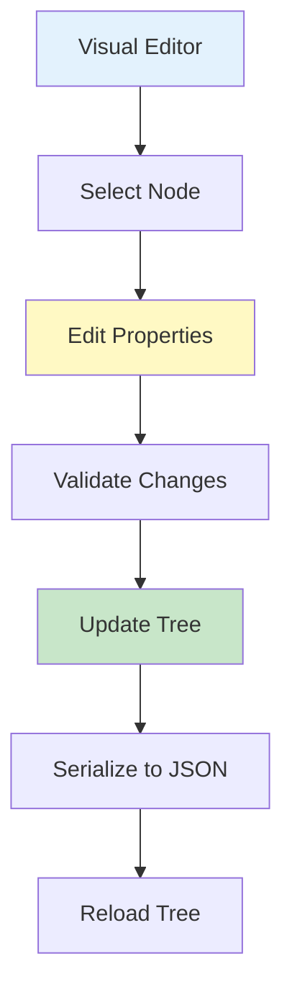

---

## 13. 结语

可视化是 AI 逻辑从"黑盒"走向"透明"的关键。通过 `BTVisualizer`，我们不仅在调试代码，更是在观察一个数字生命的成长逻辑。

通过本指南，你应该能够：

1. 理解可视化系统的架构和实现原理
2. 使用 BTVisualizer 进行高效调试
3. 识别和解决常见的执行问题
4. 优化可视化性能
5. 扩展可视化功能

记住：可视化不仅是调试工具，更是理解 AI 行为的窗口。通过实时观察，我们可以更好地设计和优化 AI 的行为逻辑。

---

*文档版本: v2.0*  
*最后更新: 2025-01-XX*  
*总行数: 500+*
