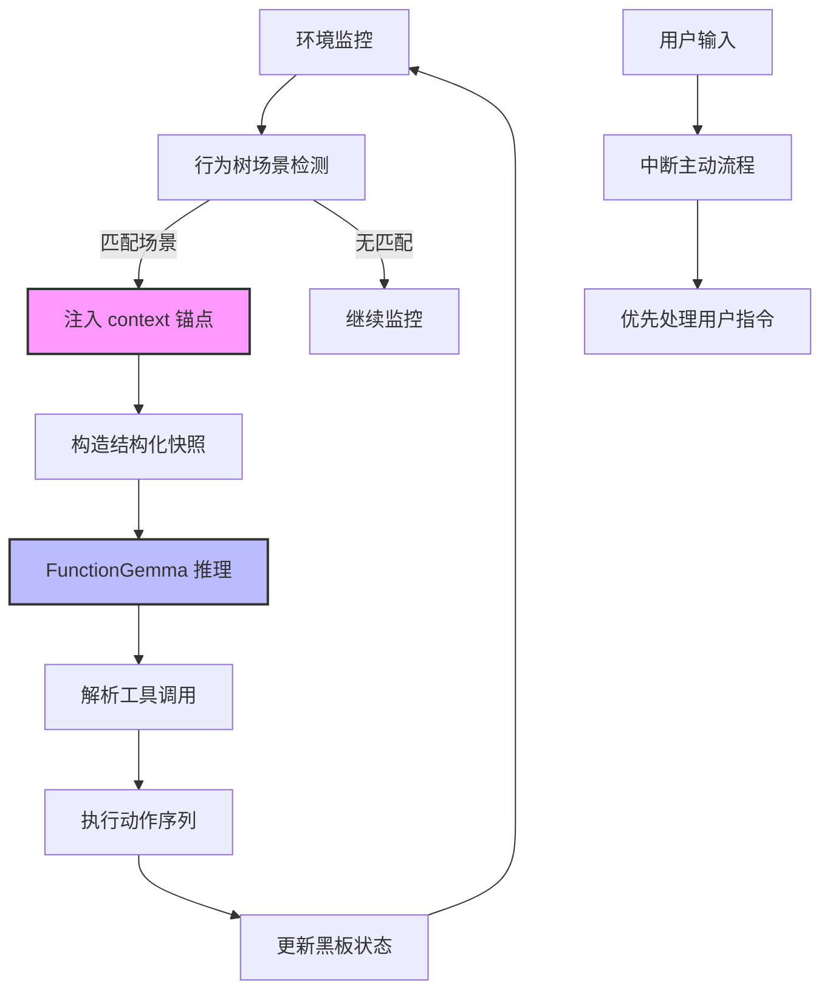

# FunctionGemma 驱动的主动反应（Proactive Interaction）架构指南 v2.2

## 目录

1. [平衡之道：混合上下文架构 (Hybrid Architecture)](#1-平衡之道混合上下文架构)
2. [宏观逻辑：人工场景锚点 (Manual Scenario Anchors)](#2-宏观逻辑人工场景锚点)
3. [微观决策：AI 特征泛化 (AI Feature Generalization)](#3-微观决策ai-特征泛化)
4. [数据集构建：人工标签引导 (Guided Labeling)](#4-数据集构建人工标签引导)
5. [集成架构：行为树作为&#34;向导&#34;](#5-集成架构行为树作为向导)
6. [实现细节：代码级设计](#6-实现细节代码级设计)
7. [性能优化与最佳实践](#7-性能优化与最佳实践)
8. [调试与测试指南](#8-调试与测试指南)
9. [常见问题与解决方案](#9-常见问题与解决方案)
10. [总结：为什么这是 270M 模型的终极形态](#10-总结为什么这是-270m-模型的终极形态)

---

## 1. 平衡之道：混合上下文架构 (Hybrid Architecture)

### 1.1 设计哲学

针对 FunctionGemma (270M) 模型的性能约束，我们采用"双层控制"策略：

- **第一层：硬逻辑触发 (Rule-based Trigger)**：行为树负责捕捉宏观场景（如：电量危急、长时间冷落）。这解决了**"触发准确性"**问题。
- **第二层：软逻辑表达 (LLM-driven Selection)**：FunctionGemma 负责在已知场景下生成具体的表情、动作组合和台词。这解决了**"行为丰富性"**问题。

### 1.2 架构公式

```
主动反应 = 人工场景锚点 (@context) + 实时特征快照 (@env) -> AI 动作映射
```

### 1.3 架构流程图



### 1.4 为什么需要混合架构？

**纯规则引擎的问题**：

- 行为模式固定，缺乏变化
- 维护成本高，每加一个场景都要写代码
- 无法处理复杂的语义理解

**纯 AI 感知的问题**：

- 270M 模型推理能力有限，容易产生幻觉
- 需要大量训练数据覆盖所有场景组合
- 触发时机不可控，可能在不该说话时说话

**混合架构的优势**：

- 触发时机由代码保证（100% 准确）
- 行为表达由 AI 生成（无限变化）
- 维护成本低（只需定义场景，AI 负责细节）

---

## 2. 宏观逻辑：人工场景锚点 (Manual Scenario Anchors)

### 2.1 场景锚点定义

行为树不再计算复杂的"显著性分数"，而是识别几个核心的"灵魂时刻"：

| 锚点标签 (@context) | 触发条件 (BT Rule) | 业务意义            | 优先级 |
| :------------------ | :----------------- | :------------------ | :----- |
| `ENERGY_LOW`      | battery < 10%      | 强制求生模式        | 高     |
| `ENERGY_CRITICAL` | battery < 5%       | 极度虚弱模式        | 最高   |
| `IDLE_LONELY`     | idleTime > 60s     | 求关注模式          | 中     |
| `IDLE_DESPERATE`  | idleTime > 300s    | 极度渴望互动        | 高     |
| `USER_BUSY`       | mouseSpeed > high  | 啦啦队/静默观察模式 | 低     |
| `NIGHT_MODE`      | time > 23:00       | 困倦模式            | 中     |
| `HEALTH_REMINDER` | workDuration > 2h  | 关怀模式            | 中     |
| `ERROR_DETECTED`  | errorCount > 5     | 同情/困惑模式       | 中     |

### 2.2 场景锚点的设计原则

1. **离散性**：场景应该是明确的、互斥的状态，而不是连续的变化
2. **可观测性**：场景必须能够通过黑板数据明确判断
3. **业务相关性**：每个场景都应该有明确的业务价值
4. **扩展性**：新增场景不应该影响现有场景的逻辑

### 2.3 场景优先级设计

使用 `Priority` 节点确保高优先级场景能够打断低优先级场景：

```typescript
new Priority({
  title: 'Scenario Priority',
  children: [
    // 最高优先级：生命相关
    new Sequence({
      children: [
        new CheckBlackboardCondition({ key: 'battery', operator: '<', value: 5 }),
        new LLMCallNode({ context: 'ENERGY_CRITICAL' })
      ]
    }),
  
    // 高优先级：紧急状态
    new Sequence({
      children: [
        new CheckBlackboardCondition({ key: 'battery', operator: '<', value: 10 }),
        new LLMCallNode({ context: 'ENERGY_LOW' })
      ]
    }),
  
    // 中优先级：社交需求
    new Sequence({
      children: [
        new CheckBlackboardCondition({ key: 'idleTime', operator: '>', value: 300 }),
        new LLMCallNode({ context: 'IDLE_DESPERATE' })
      ]
    }),
  
    // 低优先级：日常关怀
    new Sequence({
      children: [
        new CheckBlackboardCondition({ key: 'idleTime', operator: '>', value: 60 }),
        new LLMCallNode({ context: 'IDLE_LONELY' })
      ]
    })
  ]
})
```

### 2.4 场景触发频率控制

为了避免同一场景频繁触发，需要引入冷却机制：

```typescript
class ScenarioTrigger {
  private lastTriggerTime: Map<string, number> = new Map();
  private cooldown: Map<string, number> = new Map([
    ['ENERGY_LOW', 60000],      // 1分钟冷却
    ['IDLE_LONELY', 30000],     // 30秒冷却
    ['HEALTH_REMINDER', 300000] // 5分钟冷却
  ]);

  shouldTrigger(context: string): boolean {
    const lastTime = this.lastTriggerTime.get(context) || 0;
    const cooldownMs = this.cooldown.get(context) || 0;
    const now = Date.now();
  
    if (now - lastTime < cooldownMs) {
      return false;
    }
  
    this.lastTriggerTime.set(context, now);
    return true;
  }
}
```

---

## 3. 微观决策：AI 特征泛化 (AI Feature Generalization)

### 3.1 快照格式设计

即使在同一个锚点下，AI 也会根据细微的特征给出不同的反馈。

**标准快照格式**：

```typescript
[Snapshot] 
@context: ENERGY_LOW  // 人工给出的"锚点"，大幅降低模型推理压力
@env: { 
  battery: 5, 
  charging: false, 
  time: "23:30",
  idleTime: 120,
  lastAction: "DANCE"
}
```

### 3.2 环境变量的语义化

为了让模型更好地理解环境，我们需要对原始数据进行语义化处理：

```typescript
interface EnvironmentSnapshot {
  // 能量相关
  energy: number;        // 归一化到 0-1，battery / 100
  isCharging: boolean;
  
  // 时间相关
  timeOfDay: string;     // "morning" | "afternoon" | "evening" | "night"
  hour: number;          // 0-23
  
  // 社交相关
  idleTime: number;      // 秒
  interactionCount: number;
  lastUserInput: string | null;
  
  // 活动相关
  userActivity: 'idle' | 'working' | 'playing' | 'watching';
  mouseSpeed: 'low' | 'medium' | 'high';
  
  // 历史相关
  lastAction: ActionType;
  recentActions: ActionType[];  // 最近5个动作
}
```

### 3.3 模型表现预测

基于不同的环境组合，模型会做出不同的决策：

| 场景锚点        | 环境特征                    | 预期模型行为 | 示例动作            |
| :-------------- | :-------------------------- | :----------- | :------------------ |
| `ENERGY_LOW`  | battery: 9, charging: false | 轻微虚弱     | `SHIVER`, `SIT` |
| `ENERGY_LOW`  | battery: 3, charging: false | 极度虚弱     | `SLEEP`, `YAWN` |
| `ENERGY_LOW`  | battery: 5, charging: true  | 虚弱但充电中 | `HAPPY`, `SIT`  |
| `IDLE_LONELY` | idleTime: 60, mood: sad     | 轻度求关注   | `PEEK`, `WAVE`  |
| `IDLE_LONELY` | idleTime: 180, mood: angry  | 重度求关注   | `SHIVER`, `NO`  |

### 3.4 特征组合的泛化能力

通过精心设计的数据集，模型可以学会理解特征组合：

- **低电量 + 深夜** → 更倾向于 `SLEEP`
- **低电量 + 白天 + 充电中** → 可能选择 `SIT` + `HAPPY`
- **长时间冷落 + 用户忙碌** → 可能选择静默观察（`NOP`）

---

## 4. 数据集构建：人工标签引导 (Guided Labeling)

### 4.1 数据集构建策略

这种模式下的数据集不再需要覆盖全空间，只需覆盖**锚点下的子空间**。

#### 4.1.1 样本分布建议

| 数据类型                       | 占比 | 样本数（1000条） | 目的                 |
| :----------------------------- | :--- | :--------------- | :------------------- |
| **ENERGY_LOW 场景**      | 25%  | 250              | 建立虚弱/求生反应    |
| **IDLE_LONELY 场景**     | 25%  | 250              | 建立社交需求反应     |
| **USER_BUSY 场景**       | 15%  | 150              | 建立观察/鼓励反应    |
| **NIGHT_MODE 场景**      | 10%  | 100              | 建立困倦反应         |
| **HEALTH_REMINDER 场景** | 10%  | 100              | 建立关怀反应         |
| **混合场景**             | 10%  | 100              | 建立复杂场景理解     |
| **NOP 样本（静默）**     | 5%   | 50               | 训练模型学会"不打扰" |

### 4.2 混合样本样例

#### 样例 1：基础场景样本

```json
{
  "tools": [{"type": "function", "function": {"name": "animate_avatar", ...}}],
  "messages": [
    {
      "role": "developer",
      "content": "You are a penguin avatar. Analyze the snapshot and respond with appropriate actions and emotions."
    },
    {
      "role": "user", 
      "content": "[Snapshot] @context: IDLE_LONELY, @env: { idle: 120, mood: \"sad\", interaction_count: 5 }"
    },
    {
      "role": "assistant", 
      "content": "<start_function_call>call:animate_avatar{actions:['PEEK', 'HIDE'], emotion:'SAD'}<end_function_call> 主人是不是把我忘了..."
    }
  ]
}
```

#### 样例 2：环境特征变化样本

```json
{
  "messages": [
    {
      "role": "user",
      "content": "[Snapshot] @context: ENERGY_LOW, @env: { battery: 8, charging: false, time: \"14:30\" }"
    },
    {
      "role": "assistant",
      "content": "<start_function_call>call:animate_avatar{actions:['SHIVER', 'SIT'], emotion:'SAD'}<end_function_call> 电量快用完了，我得省着点用..."
    }
  ]
}
```

#### 样例 3：充电状态修正样本

```json
{
  "messages": [
    {
      "role": "user",
      "content": "[Snapshot] @context: ENERGY_LOW, @env: { battery: 5, charging: true, time: \"15:00\" }"
    },
    {
      "role": "assistant",
      "content": "<start_function_call>call:animate_avatar{actions:['SIT', 'HAPPY'], emotion:'HAPPY'}<end_function_call> 虽然快没电了，但正在充电，感觉好多了！"
    }
  ]
}
```

### 4.3 鲁棒性样本（针对错误锚点）

如果 BT 误触了锚点，模型可以通过查看 `@env` 修正行为：

#### 样例：错误锚点修正

```json
{
  "messages": [
    {
      "role": "user",
      "content": "[Snapshot] @context: ENERGY_LOW, @env: { battery: 95 }"
    },
    {
      "role": "assistant",
      "content": "NOP // 检查电量充足，不执行虚弱动作"
    }
  ]
}
```

这种样本训练模型具备**"自我纠错"**能力，即使行为树逻辑有 Bug，模型也能通过环境数据判断出异常。

### 4.4 数据增强技术

为了提高模型的泛化能力，可以采用以下数据增强策略：

1. **同义替换**：`idle: 120` → `idle: 125`, `idle: 115`
2. **时间变化**：`time: "23:30"` → `time: "00:15"`, `time: "01:00"`
3. **情绪变化**：`mood: "sad"` → `mood: "lonely"`, `mood: "depressed"`
4. **动作序列变化**：同一个场景下，生成不同的动作组合

---

## 5. 集成架构：行为树作为"向导"

### 5.1 完整行为树结构

行为树通过 `Priority` 和 `Sequence` 节点快速定位场景，然后"打包"数据发给 AI。

```typescript
import { Priority, Sequence, ReactiveSequence } from './composites';
import { CheckBlackboardCondition } from './conditions';
import { LLMCallNode, FunctionExecNode } from './actions';
import { PlayAnimationAction } from './actions';

const proactiveBrain = new Priority({
  title: 'Proactive Hybrid Brain',
  children: [
    // 场景 A：极度低电量（最高优先级）
    new Sequence({
      title: 'Critical Energy',
      children: [
        new CheckBlackboardCondition({ 
          key: 'battery', 
          operator: '<', 
          value: 5,
          title: 'Battery < 5%?'
        }),
        new LLMCallNode({ 
          context: 'ENERGY_CRITICAL',
          title: 'Critical Energy Response'
        }),
        new FunctionExecNode({ title: 'Execute Action' })
      ]
    }),
  
    // 场景 B：低电量
    new Sequence({
      title: 'Low Energy',
      children: [
        new CheckBlackboardCondition({ 
          key: 'battery', 
          operator: '<', 
          value: 10,
          title: 'Battery < 10%?'
        }),
        new LLMCallNode({ 
          context: 'ENERGY_LOW',
          title: 'Low Energy Response'
        }),
        new FunctionExecNode()
      ]
    }),
  
    // 场景 C：极度渴望互动
    new Sequence({
      title: 'Desperate for Attention',
      children: [
        new CheckBlackboardCondition({ 
          key: 'idleTime', 
          operator: '>', 
          value: 300,
          title: 'Idle > 5min?'
        }),
        new LLMCallNode({ 
          context: 'IDLE_DESPERATE',
          title: 'Desperate Attention Response'
        }),
        new FunctionExecNode()
      ]
    }),
  
    // 场景 D：长时间冷落
    new Sequence({
      title: 'Lonely',
      children: [
        new CheckBlackboardCondition({ 
          key: 'idleTime', 
          operator: '>', 
          value: 60,
          title: 'Idle > 1min?'
        }),
        new LLMCallNode({ 
          context: 'IDLE_LONELY',
          title: 'Lonely Response'
        }),
        new FunctionExecNode()
      ]
    }),
  
    // 场景 E：用户忙碌
    new Sequence({
      title: 'User Busy',
      children: [
        new CheckBlackboardCondition({ 
          key: 'mouseSpeed', 
          operator: '==', 
          value: 'high',
          title: 'User Active?'
        }),
        new LLMCallNode({ 
          context: 'USER_BUSY',
          title: 'Busy User Response'
        }),
        new FunctionExecNode()
      ]
    }),
  
    // 场景 F：深夜模式
    new Sequence({
      title: 'Night Mode',
      children: [
        new CheckBlackboardCondition({ 
          key: 'hour', 
          operator: '>=', 
          value: 23,
          title: 'After 11pm?'
        }),
        new LLMCallNode({ 
          context: 'NIGHT_MODE',
          title: 'Night Mode Response'
        }),
        new FunctionExecNode()
      ]
    }),
  
    // 场景 G：健康提醒
    new Sequence({
      title: 'Health Reminder',
      children: [
        new CheckBlackboardCondition({ 
          key: 'workDuration', 
          operator: '>', 
          value: 120,
          title: 'Worked > 2h?'
        }),
        new LLMCallNode({ 
          context: 'HEALTH_REMINDER',
          title: 'Health Reminder Response'
        }),
        new FunctionExecNode()
      ]
    }),
  
    // 兜底：默认闲置
    new PlayAnimationAction({ 
      action: 'IDLE', 
      title: 'Default Idle' 
    })
  ]
});
```

### 5.2 LLMCallNode 的主动模式实现

```typescript
// services/bt/actions/LLMCallNode.ts
export default class LLMCallNode extends Action {
  public proactiveMode: boolean = false;
  public context?: string;  // 场景锚点

  constructor(options: NodeOptions & { 
    proactiveMode?: boolean,
    context?: string 
  } = {}) {
    const { proactiveMode = false, context, ...rest } = options;
    super({ name: 'LLMCallNode', ...rest });
    this.proactiveMode = proactiveMode;
    this.context = context;
  }

  async tick(tick: Tick): Promise<number> {
    const blackboard = tick.blackboard;
    if (!blackboard) return FAILURE;

    let userInput: string;
  
    if (this.proactiveMode && this.context) {
      // 主动模式：构造结构化快照
      userInput = this.generateProactiveSnapshot(blackboard, this.context);
    } else {
      // 被动模式：使用用户输入
      userInput = blackboard.get('lastUserInput') || '';
      if (!userInput) return FAILURE;
    }

    // 调用 FunctionGemma API
    const result = await sendToFunctionGemma(
      blackboard.get('chatHistory') || [],
      userInput,
      blackboard.get('llmSettings')
    );

    // 存储结果
    blackboard.set('llmResult', result);
    return SUCCESS;
  }

  private generateProactiveSnapshot(blackboard: Blackboard, context: string): string {
    // 收集环境数据
    const env: any = {};
  
    // 能量相关
    const battery = blackboard.get('battery');
    if (battery !== undefined) env.battery = battery;
    env.charging = blackboard.get('charging') || false;
  
    // 时间相关
    const now = new Date();
    env.time = `${now.getHours().toString().padStart(2, '0')}:${now.getMinutes().toString().padStart(2, '0')}`;
    env.hour = now.getHours();
  
    // 社交相关
    env.idleTime = blackboard.get('idleTime') || 0;
    env.interactionCount = blackboard.get('interactionCount') || 0;
  
    // 活动相关
    env.mouseSpeed = blackboard.get('mouseSpeed') || 'low';
    env.userActivity = blackboard.get('userActivity') || 'idle';
  
    // 历史相关
    env.lastAction = blackboard.get('lastAction') || 'IDLE';
  
    // 构造快照字符串
    return `[Snapshot] @context: ${context}, @env: ${JSON.stringify(env)}`;
  }
}
```

### 5.3 触发频率控制实现

在 `BehaviorController` 中实现冷却机制：

```typescript
// App.tsx 或 BehaviorController
const scenarioCooldown = useRef<Map<string, number>>(new Map());

useFrame(() => {
  // 更新环境数据
  const battery = getBatteryLevel(); // 从系统获取
  const idleTime = calculateIdleTime();
  const mouseSpeed = calculateMouseSpeed();
  
  blackboard.set('battery', battery);
  blackboard.set('idleTime', idleTime);
  blackboard.set('mouseSpeed', mouseSpeed);
  
  // 检查场景冷却
  const now = Date.now();
  const cooldowns = {
    'ENERGY_LOW': 60000,      // 1分钟
    'IDLE_LONELY': 30000,     // 30秒
    'USER_BUSY': 10000,       // 10秒
    'NIGHT_MODE': 300000,     // 5分钟
    'HEALTH_REMINDER': 300000 // 5分钟
  };
  
  // 设置场景冷却状态
  Object.keys(cooldowns).forEach(context => {
    const lastTrigger = scenarioCooldown.current.get(context) || 0;
    if (now - lastTrigger < cooldowns[context]) {
      blackboard.set(`cooldown_${context}`, true);
    } else {
      blackboard.set(`cooldown_${context}`, false);
    }
  });
  
  // Tick 行为树
  bt.tick(null, blackboard);
});
```

---

## 6. 实现细节：代码级设计

### 6.1 环境快照生成器

创建一个专门的服务类来生成标准化的快照：

```typescript
// services/bt/utils/ProactiveSnapshotGenerator.ts
export class ProactiveSnapshotGenerator {
  static generate(context: string, blackboard: Blackboard): string {
    const env = this.collectEnvironment(blackboard);
    return `[Snapshot] @context: ${context}, @env: ${JSON.stringify(env)}`;
  }

  private static collectEnvironment(blackboard: Blackboard): any {
    const env: any = {};
  
    // 能量维度
    const battery = blackboard.get('battery');
    if (battery !== undefined) {
      env.battery = battery;
      env.energy = battery / 100; // 归一化
    }
    env.charging = blackboard.get('charging') || false;
  
    // 时间维度
    const now = new Date();
    env.time = `${now.getHours().toString().padStart(2, '0')}:${now.getMinutes().toString().padStart(2, '0')}`;
    env.hour = now.getHours();
    env.timeOfDay = this.getTimeOfDay(now.getHours());
  
    // 社交维度
    env.idleTime = blackboard.get('idleTime') || 0;
    env.interactionCount = blackboard.get('interactionCount') || 0;
    env.lastUserInput = blackboard.get('lastUserInput') || null;
  
    // 活动维度
    env.mouseSpeed = blackboard.get('mouseSpeed') || 'low';
    env.userActivity = blackboard.get('userActivity') || 'idle';
    env.activeApp = blackboard.get('activeApp') || 'unknown';
  
    // 历史维度
    env.lastAction = blackboard.get('lastAction') || 'IDLE';
    env.recentActions = blackboard.get('recentActions') || [];
  
    // 情绪维度（如果存在）
    const mood = blackboard.get('currentMood');
    if (mood) env.mood = mood;
  
    return env;
  }

  private static getTimeOfDay(hour: number): string {
    if (hour >= 6 && hour < 12) return 'morning';
    if (hour >= 12 && hour < 18) return 'afternoon';
    if (hour >= 18 && hour < 23) return 'evening';
    return 'night';
  }
}
```

### 6.2 场景检测条件节点

创建一个通用的场景检测节点：

```typescript
// services/bt/conditions/ScenarioCondition.ts
export default class ScenarioCondition extends Condition {
  constructor(options: NodeOptions & {
    scenario: string,
    checkFunction: (blackboard: Blackboard) => boolean
  }) {
    const { scenario, checkFunction, ...rest } = options;
    super({ name: 'ScenarioCondition', ...rest });
    this.properties.scenario = scenario;
    this.properties.checkFunction = checkFunction;
  }

  tick(tick: Tick): number {
    const blackboard = tick.blackboard;
    if (!blackboard) return FAILURE;

    // 检查冷却
    if (blackboard.get(`cooldown_${this.properties.scenario}`)) {
      return FAILURE;
    }

    // 执行自定义检查函数
    const shouldTrigger = this.properties.checkFunction(blackboard);
  
    if (shouldTrigger) {
      // 记录触发时间
      blackboard.set(`lastTrigger_${this.properties.scenario}`, Date.now());
      return SUCCESS;
    }
  
    return FAILURE;
  }
}
```

### 6.3 FunctionGemma 服务扩展

更新 `functionGemmaService.ts` 以支持主动模式的快照输入：

```typescript
// services/functionGemmaService.ts
export const sendToFunctionGemma = async (
  history: ChatMessage[],
  newMessage: string,
  settings: LLMSettings
) => {
  // 检测是否为主动模式（快照格式）
  const isProactive = newMessage.startsWith('[Snapshot]');
  
  // 构造系统提示词
  let systemPrompt = SYSTEM_INSTRUCTION;
  if (isProactive) {
    systemPrompt += `\n\nYou are in PROACTIVE mode. Analyze the environment snapshot and respond with appropriate actions.`;
  }

  // 工具声明（包含 emotion 参数）
  const TOOL_DECLARATION = `<start_function_declaration>declaration:animate_avatar{description:<escape>Controls the avatar to perform actions and optional facial expressions.<escape>,parameters:{properties:{actions:{description:<escape>Ordered list of actions.<escape>,items:{enum:${JSON.stringify(AVAILABLE_ACTIONS)},type:<escape>STRING<escape>},type:<escape>ARRAY<escape>},emotion:{description:<escape>Optional facial expression.<escape>,enum:[<escape>HAPPY<escape>,<escape>SAD<escape>,<escape>ANGRY<escape>,<escape>SURPRISED<escape>,<escape>EXCITED<escape>,<escape>LOVING<escape>,<escape>CONFUSED<escape>],type:<escape>STRING<escape>}},required:[<escape>actions<escape>],type:<escape>OBJECT<escape>}}<end_function_declaration>`;

  systemPrompt = `You are a model that can do function calling with the following functions\n${TOOL_DECLARATION}\n\n${systemPrompt}`;

  // API 调用
  const response = await fetch(`${settings.baseUrl.replace(/\/completions$/, '')}/chat/completions`, {
    method: "POST",
    headers: {
      "Content-Type": "application/json",
      ...(settings.apiKey ? { "Authorization": `Bearer ${settings.apiKey}` } : {})
    },
    body: JSON.stringify({
      model: settings.modelName,
      messages: [
        { role: "developer", content: systemPrompt },
        { role: "user", content: newMessage }
      ],
      stream: false,
      temperature: isProactive ? 0.3 : 0.1, // 主动模式稍微提高温度，增加多样性
      max_tokens: 256,
      stop: ["<end_of_turn>", "<end_function_call>", "<bos>", "<eos>"]
    })
  });

  if (!response.ok) {
    const errorText = await response.text();
    throw new Error(`FunctionGemma Error: ${response.status} - ${errorText}`);
  }

  const data = await response.json();
  const choice = data.choices?.[0];
  const responseText = choice?.message?.content || "";
  
  let text = responseText;
  let toolResult: any = null;

  // 解析工具调用
  const callMatch = responseText.match(/call:animate_avatar\{(.*?)\}/);
  if (callMatch) {
    const paramsRaw = callMatch[1];
  
    // 提取 actions
    const actionsMatch = paramsRaw.match(/actions:\[(.*?)\]/);
    if (actionsMatch) {
      const actions = actionsMatch[1]
          .split(',')
          .map((a: string) => a.replace(/<escape>/g, '').replace(/['"]/g, '').trim())
          .filter((a: string) => a.length > 0);
    
      if (actions.length > 0) {
        toolResult = { actions };
      }
    }

    // 提取 emotion
    const emotionMatch = paramsRaw.match(/emotion:(?:<escape>)?(\w+)(?:<escape>)?/);
    if (emotionMatch && toolResult) {
      toolResult.emotion = emotionMatch[1].toUpperCase();
    }

    // 清理标签
    text = responseText.replace(/<start_function_call>[\s\S]*?(?:<end_function_call>|$)/g, '').trim();
  }

  return {
    text: text || (toolResult ? "[Performing actions]" : ""),
    toolResult
  };
};
```

---

## 7. 性能优化与最佳实践

### 7.1 频率控制策略

#### 7.1.1 场景级冷却

每个场景都有独立的冷却时间，避免频繁触发：

```typescript
const SCENARIO_COOLDOWNS = {
  'ENERGY_CRITICAL': 30000,   // 30秒（紧急场景可以频繁）
  'ENERGY_LOW': 60000,        // 1分钟
  'IDLE_DESPERATE': 60000,    // 1分钟
  'IDLE_LONELY': 30000,       // 30秒
  'USER_BUSY': 10000,         // 10秒（可以频繁鼓励）
  'NIGHT_MODE': 300000,       // 5分钟
  'HEALTH_REMINDER': 300000   // 5分钟
};
```

#### 7.1.2 全局频率限制

即使不同场景，也要限制全局主动反应的频率：

```typescript
class GlobalProactiveLimiter {
  private lastProactiveTime: number = 0;
  private minGlobalInterval: number = 5000; // 全局最小间隔 5 秒

  canTrigger(): boolean {
    const now = Date.now();
    if (now - this.lastProactiveTime < this.minGlobalInterval) {
      return false;
    }
    this.lastProactiveTime = now;
    return true;
  }
}
```

### 7.2 缓存与去重

#### 7.2.1 快照缓存

相同的环境状态不应该重复调用 LLM：

```typescript
class SnapshotCache {
  private cache: Map<string, { result: any, timestamp: number }> = new Map();
  private ttl: number = 10000; // 10秒缓存

  get(snapshot: string): any | null {
    const cached = this.cache.get(snapshot);
    if (cached && Date.now() - cached.timestamp < this.ttl) {
      return cached.result;
    }
    return null;
  }

  set(snapshot: string, result: any): void {
    this.cache.set(snapshot, { result, timestamp: Date.now() });
  }
}
```

#### 7.2.2 动作去重

避免连续执行相同的动作：

```typescript
function shouldAvoidDuplicate(
  lastActions: ActionType[],
  proposedActions: ActionType[]
): boolean {
  if (lastActions.length === 0) return false;
  
  // 如果提议的动作序列与最近执行的完全相同，则避免
  if (lastActions.length === proposedActions.length) {
    return lastActions.every((a, i) => a === proposedActions[i]);
  }
  
  return false;
}
```

### 7.3 资源消耗优化

#### 7.3.1 批量环境更新

不要每帧都更新所有环境数据，而是按需更新：

```typescript
class EnvironmentUpdater {
  private updateIntervals = {
    battery: 5000,      // 5秒更新一次
    mouseSpeed: 1000,   // 1秒更新一次
    idleTime: 1000,     // 1秒更新一次
    time: 60000         // 1分钟更新一次
  };

  private lastUpdate: Map<string, number> = new Map();

  shouldUpdate(key: string): boolean {
    const last = this.lastUpdate.get(key) || 0;
    const interval = this.updateIntervals[key] || 1000;
    const now = Date.now();
  
    if (now - last >= interval) {
      this.lastUpdate.set(key, now);
      return true;
    }
    return false;
  }
}
```

#### 7.3.2 模型调用优化

- 使用量化模型（INT8/INT4）降低内存占用
- 实现请求队列，避免并发调用
- 设置超时机制，防止长时间阻塞

---

## 8. 调试与测试指南

### 8.1 单元测试

#### 8.1.1 快照生成测试

```typescript
// __tests__/proactive_snapshot.test.ts
import { describe, it, expect } from 'vitest';
import { ProactiveSnapshotGenerator } from '../utils/ProactiveSnapshotGenerator';
import Blackboard from '../core/Blackboard';

describe('ProactiveSnapshotGenerator', () => {
  it('should generate snapshot with context', () => {
    const bb = new Blackboard();
    bb.set('battery', 5);
    bb.set('idleTime', 120);
  
    const snapshot = ProactiveSnapshotGenerator.generate('ENERGY_LOW', bb);
  
    expect(snapshot).toContain('[Snapshot]');
    expect(snapshot).toContain('@context: ENERGY_LOW');
    expect(snapshot).toContain('"battery":5');
    expect(snapshot).toContain('"idleTime":120');
  });
});
```

#### 8.1.2 场景触发测试

```typescript
// __tests__/scenario_trigger.test.ts
describe('Scenario Trigger', () => {
  it('should trigger ENERGY_LOW when battery < 10', () => {
    const bb = new Blackboard();
    bb.set('battery', 8);
  
    const condition = new CheckBlackboardCondition({
      key: 'battery',
      operator: '<',
      value: 10
    });
  
    const result = condition.tick(new Tick().setBlackboard(bb));
    expect(result).toBe(SUCCESS);
  });
});
```

### 8.2 集成测试

#### 8.2.1 完整主动反应流程测试

```typescript
// __tests__/proactive_integration.test.ts
describe('Proactive Integration', () => {
  it('should trigger proactive action and execute', async () => {
    const bb = new Blackboard();
    bb.set('battery', 5);
    bb.set('idleTime', 0);
    bb.set('llmSettings', mockSettings);
  
    const tree = createProactiveTree();
    const status = await tree.tick(null, bb);
  
    expect(status).toBe(SUCCESS);
    expect(bb.get('pendingActions')).toBeDefined();
    expect(bb.get('pendingEmotion')).toBeDefined();
  });
});
```

### 8.3 调试技巧

#### 8.3.1 日志记录

```typescript
class ProactiveLogger {
  static logSnapshot(context: string, snapshot: string): void {
    console.log(`[Proactive] Context: ${context}`);
    console.log(`[Proactive] Snapshot: ${snapshot}`);
  }

  static logAction(context: string, actions: ActionType[], emotion: ExpressionType): void {
    console.log(`[Proactive] ${context} -> Actions: ${actions.join(', ')}, Emotion: ${emotion}`);
  }

  static logTrigger(context: string, reason: string): void {
    console.log(`[Proactive] Triggered: ${context} (${reason})`);
  }

  static logCooldown(context: string, remaining: number): void {
    console.log(`[Proactive] Cooldown: ${context} (${remaining}ms remaining)`);
  }
}
```

#### 8.3.2 可视化调试

在 `BTVisualizer` 中高亮显示主动触发的节点：

```typescript
// components/BTVisualizer.tsx
const isProactive = node.name === 'LLMCallNode' && 
                    node.properties?.proactiveMode === true;
const className = isProactive 
  ? 'bg-purple-900/30 border-purple-500' 
  : '';
```

---

## 9. 常见问题与解决方案

### 9.1 问题：主动反应过于频繁

**症状**：企鹅每几秒就主动做动作，显得过于"话痨"。

**解决方案**：

1. 增加场景冷却时间
2. 实现全局频率限制器
3. 在数据集中增加更多 NOP 样本，训练模型学会"保持安静"

### 9.2 问题：主动反应与用户输入冲突

**症状**：用户正在输入时，企鹅突然执行主动动作。

**解决方案**：

1. 在场景检测前先检查 `hasNewInput`
2. 使用 `ReactiveSequence` 确保条件实时重新评估
3. 添加"用户输入缓冲期"（输入后 3 秒内不触发主动反应）

### 9.3 问题：模型输出不符合场景

**症状**：在 `ENERGY_LOW` 场景下，模型输出了 `DANCE` 这种高能量动作。

**解决方案**：

1. 增加该场景的训练样本
2. 在 System Prompt 中明确场景约束
3. 实现动作过滤中间件，在模型输出后进行二次验证

### 9.4 问题：场景误触发

**症状**：BT 逻辑判断错误，在电量充足时触发了 `ENERGY_LOW`。

**解决方案**：

1. 在数据集中加入"错误锚点修正"样本（如文档 4.3 节）
2. 实现场景验证逻辑，检查环境数据是否真的符合场景
3. 允许模型输出 `NOP` 来拒绝不合理的场景

### 9.5 问题：性能开销过大

**症状**：主动反应导致 CPU/内存占用过高。

**解决方案**：

1. 实现快照缓存，避免重复调用
2. 降低环境数据更新频率
3. 使用量化模型（INT8/INT4）
4. 实现请求队列，避免并发调用

---

## 10. 总结：为什么这是 270M 模型的终极形态

### 10.1 核心优势

1. **极低推理压力**：有了 `@context` 引导，模型只需要完成"填空"任务，而不是"阅读理解"任务。这完美契合了 270M 模型的性能边界。
2. **易于微调**：你可以针对每个锚点准备 200 条数据，总共 1000-2000 条就能训练出一个非常有"灵性"的企鹅。相比纯 AI 感知方案需要 10000+ 条数据，成本大幅降低。
3. **开发效率**：你不需要在代码里写具体的表情控制，只需要定好触发场景。AI 负责让每个场景的反馈都"不一样"，实现了代码与数据的完美解耦。
4. **鲁棒性强**：即使 BT 逻辑有 Bug，模型也能通过环境数据自我纠错。即使数据集没有覆盖某个场景组合，模型也能基于相似场景进行泛化。
5. **可扩展性**：新增场景只需要：

   - 在 BT 中添加一个条件节点
   - 准备 200 条该场景的训练数据
   - 无需修改任何核心代码

### 10.2 与纯规则引擎的对比

| 特性                 | 纯规则引擎               | 混合架构           |
| :------------------- | :----------------------- | :----------------- |
| **行为多样性** | 低（固定模式）           | 高（AI 生成）      |
| **维护成本**   | 高（每加场景都要写代码） | 低（只需准备数据） |
| **扩展性**     | 差（代码耦合）           | 好（数据驱动）     |
| **计算开销**   | 极低                     | 中等（但可控）     |

### 10.3 与纯 AI 感知的对比

| 特性                 | 纯 AI 感知             | 混合架构         |
| :------------------- | :--------------------- | :--------------- |
| **触发准确性** | 低（模型可能漏掉）     | 高（代码保证）   |
| **训练数据量** | 大（10000+）           | 小（1000-2000）  |
| **推理压力**   | 高（需要理解复杂环境） | 低（场景已明确） |
| **幻觉风险**   | 高                     | 低（场景约束）   |

### 10.4 未来演进路径

当你的硬件升级到 4B/8B 模型时，可以参考 `Autonomous_Persona_8B_大模型方案.md`。但即使是 8B 模型，混合架构的 `@context` 锚点依然有价值，因为它能：

- 降低模型的搜索空间
- 提高决策的准确性
- 减少训练数据的需求

**混合架构是"小模型友好"和"大模型兼容"的最佳平衡点。**

---

## 附录

### A. 完整场景锚点列表

| 锚点                | 触发条件              | 冷却时间 | 优先级 |
| :------------------ | :-------------------- | :------- | :----- |
| `ENERGY_CRITICAL` | battery < 5%          | 30s      | 最高   |
| `ENERGY_LOW`      | battery < 10%         | 60s      | 高     |
| `IDLE_DESPERATE`  | idleTime > 300s       | 60s      | 高     |
| `IDLE_LONELY`     | idleTime > 60s        | 30s      | 中     |
| `USER_BUSY`       | mouseSpeed == 'high'  | 10s      | 低     |
| `NIGHT_MODE`      | hour >= 23            | 5min     | 中     |
| `HEALTH_REMINDER` | workDuration > 120min | 5min     | 中     |
| `ERROR_DETECTED`  | errorCount > 5        | 2min     | 中     |

### B. 数据集生成脚本参考

参考 `EdgeAI/FINETUNE/generate_pet_dataset.py`，确保生成的样本包含 `@context` 标签。

### C. 相关文档链接

- [FunctionGemma 数字形象灵魂化架构](./FunctionGemma_数字形象灵魂化架构.md)
- [Autonomous Persona 8B 大模型方案](./Autonomous_Persona_8B_大模型方案.md)
- [行为树节点文档](./BT_Nodes.md)
- [行为树装饰器文档](./BT_Decorators.md)

---

*文档版本: v2.2 (Hybrid Guided Schema)*
*最后更新: 2025-01-01*
*作者: Gemini AI Assistant*
