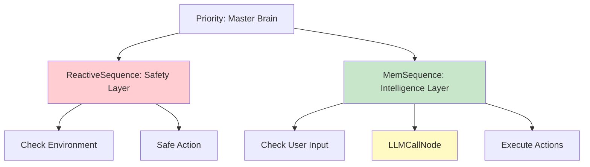
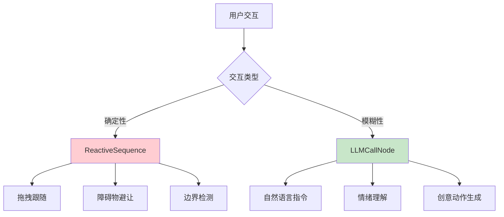
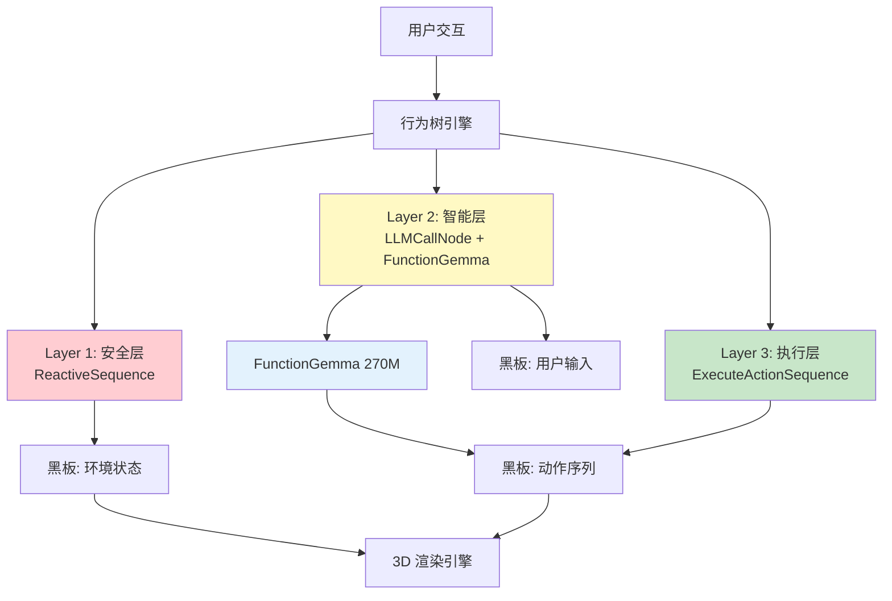
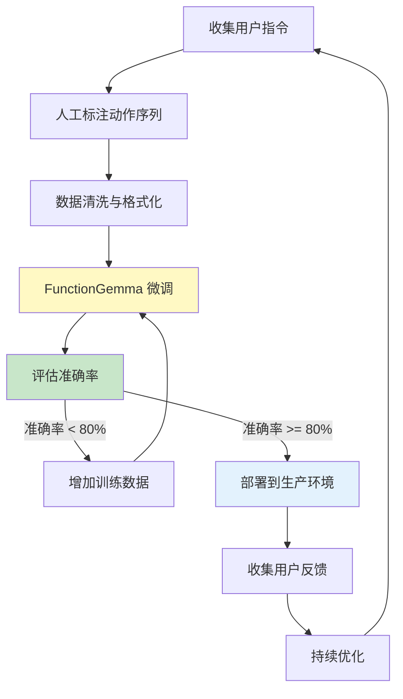
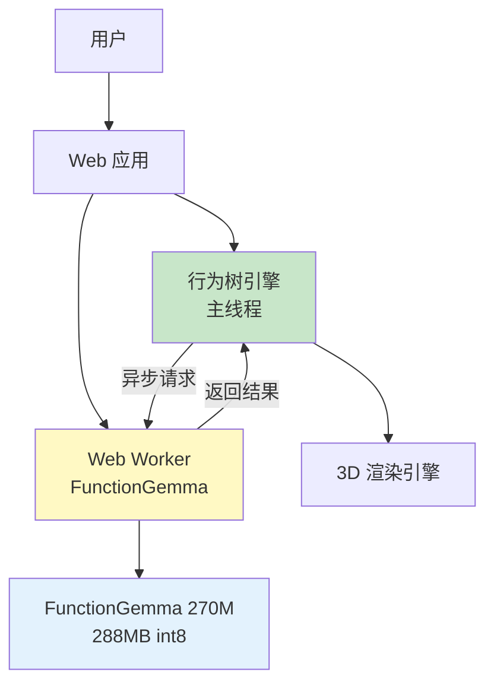

# FunctionGemma 驱动的数字形象灵魂化架构设计

## 目录
1. [核心问题：ReactiveSequence vs LLM 节点的使用场景](#1-核心问题reactivesequence-vs-llm-节点的使用场景)
2. [FunctionGemma 特性深度分析](#2-functiongemma-特性深度分析)
3. [数字形象"灵魂化"的智能场景设计](#3-数字形象灵魂化的智能场景设计)
4. [行为树 + FunctionGemma 的混合架构](#4-行为树--functiongemma-的混合架构)
5. [实战案例：企鹅的智能决策系统](#5-实战案例企鹅的智能决策系统)
6. [微调策略与数据准备](#6-微调策略与数据准备)
7. [性能优化与边缘部署](#7-性能优化与边缘部署)
8. [未来演进路线图](#8-未来演进路线图)

---

## 1. 核心问题：ReactiveSequence vs LLM 节点的使用场景

### 1.1 本质区别

| 维度 | ReactiveSequence | LLMCallNode |
|------|-----------------|-------------|
| **决策来源** | 硬编码的条件逻辑 | 大模型的推理能力 |
| **响应速度** | 极快（< 1ms） | 较慢（100-500ms） |
| **可预测性** | 100% 确定 | 概率性输出 |
| **适用场景** | 安全性检查、实时监控 | 复杂意图理解、创意生成 |
| **资源消耗** | 几乎为零 | CPU/内存密集 |

### 1.2 使用场景对比

#### ReactiveSequence：保护性逻辑

**核心思想**：在**执行动作的过程中**，持续监控环境是否依然安全。

**典型场景**：
```typescript
new ReactiveSequence({
  title: 'Safe Movement',
  children: [
    // 每一帧都检查：前方是否有障碍物？
    new CheckBlackboardCondition({ 
      title: 'Path Clear?', 
      key: 'obstacleAhead', 
      value: false 
    }),
    // 如果突然出现障碍物，立即停止移动
    new MoveToTarget({ title: 'Move Forward' })
  ]
})
```

**为什么不用 LLM？**
- 障碍物检测是**确定性逻辑**，不需要"理解"或"推理"
- 需要**每一帧都检查**（60 FPS），LLM 太慢
- 安全性要求**零延迟响应**

#### LLMCallNode：智能决策

**核心思想**：理解用户的**复杂意图**，并生成**创造性的动作序列**。

**典型场景**：
```typescript
new MemSequence({
  title: 'User Command Processing',
  children: [
    new CheckBlackboardCondition({ 
      title: 'New Command?', 
      key: 'hasNewInput' 
    }),
    new LLMCallNode({ 
      title: 'Understand Intent & Generate Actions' 
    }),
    new FunctionExecNode({ 
      title: 'Execute LLM Actions' 
    })
  ]
})
```

**为什么不用 ReactiveSequence？**
- 用户意图是**模糊的、多义的**（"让我开心" vs "跳个舞"）
- 需要**上下文理解**（对话历史、情绪状态）
- 需要**创造性**（同样的指令，可以有不同的执行方式）

### 1.3 混合使用：最佳实践

**黄金法则**：**ReactiveSequence 负责"安全"，LLM 负责"智能"**



**设计原则**：
1. **安全优先**：所有可能造成"卡死"或"失控"的动作，都用 `ReactiveSequence` 包裹
2. **智能分层**：LLM 只负责"理解"和"规划"，不负责"执行监控"
3. **性能隔离**：高频检查（每帧）用条件节点，低频决策（用户输入）用 LLM

---

## 2. FunctionGemma 特性深度分析

### 2.1 模型定位

FunctionGemma 270M 是一个**专门为工具调用（Function Calling）设计的轻量级模型**。

**核心特性**：
- ✅ **工具调用专精**：在 BFCL 基准测试中，Simple 任务达到 61.6% 准确率
- ✅ **轻量级部署**：288MB 模型大小，可在边缘设备运行
- ✅ **低延迟**：在 S25 Ultra 上，512 tokens 预填充 + 32 tokens 解码，延迟仅 0.3 秒
- ⚠️ **知识有限**：删除了大量世界知识，不适合通用对话
- ⚠️ **需要微调**：Base 模型在 Mobile Actions 任务上仅 58%，微调后可达 85%

### 2.2 与通用 LLM 的对比

| 特性 | FunctionGemma 270M | GPT-4 / Claude | Gemini |
|------|-------------------|----------------|---------|
| **参数规模** | 270M | 1T+ | 1T+ |
| **工具调用准确率** | 61.6% (base) | ~95% | ~90% |
| **世界知识** | ❌ 几乎无 | ✅ 丰富 | ✅ 丰富 |
| **推理能力** | ⚠️ 有限 | ✅ 强 | ✅ 强 |
| **延迟（边缘）** | 0.3s | N/A | N/A |
| **部署成本** | 极低 | 极高 | 高 |
| **微调难度** | ✅ 简单 | ❌ 困难 | ⚠️ 中等 |

### 2.3 适合数字形象的场景

**FunctionGemma 的优势场景**：
1. **动作序列生成**：用户说"跳个舞"，模型生成 `[WAVE, JUMP, SPIN, IDLE]`
2. **简单意图理解**：将自然语言映射到有限的工具集（动画、移动、表情）
3. **边缘部署**：无需云端 API，保护隐私，降低延迟

**FunctionGemma 的劣势场景**：
1. **复杂对话**：无法回答"企鹅的生活习性是什么？"
2. **创意写作**：无法生成长文本回复
3. **多轮推理**：无法进行复杂的逻辑推理

---

## 3. 数字形象"灵魂化"的智能场景设计

### 3.1 场景分类矩阵



### 3.2 场景 1：自然语言动作控制

**用户输入**："让我看看你飞起来的样子"

**FunctionGemma 处理流程**：
1. **意图识别**：理解"飞" = `FLY` 动作
2. **工具调用**：生成 `animate_avatar({ actions: ['FLY', 'FLY', 'IDLE'] })`
3. **行为树执行**：`ExecuteActionSequence` 按序播放

**实现架构**：
```typescript
new Priority({
  title: 'Penguin Master Brain',
  children: [
    // 安全层：拖拽、边界检查
    new ReactiveSequence({
      title: 'Safe Interaction',
      children: [
        new CheckBlackboardCondition({ key: 'isDragging' }),
        new FollowPointerNode()
      ]
    }),
    
    // 智能层：LLM 指令处理
    new MemSequence({
      title: 'LLM Command Processing',
      children: [
        new CheckBlackboardCondition({ key: 'hasNewInput' }),
        new Timeout({
          timeout: 3000,
          child: new LLMCallNode({ title: 'FunctionGemma: Parse Intent' })
        }),
        new FunctionExecNode({ title: 'Enqueue Actions' })
      ]
    }),
    
    // 执行层：动作序列播放
    new ExecuteActionSequence({ title: 'Play Action Chain' }),
    
    // 默认：待机
    new PlayAnimationAction({ action: 'IDLE' })
  ]
})
```

### 3.3 场景 2：情绪驱动的行为选择

**设计思路**：FunctionGemma 根据用户的语气和上下文，选择不同的动作风格。

**情绪状态**（存储在黑板）：
- `mood`: 'happy' | 'sad' | 'excited' | 'calm'
- `energy`: 0-100（能量值）
- `interactionCount`: 交互次数

**FunctionGemma 工具定义扩展**：
```typescript
const EMOTION_TOOLS = {
  "animate_avatar": {
    "description": "控制企鹅执行动作序列",
    "parameters": {
      "actions": { "type": "array", "items": { "enum": AVAILABLE_ACTIONS } },
      "emotion": { "type": "string", "enum": ["happy", "sad", "excited", "calm"] },
      "intensity": { "type": "number", "minimum": 0, "maximum": 100 }
    }
  }
};
```

**行为树集成**：
```typescript
new MemSequence({
  title: 'Emotion-Aware Response',
  children: [
    new CheckBlackboardCondition({ key: 'hasNewInput' }),
    new LLMCallNode({ 
      title: 'FunctionGemma: Emotion + Action Selection',
      // 在 system prompt 中包含当前情绪状态
    }),
    new FunctionExecNode()
  ]
})
```

### 3.4 场景 3：上下文感知的多轮对话

**挑战**：FunctionGemma 本身知识有限，但可以通过**工具调用**访问外部知识。

**设计**：将"记忆"和"知识"存储在黑板中，FunctionGemma 通过工具定义"看到"这些信息。

**黑板扩展**：
```typescript
// 对话历史（最近 10 轮）
blackboard.set('conversationHistory', [
  { role: 'user', content: '你叫什么名字？' },
  { role: 'assistant', content: '我是小企鹅 Q-Penguin！' },
  // ...
]);

// 用户偏好（从历史中提取）
blackboard.set('userPreferences', {
  favoriteActions: ['FLY', 'DAZZLE'],
  interactionStyle: 'playful'
});

// 当前上下文
blackboard.set('currentContext', {
  timeOfDay: 'evening',
  interactionCount: 15,
  lastAction: 'FLY'
});
```

**FunctionGemma System Prompt 增强**：
```typescript
const systemPrompt = `
You are Q-Penguin, a friendly virtual penguin avatar.

Current Context:
- Mood: ${blackboard.get('mood')}
- Energy: ${blackboard.get('energy')}
- Last Action: ${blackboard.get('lastAction')}
- User Preferences: ${JSON.stringify(blackboard.get('userPreferences'))}

Conversation History (last 3 turns):
${blackboard.get('conversationHistory').slice(-3).map(m => `${m.role}: ${m.content}`).join('\n')}

You can control the penguin using the animate_avatar function.
`;
```

### 3.5 场景 4：自适应行为模式

**目标**：让企鹅根据交互历史，逐渐"学习"用户的偏好。

**实现策略**：
1. **短期记忆**：黑板存储最近 20 次交互
2. **模式识别**：FunctionGemma 分析交互模式（用户喜欢什么动作？什么时候互动？）
3. **主动行为**：当用户长时间不互动时，企鹅主动执行"吸引注意"的动作

**行为树设计**：
```typescript
new Priority({
  children: [
    // 用户主动交互（最高优先级）
    new MemSequence({
      children: [
        new CheckBlackboardCondition({ key: 'hasNewInput' }),
        new LLMCallNode({ title: 'Process User Intent' }),
        new FunctionExecNode()
      ]
    }),
    
    // 主动行为：长时间无交互时触发
    new ReactiveSequence({
      title: 'Proactive Behavior',
      children: [
        new CheckBlackboardCondition({ 
          key: 'idleTime', 
          operator: '>', 
          value: 10000 // 10 秒无交互
        }),
        new LLMCallNode({ 
          title: 'FunctionGemma: Generate Attention-Seeking Action',
          // System prompt: "User hasn't interacted for a while. Generate an action to attract attention."
        }),
        new FunctionExecNode()
      ]
    }),
    
    // 默认待机
    new PlayAnimationAction({ action: 'IDLE' })
  ]
})
```

---

## 4. 行为树 + FunctionGemma 的混合架构

### 4.1 三层架构图



### 4.2 数据流设计

**输入流**（用户 → 行为树）：
1. **鼠标事件** → 黑板 `isDragging`, `pointerPosition`
2. **键盘输入** → 黑板 `lastUserInput`, `hasNewInput`
3. **时间流逝** → 黑板 `idleTime`, `currentTime`

**处理流**（行为树内部）：
1. **ReactiveSequence**：持续监控环境，确保安全
2. **LLMCallNode**：调用 FunctionGemma，理解意图
3. **FunctionExecNode**：解析工具调用结果，存入 `pendingActions`

**输出流**（行为树 → 渲染）：
1. **bt_output_action** → 3D 动画播放
2. **bt_output_position** → 3D 位置更新
3. **bt_output_chat_msg** → UI 聊天面板

### 4.3 关键设计模式

#### 模式 1：安全包裹智能

```typescript
new ReactiveSequence({
  title: 'Safe LLM Execution',
  children: [
    // 每一帧检查：LLM 调用是否超时？
    new CheckBlackboardCondition({ 
      key: 'llm_call_timeout', 
      value: false 
    }),
    // LLM 调用本身用 Timeout 装饰器保护
    new Timeout({
      timeout: 3000,
      child: new LLMCallNode()
    })
  ]
})
```

#### 模式 2：智能增强确定性

```typescript
new Priority({
  children: [
    // 确定性行为：拖拽
    new ReactiveSequence({
      children: [
        new CheckBlackboardCondition({ key: 'isDragging' }),
        new FollowPointerNode()
      ]
    }),
    
    // 智能行为：LLM 理解复杂指令
    new MemSequence({
      children: [
        new CheckBlackboardCondition({ key: 'hasNewInput' }),
        new LLMCallNode(), // FunctionGemma 理解"飞起来" = FLY 动作
        new FunctionExecNode()
      ]
    })
  ]
})
```

#### 模式 3：记忆 + 反应式混合

```typescript
// 外层：记忆式（保证动作序列完整）
new MemSequence({
  children: [
    new CheckBlackboardCondition({ key: 'hasNewInput' }),
    new LLMCallNode(),
    new FunctionExecNode(),
    // 内层：反应式（执行动作时持续检查安全）
    new ReactiveSequence({
      children: [
        new CheckBlackboardCondition({ key: 'isSafe' }),
        new ExecuteActionSequence()
      ]
    })
  ]
})
```

---

## 5. 实战案例：企鹅的智能决策系统

### 5.1 完整行为树设计

```typescript
export function createPenguinBT(): BehaviorTree {
  const tree = new BehaviorTree();

  tree.root = new Priority({
    title: 'Penguin Master Brain',
    children: [
      // === Layer 1: 紧急安全层 ===
      new ReactiveSequence({
        title: 'Emergency Safety',
        children: [
          new CheckBlackboardCondition({ 
            title: 'Boundary Check', 
            key: 'isOutOfBounds', 
            value: false 
          }),
          new ReturnToOriginAction({ title: 'Return to Safe Zone' })
        ]
      }),

      // === Layer 2: 用户交互层 ===
      new ReactiveSequence({
        title: 'Drag Interaction',
        children: [
          new CheckBlackboardCondition({ 
            title: 'Is Dragging?', 
            key: 'isDragging', 
            value: true 
          }),
          new FollowPointerNode({ title: 'Follow Cursor' })
        ]
      }),

      // === Layer 3: 智能决策层 ===
      new MemSequence({
        title: 'LLM-Powered Intelligence',
        children: [
          new CheckBlackboardCondition({ 
            title: 'New User Command?', 
            key: 'hasNewInput', 
            value: true 
          }),
          new Timeout({
            title: 'LLM Call with Timeout',
            timeout: 3000,
            child: new Retry({
              title: 'Retry LLM (max 2x)',
              maxAttempts: 2,
              child: new LLMCallNode({ 
                title: 'FunctionGemma: Understand Intent' 
              })
            })
          }),
          new FunctionExecNode({ 
            title: 'Parse & Enqueue Actions' 
          })
        ]
      }),

      // === Layer 4: 主动行为层 ===
      new ReactiveSequence({
        title: 'Proactive Behavior',
        children: [
          new CheckBlackboardCondition({ 
            title: 'Idle Too Long?', 
            key: 'idleTime', 
            operator: '>', 
            value: 15000 // 15 秒
          }),
          new LLMCallNode({ 
            title: 'FunctionGemma: Generate Attention Action',
            // 特殊的 system prompt：主动吸引用户注意
          }),
          new FunctionExecNode()
        ]
      }),

      // === Layer 5: 动作执行层 ===
      new ReactiveSequence({
        title: 'Safe Action Execution',
        children: [
          new CheckBlackboardCondition({ 
            title: 'Actions Pending?', 
            key: 'pendingActions', 
            operator: 'arrayLength', 
            value: 0,
            invert: true 
          }),
          new ExecuteActionSequence({ title: 'Play Action Chain' })
        ]
      }),

      // === Layer 6: 默认待机 ===
      new PlayAnimationAction({ 
        title: 'Idle / Do Nothing', 
        action: 'IDLE' 
      })
    ]
  });

  return tree;
}
```

### 5.2 FunctionGemma System Prompt 设计

```typescript
const FUNCTIONGEMMA_SYSTEM_PROMPT = `
You are Q-Penguin, a friendly virtual penguin avatar controlled by a behavior tree system.

Your capabilities:
- You can perform animations: ${AVAILABLE_ACTIONS.join(', ')}
- You can move to specific positions on a 3D stage
- You can respond to user commands with action sequences

Current Context:
- Mood: ${blackboard.get('mood', 'tree') || 'neutral'}
- Energy Level: ${blackboard.get('energy', 'tree') || 50}/100
- Last Action: ${blackboard.get('lastAction', 'tree') || 'IDLE'}
- Interaction Count: ${blackboard.get('interactionCount', 'tree') || 0}

User Preferences (learned from history):
${JSON.stringify(blackboard.get('userPreferences', 'tree') || {}, null, 2)}

Recent Conversation (last 3 turns):
${(blackboard.get('conversationHistory', 'tree') || []).slice(-3).map(m => 
  `${m.role}: ${m.content}`
).join('\n')}

Your goal:
1. Understand user intent from natural language
2. Generate appropriate action sequences using animate_avatar
3. Be playful, friendly, and responsive
4. Adapt your behavior based on user preferences

When the user says something like "fly around" or "dance for me", 
you should call animate_avatar with a sequence of actions that matches their intent.

Example:
User: "Show me a happy dance"
You: <start_function_call>call:animate_avatar{actions:[WAVE, JUMP, SPIN, IDLE]}<end_function_call>
`;
```

### 5.3 工具定义（FunctionGemma Format）

```typescript
const FUNCTIONGEMMA_TOOL_DECLARATION = `
<start_function_declaration>
declaration:animate_avatar{
  description:<escape>Controls the 3D penguin avatar to perform a sequence of actions on stage. Actions are played in order, each lasting 2-3 seconds.<escape>,
  parameters:{
    properties:{
      actions:{
        description:<escape>An ordered list of actions for the avatar to perform. Available actions: ${AVAILABLE_ACTIONS.join(', ')}.<escape>,
        items:{
          enum:${JSON.stringify(AVAILABLE_ACTIONS)},
          type:<escape>STRING<escape>
        },
        type:<escape>ARRAY<escape>
      },
      emotion:{
        description:<escape>Optional emotion context for the actions (happy, sad, excited, calm).<escape>,
        enum:[<escape>happy<escape>,<escape>sad<escape>,<escape>excited<escape>,<escape>calm<escape>],
        type:<escape>STRING<escape>
      }
    },
    required:[<escape>actions<escape>],
    type:<escape>OBJECT<escape>
  }
}
<end_function_declaration>
`;
```

---

## 6. 微调策略与数据准备

### 6.1 微调的必要性

根据 FunctionGemma 文档，**Base 模型在特定任务上的准确率通常只有 50-60%**，但经过微调后可以提升到 **80-90%**。

**对于数字形象场景，微调可以**：
1. **提高意图理解准确率**：让模型更好地理解"飞起来"、"跳个舞"等指令
2. **适配特定动作词汇**：让模型熟悉你的动作名称（FLY, DAZZLE, WAVE 等）
3. **学习用户交互模式**：让模型理解你的应用场景（虚拟宠物、游戏角色等）

### 6.2 数据准备格式

**训练数据格式**（参考 FunctionGemma 文档）：
```json
{
  "messages": [
    {
      "role": "developer",
      "content": "You are a model that can do function calling with the following functions\n<start_function_declaration>...<end_function_declaration>"
    },
    {
      "role": "user",
      "content": "让我看看你飞起来的样子"
    },
    {
      "role": "assistant",
      "content": "<start_function_call>call:animate_avatar{actions:[FLY, FLY, IDLE]}<end_function_call>"
    }
  ]
}
```

### 6.3 数据收集策略

**1. 人工标注数据（高质量，少量）**
- 收集 100-500 条用户指令
- 人工标注对应的动作序列
- 用于初始微调

**2. 用户交互日志（中等质量，大量）**
- 记录用户实际输入和系统响应
- 过滤掉明显错误的样本
- 用于持续优化

**3. 合成数据（快速扩展）**
- 基于模板生成变体："跳个舞" → "dance", "dance for me", "show me a dance"
- 用于数据增强

### 6.4 微调流程



---

## 7. 性能优化与边缘部署

### 7.1 FunctionGemma 性能基准

根据文档，在 **S25 Ultra** 上的性能：
- **Prefill**: 1718 tokens/s
- **Decode**: 125.9 tokens/s
- **Time-to-first-token**: 0.3s
- **Model Size**: 288MB (int8 量化)
- **Peak Memory**: 551MB

### 7.2 优化策略

**1. 量化部署**
- 使用 `dynamic_int8` 量化，模型大小从 ~1GB 降至 288MB
- 性能损失 < 5%，准确率几乎不变

**2. 上下文长度优化**
- 限制 system prompt 长度（< 512 tokens）
- 只保留最近 3-5 轮对话历史
- 使用紧凑的工具声明格式

**3. 缓存策略**
- 缓存常见的用户指令 → 动作序列映射
- 对于"高频指令"（如"跳个舞"），直接返回缓存结果，跳过 LLM 调用

**4. 异步调用优化**
- LLM 调用在独立的 Web Worker 中执行
- 避免阻塞主线程的 3D 渲染

### 7.3 边缘部署架构



---

## 8. 未来演进路线图

### 8.1 短期（1-2 个月）

- [x] 实现 ReactiveSequence 节点
- [x] 完善行为树可视化
- [ ] **收集用户交互数据，准备微调数据集**
- [ ] **微调 FunctionGemma 270M 适配企鹅动作词汇**
- [ ] 实现情绪状态系统（mood, energy）

### 8.2 中期（3-6 个月）

- [ ] **实现主动行为系统**（长时间无交互时主动吸引注意）
- [ ] **实现用户偏好学习**（从交互历史中提取偏好）
- [ ] **多模态输入**（语音、手势识别）
- [ ] **个性化微调**（为每个用户训练专属模型）

### 8.3 长期（6-12 个月）

- [ ] **多角色系统**（不止企鹅，支持多种数字形象）
- [ ] **社交互动**（多个数字形象之间的互动）
- [ ] **知识增强**（通过 RAG 为 FunctionGemma 补充世界知识）
- [ ] **联邦学习**（在保护隐私的前提下，从所有用户数据中学习）

---

## 结语

FunctionGemma 270M 虽然"知识有限"，但它**专精于工具调用**的特性，恰恰适合数字形象的"灵魂化"需求。通过**行为树提供确定性逻辑**，**FunctionGemma 提供智能决策**，我们可以构建出一个既安全又智能的数字生命系统。

**核心设计哲学**：
- **安全第一**：用 ReactiveSequence 保护所有关键路径
- **智能分层**：LLM 只负责"理解"和"规划"，不负责"执行监控"
- **性能优先**：高频检查用条件节点，低频决策用 LLM
- **持续学习**：通过微调和用户反馈，让数字形象越来越"懂"用户

记住：**最好的 AI 不是最聪明的，而是最懂用户的。**

---

*文档版本: v1.0*  
*最后更新: 2025-01-XX*  
*作者: AI Assistant*  
*基于: FunctionGemma 270M + q_llm_pet Behavior Tree Framework*

