# 🐧 Q-Penguin: 大模型非语言指令交互演进课题

## 1. 核心课题背景

当前的 Q-Penguin 架构已成功集成了基于文本指令的行为决策（Function Calling）。然而，为了让数字生命更加"真实"，它不应仅仅是一个"对话框驱动"的机器人，而应具备对物理世界（虚拟环境）的感知能力，并能基于这些感知产生自发的行为。

### 1.1 当前架构局限

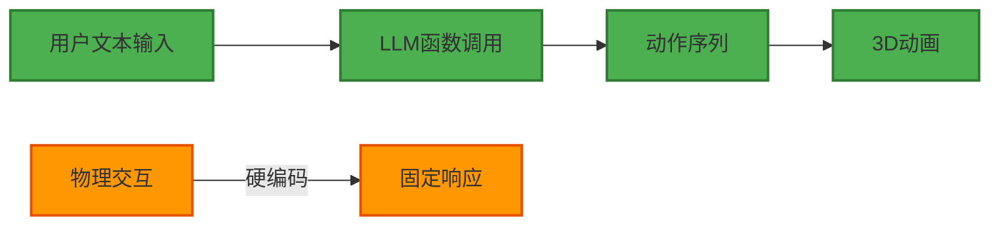

**问题**：
- 物理交互（拖拽、点击）是硬编码的，无法根据上下文动态调整
- 环境变化（温度、光照）无法影响行为决策
- 缺乏自主性，只能被动响应用户指令

## 2. 演进方向：非语言指令场景

### 2.1 环境感知与情感映射

大模型可以不再直接接收用户的"命令"，而是接收当前的"状态快照"。

**核心概念：状态快照（State Snapshot）**

状态快照是一个结构化的 JSON 对象，包含了当前时刻的所有上下文信息：
- **触发类型**：什么事件触发了这次决策（拖拽、环境变化、时间触发等）
- **实时参数**：BT 层实时采集的物理数据（速度、位置、轨迹等）
- **当前状态**：数字形象当前的表情、动作、视角等
- **决策要求**：期望的输出格式（仅 function calling 或包含文本）

**典型示例：拖拽交互状态快照**

这正是你提到的"状态快照"的完美体现！当用户拖拽企鹅时，BT 层会实时采集拖动参数，并组装成完整的状态快照发送给 LLM：

```json
{
  "trigger_type": "drag_interaction",  // 触发类型：拖动交互
  "context": {
    "drag_params": {                   // BT实时检测的拖动参数（毫秒级采集）
      "speed": 6.2,                    // 拖动速度（m/s），超过阈值5m/s
      "screen_height_percent": 85,     // 数字形象在屏幕高度占比85%（超过80%阈值）
      "trajectory": "unstable",        // 拖动轨迹：不规则（乱晃）
      "direction": "up_right"          // 拖动方向：右上
    },
    "current_state": {                 // 数字形象当前状态（BT维护）
      "expression": "neutral",         // 当前表情：中性
      "action": "idle",                // 当前动作：闲置
      "view_direction": "forward"      // 当前视角：正前方
    },
    "fallback_flag": false             // 是否需要紧急兜底：否
  },
  "requirement": "output_only_function_calling"  // 要求仅输出function calling指令
}
```

**LLM 基于状态快照的决策流程**：

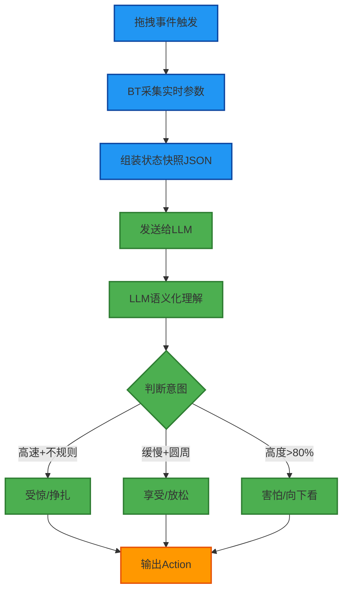

**LLM 可能的输出**（基于上述状态快照）：
```json
{
  "action": "STRUGGLE",
  "expression": "PANIC",
  "intensity": 0.9,
  "reasoning": "高速不规则拖动 + 高度超过80% = 受惊反应"
}
```

#### 完整实现案例：异步拖拽状态变化检测与决策（优化版）

**场景描述**：
- 用户拖拽企鹅时，默认行为是位置跟随（BT层处理，60FPS实时更新）
- 在拖拽过程中，如果检测到特殊状态变化（速度过快、高度过高、轨迹异常），需要触发额外的反应
- 简单规则（如速度>10m/s）由BT层直接处理
- 复杂情况（如"高速+不规则+高度>80%"的组合判断）异步发送给LLM进行语义化理解

**关键挑战**：
- LLM响应时间：600ms-1.5s（秒级响应）
- 不同场景需要不同的决策频率
- 需要避免重复调用和状态快照去重
- 需要设计可配置的决策频率策略

**系统架构**：

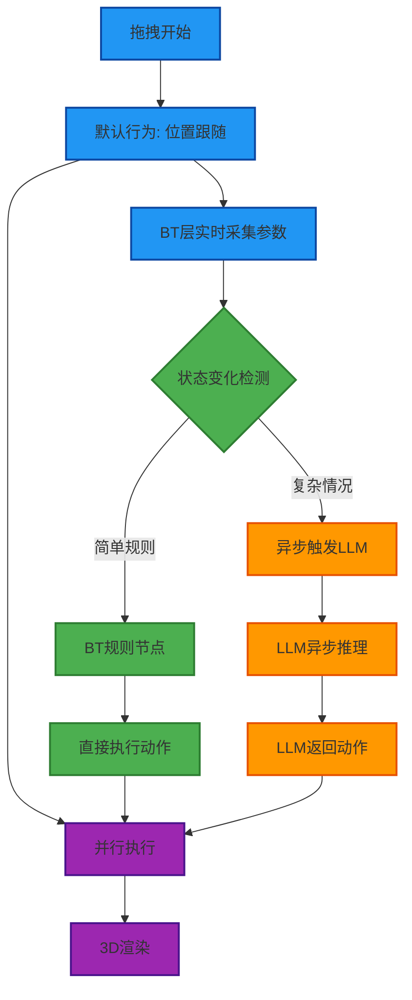

**行为树结构设计**：

```typescript
// services/bt/PenguinBT.ts - 拖拽分支扩展
new Priority({
  children: [
    // 1. 拖拽交互分支（最高优先级）
    new Sequence({
      children: [
        new CheckBlackboardCondition({ 
          key: 'isDragging', 
          value: true, 
          scope: 'global' 
        }),
        new Parallel({
          policy: 'SuccessOnAll',
          children: [
            // 默认行为：位置跟随（持续运行）
            new FollowPointerNode(),
            
            // 状态变化检测与决策（异步）
            new DragStateMonitorNode()
          ]
        })
      ]
    }),
    // ... 其他分支
  ]
});
```

**决策频率策略设计**

不同场景需要不同的决策频率，我们设计了一个可配置的策略系统：

```typescript
// services/bt/config/DecisionFrequency.ts
export interface DecisionFrequencyConfig {
  // 状态检测频率（BT层检测状态变化的频率）
  stateCheckInterval: number;  // ms
  
  // LLM决策冷却时间（两次LLM调用之间的最小间隔）
  llmCooldownTime: number;     // ms
  
  // 状态快照去重窗口（相同状态在窗口内不重复触发）
  snapshotDedupeWindow: number; // ms
  
  // 场景类型
  scenario: 'drag' | 'environment' | 'autonomous' | 'interaction';
}

// 不同场景的默认配置
export const FREQUENCY_CONFIGS: Record<string, DecisionFrequencyConfig> = {
  drag: {
    stateCheckInterval: 100,      // 拖拽需要快速响应，100ms检测一次
    llmCooldownTime: 2000,        // LLM调用间隔至少2秒（避免频繁调用）
    snapshotDedupeWindow: 1500,   // 1.5秒内的相同状态不重复触发
    scenario: 'drag'
  },
  environment: {
    stateCheckInterval: 500,      // 环境变化较慢，500ms检测一次
    llmCooldownTime: 3000,        // 环境变化LLM调用间隔3秒
    snapshotDedupeWindow: 2000,   // 2秒内的相同状态不重复触发
    scenario: 'environment'
  },
  autonomous: {
    stateCheckInterval: 1000,     // 自主行为较慢，1秒检测一次
    llmCooldownTime: 5000,        // 自主行为LLM调用间隔5秒
    snapshotDedupeWindow: 3000,   // 3秒内的相同状态不重复触发
    scenario: 'autonomous'
  }
};
```

**核心节点实现：DragStateMonitorNode（优化版）**

```typescript
// services/bt/actions/DragStateMonitorNode.ts
import Action from '../core/Action';
import { SUCCESS, RUNNING } from '../constants';
import Tick from '../core/Tick';
import { FREQUENCY_CONFIGS, DecisionFrequencyConfig } from '../config/DecisionFrequency';

/**
 * DragStateMonitorNode 在拖拽过程中实时监控状态变化
 * 简单规则直接处理，复杂情况异步触发LLM
 * 优化：可配置决策频率 + 状态快照去重 + LLM调用冷却
 */
export default class DragStateMonitorNode extends Action {
  private lastCheckTime: number = 0;
  private lastLLMCallTime: number = 0;
  private lastDragParams: any = null;
  private lastSnapshotHash: string = '';
  private config: DecisionFrequencyConfig;

  constructor({ 
    config = FREQUENCY_CONFIGS.drag 
  }: { config?: DecisionFrequencyConfig } = {}) {
    super({ name: 'DragStateMonitorNode' });
    this.config = config;
  }

  public tick(tick: Tick): number {
    const blackboard = tick.blackboard;
    const now = Date.now();
    
    // 节流：按配置的频率检查状态变化
    if (now - this.lastCheckTime < this.config.stateCheckInterval) {
      return RUNNING;
    }
    this.lastCheckTime = now;

    // 获取当前拖拽参数（BT层实时采集）
    const currentDragParams = blackboard?.get('dragParams');
    if (!currentDragParams) {
      return RUNNING; // 等待参数采集
    }

    // 检测状态变化
    const stateChange = this.detectStateChange(currentDragParams);
    
    if (stateChange) {
      // 判断是简单规则还是复杂情况
      if (this.isSimpleRule(stateChange)) {
        // 简单规则：BT层直接处理（无延迟）
        this.handleSimpleRule(stateChange, blackboard);
      } else {
        // 复杂情况：异步触发LLM（带冷却和去重）
        this.triggerLLMAsync(stateChange, currentDragParams, blackboard, now);
      }
    }

    this.lastDragParams = { ...currentDragParams };
    return RUNNING; // 持续监控直到拖拽结束
  }

  /**
   * 检测状态变化
   */
  private detectStateChange(current: any): any | null {
    if (!this.lastDragParams) {
      return null; // 首次检测，记录基准值
    }

    const changes: any = {};

    // 检测速度变化
    if (current.speed > 5 && this.lastDragParams.speed <= 5) {
      changes.speed_threshold_exceeded = true;
    }

    // 检测高度变化
    if (current.screen_height_percent > 80 && 
        this.lastDragParams.screen_height_percent <= 80) {
      changes.height_threshold_exceeded = true;
    }

    // 检测轨迹变化
    if (current.trajectory === 'unstable' && 
        this.lastDragParams.trajectory !== 'unstable') {
      changes.trajectory_became_unstable = true;
    }

    return Object.keys(changes).length > 0 ? changes : null;
  }

  /**
   * 判断是否为简单规则
   */
  private isSimpleRule(stateChange: any): boolean {
    // 单一条件变化 = 简单规则
    const changeCount = Object.keys(stateChange).length;
    return changeCount === 1;
  }

  /**
   * 处理简单规则（BT层直接处理）
   */
  private handleSimpleRule(stateChange: any, blackboard: any): void {
    if (stateChange.speed_threshold_exceeded) {
      // 速度过快：直接播放"受惊"动作
      blackboard.set('bt_output_action', 'FRIGHTENED');
      console.log('BT: 速度过快，直接触发受惊动作');
    } else if (stateChange.height_threshold_exceeded) {
      // 高度过高：直接播放"害怕"动作
      blackboard.set('bt_output_action', 'SCARED');
      console.log('BT: 高度过高，直接触发害怕动作');
    }
  }

  /**
   * 异步触发LLM进行复杂决策（优化版：冷却 + 去重）
   */
  private triggerLLMAsync(
    stateChange: any, 
    currentDragParams: any, 
    blackboard: any, 
    now: number
  ): void {
    const treeId = blackboard.get('currentTreeId');
    const llmStatus = blackboard.get('drag_llm_status', treeId, this.id);

    // 1. 如果LLM正在处理中，不重复触发
    if (llmStatus === 'processing') {
      return;
    }

    // 2. LLM调用冷却检查：距离上次调用至少间隔 config.llmCooldownTime
    if (now - this.lastLLMCallTime < this.config.llmCooldownTime) {
      // console.log(`BT: LLM冷却中，还需等待 ${this.config.llmCooldownTime - (now - this.lastLLMCallTime)}ms`);
      return;
    }

    // 3. 状态快照去重：计算状态快照的哈希值
    const currentState = blackboard.get('penguinState');
    const stateSnapshot = {
      trigger_type: "drag_interaction",
      context: {
        drag_params: {
          speed: Math.round(currentDragParams.speed * 10) / 10,  // 保留1位小数
          screen_height_percent: Math.round(currentDragParams.screen_height_percent),
          trajectory: currentDragParams.trajectory,
          direction: currentDragParams.direction
        },
        current_state: currentState,
        state_changes: stateChange,
        fallback_flag: false
      },
      requirement: "output_only_function_calling"
    };

    // 计算状态快照哈希（用于去重）
    const snapshotHash = this.hashSnapshot(stateSnapshot);
    
    // 检查是否在去重窗口内重复
    const lastSnapshotTime = blackboard.get('last_snapshot_time', treeId, this.id) || 0;
    if (snapshotHash === this.lastSnapshotHash && 
        now - lastSnapshotTime < this.config.snapshotDedupeWindow) {
      // console.log('BT: 状态快照去重，跳过重复的LLM调用');
      return;
    }

    // 4. 通过所有检查，触发LLM调用
    this.lastLLMCallTime = now;
    this.lastSnapshotHash = snapshotHash;
    
    // 标记LLM处理中
    blackboard.set('drag_llm_status', 'processing', treeId, this.id);
    blackboard.set('drag_state_snapshot', stateSnapshot, treeId, this.id);
    blackboard.set('last_snapshot_time', now, treeId, this.id);
    
    // 触发LLM异步调用（通过专门的LLM节点）
    blackboard.set('drag_llm_trigger', true, treeId);
    
    console.log('BT: 复杂状态变化，异步触发LLM决策', {
      snapshot: stateSnapshot,
      timeSinceLastCall: now - this.lastLLMCallTime
    });
  }

  /**
   * 计算状态快照的哈希值（用于去重）
   */
  private hashSnapshot(snapshot: any): string {
    // 简化的哈希算法：基于关键状态参数
    const key = JSON.stringify({
      speed: snapshot.context.drag_params.speed,
      height: snapshot.context.drag_params.screen_height_percent,
      trajectory: snapshot.context.drag_params.trajectory,
      changes: snapshot.context.state_changes
    });
    
    // 简单的字符串哈希
    let hash = 0;
    for (let i = 0; i < key.length; i++) {
      const char = key.charCodeAt(i);
      hash = ((hash << 5) - hash) + char;
      hash = hash & hash; // Convert to 32bit integer
    }
    return hash.toString();
  }
}
```

**LLM异步决策节点：DragLLMDecisionNode（优化版）**

```typescript
// services/bt/actions/DragLLMDecisionNode.ts
import Action from '../core/Action';
import { SUCCESS, FAILURE, RUNNING } from '../constants';
import Tick from '../core/Tick';
import { sendToFunctionGemma } from '../../../services/functionGemmaService';

/**
 * DragLLMDecisionNode 异步处理拖拽过程中的复杂状态变化
 * 优化：支持超时处理、结果缓存、优雅降级
 */
export default class DragLLMDecisionNode extends Action {
  private llmTimeout: number = 3000; // LLM调用超时时间（3秒）
  private timeoutId: NodeJS.Timeout | null = null;

  constructor({ llmTimeout = 3000 }: { llmTimeout?: number } = {}) {
    super({ name: 'DragLLMDecisionNode' });
    this.llmTimeout = llmTimeout;
  }

  public open(tick: Tick): void {
    const blackboard = tick.blackboard;
    const treeId = tick.tree?.id;
    
    // 初始化状态
    blackboard?.set('drag_llm_response', null, treeId, this.id);
    blackboard?.set('drag_llm_error', null, treeId, this.id);
    blackboard?.set('drag_llm_status', 'idle', treeId, this.id);
  }

  public tick(tick: Tick): number {
    const blackboard = tick.blackboard;
    const treeId = tick.tree?.id;
    const trigger = blackboard?.get('drag_llm_trigger', treeId);
    const status = blackboard?.get('drag_llm_status', treeId, this.id);

    // 如果没有触发信号，直接返回
    if (!trigger) {
      return FAILURE;
    }

    // 如果正在处理中，等待结果
    if (status === 'processing') {
      return RUNNING;
    }

    // 如果已完成，应用结果
    if (status === 'success') {
      const response = blackboard?.get('drag_llm_response', treeId, this.id);
      this.applyLLMResult(response, blackboard);
      
      // 清除触发信号和状态
      blackboard?.set('drag_llm_trigger', false, treeId);
      blackboard?.set('drag_llm_status', 'idle', treeId, this.id);
      
      return SUCCESS;
    }

    // 如果失败，清除状态
    if (status === 'failed') {
      const error = blackboard?.get('drag_llm_error', treeId, this.id);
      console.error('BT: 拖拽LLM决策失败', error);
      
      blackboard?.set('drag_llm_trigger', false, treeId);
      blackboard?.set('drag_llm_status', 'idle', treeId, this.id);
      
      return FAILURE;
    }

    // 初始状态：开始异步调用
    if (status === 'idle') {
      const stateSnapshot = blackboard?.get('drag_state_snapshot', treeId, this.id);
      if (!stateSnapshot) {
        return FAILURE;
      }

      // 检查缓存（可选：相同状态快照在短时间内复用结果）
      const cachedResult = this.checkCache(stateSnapshot, blackboard, treeId);
      if (cachedResult) {
        this.applyLLMResult(cachedResult, blackboard);
        blackboard?.set('drag_llm_trigger', false, treeId);
        return SUCCESS;
      }

      // 组装LLM输入
      const llmInput = this.buildLLMPrompt(stateSnapshot);
      const llmSettings = blackboard?.get('llmSettings');
      
      // 异步调用LLM
      blackboard?.set('drag_llm_status', 'processing', treeId, this.id);
      const startTime = Date.now();
      
      // 设置超时处理
      this.timeoutId = setTimeout(() => {
        const currentStatus = blackboard?.get('drag_llm_status', treeId, this.id);
        if (currentStatus === 'processing') {
          console.warn('BT: 拖拽LLM决策超时，使用降级策略');
          blackboard?.set('drag_llm_status', 'timeout', treeId, this.id);
          this.applyFallback(stateSnapshot, blackboard);
        }
      }, this.llmTimeout);
      
      sendToFunctionGemma([], llmInput, llmSettings)
        .then((response) => {
          // 清除超时
          if (this.timeoutId) {
            clearTimeout(this.timeoutId);
            this.timeoutId = null;
          }
          
          const elapsed = Date.now() - startTime;
          blackboard?.set('drag_llm_response', response, treeId, this.id);
          blackboard?.set('drag_llm_status', 'success', treeId, this.id);
          
          // 缓存结果（可选）
          this.cacheResult(stateSnapshot, response, blackboard, treeId);
          
          console.log(`BT: 拖拽LLM决策成功 (${elapsed}ms)`, response);
        })
        .catch((error) => {
          // 清除超时
          if (this.timeoutId) {
            clearTimeout(this.timeoutId);
            this.timeoutId = null;
          }
          
          blackboard?.set('drag_llm_error', error, treeId, this.id);
          blackboard?.set('drag_llm_status', 'failed', treeId, this.id);
          
          // 失败时使用降级策略
          this.applyFallback(stateSnapshot, blackboard);
          
          console.error('BT: 拖拽LLM决策错误', error);
        });

      return RUNNING;
    }

    // 超时状态处理
    if (status === 'timeout') {
      blackboard?.set('drag_llm_trigger', false, treeId);
      blackboard?.set('drag_llm_status', 'idle', treeId, this.id);
      return FAILURE;
    }

    return FAILURE;
  }

  /**
   * 构建LLM输入提示词
   */
  private buildLLMPrompt(stateSnapshot: any): string {
    const { drag_params, current_state, state_changes } = stateSnapshot.context;
    
    return `当前正在拖拽数字形象，检测到以下状态变化：
- 拖动速度: ${drag_params.speed} m/s
- 屏幕高度占比: ${drag_params.screen_height_percent}%
- 轨迹类型: ${drag_params.trajectory}
- 状态变化: ${JSON.stringify(state_changes)}

当前形象状态：
- 表情: ${current_state.expression}
- 动作: ${current_state.action}

请根据这些信息，判断用户的拖拽意图，并输出合适的动作和表情。`;
  }

  /**
   * 检查缓存（相同状态快照在短时间内复用结果）
   */
  private checkCache(snapshot: any, blackboard: any, treeId: string): any | null {
    const cacheKey = `drag_llm_cache_${this.hashSnapshot(snapshot)}`;
    const cached = blackboard?.get(cacheKey, treeId, this.id);
    
    if (cached && Date.now() - cached.timestamp < 5000) { // 5秒内有效
      console.log('BT: 使用缓存的LLM决策结果');
      return cached.response;
    }
    
    return null;
  }

  /**
   * 缓存结果
   */
  private cacheResult(snapshot: any, response: any, blackboard: any, treeId: string): void {
    const cacheKey = `drag_llm_cache_${this.hashSnapshot(snapshot)}`;
    blackboard?.set(cacheKey, {
      response,
      timestamp: Date.now()
    }, treeId, this.id);
  }

  /**
   * 计算状态快照哈希（与DragStateMonitorNode保持一致）
   */
  private hashSnapshot(snapshot: any): string {
    const key = JSON.stringify({
      speed: snapshot.context.drag_params.speed,
      height: snapshot.context.drag_params.screen_height_percent,
      trajectory: snapshot.context.drag_params.trajectory,
      changes: snapshot.context.state_changes
    });
    
    let hash = 0;
    for (let i = 0; i < key.length; i++) {
      const char = key.charCodeAt(i);
      hash = ((hash << 5) - hash) + char;
      hash = hash & hash;
    }
    return hash.toString();
  }

  /**
   * 降级策略：LLM调用失败或超时时的默认行为
   */
  private applyFallback(snapshot: any, blackboard: any): void {
    const { drag_params, state_changes } = snapshot.context;
    
    // 根据状态变化选择降级动作
    if (state_changes.speed_threshold_exceeded) {
      blackboard?.set('bt_output_action', 'FRIGHTENED');
    } else if (state_changes.height_threshold_exceeded) {
      blackboard?.set('bt_output_action', 'SCARED');
    } else {
      // 默认：保持当前状态
      console.log('BT: LLM降级策略，保持当前状态');
    }
  }

  /**
   * 应用LLM返回的结果
   */
  private applyLLMResult(response: any, blackboard: any): void {
    if (response.toolResult && response.toolResult.actions) {
      // LLM返回的动作序列
      const actions = response.toolResult.actions;
      
      // 将动作存入黑板，由ExecuteActionSequence处理
      // 注意：这里可以与默认的FollowPointerNode并行执行
      blackboard?.set('drag_llm_actions', actions);
      
      // 立即执行第一个动作（如果需要覆盖默认跟随）
      if (actions.length > 0) {
        blackboard?.set('bt_output_action', actions[0]);
      }
      
      console.log('BT: 应用LLM拖拽决策结果', actions);
    }
  }

  public close(tick: Tick): void {
    // 清理超时定时器
    if (this.timeoutId) {
      clearTimeout(this.timeoutId);
      this.timeoutId = null;
    }
    super.close(tick);
  }
}
```

**完整的行为树集成（支持不同场景的决策频率）**：

```typescript
// services/bt/PenguinBT.ts
import { FREQUENCY_CONFIGS } from './config/DecisionFrequency';

new Priority({
  children: [
    // 1. 拖拽交互分支（最高优先级）
    new Sequence({
      children: [
        new CheckBlackboardCondition({ 
          key: 'isDragging', 
          value: true, 
          scope: 'global' 
        }),
        new Parallel({
          policy: 'SuccessOnAll',
          children: [
            // 默认行为：位置跟随（60FPS实时更新）
            new FollowPointerNode(),
            
            // 状态监控与决策（可配置频率：拖拽场景100ms检测，LLM调用间隔2秒）
            new DragStateMonitorNode({ 
              config: FREQUENCY_CONFIGS.drag 
            }),
            
            // LLM异步决策（仅在触发时运行，支持超时和降级）
            new DragLLMDecisionNode({ llmTimeout: 3000 })
          ]
        })
      ]
    }),

    // 2. 环境感知分支（较低频率）
    new Sequence({
      children: [
        new CheckBlackboardCondition({ 
          key: 'environmentChanged', 
          value: true, 
          scope: 'global' 
        }),
        new EnvironmentMonitorNode({ 
          config: FREQUENCY_CONFIGS.environment  // 500ms检测，3秒LLM间隔
        }),
        new EnvironmentLLMDecisionNode({ llmTimeout: 3000 })
      ]
    }),

    // 3. 自主行为分支（最低频率）
    new Sequence({
      children: [
        new CheckBlackboardCondition({ 
          key: 'autonomousTrigger', 
          value: true, 
          scope: 'global' 
        }),
        new AutonomousMonitorNode({ 
          config: FREQUENCY_CONFIGS.autonomous  // 1秒检测，5秒LLM间隔
        }),
        new AutonomousLLMDecisionNode({ llmTimeout: 5000 })
      ]
    }),

    // ... 其他分支
  ]
});
```

**决策频率对比表**：

| 场景 | 状态检测频率 | LLM调用间隔 | 去重窗口 | 适用场景 |
|------|------------|------------|---------|---------|
| **拖拽交互** | 100ms | 2秒 | 1.5秒 | 需要快速响应的实时交互 |
| **环境感知** | 500ms | 3秒 | 2秒 | 环境变化较慢的场景 |
| **自主行为** | 1秒 | 5秒 | 3秒 | 不需要频繁决策的自主行为 |

**优化效果**：

1. **避免频繁调用**：LLM调用间隔至少2秒，避免在600ms-1.5s响应时间内重复调用
2. **状态去重**：相同状态在1.5秒内不重复触发，减少无效调用
3. **结果缓存**：相同状态快照在5秒内复用结果，进一步提升性能
4. **超时处理**：3秒超时后自动降级，保证系统响应性
5. **可配置策略**：不同场景使用不同的决策频率，灵活适配需求

**执行流程示例（优化版）**：

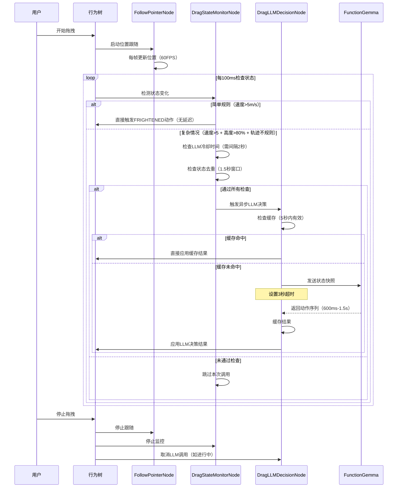

**关键优化点**：

1. **状态检测频率**：100ms（而非200ms），保证快速响应
2. **LLM调用冷却**：至少间隔2秒，避免在600ms-1.5s响应时间内重复调用
3. **状态去重**：1.5秒内的相同状态不重复触发
4. **结果缓存**：5秒内相同状态快照复用结果
5. **超时降级**：3秒超时后使用降级策略，保证系统响应性

**关键设计点**：

1. **默认行为持续运行**：`FollowPointerNode` 在拖拽期间持续更新位置（60FPS），不受其他决策影响
2. **可配置决策频率**：不同场景使用不同的检测频率和LLM调用间隔
3. **状态变化异步检测**：`DragStateMonitorNode` 按配置频率检查（拖拽场景100ms），避免过于频繁
4. **LLM调用优化**：
   - **冷却机制**：至少间隔2秒，避免在600ms-1.5s响应时间内重复调用
   - **状态去重**：1.5秒内的相同状态不重复触发
   - **结果缓存**：5秒内相同状态快照复用结果
   - **超时降级**：3秒超时后使用降级策略
5. **分层决策**：简单规则BT层直接处理（无延迟），复杂情况异步调用LLM
6. **并行执行**：默认跟随、简单规则动作、LLM决策结果可以并行应用
7. **资源清理**：拖拽结束时，自动清理LLM调用状态和超时定时器

**性能指标**：

- **状态检测延迟**：100ms（拖拽场景）
- **简单规则响应**：< 1ms（BT层直接处理）
- **LLM调用频率**：最多每2秒一次（拖拽场景）
- **LLM响应时间**：600ms-1.5s（实际）
- **超时保护**：3秒后自动降级
- **缓存命中率**：相同状态在5秒内复用，减少LLM调用

这个设计实现了**默认行为 + 异步状态检测 + 分层决策 + 频率优化**的完整流程，既保证了实时性，又适配了LLM的秒级响应特性，避免了频繁调用和资源浪费。

#### 示例 1：温度感知系统

**场景**：用户开启空调，室温从 25°C 降至 16°C

**数据流**：


**输入 JSON**：
```json
{
  "temp": 16,
  "status": "aircon_on",
  "previous_temp": 25,
  "change_rate": -9
}
```

**LLM 输出**：
```json
{
  "action": "SHIVER",
  "expression": "COLD",
  "intensity": 0.8,
  "duration": 3.0
}
```

#### 示例 2：光照交互系统

**场景**：用户将企鹅拖动到虚拟阳光区域

**数据流**：


**输入 JSON**：
```json
{
  "light_intensity": 0.9,
  "area": "sunny",
  "position": [2.5, 0, 1.2],
  "exposure_time": 2.0
}
```

**LLM 输出**：
```json
{
  "action": "SQUINT",
  "view": "LOOK_UP",
  "expression": "UNCOMFORTABLE",
  "duration": 2.5
}
```

#### 示例 3：时段触发系统

**场景**：深夜 23:30，企鹅自动表现出困倦

**输入 JSON**：
```json
{
  "time": "23:30",
  "day_of_week": "Monday",
  "last_interaction": "2 hours ago"
}
```

**LLM 输出**：
```json
{
  "action": "YAWN",
  "state": "SLEEPY",
  "text": "好困啊...",
  "auto_trigger": true
}
```

### 2.2 物理交互的"泛化解释"

目前点击和拖拽是硬编码的，未来可以通过大模型进行语义化解释。

#### 示例 1：拖拽轨迹语义化分析

**场景 A：恶意拖拽（高速无规律）**

**轨迹数据采集**：
```typescript
{
  "trajectory": [
    { "t": 0, "x": 0, "y": 0, "z": 0 },
    { "t": 0.1, "x": 2.5, "y": 1.8, "z": -1.2 },
    { "t": 0.2, "x": -1.5, "y": 0.3, "z": 2.1 },
    { "t": 0.3, "x": 3.2, "y": -0.5, "z": -2.8 }
  ],
  "velocity_avg": 8.5,  // m/s
  "jitter_frequency": 12.3,  // Hz
  "acceleration_max": 15.2
}
```

**LLM 语义化解释**：
```json
{
  "intent": "MALICIOUS_DRAG",
  "emotion": "FRIGHTENED",
  "confidence": 0.92,
  "action": "STRUGGLE",
  "expression": "PANIC"
}
```

**场景 B：温柔抚摸（缓慢圆周运动）**

**轨迹数据采集**：
```typescript
{
  "trajectory": [
    { "t": 0, "x": 0, "y": 0, "z": 0 },
    { "t": 0.5, "x": 0.3, "y": 0.2, "z": 0.1 },
    { "t": 1.0, "x": 0.2, "y": 0.3, "z": -0.1 },
    { "t": 1.5, "x": 0.1, "y": 0.2, "z": 0.05 }
  ],
  "velocity_avg": 0.4,  // m/s
  "circular_pattern": true,
  "smoothness": 0.95
}
```

**LLM 语义化解释**：
```json
{
  "intent": "GENTLE_PET",
  "emotion": "COMFORTABLE",
  "confidence": 0.88,
  "action": "RELAX",
  "expression": "HAPPY"
}
```

**系统架构**：
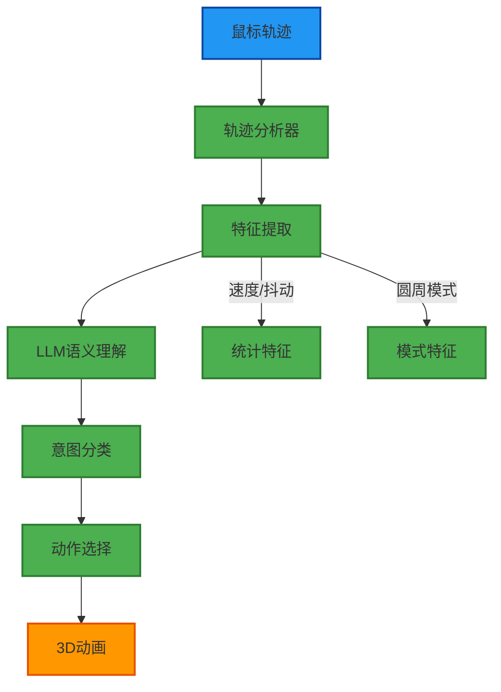

#### 示例 2：点击位置语义化

**场景 A：点击头部**

**输入数据**：
```json
{
  "click_position": [0, 1.2, 0],
  "body_part": "head",
  "click_type": "single",
  "pressure": 0.5
}
```

**LLM 输出**：
```json
{
  "action": "NOD",
  "text": "嗯？怎么了？",
  "expression": "CURIOUS",
  "social_feedback": "positive"
}
```

**场景 B：点击脚部**

**输入数据**：
```json
{
  "click_position": [0, -0.8, 0],
  "body_part": "foot",
  "click_type": "single",
  "pressure": 0.5
}
```

**LLM 输出**：
```json
{
  "action": "LOOK_DOWN",
  "text": "我的脚怎么了？",
  "expression": "CONFUSED",
  "social_feedback": "neutral"
}
```

### 2.3 自主目标设定 (Autonomous Goal Setting)

引入"渴望"或"需求"系统（如饥饿值、孤独值），让企鹅能够自发地产生行为。

#### 需求系统设计

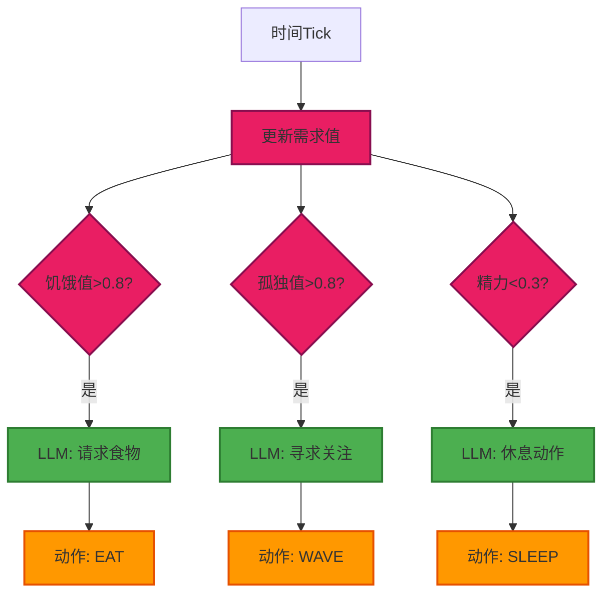

#### 示例：孤独值触发

**需求状态**：
```json
{
  "loneliness": 0.85,
  "last_interaction": "15 minutes ago",
  "interaction_count_today": 2,
  "time_of_day": "afternoon"
}
```

**LLM 自主决策**：
```json
{
  "trigger": "AUTONOMOUS",
  "need": "loneliness",
  "action": "WAVE",
  "text": "嘿，理理我嘛...",
  "expression": "LONELY",
  "priority": "high"
}
```

**长期记忆集成**：


**记忆数据结构**：
```json
{
  "user_interaction_history": [
    {
      "timestamp": "2025-12-30T10:30:00Z",
      "type": "text",
      "content": "飞起来",
      "response": "FLY",
      "user_satisfaction": "positive"
    },
    {
      "timestamp": "2025-12-30T14:20:00Z",
      "type": "drag",
      "intent": "gentle",
      "response": "RELAX",
      "user_satisfaction": "positive"
    }
  ],
  "preferences": {
    "favorite_actions": ["FLY", "DANCE"],
    "disliked_actions": ["SAD"],
    "interaction_style": "playful"
  }
}
```

## 3. 技术演进路径

### 3.1 演进时间线

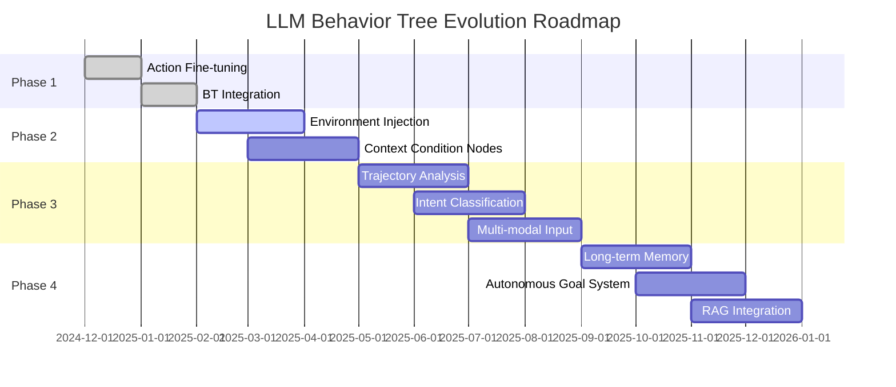

### 3.2 阶段详细说明

| 阶段 | 目标 | 核心技术 | 示例实现 |
| :--- | :--- | :--- | :--- |
| **阶段 1 (当前)** | 动作微调与 BT 集成 | 文本 -> 动作映射, 确定性 BT 分支 | `LLMCallNode` + `FunctionExecNode` |
| **阶段 2 (近期)** | 环境参数注入 | 将环境 JSON 拼接到 Prompt, 增加环境 Condition | `EnvironmentCondition` + `ContextInjectNode` |
| **阶段 3 (中期)** | 多模态输入解析 | 轨迹分析算法 -> 意图标签 -> LLM 决策 | `TrajectoryAnalyzer` + `IntentClassifier` |
| **阶段 4 (远期)** | 自主意识系统 | 长期记忆 (RAG), 需求驱动的自发 Tick 调用 | `MemoryNode` + `AutonomousGoalNode` |

### 3.3 阶段 2 实现示例：环境参数注入

**新增节点**：`EnvironmentCondition`

```typescript
// services/bt/conditions/EnvironmentCondition.ts
export default class EnvironmentCondition extends Condition {
  tick(tick: Tick): number {
    const env = tick.blackboard.get('environment');
    const threshold = this.properties.threshold;
    
    // 检查环境参数是否满足条件
    if (env.temp < threshold.temp_min) {
      return SUCCESS; // 触发"冷"相关行为
    }
    
    return FAILURE;
  }
}
```

**行为树集成**：
```typescript
new Priority({
  children: [
    // ... 其他分支
    new Sequence({
      children: [
        new EnvironmentCondition({ 
          threshold: { temp_min: 18 } 
        }),
        new LLMCallNode({ 
          context: 'environment' // 注入环境上下文
        })
      ]
    })
  ]
});
```

### 3.4 阶段 3 实现示例：轨迹分析

**轨迹分析器**：
```typescript
// services/trajectory/TrajectoryAnalyzer.ts
export class TrajectoryAnalyzer {
  analyze(trajectory: Point[]): TrajectoryFeatures {
    return {
      velocity_avg: this.calculateAvgVelocity(trajectory),
      jitter_frequency: this.calculateJitter(trajectory),
      circular_pattern: this.detectCircularPattern(trajectory),
      smoothness: this.calculateSmoothness(trajectory)
    };
  }
}
```

**意图分类节点**：
```typescript
// services/bt/actions/IntentClassifierNode.ts
export default class IntentClassifierNode extends Action {
  tick(tick: Tick): number {
    const trajectory = tick.blackboard.get('currentTrajectory');
    const features = this.analyzer.analyze(trajectory);
    
    // 调用 LLM 进行语义化解释
    const intent = await this.llm.classifyIntent(features);
    
    tick.blackboard.set('detectedIntent', intent);
    return SUCCESS;
  }
}
```

### 3.5 阶段 4 实现示例：自主目标系统

**需求更新节点**：
```typescript
// services/bt/actions/UpdateNeedsNode.ts
export default class UpdateNeedsNode extends Action {
  tick(tick: Tick): number {
    const timeSinceLastInteraction = 
      Date.now() - tick.blackboard.get('lastInteractionTime');
    
    // 更新孤独值
    const loneliness = Math.min(1.0, 
      timeSinceLastInteraction / (15 * 60 * 1000) // 15分钟达到最大值
    );
    
    tick.blackboard.set('loneliness', loneliness);
    
    if (loneliness > 0.8) {
      tick.blackboard.set('autonomousTrigger', 'loneliness');
    }
    
    return SUCCESS;
  }
}
```

**自主行为触发**：
```typescript
new Priority({
  children: [
    // ... 其他分支
    new Sequence({
      children: [
        new CheckBlackboardCondition({ 
          key: 'autonomousTrigger', 
          value: 'loneliness' 
        }),
        new LLMCallNode({ 
          context: 'autonomous',
          prompt: "I feel lonely, what should I do?"
        })
      ]
    })
  ]
});
```

## 4. 系统架构设计

### 4.1 分层决策架构

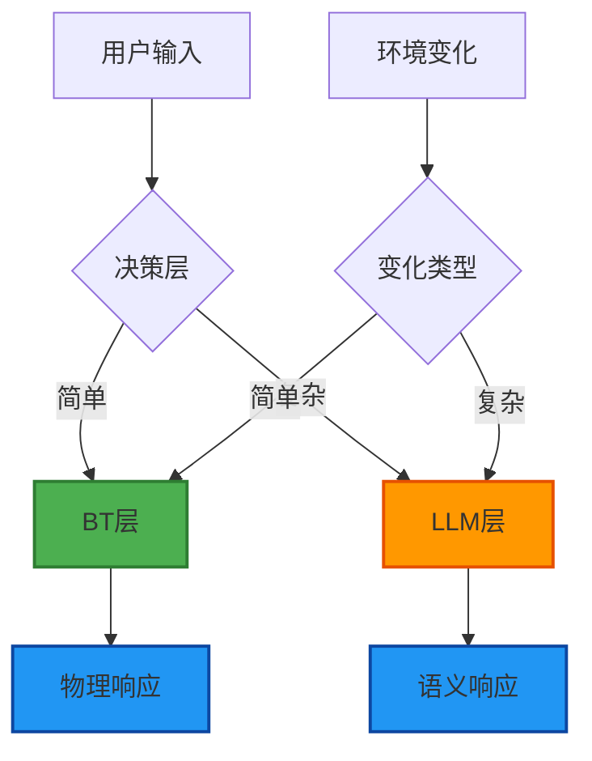

**分层原则**：
- **BT 层**：处理确定性物理反馈（位移、基础动画）
- **LLM 层**：处理需要语义理解的决策（情感、意图、上下文）

### 4.2 推理缓存机制

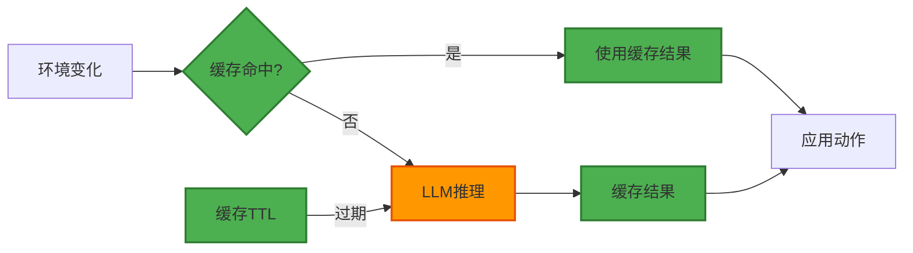

**缓存策略示例**：
```typescript
// services/cache/LLMCache.ts
export class LLMCache {
  private cache = new Map<string, CacheEntry>();
  
  get(key: string): CacheEntry | null {
    const entry = this.cache.get(key);
    if (entry && Date.now() - entry.timestamp < entry.ttl) {
      return entry;
    }
    return null;
  }
  
  set(key: string, value: any, ttl: number = 30000): void {
    this.cache.set(key, {
      value,
      timestamp: Date.now(),
      ttl
    });
  }
}

// 使用示例
const cacheKey = `env_${env.temp}_${env.light}`;
const cached = cache.get(cacheKey);
if (cached) {
  return cached.value; // 30秒内复用结果
}
```

### 4.3 模型选择策略

**FunctionGemma 优势**：
- 轻量级，适合实时推理
- 专精于"状态 -> 动作"映射
- 无需庞大世界知识库
- 可本地部署，低延迟

**架构建议**：
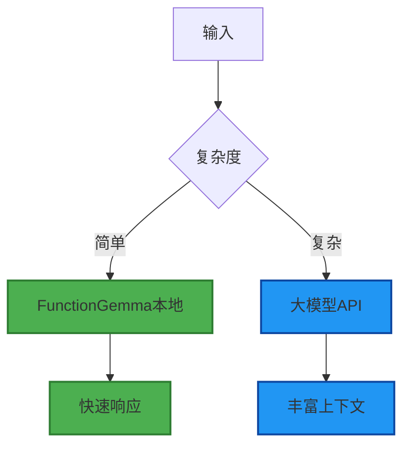

## 5. 面向 FunctionGemma (270M) 的数据集设计

针对非语言指令场景（拖拽、环境感知、自主行为），我们需要设计全新的数据集格式。FunctionGemma 270M 是一个轻量级模型（0.3B 参数），需要**高纯度、强格式约束**的训练数据。

### 5.1 数据集设计原则

#### 5.1.1 从"文本指令"到"状态快照"的转变

**传统文本指令数据集**（当前格式）：
```json
{
  "messages": [
    {"role": "developer", "content": "You are a model that can do function calling with the following functions\n"},
    {"role": "user", "content": "你能开心吗？"},
    {"role": "assistant", "tool_calls": [{"type": "function", "function": {"name": "animate_avatar", "arguments": {"actions": ["HAPPY"]}}}]}
  ]
}
```

**非语言指令数据集**（新格式）：
```json
{
  "messages": [
    {"role": "developer", "content": "You are a model that performs function calling based on virtual pet state snapshots."},
    {"role": "user", "content": "STATE_SNAPSHOT: {\"type\":\"drag\",\"speed\":6.2,\"height\":85,\"traj\":\"unstable\"}"},
    {"role": "assistant", "tool_calls": [{"type": "function", "function": {"name": "animate_avatar", "arguments": {"actions": ["STRUGGLE", "SAD"]}}}]}
  ]
}
```

**关键变化**：
- `user` 角色的内容从自然语言变为**结构化的状态快照 JSON**
- 模型需要学习将物理参数（速度、高度、轨迹）映射到情感动作（挣扎、悲伤）

#### 5.1.2 FunctionGemma 270M 的特殊要求

根据 README，FunctionGemma 270M 有以下特点：
- **必须使用 Developer Role**：`{"role": "developer", "content": "You are a model that can do function calling..."}`
- **上下文窗口**：32K tokens（但 270M 模型实际有效上下文更短，建议控制在 512-1024 tokens）
- **专精于工具调用**：不需要庞大的世界知识，只需精通"状态 -> 动作"映射
- **需要微调**：Base 模型在特定任务上准确率约 58%，微调后可提升至 85%+

### 5.2 数据集格式设计

#### 5.2.1 拖拽交互数据集

**场景 1：恶意拖拽（高速+不规则+高度>80%）**

```json
{
  "metadata": "train",
  "tools": [{
    "type": "function",
    "function": {
      "name": "animate_avatar",
      "description": "Controls the 3D penguin avatar to perform a sequence of actions on stage.",
      "parameters": {
        "type": "OBJECT",
        "properties": {
          "actions": {
            "type": "ARRAY",
            "description": "An ordered list of actions for the avatar to perform.",
            "items": {
              "type": "STRING",
              "enum": ["IDLE", "WALK", "RUN", "JUMP", "WAVE", "DANCE", "SPIN", "SHIVER", "SLEEP", "BOW", "NO", "YES", "EAT", "SURPRISE", "ANGRY", "SAD", "HAPPY", "LOOK_LEFT", "LOOK_RIGHT", "ROLL", "BACKFLIP", "CLAP", "THINK", "SIT", "FIGHT", "SWIM", "DAZZLE", "HIDE", "PEEK", "LOVE", "FLY", "RUN_ACROSS", "SLIDE", "STRUGGLE", "FRIGHTENED", "SCARED", "PANIC"]
            }
          }
        },
        "required": ["actions"]
      }
    }
  }],
  "messages": [
    {
      "role": "developer",
      "content": "You are a model that performs function calling based on virtual pet state snapshots. Analyze the drag interaction parameters and output appropriate emotional reactions."
    },
    {
      "role": "user",
      "content": "DRAG_SNAPSHOT: {\"type\":\"drag\",\"speed\":6.5,\"height\":85,\"traj\":\"unstable\",\"dir\":\"up_right\",\"state\":{\"expr\":\"neutral\",\"act\":\"idle\"}}"
    },
    {
      "role": "assistant",
      "tool_calls": [{
        "type": "function",
        "function": {
          "name": "animate_avatar",
          "arguments": {
            "actions": ["STRUGGLE", "FRIGHTENED"]
          }
        }
      }]
    }
  ]
}
```

**场景 2：温柔抚摸（缓慢+圆周运动）**

```json
{
  "metadata": "train",
  "tools": [{"type": "function", "function": {"name": "animate_avatar", ...}}],
  "messages": [
    {
      "role": "developer",
      "content": "You are a model that performs function calling based on virtual pet state snapshots. Analyze the drag interaction parameters and output appropriate emotional reactions."
    },
    {
      "role": "user",
      "content": "DRAG_SNAPSHOT: {\"type\":\"drag\",\"speed\":0.4,\"height\":45,\"traj\":\"circular\",\"dir\":\"gentle\",\"state\":{\"expr\":\"neutral\",\"act\":\"idle\"}}"
    },
    {
      "role": "assistant",
      "tool_calls": [{
        "type": "function",
        "function": {
          "name": "animate_avatar",
          "arguments": {
            "actions": ["HAPPY", "LOVE"]
          }
        }
      }]
    }
  ]
}
```

**场景 3：正常拖拽（不触发特殊反应）**

```json
{
  "metadata": "train",
  "tools": [{"type": "function", "function": {"name": "animate_avatar", ...}}],
  "messages": [
    {
      "role": "developer",
      "content": "You are a model that performs function calling based on virtual pet state snapshots. Analyze the drag interaction parameters and output appropriate emotional reactions."
    },
    {
      "role": "user",
      "content": "DRAG_SNAPSHOT: {\"type\":\"drag\",\"speed\":2.1,\"height\":50,\"traj\":\"smooth\",\"dir\":\"forward\",\"state\":{\"expr\":\"neutral\",\"act\":\"idle\"}}"
    },
    {
      "role": "assistant",
      "tool_calls": [{
        "type": "function",
        "function": {
          "name": "animate_avatar",
          "arguments": {
            "actions": ["IDLE"]
          }
        }
      }]
    }
  ]
}
```

#### 5.2.2 环境感知数据集

**场景：温度感知（室温降低）**

```json
{
  "metadata": "train",
  "tools": [{"type": "function", "function": {"name": "animate_avatar", ...}}],
  "messages": [
    {
      "role": "developer",
      "content": "You are a model that performs function calling based on virtual pet state snapshots. Analyze environmental changes and output appropriate reactions."
    },
    {
      "role": "user",
      "content": "ENV_SNAPSHOT: {\"type\":\"temperature\",\"temp\":16,\"prev_temp\":25,\"change\":-9,\"aircon\":true,\"state\":{\"expr\":\"neutral\",\"act\":\"idle\"}}"
    },
    {
      "role": "assistant",
      "tool_calls": [{
        "type": "function",
        "function": {
          "name": "animate_avatar",
          "arguments": {
            "actions": ["SHIVER", "SAD"]
          }
        }
      }]
    }
  ]
}
```

**场景：光照交互（移动到阳光区域）**

```json
{
  "metadata": "train",
  "tools": [{"type": "function", "function": {"name": "animate_avatar", ...}}],
  "messages": [
    {
      "role": "developer",
      "content": "You are a model that performs function calling based on virtual pet state snapshots. Analyze environmental changes and output appropriate reactions."
    },
    {
      "role": "user",
      "content": "ENV_SNAPSHOT: {\"type\":\"light\",\"intensity\":0.9,\"area\":\"sunny\",\"pos\":[2.5,0,1.2],\"exposure\":2.0,\"state\":{\"expr\":\"neutral\",\"act\":\"idle\"}}"
    },
    {
      "role": "assistant",
      "tool_calls": [{
        "type": "function",
        "function": {
          "name": "animate_avatar",
          "arguments": {
            "actions": ["LOOK_LEFT", "LOOK_RIGHT"]
          }
        }
      }]
    }
  ]
}
```

#### 5.2.3 自主行为数据集

**场景：孤独值触发**

```json
{
  "metadata": "train",
  "tools": [{"type": "function", "function": {"name": "animate_avatar", ...}}],
  "messages": [
    {
      "role": "developer",
      "content": "You are a model that performs function calling based on virtual pet state snapshots. Analyze the pet's internal needs and output appropriate autonomous behaviors."
    },
    {
      "role": "user",
      "content": "AUTONOMOUS_SNAPSHOT: {\"type\":\"loneliness\",\"value\":0.85,\"last_interaction\":900,\"count_today\":2,\"time\":\"afternoon\",\"state\":{\"expr\":\"neutral\",\"act\":\"idle\"}}"
    },
    {
      "role": "assistant",
      "tool_calls": [{
        "type": "function",
        "function": {
          "name": "animate_avatar",
          "arguments": {
            "actions": ["WAVE", "HAPPY"]
          }
        }
      }]
    }
  ]
}
```

### 5.3 Token 效率优化（针对 270M 模型）

由于 FunctionGemma 270M 的上下文窗口和参数量有限，状态快照需要**紧凑化**：

#### 5.3.1 键名缩写策略

**完整格式**（不推荐，Token 过多）：
```json
{
  "trigger_type": "drag_interaction",
  "context": {
    "drag_params": {
      "speed": 6.2,
      "screen_height_percent": 85,
      "trajectory": "unstable",
      "direction": "up_right"
    },
    "current_state": {
      "expression": "neutral",
      "action": "idle",
      "view_direction": "forward"
    }
  }
}
```

**紧凑格式**（推荐，节省 Token）：
```json
{
  "t": "drag",
  "dp": {
    "s": 6.2,
    "h": 85,
    "tr": "unstable",
    "d": "up_right"
  },
  "st": {
    "e": "neutral",
    "a": "idle"
  }
}
```

**权衡**：虽然可读性降低，但对于 270M 模型，Token 效率更重要。可以在训练时使用紧凑格式，推理时再展开。

#### 5.3.2 数值精度控制

- **速度**：保留 1 位小数（`6.2` 而非 `6.234567`）
- **高度百分比**：整数（`85` 而非 `85.3`）
- **时间戳**：相对时间（秒），而非绝对时间戳

### 5.4 数据集规模建议

针对 FunctionGemma 270M，建议的数据集规模：

| 场景类型 | 训练样本数 | 验证样本数 | 说明 |
|---------|----------|----------|------|
| **拖拽交互** | 2000-3000 | 200-300 | 覆盖各种速度、高度、轨迹组合 |
| **环境感知** | 1000-1500 | 100-150 | 温度、光照、时段等变化 |
| **自主行为** | 500-800 | 50-80 | 饥饿、孤独、精力等需求触发 |
| **负样本** | 500-800 | 50-80 | 正常状态不触发特殊反应 |
| **总计** | 4000-6100 | 400-610 | 约 5K 样本足够微调 270M 模型 |

**负样本的重要性**：
- 防止模型过拟合，导致企鹅变成"惊弓之鸟"
- 正常拖拽、正常环境变化时，应该保持 IDLE 或轻微反应

### 5.5 数据增强策略

#### 5.5.1 参数扰动

对同一场景的参数进行小幅扰动，生成更多样本：

```python
# 原始样本
{"speed": 6.2, "height": 85, "traj": "unstable"}

# 增强样本
{"speed": 6.0, "height": 84, "traj": "unstable"}  # 速度-0.2, 高度-1
{"speed": 6.4, "height": 86, "traj": "unstable"}  # 速度+0.2, 高度+1
{"speed": 5.8, "height": 83, "traj": "unstable"}  # 速度-0.4, 高度-2
```

#### 5.5.2 组合变化

将不同的状态变化组合，生成复杂场景：

```python
# 基础场景
场景A: 高速拖拽 → STRUGGLE
场景B: 高度>80% → SCARED

# 组合场景
场景C: 高速 + 高度>80% → STRUGGLE + SCARED (更强烈的反应)
```

### 5.6 完整数据集示例

**文件结构**：
```
EdgeAI/FINETUNE/datasets/
├── pet_actions_single_turn_2000.jsonl      # 现有：文本指令数据集
├── pet_actions_multi_turn.jsonl            # 现有：多轮对话数据集
├── pet_drag_interaction.jsonl               # 新增：拖拽交互数据集
├── pet_environment_sensing.jsonl           # 新增：环境感知数据集
└── pet_autonomous_behavior.jsonl            # 新增：自主行为数据集
```

**pet_drag_interaction.jsonl 示例**（前 5 条）：

```jsonl
{"metadata": "train", "tools": [{"type": "function", "function": {"name": "animate_avatar", "description": "Controls the 3D penguin avatar to perform a sequence of actions on stage.", "parameters": {"type": "OBJECT", "properties": {"actions": {"type": "ARRAY", "description": "An ordered list of actions for the avatar to perform.", "items": {"type": "STRING", "enum": ["IDLE", "WALK", "RUN", "JUMP", "WAVE", "DANCE", "SPIN", "SHIVER", "SLEEP", "BOW", "NO", "YES", "EAT", "SURPRISE", "ANGRY", "SAD", "HAPPY", "LOOK_LEFT", "LOOK_RIGHT", "ROLL", "BACKFLIP", "CLAP", "THINK", "SIT", "FIGHT", "SWIM", "DAZZLE", "HIDE", "PEEK", "LOVE", "FLY", "RUN_ACROSS", "SLIDE", "STRUGGLE", "FRIGHTENED", "SCARED", "PANIC"]}}}, "required": ["actions"]}}}], "messages": [{"role": "developer", "content": "You are a model that performs function calling based on virtual pet state snapshots. Analyze the drag interaction parameters and output appropriate emotional reactions."}, {"role": "user", "content": "DRAG_SNAPSHOT: {\"t\":\"drag\",\"dp\":{\"s\":6.5,\"h\":85,\"tr\":\"unstable\",\"d\":\"up_right\"},\"st\":{\"e\":\"neutral\",\"a\":\"idle\"}}"}, {"role": "assistant", "tool_calls": [{"type": "function", "function": {"name": "animate_avatar", "arguments": {"actions": ["STRUGGLE", "FRIGHTENED"]}}}]}]}
{"metadata": "train", "tools": [{"type": "function", "function": {"name": "animate_avatar", "description": "Controls the 3D penguin avatar to perform a sequence of actions on stage.", "parameters": {"type": "OBJECT", "properties": {"actions": {"type": "ARRAY", "description": "An ordered list of actions for the avatar to perform.", "items": {"type": "STRING", "enum": ["IDLE", "WALK", "RUN", "JUMP", "WAVE", "DANCE", "SPIN", "SHIVER", "SLEEP", "BOW", "NO", "YES", "EAT", "SURPRISE", "ANGRY", "SAD", "HAPPY", "LOOK_LEFT", "LOOK_RIGHT", "ROLL", "BACKFLIP", "CLAP", "THINK", "SIT", "FIGHT", "SWIM", "DAZZLE", "HIDE", "PEEK", "LOVE", "FLY", "RUN_ACROSS", "SLIDE", "STRUGGLE", "FRIGHTENED", "SCARED", "PANIC"]}}}, "required": ["actions"]}}}], "messages": [{"role": "developer", "content": "You are a model that performs function calling based on virtual pet state snapshots. Analyze the drag interaction parameters and output appropriate emotional reactions."}, {"role": "user", "content": "DRAG_SNAPSHOT: {\"t\":\"drag\",\"dp\":{\"s\":0.4,\"h\":45,\"tr\":\"circular\",\"d\":\"gentle\"},\"st\":{\"e\":\"neutral\",\"a\":\"idle\"}}"}, {"role": "assistant", "tool_calls": [{"type": "function", "function": {"name": "animate_avatar", "arguments": {"actions": ["HAPPY", "LOVE"]}}}]}]}
{"metadata": "train", "tools": [{"type": "function", "function": {"name": "animate_avatar", "description": "Controls the 3D penguin avatar to perform a sequence of actions on stage.", "parameters": {"type": "OBJECT", "properties": {"actions": {"type": "ARRAY", "description": "An ordered list of actions for the avatar to perform.", "items": {"type": "STRING", "enum": ["IDLE", "WALK", "RUN", "JUMP", "WAVE", "DANCE", "SPIN", "SHIVER", "SLEEP", "BOW", "NO", "YES", "EAT", "SURPRISE", "ANGRY", "SAD", "HAPPY", "LOOK_LEFT", "LOOK_RIGHT", "ROLL", "BACKFLIP", "CLAP", "THINK", "SIT", "FIGHT", "SWIM", "DAZZLE", "HIDE", "PEEK", "LOVE", "FLY", "RUN_ACROSS", "SLIDE", "STRUGGLE", "FRIGHTENED", "SCARED", "PANIC"]}}}, "required": ["actions"]}}}], "messages": [{"role": "developer", "content": "You are a model that performs function calling based on virtual pet state snapshots. Analyze the drag interaction parameters and output appropriate emotional reactions."}, {"role": "user", "content": "DRAG_SNAPSHOT: {\"t\":\"drag\",\"dp\":{\"s\":2.1,\"h\":50,\"tr\":\"smooth\",\"d\":\"forward\"},\"st\":{\"e\":\"neutral\",\"a\":\"idle\"}}"}, {"role": "assistant", "tool_calls": [{"type": "function", "function": {"name": "animate_avatar", "arguments": {"actions": ["IDLE"]}}}]}]}
{"metadata": "train", "tools": [{"type": "function", "function": {"name": "animate_avatar", "description": "Controls the 3D penguin avatar to perform a sequence of actions on stage.", "parameters": {"type": "OBJECT", "properties": {"actions": {"type": "ARRAY", "description": "An ordered list of actions for the avatar to perform.", "items": {"type": "STRING", "enum": ["IDLE", "WALK", "RUN", "JUMP", "WAVE", "DANCE", "SPIN", "SHIVER", "SLEEP", "BOW", "NO", "YES", "EAT", "SURPRISE", "ANGRY", "SAD", "HAPPY", "LOOK_LEFT", "LOOK_RIGHT", "ROLL", "BACKFLIP", "CLAP", "THINK", "SIT", "FIGHT", "SWIM", "DAZZLE", "HIDE", "PEEK", "LOVE", "FLY", "RUN_ACROSS", "SLIDE", "STRUGGLE", "FRIGHTENED", "SCARED", "PANIC"]}}}, "required": ["actions"]}}}], "messages": [{"role": "developer", "content": "You are a model that performs function calling based on virtual pet state snapshots. Analyze the drag interaction parameters and output appropriate emotional reactions."}, {"role": "user", "content": "DRAG_SNAPSHOT: {\"t\":\"drag\",\"dp\":{\"s\":8.2,\"h\":90,\"tr\":\"unstable\",\"d\":\"down_left\"},\"st\":{\"e\":\"neutral\",\"a\":\"idle\"}}"}, {"role": "assistant", "tool_calls": [{"type": "function", "function": {"name": "animate_avatar", "arguments": {"actions": ["PANIC", "STRUGGLE", "SCARED"]}}}]}]}
{"metadata": "train", "tools": [{"type": "function", "function": {"name": "animate_avatar", "description": "Controls the 3D penguin avatar to perform a sequence of actions on stage.", "parameters": {"type": "OBJECT", "properties": {"actions": {"type": "ARRAY", "description": "An ordered list of actions for the avatar to perform.", "items": {"type": "STRING", "enum": ["IDLE", "WALK", "RUN", "JUMP", "WAVE", "DANCE", "SPIN", "SHIVER", "SLEEP", "BOW", "NO", "YES", "EAT", "SURPRISE", "ANGRY", "SAD", "HAPPY", "LOOK_LEFT", "LOOK_RIGHT", "ROLL", "BACKFLIP", "CLAP", "THINK", "SIT", "FIGHT", "SWIM", "DAZZLE", "HIDE", "PEEK", "LOVE", "FLY", "RUN_ACROSS", "SLIDE", "STRUGGLE", "FRIGHTENED", "SCARED", "PANIC"]}}}, "required": ["actions"]}}}], "messages": [{"role": "developer", "content": "You are a model that performs function calling based on virtual pet state snapshots. Analyze the drag interaction parameters and output appropriate emotional reactions."}, {"role": "user", "content": "DRAG_SNAPSHOT: {\"t\":\"drag\",\"dp\":{\"s\":1.5,\"h\":40,\"tr\":\"circular\",\"d\":\"gentle\"},\"st\":{\"e\":\"neutral\",\"a\":\"idle\"}}"}, {"role": "assistant", "tool_calls": [{"type": "function", "function": {"name": "animate_avatar", "arguments": {"actions": ["HAPPY"]}}}]}]}
```

### 5.7 训练数据生成流程

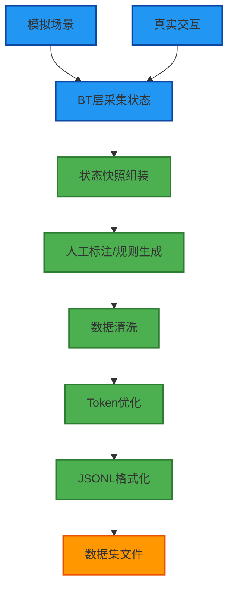

**数据生成步骤**：

1. **场景模拟**：在 BT 层模拟各种拖拽、环境变化场景，采集状态快照
2. **规则标注**：根据设计规则（速度>5m/s → 受惊）自动生成标签
3. **人工校验**：对复杂场景进行人工校验，确保动作序列合理
4. **数据清洗**：去除异常值、重复样本
5. **Token 优化**：将完整 JSON 压缩为紧凑格式
6. **格式转换**：转换为 FunctionGemma 要求的 JSONL 格式

### 5.8 与现有数据集的融合

**混合训练策略**：

```python
# 训练时混合使用
train_data = [
    pet_actions_single_turn_2000.jsonl,      # 文本指令（保持现有能力）
    pet_drag_interaction.jsonl,              # 拖拽交互（新增能力）
    pet_environment_sensing.jsonl,          # 环境感知（新增能力）
    pet_autonomous_behavior.jsonl            # 自主行为（新增能力）
]

# 比例建议
# 文本指令：非语言指令 = 6:4 或 7:3
# 确保模型不会忘记原有的文本理解能力
```

### 5.9 评估指标

针对非语言指令场景，需要设计专门的评估指标：

1. **准确率**：状态快照 → 动作序列的匹配准确率
2. **响应合理性**：人工评估动作序列是否符合物理直觉（高速拖拽 → 受惊）
3. **负样本准确率**：正常状态不触发特殊反应的比例
4. **Token 效率**：平均每个状态快照的 Token 数量

### 5.10 总结

针对 FunctionGemma 270M 的数据集设计要点：

1. **格式转变**：从自然语言到结构化状态快照
2. **Token 优化**：使用紧凑的 JSON 格式，节省上下文
3. **负样本平衡**：防止模型过拟合，保持正常行为的判断力
4. **规模适中**：4K-6K 样本足够微调 270M 模型
5. **混合训练**：与现有文本指令数据集混合，保持多模态能力

## 6. 合理化建议 (非画蛇添足)

1. **分层决策**：简单的物理反馈（如提起瞬间的位移）保持在 BT 的 TypeScript 层，只有需要"决定态度"的时候才调用 LLM。
   - **示例**：拖拽时的位置跟随 → BT 层
   - **示例**：判断拖拽是"恶意"还是"温柔" → LLM 层

2. **异步推理缓存**：针对环境变化（如变冷），LLM 推理一次后结果可保持一段时间（如 30 秒），无需高频调用。
   - **缓存键**：`env_${temp}_${light}_${time}`
   - **TTL**：根据变化频率动态调整

3. **小模型本地化**：FunctionGemma 极其适合此类任务，因为它不需要庞大的世界知识，只需精通"状态 -> 动作"的映射。
   - **部署**：本地 vLLM 服务
   - **延迟**：< 100ms
   - **成本**：几乎为零

4. **渐进式实现**：不要一次性实现所有功能，按阶段逐步演进，每个阶段都要有可验证的成果。

## 7. 完整系统架构图

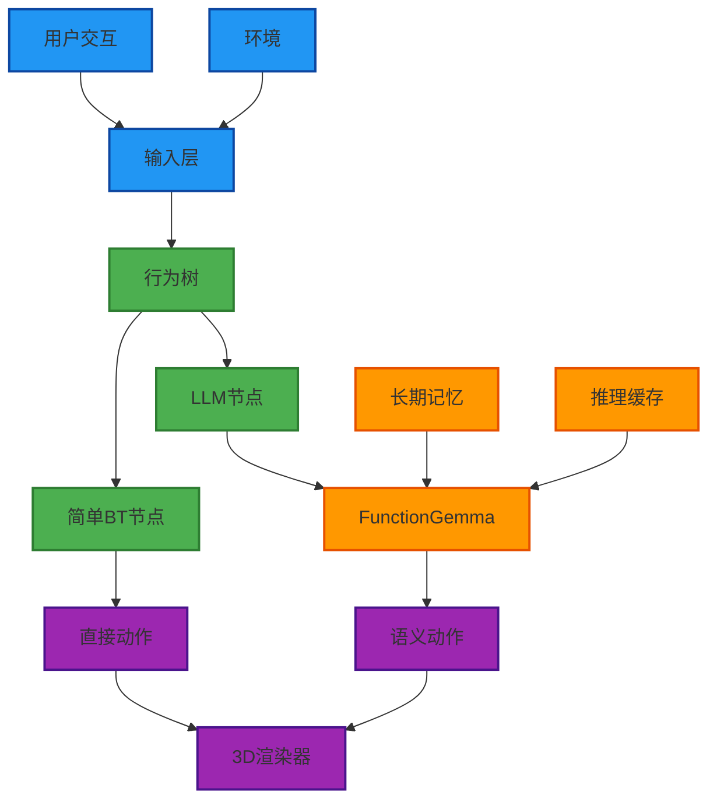

## 8. 总结

通过以上演进路径，Q-Penguin 将从当前的"对话框驱动"系统逐步演进为具备**环境感知、语义理解、自主决策**能力的数字生命系统。每个阶段都有明确的技术目标和实现路径，确保系统的稳定性和可扩展性。

---
*文档编制：AI Assistant*  
*日期：2025年12月31日*  
*最后更新：2025年12月31日*

