# 🧠Q-Penguin: 大模å‹é语言指令交互演进课题

## 1. 核心课题背景

当å‰çš„ Q-Penguin æ¶æ„å·²æˆåŠŸé›†æˆäº†åŸºäºæ–‡æœ¬æŒ‡ä»¤çš„行为决策（Function Calling）。然而，为了让数字生命更加"真å®"，它ä¸åº”仅仅是一个"对è¯æ¡†é©±åŠ¨"的机器人，而应具备对物ç†ä¸–界（虚拟ç¯å¢ƒï¼‰çš„感知能力，并能基äºè¿™äº›æ„ŸçŸ¥äº§ç”Ÿè‡ªå‘的行为。

### 1.1 当å‰æ¶æ„å±€é™

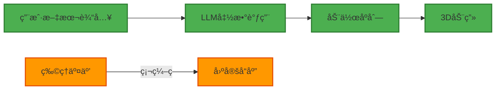

**问题**：
- 物ç†äº¤äº’（拖拽ã€ç‚¹å‡»ï¼‰æ˜¯ç¡¬ç¼–ç çš„，无法根æ®ä¸Šä¸‹æ–‡åŠ¨æ€è°ƒæ•´
- ç¯å¢ƒå˜åŒ–（温度ã€å…‰ç…§ï¼‰æ— æ³•å½±å“行为决策
- 缺ä¹è‡ªä¸»æ€§ï¼Œåªèƒ½è¢«åŠ¨å“应用户指令

## 2. 演进方å‘：é语言指令场景

### 2.1 ç¯å¢ƒæ„ŸçŸ¥ä¸æƒ…感映射

大模å‹å¯ä»¥ä¸å†ç›´æ¥æ¥æ”¶ç”¨æˆ·çš„"命令"，而是æ¥æ”¶å½“å‰çš„"状æ€å¿«ç…§"。

**核心概念：状æ€å¿«ç…§ï¼ˆState Snapshot）**

状æ€å¿«ç…§æ˜¯ä¸€ä¸ªç»“æ„化的 JSON 对象，包å«äº†å½“å‰æ—¶åˆ»çš„所有上下文信æ¯ï¼š
- **触å‘ç±»å‹**：什么事件触å‘了这次决策（拖拽ã€ç¯å¢ƒå˜åŒ–ã€æ—¶é—´è§¦å‘等）
- **å®æ—¶å‚æ•°**：BT 层å®æ—¶é‡‡é›†çš„物ç†æ•°æ®ï¼ˆé€Ÿåº¦ã€ä½ç½®ã€è½¨è¿¹ç­‰ï¼‰
- **当å‰çŠ¶æ€**：数字形象当å‰çš„表情ã€åŠ¨ä½œã€è§†è§’ç­‰
- **决策è¦æ±‚**：期望的输出格å¼ï¼ˆä»… function calling 或包å«æ–‡æœ¬ï¼‰

**å…¸å‹ç¤ºä¾‹ï¼šæ‹–拽交互状æ€å¿«ç…§**

这正是你æ到的"状æ€å¿«ç…§"的完ç¾ä½“ç°ï¼å½“用户拖拽ä¼é¹…时，BT 层会å®æ—¶é‡‡é›†æ‹–动å‚数，并组装æˆå®Œæ•´çš„状æ€å¿«ç…§å‘é€ç»™ LLM：

```json
{
  "trigger_type": "drag_interaction",  // 触å‘ç±»å‹ï¼šæ‹–动交互
  "context": {
    "drag_params": {                   // BTå®æ—¶æ£€æµ‹çš„拖动å‚数（毫秒级采集）
      "speed": 6.2,                    // 拖动速度（m/s），超过阈值5m/s
      "screen_height_percent": 85,     // 数字形象在å±å¹•é«˜åº¦å æ¯”85%（超过80%阈值）
      "trajectory": "unstable",        // 拖动轨迹：ä¸è§„则（乱晃）
      "direction": "up_right"          // 拖动方å‘：å³ä¸Š
    },
    "current_state": {                 // 数字形象当å‰çŠ¶æ€ï¼ˆBT维护）
      "expression": "neutral",         // 当å‰è¡¨æƒ…：中性
      "action": "idle",                // 当å‰åŠ¨ä½œï¼šé—²ç½®
      "view_direction": "forward"      // 当å‰è§†è§’：正å‰æ–¹
    },
    "fallback_flag": false             // 是å¦éœ€è¦ç´§æ€¥å…œåº•ï¼šå¦
  },
  "requirement": "output_only_function_calling"  // è¦æ±‚仅输出function calling指令
}
```

**LLM 基äºçŠ¶æ€å¿«ç…§çš„决策æµç¨‹**：

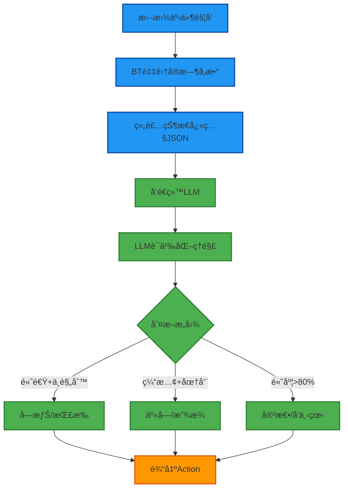

**LLM å¯èƒ½çš„输出**（基äºä¸Šè¿°çŠ¶æ€å¿«ç…§ï¼‰ï¼š
```json
{
  "action": "STRUGGLE",
  "expression": "PANIC",
  "intensity": 0.9,
  "reasoning": "高速ä¸è§„则拖动 + 高度超过80% = å—惊å应"
}
```

#### 完整å®ç°æ¡ˆä¾‹ï¼šå¼‚步拖拽状æ€å˜åŒ–检测ä¸å†³ç­–（优化版）

**场景æè¿°**：
- 用户拖拽ä¼é¹…时，默认行为是ä½ç½®è·Ÿéšï¼ˆBT层处ç†ï¼Œ60FPSå®æ—¶æ›´æ–°ï¼‰
- 在拖拽过程中，如æœæ£€æµ‹åˆ°ç‰¹æ®ŠçŠ¶æ€å˜åŒ–（速度过快ã€é«˜åº¦è¿‡é«˜ã€è½¨è¿¹å¼‚常），需è¦è§¦å‘é¢å¤–çš„å应
- 简å•è§„则（如速度>10m/s）由BT层直æ¥å¤„ç†
- å¤æ‚情况（如"高速+ä¸è§„则+高度>80%"的组åˆåˆ¤æ–­ï¼‰å¼‚æ­¥å‘é€ç»™LLM进行语义化ç†è§£

**关键挑战**：
- LLMå“应时间：600ms-1.5s（秒级å“应）
- ä¸åŒåœºæ™¯éœ€è¦ä¸åŒçš„决策频ç‡
- 需è¦é¿å…é‡å¤è°ƒç”¨å’ŒçŠ¶æ€å¿«ç…§å»é‡
- 需è¦è®¾è®¡å¯é…置的决策频ç‡ç­–ç•¥

**系统æ¶æ„**：

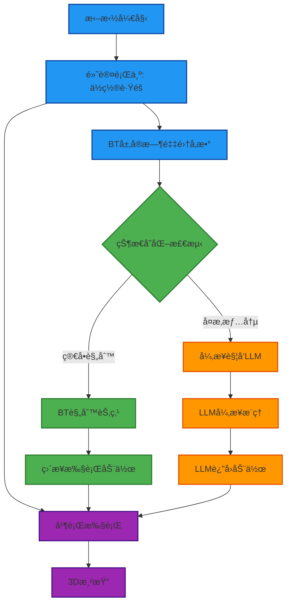

**行为树结æ„设计**：

```typescript
// services/bt/PenguinBT.ts - 拖拽分支扩展
new Priority({
  children: [
    // 1. 拖拽交互分支（最高优先级）
    new Sequence({
      children: [
        new CheckBlackboardCondition({ 
          key: 'isDragging', 
          value: true, 
          scope: 'global' 
        }),
        new Parallel({
          policy: 'SuccessOnAll',
          children: [
            // 默认行为：ä½ç½®è·Ÿéšï¼ˆæŒç»­è¿è¡Œï¼‰
            new FollowPointerNode(),
            
            // 状æ€å˜åŒ–检测ä¸å†³ç­–（异步）
            new DragStateMonitorNode()
          ]
        })
      ]
    }),
    // ... 其他分支
  ]
});
```

**决策频ç‡ç­–略设计**

ä¸åŒåœºæ™¯éœ€è¦ä¸åŒçš„决策频ç‡ï¼Œæˆ‘们设计了一个å¯é…置的策略系统：

```typescript
// services/bt/config/DecisionFrequency.ts
export interface DecisionFrequencyConfig {
  // 状æ€æ£€æµ‹é¢‘ç‡ï¼ˆBT层检测状æ€å˜åŒ–的频ç‡ï¼‰
  stateCheckInterval: number;  // ms
  
  // LLM决策冷å´æ—¶é—´ï¼ˆä¸¤æ¬¡LLM调用之间的最å°é—´éš”）
  llmCooldownTime: number;     // ms
  
  // 状æ€å¿«ç…§å»é‡çª—å£ï¼ˆç›¸åŒçŠ¶æ€åœ¨çª—å£å†…ä¸é‡å¤è§¦å‘）
  snapshotDedupeWindow: number; // ms
  
  // 场景类å‹
  scenario: 'drag' | 'environment' | 'autonomous' | 'interaction';
}

// ä¸åŒåœºæ™¯çš„默认é…ç½®
export const FREQUENCY_CONFIGS: Record<string, DecisionFrequencyConfig> = {
  drag: {
    stateCheckInterval: 100,      // 拖拽需è¦å¿«é€Ÿå“应，100ms检测一次
    llmCooldownTime: 2000,        // LLM调用间隔至少2秒（é¿å…频ç¹è°ƒç”¨ï¼‰
    snapshotDedupeWindow: 1500,   // 1.5秒内的相åŒçŠ¶æ€ä¸é‡å¤è§¦å‘
    scenario: 'drag'
  },
  environment: {
    stateCheckInterval: 500,      // ç¯å¢ƒå˜åŒ–较慢，500ms检测一次
    llmCooldownTime: 3000,        // ç¯å¢ƒå˜åŒ–LLM调用间隔3秒
    snapshotDedupeWindow: 2000,   // 2秒内的相åŒçŠ¶æ€ä¸é‡å¤è§¦å‘
    scenario: 'environment'
  },
  autonomous: {
    stateCheckInterval: 1000,     // 自主行为较慢，1秒检测一次
    llmCooldownTime: 5000,        // 自主行为LLM调用间隔5秒
    snapshotDedupeWindow: 3000,   // 3秒内的相åŒçŠ¶æ€ä¸é‡å¤è§¦å‘
    scenario: 'autonomous'
  }
};
```

**核心节点å®ç°ï¼šDragStateMonitorNode（优化版）**

```typescript
// services/bt/actions/DragStateMonitorNode.ts
import Action from '../core/Action';
import { SUCCESS, RUNNING } from '../constants';
import Tick from '../core/Tick';
import { FREQUENCY_CONFIGS, DecisionFrequencyConfig } from '../config/DecisionFrequency';

/**
 * DragStateMonitorNode 在拖拽过程中å®æ—¶ç›‘æ§çŠ¶æ€å˜åŒ–
 * 简å•è§„则直æ¥å¤„ç†ï¼Œå¤æ‚情况异步触å‘LLM
 * 优化：å¯é…ç½®å†³ç­–é¢‘ç‡ + 状æ€å¿«ç…§å»é‡ + LLM调用冷å´
 */
export default class DragStateMonitorNode extends Action {
  private lastCheckTime: number = 0;
  private lastLLMCallTime: number = 0;
  private lastDragParams: any = null;
  private lastSnapshotHash: string = '';
  private config: DecisionFrequencyConfig;

  constructor({ 
    config = FREQUENCY_CONFIGS.drag 
  }: { config?: DecisionFrequencyConfig } = {}) {
    super({ name: 'DragStateMonitorNode' });
    this.config = config;
  }

  public tick(tick: Tick): number {
    const blackboard = tick.blackboard;
    const now = Date.now();
    
    // 节æµï¼šæŒ‰é…置的频ç‡æ£€æŸ¥çŠ¶æ€å˜åŒ–
    if (now - this.lastCheckTime < this.config.stateCheckInterval) {
      return RUNNING;
    }
    this.lastCheckTime = now;

    // è·å–当å‰æ‹–拽å‚数（BT层å®æ—¶é‡‡é›†ï¼‰
    const currentDragParams = blackboard?.get('dragParams');
    if (!currentDragParams) {
      return RUNNING; // 等待å‚数采集
    }

    // 检测状æ€å˜åŒ–
    const stateChange = this.detectStateChange(currentDragParams);
    
    if (stateChange) {
      // 判断是简å•è§„则还是å¤æ‚情况
      if (this.isSimpleRule(stateChange)) {
        // 简å•è§„则：BT层直æ¥å¤„ç†ï¼ˆæ— å»¶è¿Ÿï¼‰
        this.handleSimpleRule(stateChange, blackboard);
      } else {
        // å¤æ‚情况：异步触å‘LLM（带冷å´å’Œå»é‡ï¼‰
        this.triggerLLMAsync(stateChange, currentDragParams, blackboard, now);
      }
    }

    this.lastDragParams = { ...currentDragParams };
    return RUNNING; // æŒç»­ç›‘æ§ç›´åˆ°æ‹–拽结æŸ
  }

  /**
   * 检测状æ€å˜åŒ–
   */
  private detectStateChange(current: any): any | null {
    if (!this.lastDragParams) {
      return null; // 首次检测，记录基准值
    }

    const changes: any = {};

    // 检测速度å˜åŒ–
    if (current.speed > 5 && this.lastDragParams.speed <= 5) {
      changes.speed_threshold_exceeded = true;
    }

    // 检测高度å˜åŒ–
    if (current.screen_height_percent > 80 && 
        this.lastDragParams.screen_height_percent <= 80) {
      changes.height_threshold_exceeded = true;
    }

    // 检测轨迹å˜åŒ–
    if (current.trajectory === 'unstable' && 
        this.lastDragParams.trajectory !== 'unstable') {
      changes.trajectory_became_unstable = true;
    }

    return Object.keys(changes).length > 0 ? changes : null;
  }

  /**
   * 判断是å¦ä¸ºç®€å•è§„则
   */
  private isSimpleRule(stateChange: any): boolean {
    // å•ä¸€æ¡ä»¶å˜åŒ– = 简å•è§„则
    const changeCount = Object.keys(stateChange).length;
    return changeCount === 1;
  }

  /**
   * 处ç†ç®€å•è§„则（BT层直æ¥å¤„ç†ï¼‰
   */
  private handleSimpleRule(stateChange: any, blackboard: any): void {
    if (stateChange.speed_threshold_exceeded) {
      // 速度过快：直æ¥æ’­æ”¾"å—惊"动作
      blackboard.set('bt_output_action', 'FRIGHTENED');
      console.log('BT: 速度过快，直æ¥è§¦å‘å—惊动作');
    } else if (stateChange.height_threshold_exceeded) {
      // 高度过高：直æ¥æ’­æ”¾"害怕"动作
      blackboard.set('bt_output_action', 'SCARED');
      console.log('BT: 高度过高，直æ¥è§¦å‘害怕动作');
    }
  }

  /**
   * 异步触å‘LLM进行å¤æ‚å†³ç­–ï¼ˆä¼˜åŒ–ç‰ˆï¼šå†·å´ + å»é‡ï¼‰
   */
  private triggerLLMAsync(
    stateChange: any, 
    currentDragParams: any, 
    blackboard: any, 
    now: number
  ): void {
    const treeId = blackboard.get('currentTreeId');
    const llmStatus = blackboard.get('drag_llm_status', treeId, this.id);

    // 1. 如æœLLM正在处ç†ä¸­ï¼Œä¸é‡å¤è§¦å‘
    if (llmStatus === 'processing') {
      return;
    }

    // 2. LLM调用冷å´æ£€æŸ¥ï¼šè·ç¦»ä¸Šæ¬¡è°ƒç”¨è‡³å°‘é—´éš” config.llmCooldownTime
    if (now - this.lastLLMCallTime < this.config.llmCooldownTime) {
      // console.log(`BT: LLM冷å´ä¸­ï¼Œè¿˜éœ€ç­‰å¾… ${this.config.llmCooldownTime - (now - this.lastLLMCallTime)}ms`);
      return;
    }

    // 3. 状æ€å¿«ç…§å»é‡ï¼šè®¡ç®—状æ€å¿«ç…§çš„哈希值
    const currentState = blackboard.get('penguinState');
    const stateSnapshot = {
      trigger_type: "drag_interaction",
      context: {
        drag_params: {
          speed: Math.round(currentDragParams.speed * 10) / 10,  // ä¿ç•™1ä½å°æ•°
          screen_height_percent: Math.round(currentDragParams.screen_height_percent),
          trajectory: currentDragParams.trajectory,
          direction: currentDragParams.direction
        },
        current_state: currentState,
        state_changes: stateChange,
        fallback_flag: false
      },
      requirement: "output_only_function_calling"
    };

    // 计算状æ€å¿«ç…§å“ˆå¸Œï¼ˆç”¨äºå»é‡ï¼‰
    const snapshotHash = this.hashSnapshot(stateSnapshot);
    
    // 检查是å¦åœ¨å»é‡çª—å£å†…é‡å¤
    const lastSnapshotTime = blackboard.get('last_snapshot_time', treeId, this.id) || 0;
    if (snapshotHash === this.lastSnapshotHash && 
        now - lastSnapshotTime < this.config.snapshotDedupeWindow) {
      // console.log('BT: 状æ€å¿«ç…§å»é‡ï¼Œè·³è¿‡é‡å¤çš„LLM调用');
      return;
    }

    // 4. 通过所有检查，触å‘LLM调用
    this.lastLLMCallTime = now;
    this.lastSnapshotHash = snapshotHash;
    
    // 标记LLM处ç†ä¸­
    blackboard.set('drag_llm_status', 'processing', treeId, this.id);
    blackboard.set('drag_state_snapshot', stateSnapshot, treeId, this.id);
    blackboard.set('last_snapshot_time', now, treeId, this.id);
    
    // 触å‘LLM异步调用（通过专门的LLM节点）
    blackboard.set('drag_llm_trigger', true, treeId);
    
    console.log('BT: å¤æ‚状æ€å˜åŒ–，异步触å‘LLM决策', {
      snapshot: stateSnapshot,
      timeSinceLastCall: now - this.lastLLMCallTime
    });
  }

  /**
   * 计算状æ€å¿«ç…§çš„哈希值（用äºå»é‡ï¼‰
   */
  private hashSnapshot(snapshot: any): string {
    // 简化的哈希算法：基äºå…³é”®çŠ¶æ€å‚æ•°
    const key = JSON.stringify({
      speed: snapshot.context.drag_params.speed,
      height: snapshot.context.drag_params.screen_height_percent,
      trajectory: snapshot.context.drag_params.trajectory,
      changes: snapshot.context.state_changes
    });
    
    // 简å•çš„字符串哈希
    let hash = 0;
    for (let i = 0; i < key.length; i++) {
      const char = key.charCodeAt(i);
      hash = ((hash << 5) - hash) + char;
      hash = hash & hash; // Convert to 32bit integer
    }
    return hash.toString();
  }
}
```

**LLM异步决策节点：DragLLMDecisionNode（优化版）**

```typescript
// services/bt/actions/DragLLMDecisionNode.ts
import Action from '../core/Action';
import { SUCCESS, FAILURE, RUNNING } from '../constants';
import Tick from '../core/Tick';
import { sendToFunctionGemma } from '../../../services/functionGemmaService';

/**
 * DragLLMDecisionNode 异步处ç†æ‹–拽过程中的å¤æ‚状æ€å˜åŒ–
 * 优化：支æŒè¶…时处ç†ã€ç»“æœç¼“å­˜ã€ä¼˜é›…é™çº§
 */
export default class DragLLMDecisionNode extends Action {
  private llmTimeout: number = 3000; // LLM调用超时时间（3秒）
  private timeoutId: NodeJS.Timeout | null = null;

  constructor({ llmTimeout = 3000 }: { llmTimeout?: number } = {}) {
    super({ name: 'DragLLMDecisionNode' });
    this.llmTimeout = llmTimeout;
  }

  public open(tick: Tick): void {
    const blackboard = tick.blackboard;
    const treeId = tick.tree?.id;
    
    // åˆå§‹åŒ–状æ€
    blackboard?.set('drag_llm_response', null, treeId, this.id);
    blackboard?.set('drag_llm_error', null, treeId, this.id);
    blackboard?.set('drag_llm_status', 'idle', treeId, this.id);
  }

  public tick(tick: Tick): number {
    const blackboard = tick.blackboard;
    const treeId = tick.tree?.id;
    const trigger = blackboard?.get('drag_llm_trigger', treeId);
    const status = blackboard?.get('drag_llm_status', treeId, this.id);

    // 如æœæ²¡æœ‰è§¦å‘ä¿¡å·ï¼Œç›´æ¥è¿”å›
    if (!trigger) {
      return FAILURE;
    }

    // 如æœæ­£åœ¨å¤„ç†ä¸­ï¼Œç­‰å¾…结æœ
    if (status === 'processing') {
      return RUNNING;
    }

    // 如æœå·²å®Œæˆï¼Œåº”用结æœ
    if (status === 'success') {
      const response = blackboard?.get('drag_llm_response', treeId, this.id);
      this.applyLLMResult(response, blackboard);
      
      // 清除触å‘ä¿¡å·å’ŒçŠ¶æ€
      blackboard?.set('drag_llm_trigger', false, treeId);
      blackboard?.set('drag_llm_status', 'idle', treeId, this.id);
      
      return SUCCESS;
    }

    // 如æœå¤±è´¥ï¼Œæ¸…除状æ€
    if (status === 'failed') {
      const error = blackboard?.get('drag_llm_error', treeId, this.id);
      console.error('BT: 拖拽LLM决策失败', error);
      
      blackboard?.set('drag_llm_trigger', false, treeId);
      blackboard?.set('drag_llm_status', 'idle', treeId, this.id);
      
      return FAILURE;
    }

    // åˆå§‹çŠ¶æ€ï¼šå¼€å§‹å¼‚步调用
    if (status === 'idle') {
      const stateSnapshot = blackboard?.get('drag_state_snapshot', treeId, this.id);
      if (!stateSnapshot) {
        return FAILURE;
      }

      // 检查缓存（å¯é€‰ï¼šç›¸åŒçŠ¶æ€å¿«ç…§åœ¨çŸ­æ—¶é—´å†…å¤ç”¨ç»“æœï¼‰
      const cachedResult = this.checkCache(stateSnapshot, blackboard, treeId);
      if (cachedResult) {
        this.applyLLMResult(cachedResult, blackboard);
        blackboard?.set('drag_llm_trigger', false, treeId);
        return SUCCESS;
      }

      // 组装LLM输入
      const llmInput = this.buildLLMPrompt(stateSnapshot);
      const llmSettings = blackboard?.get('llmSettings');
      
      // 异步调用LLM
      blackboard?.set('drag_llm_status', 'processing', treeId, this.id);
      const startTime = Date.now();
      
      // 设置超时处ç†
      this.timeoutId = setTimeout(() => {
        const currentStatus = blackboard?.get('drag_llm_status', treeId, this.id);
        if (currentStatus === 'processing') {
          console.warn('BT: 拖拽LLM决策超时，使用é™çº§ç­–ç•¥');
          blackboard?.set('drag_llm_status', 'timeout', treeId, this.id);
          this.applyFallback(stateSnapshot, blackboard);
        }
      }, this.llmTimeout);
      
      sendToFunctionGemma([], llmInput, llmSettings)
        .then((response) => {
          // 清除超时
          if (this.timeoutId) {
            clearTimeout(this.timeoutId);
            this.timeoutId = null;
          }
          
          const elapsed = Date.now() - startTime;
          blackboard?.set('drag_llm_response', response, treeId, this.id);
          blackboard?.set('drag_llm_status', 'success', treeId, this.id);
          
          // 缓存结æœï¼ˆå¯é€‰ï¼‰
          this.cacheResult(stateSnapshot, response, blackboard, treeId);
          
          console.log(`BT: 拖拽LLM决策æˆåŠŸ (${elapsed}ms)`, response);
        })
        .catch((error) => {
          // 清除超时
          if (this.timeoutId) {
            clearTimeout(this.timeoutId);
            this.timeoutId = null;
          }
          
          blackboard?.set('drag_llm_error', error, treeId, this.id);
          blackboard?.set('drag_llm_status', 'failed', treeId, this.id);
          
          // 失败时使用é™çº§ç­–ç•¥
          this.applyFallback(stateSnapshot, blackboard);
          
          console.error('BT: 拖拽LLM决策错误', error);
        });

      return RUNNING;
    }

    // 超时状æ€å¤„ç†
    if (status === 'timeout') {
      blackboard?.set('drag_llm_trigger', false, treeId);
      blackboard?.set('drag_llm_status', 'idle', treeId, this.id);
      return FAILURE;
    }

    return FAILURE;
  }

  /**
   * æ„建LLM输入æ示è¯
   */
  private buildLLMPrompt(stateSnapshot: any): string {
    const { drag_params, current_state, state_changes } = stateSnapshot.context;
    
    return `当å‰æ­£åœ¨æ‹–拽数字形象，检测到以下状æ€å˜åŒ–：
- 拖动速度: ${drag_params.speed} m/s
- å±å¹•é«˜åº¦å æ¯”: ${drag_params.screen_height_percent}%
- 轨迹类å‹: ${drag_params.trajectory}
- 状æ€å˜åŒ–: ${JSON.stringify(state_changes)}

当å‰å½¢è±¡çŠ¶æ€ï¼š
- 表情: ${current_state.expression}
- 动作: ${current_state.action}

请根æ®è¿™äº›ä¿¡æ¯ï¼Œåˆ¤æ–­ç”¨æˆ·çš„拖拽æ„图，并输出åˆé€‚的动作和表情。`;
  }

  /**
   * 检查缓存（相åŒçŠ¶æ€å¿«ç…§åœ¨çŸ­æ—¶é—´å†…å¤ç”¨ç»“æœï¼‰
   */
  private checkCache(snapshot: any, blackboard: any, treeId: string): any | null {
    const cacheKey = `drag_llm_cache_${this.hashSnapshot(snapshot)}`;
    const cached = blackboard?.get(cacheKey, treeId, this.id);
    
    if (cached && Date.now() - cached.timestamp < 5000) { // 5秒内有效
      console.log('BT: 使用缓存的LLM决策结æœ');
      return cached.response;
    }
    
    return null;
  }

  /**
   * 缓存结æœ
   */
  private cacheResult(snapshot: any, response: any, blackboard: any, treeId: string): void {
    const cacheKey = `drag_llm_cache_${this.hashSnapshot(snapshot)}`;
    blackboard?.set(cacheKey, {
      response,
      timestamp: Date.now()
    }, treeId, this.id);
  }

  /**
   * 计算状æ€å¿«ç…§å“ˆå¸Œï¼ˆä¸DragStateMonitorNodeä¿æŒä¸€è‡´ï¼‰
   */
  private hashSnapshot(snapshot: any): string {
    const key = JSON.stringify({
      speed: snapshot.context.drag_params.speed,
      height: snapshot.context.drag_params.screen_height_percent,
      trajectory: snapshot.context.drag_params.trajectory,
      changes: snapshot.context.state_changes
    });
    
    let hash = 0;
    for (let i = 0; i < key.length; i++) {
      const char = key.charCodeAt(i);
      hash = ((hash << 5) - hash) + char;
      hash = hash & hash;
    }
    return hash.toString();
  }

  /**
   * é™çº§ç­–略：LLM调用失败或超时时的默认行为
   */
  private applyFallback(snapshot: any, blackboard: any): void {
    const { drag_params, state_changes } = snapshot.context;
    
    // æ ¹æ®çŠ¶æ€å˜åŒ–选择é™çº§åŠ¨ä½œ
    if (state_changes.speed_threshold_exceeded) {
      blackboard?.set('bt_output_action', 'FRIGHTENED');
    } else if (state_changes.height_threshold_exceeded) {
      blackboard?.set('bt_output_action', 'SCARED');
    } else {
      // 默认：ä¿æŒå½“å‰çŠ¶æ€
      console.log('BT: LLMé™çº§ç­–略，ä¿æŒå½“å‰çŠ¶æ€');
    }
  }

  /**
   * 应用LLMè¿”å›çš„结æœ
   */
  private applyLLMResult(response: any, blackboard: any): void {
    if (response.toolResult && response.toolResult.actions) {
      // LLMè¿”å›çš„动作åºåˆ—
      const actions = response.toolResult.actions;
      
      // 将动作存入黑æ¿ï¼Œç”±ExecuteActionSequence处ç†
      // 注æ„：这里å¯ä»¥ä¸é»˜è®¤çš„FollowPointerNode并行执行
      blackboard?.set('drag_llm_actions', actions);
      
      // ç«‹å³æ‰§è¡Œç¬¬ä¸€ä¸ªåŠ¨ä½œï¼ˆå¦‚æœéœ€è¦è¦†ç›–默认跟éšï¼‰
      if (actions.length > 0) {
        blackboard?.set('bt_output_action', actions[0]);
      }
      
      console.log('BT: 应用LLM拖拽决策结æœ', actions);
    }
  }

  public close(tick: Tick): void {
    // 清ç†è¶…时定时器
    if (this.timeoutId) {
      clearTimeout(this.timeoutId);
      this.timeoutId = null;
    }
    super.close(tick);
  }
}
```

**完整的行为树集æˆï¼ˆæ”¯æŒä¸åŒåœºæ™¯çš„决策频ç‡ï¼‰**：

```typescript
// services/bt/PenguinBT.ts
import { FREQUENCY_CONFIGS } from './config/DecisionFrequency';

new Priority({
  children: [
    // 1. 拖拽交互分支（最高优先级）
    new Sequence({
      children: [
        new CheckBlackboardCondition({ 
          key: 'isDragging', 
          value: true, 
          scope: 'global' 
        }),
        new Parallel({
          policy: 'SuccessOnAll',
          children: [
            // 默认行为：ä½ç½®è·Ÿéšï¼ˆ60FPSå®æ—¶æ›´æ–°ï¼‰
            new FollowPointerNode(),
            
            // 状æ€ç›‘æ§ä¸å†³ç­–（å¯é…置频ç‡ï¼šæ‹–拽场景100ms检测，LLM调用间隔2秒）
            new DragStateMonitorNode({ 
              config: FREQUENCY_CONFIGS.drag 
            }),
            
            // LLM异步决策（仅在触å‘æ—¶è¿è¡Œï¼Œæ”¯æŒè¶…时和é™çº§ï¼‰
            new DragLLMDecisionNode({ llmTimeout: 3000 })
          ]
        })
      ]
    }),

    // 2. ç¯å¢ƒæ„ŸçŸ¥åˆ†æ”¯ï¼ˆè¾ƒä½é¢‘ç‡ï¼‰
    new Sequence({
      children: [
        new CheckBlackboardCondition({ 
          key: 'environmentChanged', 
          value: true, 
          scope: 'global' 
        }),
        new EnvironmentMonitorNode({ 
          config: FREQUENCY_CONFIGS.environment  // 500ms检测，3秒LLM间隔
        }),
        new EnvironmentLLMDecisionNode({ llmTimeout: 3000 })
      ]
    }),

    // 3. 自主行为分支（最ä½é¢‘ç‡ï¼‰
    new Sequence({
      children: [
        new CheckBlackboardCondition({ 
          key: 'autonomousTrigger', 
          value: true, 
          scope: 'global' 
        }),
        new AutonomousMonitorNode({ 
          config: FREQUENCY_CONFIGS.autonomous  // 1秒检测，5秒LLM间隔
        }),
        new AutonomousLLMDecisionNode({ llmTimeout: 5000 })
      ]
    }),

    // ... 其他分支
  ]
});
```

**决策频ç‡å¯¹æ¯”表**：

| 场景 | 状æ€æ£€æµ‹é¢‘ç‡ | LLM调用间隔 | å»é‡çª—å£ | 适用场景 |
|------|------------|------------|---------|---------|
| **拖拽交互** | 100ms | 2秒 | 1.5秒 | 需è¦å¿«é€Ÿå“应的å®æ—¶äº¤äº’ |
| **ç¯å¢ƒæ„ŸçŸ¥** | 500ms | 3秒 | 2秒 | ç¯å¢ƒå˜åŒ–较慢的场景 |
| **自主行为** | 1秒 | 5秒 | 3秒 | ä¸éœ€è¦é¢‘ç¹å†³ç­–的自主行为 |

**优化效æœ**：

1. **é¿å…频ç¹è°ƒç”¨**：LLM调用间隔至少2秒，é¿å…在600ms-1.5så“应时间内é‡å¤è°ƒç”¨
2. **状æ€å»é‡**：相åŒçŠ¶æ€åœ¨1.5秒内ä¸é‡å¤è§¦å‘，å‡å°‘无效调用
3. **结æœç¼“å­˜**：相åŒçŠ¶æ€å¿«ç…§åœ¨5秒内å¤ç”¨ç»“æœï¼Œè¿›ä¸€æ­¥æå‡æ€§èƒ½
4. **超时处ç†**：3秒超时å自动é™çº§ï¼Œä¿è¯ç³»ç»Ÿå“应性
5. **å¯é…置策略**：ä¸åŒåœºæ™¯ä½¿ç”¨ä¸åŒçš„决策频ç‡ï¼Œçµæ´»é€‚é…需求

**执行æµç¨‹ç¤ºä¾‹ï¼ˆä¼˜åŒ–版）**：

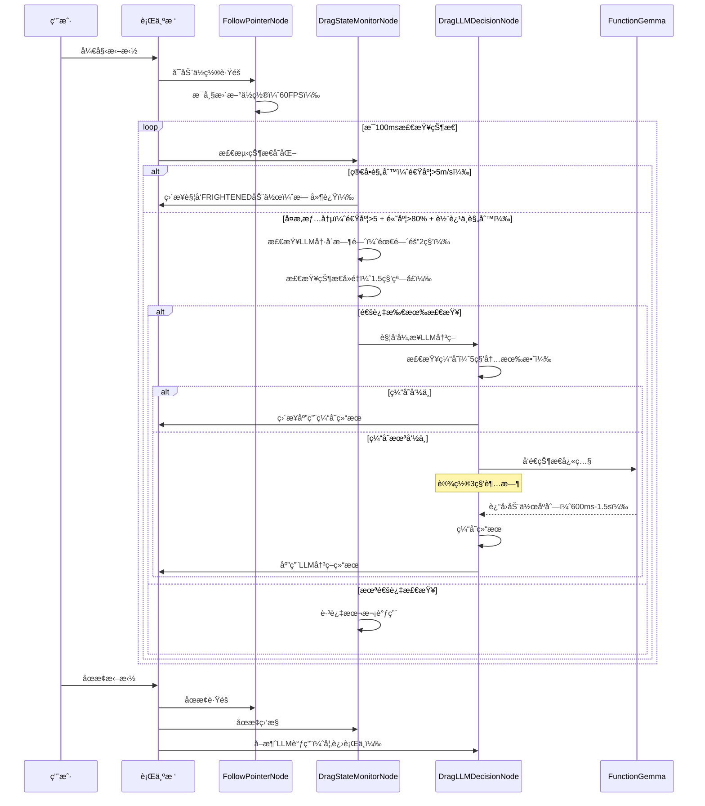

**关键优化点**：

1. **状æ€æ£€æµ‹é¢‘ç‡**：100ms（而é200ms），ä¿è¯å¿«é€Ÿå“应
2. **LLM调用冷å´**：至少间隔2秒，é¿å…在600ms-1.5så“应时间内é‡å¤è°ƒç”¨
3. **状æ€å»é‡**：1.5秒内的相åŒçŠ¶æ€ä¸é‡å¤è§¦å‘
4. **结æœç¼“å­˜**：5秒内相åŒçŠ¶æ€å¿«ç…§å¤ç”¨ç»“æœ
5. **超时é™çº§**：3秒超时å使用é™çº§ç­–略，ä¿è¯ç³»ç»Ÿå“应性

**关键设计点**：

1. **默认行为æŒç»­è¿è¡Œ**：`FollowPointerNode` 在拖拽期间æŒç»­æ›´æ–°ä½ç½®ï¼ˆ60FPS），ä¸å—其他决策影å“
2. **å¯é…置决策频ç‡**：ä¸åŒåœºæ™¯ä½¿ç”¨ä¸åŒçš„检测频ç‡å’ŒLLM调用间隔
3. **状æ€å˜åŒ–异步检测**：`DragStateMonitorNode` 按é…置频ç‡æ£€æŸ¥ï¼ˆæ‹–拽场景100ms），é¿å…过äºé¢‘ç¹
4. **LLM调用优化**：
   - **冷å´æœºåˆ¶**：至少间隔2秒，é¿å…在600ms-1.5så“应时间内é‡å¤è°ƒç”¨
   - **状æ€å»é‡**：1.5秒内的相åŒçŠ¶æ€ä¸é‡å¤è§¦å‘
   - **结æœç¼“å­˜**：5秒内相åŒçŠ¶æ€å¿«ç…§å¤ç”¨ç»“æœ
   - **超时é™çº§**：3秒超时å使用é™çº§ç­–ç•¥
5. **分层决策**：简å•è§„则BT层直æ¥å¤„ç†ï¼ˆæ— å»¶è¿Ÿï¼‰ï¼Œå¤æ‚情况异步调用LLM
6. **并行执行**：默认跟éšã€ç®€å•è§„则动作ã€LLM决策结æœå¯ä»¥å¹¶è¡Œåº”用
7. **资æºæ¸…ç†**：拖拽结æŸæ—¶ï¼Œè‡ªåŠ¨æ¸…ç†LLM调用状æ€å’Œè¶…时定时器

**性能指标**：

- **状æ€æ£€æµ‹å»¶è¿Ÿ**：100ms（拖拽场景）
- **简å•è§„则å“应**：< 1ms（BT层直æ¥å¤„ç†ï¼‰
- **LLM调用频ç‡**：最多æ¯2秒一次（拖拽场景）
- **LLMå“应时间**：600ms-1.5s（å®é™…）
- **超时ä¿æŠ¤**：3秒å自动é™çº§
- **缓存命中ç‡**：相åŒçŠ¶æ€åœ¨5秒内å¤ç”¨ï¼Œå‡å°‘LLM调用

这个设计å®ç°äº†**默认行为 + 异步状æ€æ£€æµ‹ + 分层决策 + 频ç‡ä¼˜åŒ–**的完整æµç¨‹ï¼Œæ—¢ä¿è¯äº†å®æ—¶æ€§ï¼Œåˆé€‚é…了LLM的秒级å“应特性，é¿å…了频ç¹è°ƒç”¨å’Œèµ„æºæµªè´¹ã€‚

#### 示例 1：温度感知系统

**场景**：用户开å¯ç©ºè°ƒï¼Œå®¤æ¸©ä» 25°C é™è‡³ 16°C

**æ•°æ®æµ**：
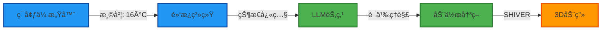

**输入 JSON**：
```json
{
  "temp": 16,
  "status": "aircon_on",
  "previous_temp": 25,
  "change_rate": -9
}
```

**LLM 输出**：
```json
{
  "action": "SHIVER",
  "expression": "COLD",
  "intensity": 0.8,
  "duration": 3.0
}
```

#### 示例 2：光照交互系统

**场景**：用户将ä¼é¹…拖动到虚拟阳光区域

**æ•°æ®æµ**：
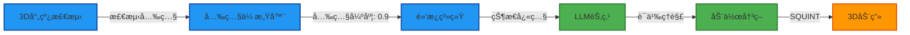

**输入 JSON**：
```json
{
  "light_intensity": 0.9,
  "area": "sunny",
  "position": [2.5, 0, 1.2],
  "exposure_time": 2.0
}
```

**LLM 输出**：
```json
{
  "action": "SQUINT",
  "view": "LOOK_UP",
  "expression": "UNCOMFORTABLE",
  "duration": 2.5
}
```

#### 示例 3：时段触å‘系统

**场景**：深夜 23:30，ä¼é¹…自动表ç°å‡ºå›°å€¦

**输入 JSON**：
```json
{
  "time": "23:30",
  "day_of_week": "Monday",
  "last_interaction": "2 hours ago"
}
```

**LLM 输出**：
```json
{
  "action": "YAWN",
  "state": "SLEEPY",
  "text": "好困啊...",
  "auto_trigger": true
}
```

### 2.2 物ç†äº¤äº’çš„"泛化解释"

ç›®å‰ç‚¹å‡»å’Œæ‹–拽是硬编ç çš„，未æ¥å¯ä»¥é€šè¿‡å¤§æ¨¡å‹è¿›è¡Œè¯­ä¹‰åŒ–解释。

#### 示例 1：拖拽轨迹语义化分æ

**场景 A：æ¶æ„拖拽（高速无规律）**

**轨迹数æ®é‡‡é›†**：
```typescript
{
  "trajectory": [
    { "t": 0, "x": 0, "y": 0, "z": 0 },
    { "t": 0.1, "x": 2.5, "y": 1.8, "z": -1.2 },
    { "t": 0.2, "x": -1.5, "y": 0.3, "z": 2.1 },
    { "t": 0.3, "x": 3.2, "y": -0.5, "z": -2.8 }
  ],
  "velocity_avg": 8.5,  // m/s
  "jitter_frequency": 12.3,  // Hz
  "acceleration_max": 15.2
}
```

**LLM 语义化解释**：
```json
{
  "intent": "MALICIOUS_DRAG",
  "emotion": "FRIGHTENED",
  "confidence": 0.92,
  "action": "STRUGGLE",
  "expression": "PANIC"
}
```

**场景 B：温柔抚摸（缓慢圆周è¿åŠ¨ï¼‰**

**轨迹数æ®é‡‡é›†**：
```typescript
{
  "trajectory": [
    { "t": 0, "x": 0, "y": 0, "z": 0 },
    { "t": 0.5, "x": 0.3, "y": 0.2, "z": 0.1 },
    { "t": 1.0, "x": 0.2, "y": 0.3, "z": -0.1 },
    { "t": 1.5, "x": 0.1, "y": 0.2, "z": 0.05 }
  ],
  "velocity_avg": 0.4,  // m/s
  "circular_pattern": true,
  "smoothness": 0.95
}
```

**LLM 语义化解释**：
```json
{
  "intent": "GENTLE_PET",
  "emotion": "COMFORTABLE",
  "confidence": 0.88,
  "action": "RELAX",
  "expression": "HAPPY"
}
```

**系统æ¶æ„**：
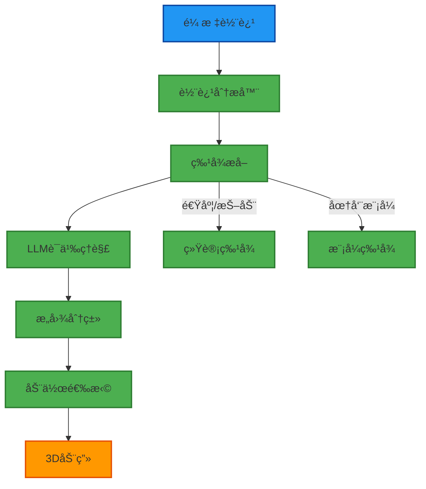

#### 示例 2：点击ä½ç½®è¯­ä¹‰åŒ–

**场景 A：点击头部**

**输入数æ®**：
```json
{
  "click_position": [0, 1.2, 0],
  "body_part": "head",
  "click_type": "single",
  "pressure": 0.5
}
```

**LLM 输出**：
```json
{
  "action": "NOD",
  "text": "嗯？æ€ä¹ˆäº†ï¼Ÿ",
  "expression": "CURIOUS",
  "social_feedback": "positive"
}
```

**场景 B：点击脚部**

**输入数æ®**：
```json
{
  "click_position": [0, -0.8, 0],
  "body_part": "foot",
  "click_type": "single",
  "pressure": 0.5
}
```

**LLM 输出**：
```json
{
  "action": "LOOK_DOWN",
  "text": "我的脚æ€ä¹ˆäº†ï¼Ÿ",
  "expression": "CONFUSED",
  "social_feedback": "neutral"
}
```

### 2.3 自主目标设定 (Autonomous Goal Setting)

引入"渴望"或"需求"系统（如饥饿值ã€å­¤ç‹¬å€¼ï¼‰ï¼Œè®©ä¼é¹…能够自å‘地产生行为。

#### 需求系统设计

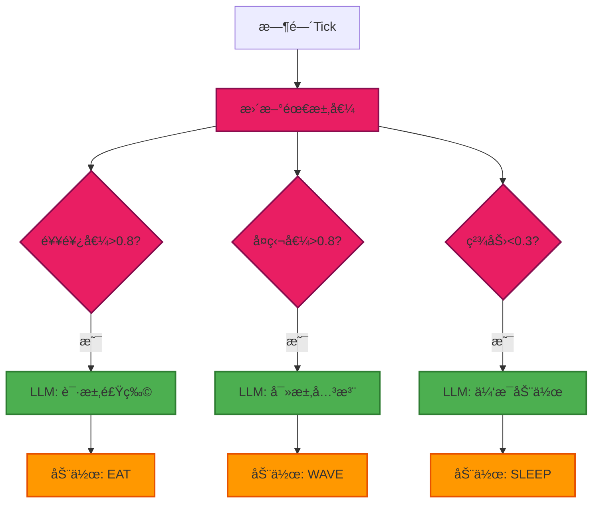

#### 示例：孤独值触å‘

**需求状æ€**：
```json
{
  "loneliness": 0.85,
  "last_interaction": "15 minutes ago",
  "interaction_count_today": 2,
  "time_of_day": "afternoon"
}
```

**LLM 自主决策**：
```json
{
  "trigger": "AUTONOMOUS",
  "need": "loneliness",
  "action": "WAVE",
  "text": "嘿，ç†ç†æˆ‘嘛...",
  "expression": "LONELY",
  "priority": "high"
}
```

**长期记忆集æˆ**：
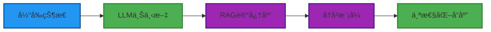

**记忆数æ®ç»“æ„**：
```json
{
  "user_interaction_history": [
    {
      "timestamp": "2025-12-30T10:30:00Z",
      "type": "text",
      "content": "é£èµ·æ¥",
      "response": "FLY",
      "user_satisfaction": "positive"
    },
    {
      "timestamp": "2025-12-30T14:20:00Z",
      "type": "drag",
      "intent": "gentle",
      "response": "RELAX",
      "user_satisfaction": "positive"
    }
  ],
  "preferences": {
    "favorite_actions": ["FLY", "DANCE"],
    "disliked_actions": ["SAD"],
    "interaction_style": "playful"
  }
}
```

## 3. 技术演进路径

### 3.1 演进时间线


### 3.2 阶段详细说æ˜

| 阶段 | 目标 | 核心技术 | 示例å®ç° |
| :--- | :--- | :--- | :--- |
| **阶段 1 (当å‰)** | åŠ¨ä½œå¾®è°ƒä¸ BT é›†æˆ | 文本 -> 动作映射, 确定性 BT 分支 | `LLMCallNode` + `FunctionExecNode` |
| **阶段 2 (近期)** | ç¯å¢ƒå‚数注入 | å°†ç¯å¢ƒ JSON 拼æ¥åˆ° Prompt, å¢åŠ ç¯å¢ƒ Condition | `EnvironmentCondition` + `ContextInjectNode` |
| **阶段 3 (中期)** | 多模æ€è¾“入解æ | 轨迹分æ算法 -> æ„图标签 -> LLM 决策 | `TrajectoryAnalyzer` + `IntentClassifier` |
| **阶段 4 (远期)** | 自主æ„识系统 | 长期记忆 (RAG), éœ€æ±‚é©±åŠ¨çš„è‡ªå‘ Tick 调用 | `MemoryNode` + `AutonomousGoalNode` |

### 3.3 阶段 2 å®ç°ç¤ºä¾‹ï¼šç¯å¢ƒå‚数注入

**æ–°å¢èŠ‚点**：`EnvironmentCondition`

```typescript
// services/bt/conditions/EnvironmentCondition.ts
export default class EnvironmentCondition extends Condition {
  tick(tick: Tick): number {
    const env = tick.blackboard.get('environment');
    const threshold = this.properties.threshold;
    
    // 检查ç¯å¢ƒå‚数是å¦æ»¡è¶³æ¡ä»¶
    if (env.temp < threshold.temp_min) {
      return SUCCESS; // 触å‘"冷"相关行为
    }
    
    return FAILURE;
  }
}
```

**行为树集æˆ**：
```typescript
new Priority({
  children: [
    // ... 其他分支
    new Sequence({
      children: [
        new EnvironmentCondition({ 
          threshold: { temp_min: 18 } 
        }),
        new LLMCallNode({ 
          context: 'environment' // 注入ç¯å¢ƒä¸Šä¸‹æ–‡
        })
      ]
    })
  ]
});
```

### 3.4 阶段 3 å®ç°ç¤ºä¾‹ï¼šè½¨è¿¹åˆ†æ

**轨迹分æ器**：
```typescript
// services/trajectory/TrajectoryAnalyzer.ts
export class TrajectoryAnalyzer {
  analyze(trajectory: Point[]): TrajectoryFeatures {
    return {
      velocity_avg: this.calculateAvgVelocity(trajectory),
      jitter_frequency: this.calculateJitter(trajectory),
      circular_pattern: this.detectCircularPattern(trajectory),
      smoothness: this.calculateSmoothness(trajectory)
    };
  }
}
```

**æ„图分类节点**：
```typescript
// services/bt/actions/IntentClassifierNode.ts
export default class IntentClassifierNode extends Action {
  tick(tick: Tick): number {
    const trajectory = tick.blackboard.get('currentTrajectory');
    const features = this.analyzer.analyze(trajectory);
    
    // 调用 LLM 进行语义化解释
    const intent = await this.llm.classifyIntent(features);
    
    tick.blackboard.set('detectedIntent', intent);
    return SUCCESS;
  }
}
```

### 3.5 阶段 4 å®ç°ç¤ºä¾‹ï¼šè‡ªä¸»ç›®æ ‡ç³»ç»Ÿ

**需求更新节点**：
```typescript
// services/bt/actions/UpdateNeedsNode.ts
export default class UpdateNeedsNode extends Action {
  tick(tick: Tick): number {
    const timeSinceLastInteraction = 
      Date.now() - tick.blackboard.get('lastInteractionTime');
    
    // 更新孤独值
    const loneliness = Math.min(1.0, 
      timeSinceLastInteraction / (15 * 60 * 1000) // 15分钟达到最大值
    );
    
    tick.blackboard.set('loneliness', loneliness);
    
    if (loneliness > 0.8) {
      tick.blackboard.set('autonomousTrigger', 'loneliness');
    }
    
    return SUCCESS;
  }
}
```

**自主行为触å‘**：
```typescript
new Priority({
  children: [
    // ... 其他分支
    new Sequence({
      children: [
        new CheckBlackboardCondition({ 
          key: 'autonomousTrigger', 
          value: 'loneliness' 
        }),
        new LLMCallNode({ 
          context: 'autonomous',
          prompt: "I feel lonely, what should I do?"
        })
      ]
    })
  ]
});
```

## 4. 系统æ¶æ„设计

### 4.1 分层决策æ¶æ„

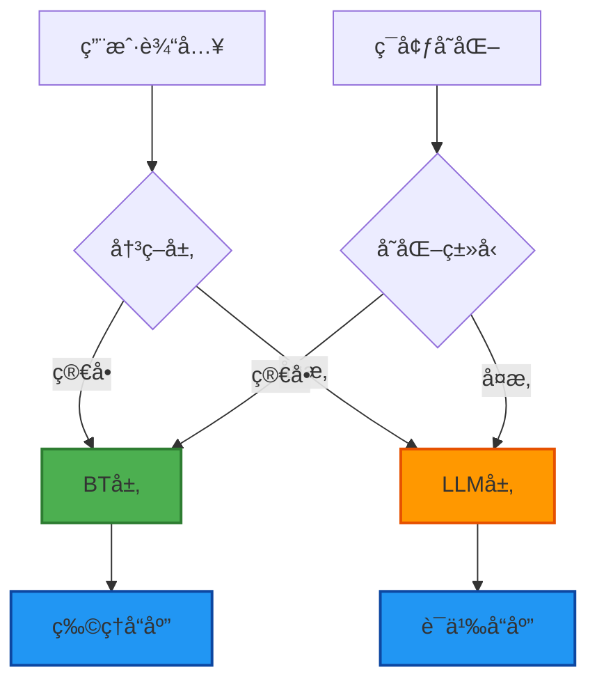

**分层åŸåˆ™**：
- **BT 层**：处ç†ç¡®å®šæ€§ç‰©ç†å馈（ä½ç§»ã€åŸºç¡€åŠ¨ç”»ï¼‰
- **LLM 层**：处ç†éœ€è¦è¯­ä¹‰ç†è§£çš„决策（情感ã€æ„图ã€ä¸Šä¸‹æ–‡ï¼‰

### 4.2 æ¨ç†ç¼“存机制

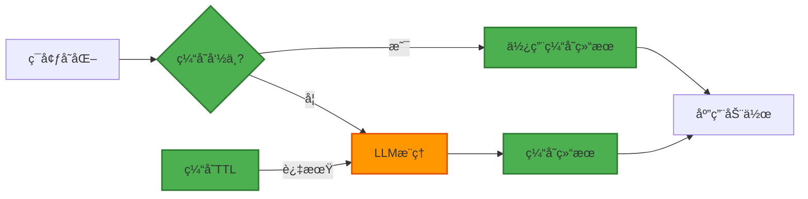

**缓存策略示例**：
```typescript
// services/cache/LLMCache.ts
export class LLMCache {
  private cache = new Map<string, CacheEntry>();
  
  get(key: string): CacheEntry | null {
    const entry = this.cache.get(key);
    if (entry && Date.now() - entry.timestamp < entry.ttl) {
      return entry;
    }
    return null;
  }
  
  set(key: string, value: any, ttl: number = 30000): void {
    this.cache.set(key, {
      value,
      timestamp: Date.now(),
      ttl
    });
  }
}

// 使用示例
const cacheKey = `env_${env.temp}_${env.light}`;
const cached = cache.get(cacheKey);
if (cached) {
  return cached.value; // 30秒内å¤ç”¨ç»“æœ
}
```

### 4.3 模å‹é€‰æ‹©ç­–ç•¥

**FunctionGemma 优势**：
- è½»é‡çº§ï¼Œé€‚åˆå®æ—¶æ¨ç†
- 专精äº"çŠ¶æ€ -> 动作"映射
- 无需åºå¤§ä¸–界知识库
- å¯æœ¬åœ°éƒ¨ç½²ï¼Œä½å»¶è¿Ÿ

**æ¶æ„建议**：
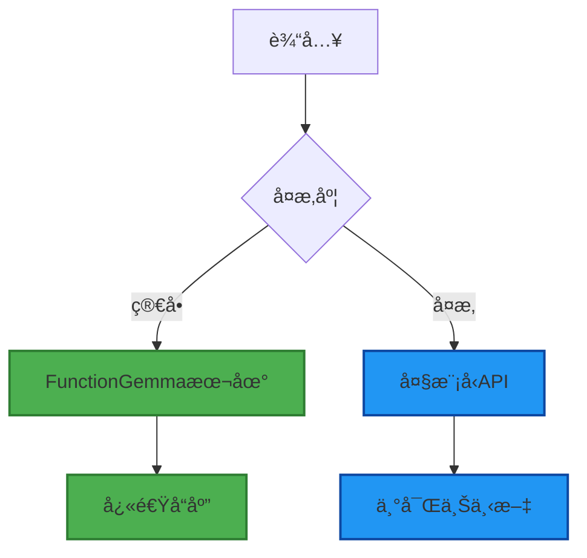

## 5. é¢å‘ FunctionGemma (270M) çš„æ•°æ®é›†è®¾è®¡

针对é语言指令场景（拖拽ã€ç¯å¢ƒæ„ŸçŸ¥ã€è‡ªä¸»è¡Œä¸ºï¼‰ï¼Œæˆ‘们需è¦è®¾è®¡å…¨æ–°çš„æ•°æ®é›†æ ¼å¼ã€‚FunctionGemma 270M 是一个轻é‡çº§æ¨¡å‹ï¼ˆ0.3B å‚数），需è¦**高纯度ã€å¼ºæ ¼å¼çº¦æŸ**的训练数æ®ã€‚

### 5.1 æ•°æ®é›†è®¾è®¡åŸåˆ™

#### 5.1.1 ä»"文本指令"到"状æ€å¿«ç…§"的转å˜

**传统文本指令数æ®é›†**（当å‰æ ¼å¼ï¼‰ï¼š
```json
{
  "messages": [
    {"role": "developer", "content": "You are a model that can do function calling with the following functions\n"},
    {"role": "user", "content": "你能开心å—？"},
    {"role": "assistant", "tool_calls": [{"type": "function", "function": {"name": "animate_avatar", "arguments": {"actions": ["HAPPY"]}}}]}
  ]
}
```

**é语言指令数æ®é›†**（新格å¼ï¼‰ï¼š
```json
{
  "messages": [
    {"role": "developer", "content": "You are a model that performs function calling based on virtual pet state snapshots."},
    {"role": "user", "content": "STATE_SNAPSHOT: {\"type\":\"drag\",\"speed\":6.2,\"height\":85,\"traj\":\"unstable\"}"},
    {"role": "assistant", "tool_calls": [{"type": "function", "function": {"name": "animate_avatar", "arguments": {"actions": ["STRUGGLE", "SAD"]}}}]}
  ]
}
```

**关键å˜åŒ–**：
- `user` 角色的内容ä»è‡ªç„¶è¯­è¨€å˜ä¸º**结æ„化的状æ€å¿«ç…§ JSON**
- 模å‹éœ€è¦å­¦ä¹ å°†ç‰©ç†å‚数（速度ã€é«˜åº¦ã€è½¨è¿¹ï¼‰æ˜ å°„到情感动作（挣æ‰ã€æ‚²ä¼¤ï¼‰

#### 5.1.2 FunctionGemma 270M 的特殊è¦æ±‚

æ ¹æ® README，FunctionGemma 270M 有以下特点：
- **必须使用 Developer Role**：`{"role": "developer", "content": "You are a model that can do function calling..."}`
- **上下文窗å£**：32K tokens（但 270M 模å‹å®é™…有效上下文更短，建议æ§åˆ¶åœ¨ 512-1024 tokens）
- **专精äºå·¥å…·è°ƒç”¨**：ä¸éœ€è¦åºå¤§çš„世界知识，åªéœ€ç²¾é€š"çŠ¶æ€ -> 动作"映射
- **需è¦å¾®è°ƒ**：Base 模å‹åœ¨ç‰¹å®šä»»åŠ¡ä¸Šå‡†ç¡®ç‡çº¦ 58%，微调åå¯æå‡è‡³ 85%+

### 5.2 æ•°æ®é›†æ ¼å¼è®¾è®¡

#### 5.2.1 拖拽交互数æ®é›†

**场景 1：æ¶æ„拖拽（高速+ä¸è§„则+高度>80%）**

```json
{
  "metadata": "train",
  "tools": [{
    "type": "function",
    "function": {
      "name": "animate_avatar",
      "description": "Controls the 3D penguin avatar to perform a sequence of actions on stage.",
      "parameters": {
        "type": "OBJECT",
        "properties": {
          "actions": {
            "type": "ARRAY",
            "description": "An ordered list of actions for the avatar to perform.",
            "items": {
              "type": "STRING",
              "enum": ["IDLE", "WALK", "RUN", "JUMP", "WAVE", "DANCE", "SPIN", "SHIVER", "SLEEP", "BOW", "NO", "YES", "EAT", "SURPRISE", "ANGRY", "SAD", "HAPPY", "LOOK_LEFT", "LOOK_RIGHT", "ROLL", "BACKFLIP", "CLAP", "THINK", "SIT", "FIGHT", "SWIM", "DAZZLE", "HIDE", "PEEK", "LOVE", "FLY", "RUN_ACROSS", "SLIDE", "STRUGGLE", "FRIGHTENED", "SCARED", "PANIC"]
            }
          }
        },
        "required": ["actions"]
      }
    }
  }],
  "messages": [
    {
      "role": "developer",
      "content": "You are a model that performs function calling based on virtual pet state snapshots. Analyze the drag interaction parameters and output appropriate emotional reactions."
    },
    {
      "role": "user",
      "content": "DRAG_SNAPSHOT: {\"type\":\"drag\",\"speed\":6.5,\"height\":85,\"traj\":\"unstable\",\"dir\":\"up_right\",\"state\":{\"expr\":\"neutral\",\"act\":\"idle\"}}"
    },
    {
      "role": "assistant",
      "tool_calls": [{
        "type": "function",
        "function": {
          "name": "animate_avatar",
          "arguments": {
            "actions": ["STRUGGLE", "FRIGHTENED"]
          }
        }
      }]
    }
  ]
}
```

**场景 2：温柔抚摸（缓慢+圆周è¿åŠ¨ï¼‰**

```json
{
  "metadata": "train",
  "tools": [{"type": "function", "function": {"name": "animate_avatar", ...}}],
  "messages": [
    {
      "role": "developer",
      "content": "You are a model that performs function calling based on virtual pet state snapshots. Analyze the drag interaction parameters and output appropriate emotional reactions."
    },
    {
      "role": "user",
      "content": "DRAG_SNAPSHOT: {\"type\":\"drag\",\"speed\":0.4,\"height\":45,\"traj\":\"circular\",\"dir\":\"gentle\",\"state\":{\"expr\":\"neutral\",\"act\":\"idle\"}}"
    },
    {
      "role": "assistant",
      "tool_calls": [{
        "type": "function",
        "function": {
          "name": "animate_avatar",
          "arguments": {
            "actions": ["HAPPY", "LOVE"]
          }
        }
      }]
    }
  ]
}
```

**场景 3：正常拖拽（ä¸è§¦å‘特殊å应）**

```json
{
  "metadata": "train",
  "tools": [{"type": "function", "function": {"name": "animate_avatar", ...}}],
  "messages": [
    {
      "role": "developer",
      "content": "You are a model that performs function calling based on virtual pet state snapshots. Analyze the drag interaction parameters and output appropriate emotional reactions."
    },
    {
      "role": "user",
      "content": "DRAG_SNAPSHOT: {\"type\":\"drag\",\"speed\":2.1,\"height\":50,\"traj\":\"smooth\",\"dir\":\"forward\",\"state\":{\"expr\":\"neutral\",\"act\":\"idle\"}}"
    },
    {
      "role": "assistant",
      "tool_calls": [{
        "type": "function",
        "function": {
          "name": "animate_avatar",
          "arguments": {
            "actions": ["IDLE"]
          }
        }
      }]
    }
  ]
}
```

#### 5.2.2 ç¯å¢ƒæ„ŸçŸ¥æ•°æ®é›†

**场景：温度感知（室温é™ä½ï¼‰**

```json
{
  "metadata": "train",
  "tools": [{"type": "function", "function": {"name": "animate_avatar", ...}}],
  "messages": [
    {
      "role": "developer",
      "content": "You are a model that performs function calling based on virtual pet state snapshots. Analyze environmental changes and output appropriate reactions."
    },
    {
      "role": "user",
      "content": "ENV_SNAPSHOT: {\"type\":\"temperature\",\"temp\":16,\"prev_temp\":25,\"change\":-9,\"aircon\":true,\"state\":{\"expr\":\"neutral\",\"act\":\"idle\"}}"
    },
    {
      "role": "assistant",
      "tool_calls": [{
        "type": "function",
        "function": {
          "name": "animate_avatar",
          "arguments": {
            "actions": ["SHIVER", "SAD"]
          }
        }
      }]
    }
  ]
}
```

**场景：光照交互（移动到阳光区域）**

```json
{
  "metadata": "train",
  "tools": [{"type": "function", "function": {"name": "animate_avatar", ...}}],
  "messages": [
    {
      "role": "developer",
      "content": "You are a model that performs function calling based on virtual pet state snapshots. Analyze environmental changes and output appropriate reactions."
    },
    {
      "role": "user",
      "content": "ENV_SNAPSHOT: {\"type\":\"light\",\"intensity\":0.9,\"area\":\"sunny\",\"pos\":[2.5,0,1.2],\"exposure\":2.0,\"state\":{\"expr\":\"neutral\",\"act\":\"idle\"}}"
    },
    {
      "role": "assistant",
      "tool_calls": [{
        "type": "function",
        "function": {
          "name": "animate_avatar",
          "arguments": {
            "actions": ["LOOK_LEFT", "LOOK_RIGHT"]
          }
        }
      }]
    }
  ]
}
```

#### 5.2.3 自主行为数æ®é›†

**场景：孤独值触å‘**

```json
{
  "metadata": "train",
  "tools": [{"type": "function", "function": {"name": "animate_avatar", ...}}],
  "messages": [
    {
      "role": "developer",
      "content": "You are a model that performs function calling based on virtual pet state snapshots. Analyze the pet's internal needs and output appropriate autonomous behaviors."
    },
    {
      "role": "user",
      "content": "AUTONOMOUS_SNAPSHOT: {\"type\":\"loneliness\",\"value\":0.85,\"last_interaction\":900,\"count_today\":2,\"time\":\"afternoon\",\"state\":{\"expr\":\"neutral\",\"act\":\"idle\"}}"
    },
    {
      "role": "assistant",
      "tool_calls": [{
        "type": "function",
        "function": {
          "name": "animate_avatar",
          "arguments": {
            "actions": ["WAVE", "HAPPY"]
          }
        }
      }]
    }
  ]
}
```

### 5.3 Token 效ç‡ä¼˜åŒ–（针对 270M 模å‹ï¼‰

ç”±äº FunctionGemma 270M 的上下文窗å£å’Œå‚æ•°é‡æœ‰é™ï¼ŒçŠ¶æ€å¿«ç…§éœ€è¦**紧凑化**：

#### 5.3.1 é”®å缩写策略

**完整格å¼**（ä¸æ¨è，Token 过多）：
```json
{
  "trigger_type": "drag_interaction",
  "context": {
    "drag_params": {
      "speed": 6.2,
      "screen_height_percent": 85,
      "trajectory": "unstable",
      "direction": "up_right"
    },
    "current_state": {
      "expression": "neutral",
      "action": "idle",
      "view_direction": "forward"
    }
  }
}
```

**紧凑格å¼**（æ¨èï¼ŒèŠ‚çœ Token）：
```json
{
  "t": "drag",
  "dp": {
    "s": 6.2,
    "h": 85,
    "tr": "unstable",
    "d": "up_right"
  },
  "st": {
    "e": "neutral",
    "a": "idle"
  }
}
```

**æƒè¡¡**：虽然å¯è¯»æ€§é™ä½ï¼Œä½†å¯¹äº 270M 模å‹ï¼ŒToken 效ç‡æ›´é‡è¦ã€‚å¯ä»¥åœ¨è®­ç»ƒæ—¶ä½¿ç”¨ç´§å‡‘æ ¼å¼ï¼Œæ¨ç†æ—¶å†å±•å¼€ã€‚

#### 5.3.2 数值精度æ§åˆ¶

- **速度**：ä¿ç•™ 1 ä½å°æ•°ï¼ˆ`6.2` 而é `6.234567`）
- **高度百分比**：整数（`85` 而é `85.3`）
- **时间戳**：相对时间（秒），而éç»å¯¹æ—¶é—´æˆ³

### 5.4 æ•°æ®é›†è§„模建议

针对 FunctionGemma 270M，建议的数æ®é›†è§„模：

| åœºæ™¯ç±»å‹ | 训练样本数 | 验è¯æ ·æœ¬æ•° | è¯´æ˜ |
|---------|----------|----------|------|
| **拖拽交互** | 2000-3000 | 200-300 | 覆盖å„ç§é€Ÿåº¦ã€é«˜åº¦ã€è½¨è¿¹ç»„åˆ |
| **ç¯å¢ƒæ„ŸçŸ¥** | 1000-1500 | 100-150 | 温度ã€å…‰ç…§ã€æ—¶æ®µç­‰å˜åŒ– |
| **自主行为** | 500-800 | 50-80 | 饥饿ã€å­¤ç‹¬ã€ç²¾åŠ›ç­‰éœ€æ±‚è§¦å‘ |
| **负样本** | 500-800 | 50-80 | 正常状æ€ä¸è§¦å‘特殊å应 |
| **总计** | 4000-6100 | 400-610 | 约 5K 样本足够微调 270M æ¨¡å‹ |

**负样本的é‡è¦æ€§**：
- 防止模å‹è¿‡æ‹Ÿåˆï¼Œå¯¼è‡´ä¼é¹…å˜æˆ"惊弓之鸟"
- 正常拖拽ã€æ­£å¸¸ç¯å¢ƒå˜åŒ–时，应该ä¿æŒ IDLE 或轻微å应

### 5.5 æ•°æ®å¢å¼ºç­–ç•¥

#### 5.5.1 å‚数扰动

对åŒä¸€åœºæ™¯çš„å‚数进行å°å¹…扰动，生æˆæ›´å¤šæ ·æœ¬ï¼š

```python
# åŸå§‹æ ·æœ¬
{"speed": 6.2, "height": 85, "traj": "unstable"}

# å¢å¼ºæ ·æœ¬
{"speed": 6.0, "height": 84, "traj": "unstable"}  # 速度-0.2, 高度-1
{"speed": 6.4, "height": 86, "traj": "unstable"}  # 速度+0.2, 高度+1
{"speed": 5.8, "height": 83, "traj": "unstable"}  # 速度-0.4, 高度-2
```

#### 5.5.2 组åˆå˜åŒ–

å°†ä¸åŒçš„状æ€å˜åŒ–组åˆï¼Œç”Ÿæˆå¤æ‚场景：

```python
# 基础场景
场景A: 高速拖拽 → STRUGGLE
场景B: 高度>80% → SCARED

# 组åˆåœºæ™¯
场景C: 高速 + 高度>80% → STRUGGLE + SCARED (更强烈的å应)
```

### 5.6 完整数æ®é›†ç¤ºä¾‹

**文件结æ„**：
```
EdgeAI/FINETUNE/datasets/
├── pet_actions_single_turn_2000.jsonl      # ç°æœ‰ï¼šæ–‡æœ¬æŒ‡ä»¤æ•°æ®é›†
├── pet_actions_multi_turn.jsonl            # ç°æœ‰ï¼šå¤šè½®å¯¹è¯æ•°æ®é›†
├── pet_drag_interaction.jsonl               # æ–°å¢ï¼šæ‹–拽交互数æ®é›†
├── pet_environment_sensing.jsonl           # æ–°å¢ï¼šç¯å¢ƒæ„ŸçŸ¥æ•°æ®é›†
└── pet_autonomous_behavior.jsonl            # æ–°å¢ï¼šè‡ªä¸»è¡Œä¸ºæ•°æ®é›†
```

**pet_drag_interaction.jsonl 示例**ï¼ˆå‰ 5 æ¡ï¼‰ï¼š

```jsonl
{"metadata": "train", "tools": [{"type": "function", "function": {"name": "animate_avatar", "description": "Controls the 3D penguin avatar to perform a sequence of actions on stage.", "parameters": {"type": "OBJECT", "properties": {"actions": {"type": "ARRAY", "description": "An ordered list of actions for the avatar to perform.", "items": {"type": "STRING", "enum": ["IDLE", "WALK", "RUN", "JUMP", "WAVE", "DANCE", "SPIN", "SHIVER", "SLEEP", "BOW", "NO", "YES", "EAT", "SURPRISE", "ANGRY", "SAD", "HAPPY", "LOOK_LEFT", "LOOK_RIGHT", "ROLL", "BACKFLIP", "CLAP", "THINK", "SIT", "FIGHT", "SWIM", "DAZZLE", "HIDE", "PEEK", "LOVE", "FLY", "RUN_ACROSS", "SLIDE", "STRUGGLE", "FRIGHTENED", "SCARED", "PANIC"]}}}, "required": ["actions"]}}}], "messages": [{"role": "developer", "content": "You are a model that performs function calling based on virtual pet state snapshots. Analyze the drag interaction parameters and output appropriate emotional reactions."}, {"role": "user", "content": "DRAG_SNAPSHOT: {\"t\":\"drag\",\"dp\":{\"s\":6.5,\"h\":85,\"tr\":\"unstable\",\"d\":\"up_right\"},\"st\":{\"e\":\"neutral\",\"a\":\"idle\"}}"}, {"role": "assistant", "tool_calls": [{"type": "function", "function": {"name": "animate_avatar", "arguments": {"actions": ["STRUGGLE", "FRIGHTENED"]}}}]}]}
{"metadata": "train", "tools": [{"type": "function", "function": {"name": "animate_avatar", "description": "Controls the 3D penguin avatar to perform a sequence of actions on stage.", "parameters": {"type": "OBJECT", "properties": {"actions": {"type": "ARRAY", "description": "An ordered list of actions for the avatar to perform.", "items": {"type": "STRING", "enum": ["IDLE", "WALK", "RUN", "JUMP", "WAVE", "DANCE", "SPIN", "SHIVER", "SLEEP", "BOW", "NO", "YES", "EAT", "SURPRISE", "ANGRY", "SAD", "HAPPY", "LOOK_LEFT", "LOOK_RIGHT", "ROLL", "BACKFLIP", "CLAP", "THINK", "SIT", "FIGHT", "SWIM", "DAZZLE", "HIDE", "PEEK", "LOVE", "FLY", "RUN_ACROSS", "SLIDE", "STRUGGLE", "FRIGHTENED", "SCARED", "PANIC"]}}}, "required": ["actions"]}}}], "messages": [{"role": "developer", "content": "You are a model that performs function calling based on virtual pet state snapshots. Analyze the drag interaction parameters and output appropriate emotional reactions."}, {"role": "user", "content": "DRAG_SNAPSHOT: {\"t\":\"drag\",\"dp\":{\"s\":0.4,\"h\":45,\"tr\":\"circular\",\"d\":\"gentle\"},\"st\":{\"e\":\"neutral\",\"a\":\"idle\"}}"}, {"role": "assistant", "tool_calls": [{"type": "function", "function": {"name": "animate_avatar", "arguments": {"actions": ["HAPPY", "LOVE"]}}}]}]}
{"metadata": "train", "tools": [{"type": "function", "function": {"name": "animate_avatar", "description": "Controls the 3D penguin avatar to perform a sequence of actions on stage.", "parameters": {"type": "OBJECT", "properties": {"actions": {"type": "ARRAY", "description": "An ordered list of actions for the avatar to perform.", "items": {"type": "STRING", "enum": ["IDLE", "WALK", "RUN", "JUMP", "WAVE", "DANCE", "SPIN", "SHIVER", "SLEEP", "BOW", "NO", "YES", "EAT", "SURPRISE", "ANGRY", "SAD", "HAPPY", "LOOK_LEFT", "LOOK_RIGHT", "ROLL", "BACKFLIP", "CLAP", "THINK", "SIT", "FIGHT", "SWIM", "DAZZLE", "HIDE", "PEEK", "LOVE", "FLY", "RUN_ACROSS", "SLIDE", "STRUGGLE", "FRIGHTENED", "SCARED", "PANIC"]}}}, "required": ["actions"]}}}], "messages": [{"role": "developer", "content": "You are a model that performs function calling based on virtual pet state snapshots. Analyze the drag interaction parameters and output appropriate emotional reactions."}, {"role": "user", "content": "DRAG_SNAPSHOT: {\"t\":\"drag\",\"dp\":{\"s\":2.1,\"h\":50,\"tr\":\"smooth\",\"d\":\"forward\"},\"st\":{\"e\":\"neutral\",\"a\":\"idle\"}}"}, {"role": "assistant", "tool_calls": [{"type": "function", "function": {"name": "animate_avatar", "arguments": {"actions": ["IDLE"]}}}]}]}
{"metadata": "train", "tools": [{"type": "function", "function": {"name": "animate_avatar", "description": "Controls the 3D penguin avatar to perform a sequence of actions on stage.", "parameters": {"type": "OBJECT", "properties": {"actions": {"type": "ARRAY", "description": "An ordered list of actions for the avatar to perform.", "items": {"type": "STRING", "enum": ["IDLE", "WALK", "RUN", "JUMP", "WAVE", "DANCE", "SPIN", "SHIVER", "SLEEP", "BOW", "NO", "YES", "EAT", "SURPRISE", "ANGRY", "SAD", "HAPPY", "LOOK_LEFT", "LOOK_RIGHT", "ROLL", "BACKFLIP", "CLAP", "THINK", "SIT", "FIGHT", "SWIM", "DAZZLE", "HIDE", "PEEK", "LOVE", "FLY", "RUN_ACROSS", "SLIDE", "STRUGGLE", "FRIGHTENED", "SCARED", "PANIC"]}}}, "required": ["actions"]}}}], "messages": [{"role": "developer", "content": "You are a model that performs function calling based on virtual pet state snapshots. Analyze the drag interaction parameters and output appropriate emotional reactions."}, {"role": "user", "content": "DRAG_SNAPSHOT: {\"t\":\"drag\",\"dp\":{\"s\":8.2,\"h\":90,\"tr\":\"unstable\",\"d\":\"down_left\"},\"st\":{\"e\":\"neutral\",\"a\":\"idle\"}}"}, {"role": "assistant", "tool_calls": [{"type": "function", "function": {"name": "animate_avatar", "arguments": {"actions": ["PANIC", "STRUGGLE", "SCARED"]}}}]}]}
{"metadata": "train", "tools": [{"type": "function", "function": {"name": "animate_avatar", "description": "Controls the 3D penguin avatar to perform a sequence of actions on stage.", "parameters": {"type": "OBJECT", "properties": {"actions": {"type": "ARRAY", "description": "An ordered list of actions for the avatar to perform.", "items": {"type": "STRING", "enum": ["IDLE", "WALK", "RUN", "JUMP", "WAVE", "DANCE", "SPIN", "SHIVER", "SLEEP", "BOW", "NO", "YES", "EAT", "SURPRISE", "ANGRY", "SAD", "HAPPY", "LOOK_LEFT", "LOOK_RIGHT", "ROLL", "BACKFLIP", "CLAP", "THINK", "SIT", "FIGHT", "SWIM", "DAZZLE", "HIDE", "PEEK", "LOVE", "FLY", "RUN_ACROSS", "SLIDE", "STRUGGLE", "FRIGHTENED", "SCARED", "PANIC"]}}}, "required": ["actions"]}}}], "messages": [{"role": "developer", "content": "You are a model that performs function calling based on virtual pet state snapshots. Analyze the drag interaction parameters and output appropriate emotional reactions."}, {"role": "user", "content": "DRAG_SNAPSHOT: {\"t\":\"drag\",\"dp\":{\"s\":1.5,\"h\":40,\"tr\":\"circular\",\"d\":\"gentle\"},\"st\":{\"e\":\"neutral\",\"a\":\"idle\"}}"}, {"role": "assistant", "tool_calls": [{"type": "function", "function": {"name": "animate_avatar", "arguments": {"actions": ["HAPPY"]}}}]}]}
```

### 5.7 训练数æ®ç”Ÿæˆæµç¨‹

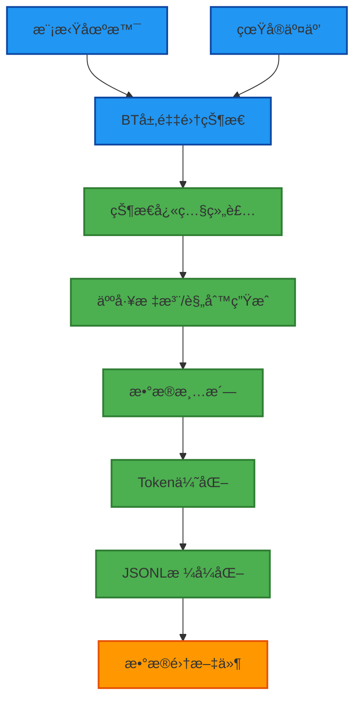

**æ•°æ®ç”Ÿæˆæ­¥éª¤**：

1. **场景模拟**：在 BT 层模拟å„ç§æ‹–拽ã€ç¯å¢ƒå˜åŒ–场景，采集状æ€å¿«ç…§
2. **规则标注**：根æ®è®¾è®¡è§„则（速度>5m/s → å—惊）自动生æˆæ ‡ç­¾
3. **人工校验**：对å¤æ‚场景进行人工校验，确ä¿åŠ¨ä½œåºåˆ—åˆç†
4. **æ•°æ®æ¸…æ´—**：å»é™¤å¼‚常值ã€é‡å¤æ ·æœ¬
5. **Token 优化**：将完整 JSON å‹ç¼©ä¸ºç´§å‡‘æ ¼å¼
6. **æ ¼å¼è½¬æ¢**：转æ¢ä¸º FunctionGemma è¦æ±‚çš„ JSONL æ ¼å¼

### 5.8 ä¸ç°æœ‰æ•°æ®é›†çš„èåˆ

**æ··åˆè®­ç»ƒç­–ç•¥**：

```python
# 训练时混åˆä½¿ç”¨
train_data = [
    pet_actions_single_turn_2000.jsonl,      # 文本指令（ä¿æŒç°æœ‰èƒ½åŠ›ï¼‰
    pet_drag_interaction.jsonl,              # 拖拽交互（新å¢èƒ½åŠ›ï¼‰
    pet_environment_sensing.jsonl,          # ç¯å¢ƒæ„ŸçŸ¥ï¼ˆæ–°å¢èƒ½åŠ›ï¼‰
    pet_autonomous_behavior.jsonl            # 自主行为（新å¢èƒ½åŠ›ï¼‰
]

# 比例建议
# 文本指令：é语言指令 = 6:4 或 7:3
# ç¡®ä¿æ¨¡å‹ä¸ä¼šå¿˜è®°åŸæœ‰çš„文本ç†è§£èƒ½åŠ›
```

### 5.9 评估指标

针对é语言指令场景，需è¦è®¾è®¡ä¸“门的评估指标：

1. **准确ç‡**：状æ€å¿«ç…§ → 动作åºåˆ—的匹é…准确ç‡
2. **å“应åˆç†æ€§**：人工评估动作åºåˆ—是å¦ç¬¦åˆç‰©ç†ç›´è§‰ï¼ˆé«˜é€Ÿæ‹–拽 → å—惊）
3. **负样本准确ç‡**：正常状æ€ä¸è§¦å‘特殊å应的比例
4. **Token 效ç‡**：平å‡æ¯ä¸ªçŠ¶æ€å¿«ç…§çš„ Token æ•°é‡

### 5.10 总结

针对 FunctionGemma 270M çš„æ•°æ®é›†è®¾è®¡è¦ç‚¹ï¼š

1. **æ ¼å¼è½¬å˜**：ä»è‡ªç„¶è¯­è¨€åˆ°ç»“æ„化状æ€å¿«ç…§
2. **Token 优化**：使用紧凑的 JSON æ ¼å¼ï¼ŒèŠ‚çœä¸Šä¸‹æ–‡
3. **负样本平衡**：防止模å‹è¿‡æ‹Ÿåˆï¼Œä¿æŒæ­£å¸¸è¡Œä¸ºçš„判断力
4. **规模适中**：4K-6K 样本足够微调 270M 模å‹
5. **æ··åˆè®­ç»ƒ**：ä¸ç°æœ‰æ–‡æœ¬æŒ‡ä»¤æ•°æ®é›†æ··åˆï¼Œä¿æŒå¤šæ¨¡æ€èƒ½åŠ›

## 6. åˆç†åŒ–建议 (é画蛇添足)

1. **分层决策**：简å•çš„物ç†å馈（如æèµ·ç¬é—´çš„ä½ç§»ï¼‰ä¿æŒåœ¨ BT çš„ TypeScript 层，åªæœ‰éœ€è¦"决定æ€åº¦"的时候æ‰è°ƒç”¨ LLM。
   - **示例**：拖拽时的ä½ç½®è·Ÿéš → BT 层
   - **示例**：判断拖拽是"æ¶æ„"还是"温柔" → LLM 层

2. **异步æ¨ç†ç¼“å­˜**：针对ç¯å¢ƒå˜åŒ–（如å˜å†·ï¼‰ï¼ŒLLM æ¨ç†ä¸€æ¬¡å结æœå¯ä¿æŒä¸€æ®µæ—¶é—´ï¼ˆå¦‚ 30 秒），无需高频调用。
   - **缓存键**：`env_${temp}_${light}_${time}`
   - **TTL**：根æ®å˜åŒ–频ç‡åŠ¨æ€è°ƒæ•´

3. **å°æ¨¡å‹æœ¬åœ°åŒ–**：FunctionGemma æ其适åˆæ­¤ç±»ä»»åŠ¡ï¼Œå› ä¸ºå®ƒä¸éœ€è¦åºå¤§çš„世界知识，åªéœ€ç²¾é€š"çŠ¶æ€ -> 动作"的映射。
   - **部署**：本地 vLLM æœåŠ¡
   - **延迟**：< 100ms
   - **æˆæœ¬**：几ä¹ä¸ºé›¶

4. **æ¸è¿›å¼å®ç°**：ä¸è¦ä¸€æ¬¡æ€§å®ç°æ‰€æœ‰åŠŸèƒ½ï¼ŒæŒ‰é˜¶æ®µé€æ­¥æ¼”进，æ¯ä¸ªé˜¶æ®µéƒ½è¦æœ‰å¯éªŒè¯çš„æˆæœã€‚

## 7. 完整系统æ¶æ„图

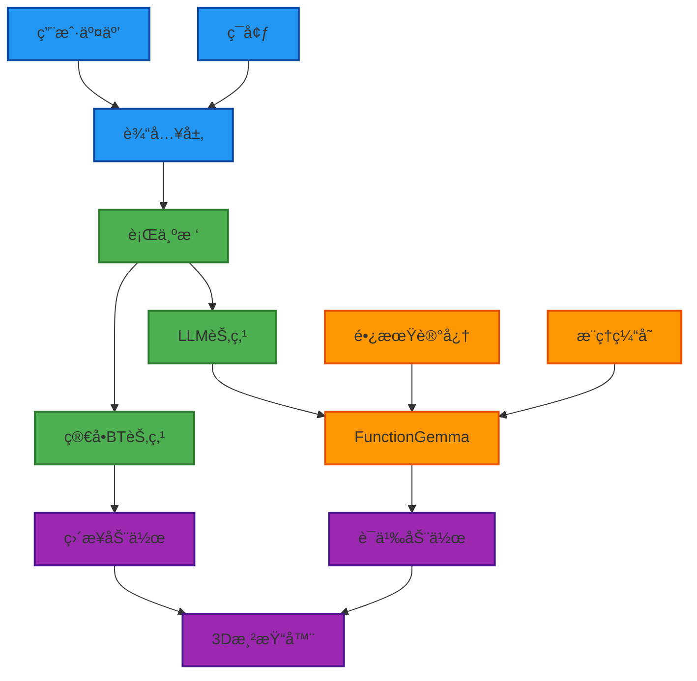

## 8. 总结

通过以上演进路径，Q-Penguin å°†ä»å½“å‰çš„"对è¯æ¡†é©±åŠ¨"系统é€æ­¥æ¼”进为具备**ç¯å¢ƒæ„ŸçŸ¥ã€è¯­ä¹‰ç†è§£ã€è‡ªä¸»å†³ç­–**能力的数字生命系统。æ¯ä¸ªé˜¶æ®µéƒ½æœ‰æ˜ç¡®çš„技术目标和å®ç°è·¯å¾„，确ä¿ç³»ç»Ÿçš„稳定性和å¯æ‰©å±•æ€§ã€‚

---
*文档编制：AI Assistant*  
*日期：2025年12月31日*  
*最å更新：2025å¹´12月31æ—¥*

