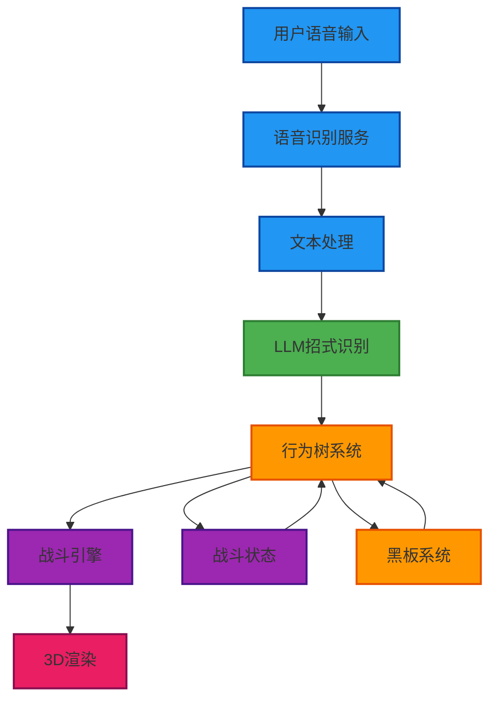
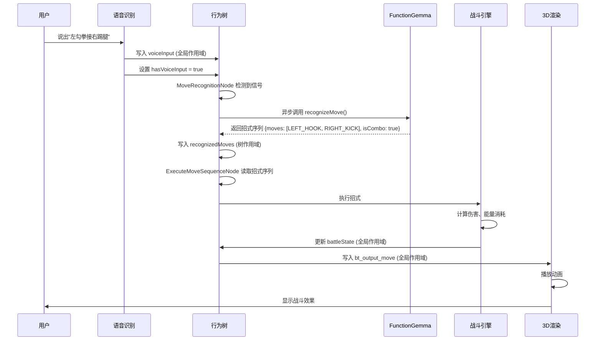

# VOICE_FIGHT 语音格斗游戏 - 技术文档

**版本**: v1.0  
**日期**: 2025-01-01  
**技术负责人**: 开发团队

---

## 一、技术架构概览

### 1.1 整体架构

VOICE_FIGHT 采用**分层架构**设计，参考 Q-Penguin 的成熟架构，实现语音识别、LLM 招式识别、行为树战斗控制的完整系统。



### 1.2 核心设计原则

1. **BT Driver 模式**：行为树节点通过黑板系统与 React 组件解耦
2. **三层黑板作用域**：全局、树、节点作用域隔离，防止变量污染
3. **异步 LLM 调用**：支持异步招式识别，不阻塞游戏主循环
4. **模块化设计**：各系统独立，便于测试和维护

---

## 二、系统模块设计

### 2.1 语音识别模块

#### 2.1.1 架构设计

```typescript
// services/voice/speechRecognition.ts
export class SpeechRecognitionService {
  private recognition: SpeechRecognition | null = null;
  private isListening: boolean = false;
  
  /**
   * 初始化语音识别
   * @param options 配置选项
   */
  init(options: SpeechRecognitionOptions): void {
    // 使用 Web Speech API 或备选服务
  }
  
  /**
   * 开始监听语音输入
   */
  startListening(): Promise<string> {
    // 返回 Promise，解析为识别的文本
  }
  
  /**
   * 停止监听
   */
  stopListening(): void {
    // 停止语音识别
  }
  
  /**
   * 处理识别结果
   */
  private handleResult(text: string): void {
    // 写入黑板系统
    blackboard.set('voiceInput', text);
    blackboard.set('hasVoiceInput', true);
  }
}
```

#### 2.1.2 与行为树集成

语音识别结果通过**全局作用域**写入黑板：

```typescript
// 语音识别服务写入
blackboard.set('voiceInput', '左勾拳接右踢腿');
blackboard.set('hasVoiceInput', true);

// 行为树节点读取
const voiceInput = tick.blackboard?.get('voiceInput');
if (voiceInput) {
  // 触发 LLM 识别流程
}
```

### 2.2 LLM 招式识别模块

#### 2.2.1 架构设计

参考 Q-Penguin 的 FunctionGemma 集成方式，实现招式识别服务：

```typescript
// services/llm/moveRecognitionService.ts
export const recognizeMove = async (
  voiceText: string,
  battleState: BattleState,
  settings: LLMSettings
): Promise<MoveSequence> => {
  // 1. 构造工具声明（Function Calling）
  const TOOL_DECLARATION = `
    <start_function_declaration>
    declaration:execute_move{
      description:<escape>Execute a fighting move or combo sequence.<escape>,
      parameters:{
        properties:{
          moves:{
            description:<escape>An ordered list of moves to execute.<escape>,
            items:{
              enum:${JSON.stringify(AVAILABLE_MOVES)},
              type:<escape>STRING<escape>
            },
            type:<escape>ARRAY<escape>
          },
          combo: {
            description:<escape>Whether this is a combo move.<escape>,
            type:<escape>BOOLEAN<escape>
          }
        },
        required:[<escape>moves<escape>],
        type:<escape>OBJECT<escape>
      }
    }
    <end_function_declaration>
  `;
  
  // 2. 构造系统提示词
  const systemPrompt = `You are a fighting game move recognition system.
  Analyze the player's voice command and output the corresponding move sequence.
  ${TOOL_DECLARATION}
  
  Available moves: ${AVAILABLE_MOVES.join(', ')}
  Current battle state: HP=${battleState.playerHP}, Energy=${battleState.playerEnergy}`;
  
  // 3. 调用 FunctionGemma
  const response = await fetch(`${settings.baseUrl}/chat/completions`, {
    method: 'POST',
    headers: {
      'Content-Type': 'application/json',
    },
    body: JSON.stringify({
      model: settings.modelName,
      messages: [
        { role: 'developer', content: systemPrompt },
        { role: 'user', content: voiceText }
      ],
      temperature: 0.1,
      max_tokens: 256,
    })
  });
  
  // 4. 解析响应
  const data = await response.json();
  const toolCalls = parseToolCalls(data);
  
  // 5. 返回招式序列
  return {
    moves: toolCalls.moves,
    isCombo: toolCalls.combo || false
  };
};
```

#### 2.2.2 招式定义

```typescript
// constants/moves.ts
export const AVAILABLE_MOVES = [
  // 基础攻击
  'LEFT_PUNCH',      // 左直拳
  'RIGHT_PUNCH',     // 右直拳
  'LEFT_HOOK',       // 左勾拳
  'RIGHT_HOOK',       // 右勾拳
  'LEFT_KICK',       // 左踢腿
  'RIGHT_KICK',      // 右踢腿
  'HEAVY_PUNCH',     // 重拳
  'UPPERCUT',        // 上勾拳
  
  // 防御
  'DEFEND',          // 防御
  'DODGE_LEFT',      // 左闪避
  'DODGE_RIGHT',     // 右闪避
  'DODGE_BACK',      // 后闪避
  
  // 特殊招式
  'COMBO_ATTACK',    // 连击
  'SPECIAL_MOVE',    // 必杀技
  'COUNTER_ATTACK',  // 反击
] as const;

export type MoveType = typeof AVAILABLE_MOVES[number];

export interface Move {
  id: MoveType;
  name: string;
  type: 'attack' | 'defense' | 'dodge' | 'combo' | 'special';
  damage: number;
  energyCost: number;
  cooldown: number;      // 冷却时间（毫秒）
  duration: number;       // 执行时长（毫秒）
  comboPoints: number;    // 连击点数
  animation: string;     // 动画名称
}

export const MOVE_DEFINITIONS: Record<MoveType, Move> = {
  LEFT_PUNCH: {
    id: 'LEFT_PUNCH',
    name: '左直拳',
    type: 'attack',
    damage: 10,
    energyCost: 5,
    cooldown: 500,
    duration: 300,
    comboPoints: 1,
    animation: 'left_punch'
  },
  // ... 其他招式定义
};
```

### 2.3 行为树系统

#### 2.3.1 行为树结构

参考 Q-Penguin 的行为树架构，设计战斗行为树：

```typescript
// services/bt/BattleBT.ts
export function createBattleBT(): BehaviorTree {
  const tree = new BehaviorTree();
  
  tree.root = new Priority({
    children: [
      // 1. 语音输入处理（最高优先级）
      new MemSequence({
        children: [
          new CheckBlackboardCondition({ 
            key: 'hasVoiceInput', 
            value: true, 
            scope: 'global' 
          }),
          new Retry({
            maxAttempts: 2,
            child: new MoveRecognitionNode()  // LLM 招式识别节点
          }),
          new MoveParseNode(),                // 招式解析节点
          new ValidateMoveNode(),            // 招式验证节点
        ]
      }),
      
      // 2. 招式执行序列
      new ExecuteMoveSequenceNode(),
      
      // 3. 战斗状态更新
      new UpdateBattleStateNode(),
      
      // 4. AI 对手行为
      new AIPlayerNode(),
      
      // 5. 默认闲置
      new IdleNode()
    ]
  });
  
  return tree;
}
```

#### 2.3.2 核心节点设计

**MoveRecognitionNode（招式识别节点）**

```typescript
// services/bt/actions/MoveRecognitionNode.ts
export default class MoveRecognitionNode extends Action {
  constructor() {
    super({ name: 'MoveRecognitionNode' });
  }
  
  open(tick: Tick): void {
    const blackboard = tick.blackboard;
    const treeId = tick.tree?.id;
    blackboard?.set('move_recognition_status', 'idle', treeId, this.id);
  }
  
  tick(tick: Tick): number {
    const blackboard = tick.blackboard;
    const treeId = tick.tree?.id;
    const status = blackboard?.get('move_recognition_status', treeId, this.id);
    
    if (status === 'idle') {
      const voiceInput = blackboard?.get('voiceInput');
      const battleState = blackboard?.get('battleState');
      const settings = blackboard?.get('llmSettings');
      
      if (!voiceInput) return FAILURE;
      
      // 设置状态为处理中
      blackboard?.set('move_recognition_status', 'processing', treeId, this.id);
      
      // 异步调用 LLM
      recognizeMove(voiceInput, battleState, settings)
        .then((moveSequence) => {
          blackboard?.set('recognizedMoves', moveSequence, treeId, this.id);
          blackboard?.set('move_recognition_status', 'success', treeId, this.id);
        })
        .catch((error) => {
          blackboard?.set('move_recognition_error', error, treeId, this.id);
          blackboard?.set('move_recognition_status', 'failed', treeId, this.id);
        });
      
      return RUNNING;
    }
    
    if (status === 'processing') {
      return RUNNING;
    }
    
    if (status === 'success') {
      // 清除语音输入信号
      blackboard?.set('hasVoiceInput', false);
      return SUCCESS;
    }
    
    if (status === 'failed') {
      // 失败处理
      return FAILURE;
    }
    
    return FAILURE;
  }
}
```

**ExecuteMoveSequenceNode（招式执行节点）**

```typescript
// services/bt/actions/ExecuteMoveSequenceNode.ts
export default class ExecuteMoveSequenceNode extends Action {
  tick(tick: Tick): number {
    const blackboard = tick.blackboard;
    const treeId = tick.tree?.id;
    const nodeId = this.id;
    
    // 从树作用域读取识别的招式序列
    const moveSequence = blackboard?.get('recognizedMoves', treeId, 'MoveRecognitionNode');
    if (!moveSequence || !moveSequence.moves || moveSequence.moves.length === 0) {
      return FAILURE;
    }
    
    // 获取当前执行索引
    let currentIdx = blackboard?.get('currentMoveIdx', treeId, nodeId) || 0;
    const startTime = blackboard?.get('moveSequenceStartTime', treeId, nodeId) || Date.now();
    
    // 如果是新序列，重置索引
    if (currentIdx === 0 && Date.now() - startTime > 100) {
      currentIdx = 0;
      blackboard?.set('moveSequenceStartTime', Date.now(), treeId, nodeId);
    }
    
    if (currentIdx >= moveSequence.moves.length) {
      // 序列执行完成
      blackboard?.set('recognizedMoves', null, treeId, 'MoveRecognitionNode');
      blackboard?.set('currentMoveIdx', 0, treeId, nodeId);
      return SUCCESS;
    }
    
    // 执行当前招式
    const currentMove = moveSequence.moves[currentIdx];
    const moveDef = MOVE_DEFINITIONS[currentMove];
    
    if (!moveDef) {
      // 无效招式，跳过
      currentIdx++;
      blackboard?.set('currentMoveIdx', currentIdx, treeId, nodeId);
      return RUNNING;
    }
    
    // 检查冷却时间
    const lastMoveTime = blackboard?.get(`lastMoveTime_${currentMove}`, treeId);
    if (lastMoveTime && Date.now() - lastMoveTime < moveDef.cooldown) {
      // 还在冷却中，等待
      return RUNNING;
    }
    
    // 检查能量
    const battleState = blackboard?.get('battleState');
    if (battleState.playerEnergy < moveDef.energyCost) {
      // 能量不足，执行失败
      return FAILURE;
    }
    
    // 执行招式：写入黑板输出
    blackboard?.set('bt_output_move', {
      move: currentMove,
      isCombo: moveSequence.isCombo && currentIdx > 0,
      comboCount: currentIdx + 1
    });
    
    // 更新状态
    blackboard?.set(`lastMoveTime_${currentMove}`, Date.now(), treeId);
    blackboard?.set('currentMoveIdx', currentIdx + 1, treeId, nodeId);
    
    // 消耗能量
    battleState.playerEnergy -= moveDef.energyCost;
    blackboard?.set('battleState', battleState);
    
    return RUNNING;
  }
}
```

### 2.4 战斗引擎

#### 2.4.1 战斗状态管理

```typescript
// services/battle/battleEngine.ts
export interface BattleState {
  // 玩家状态
  playerHP: number;
  playerEnergy: number;
  playerCombo: number;
  playerPosition: [number, number, number];
  
  // 对手状态
  opponentHP: number;
  opponentEnergy: number;
  opponentCombo: number;
  opponentPosition: [number, number, number];
  
  // 战斗状态
  isPlayerAttacking: boolean;
  isPlayerDefending: boolean;
  isPlayerDodging: boolean;
  
  // 时间戳
  lastUpdateTime: number;
}

export class BattleEngine {
  private state: BattleState;
  private blackboard: Blackboard;
  
  constructor(blackboard: Blackboard) {
    this.blackboard = blackboard;
    this.state = this.initBattleState();
  }
  
  /**
   * 初始化战斗状态
   */
  private initBattleState(): BattleState {
    return {
      playerHP: 100,
      playerEnergy: 50,
      playerCombo: 0,
      playerPosition: [0, 0, 0],
      opponentHP: 100,
      opponentEnergy: 50,
      opponentCombo: 0,
      opponentPosition: [5, 0, 0],
      isPlayerAttacking: false,
      isPlayerDefending: false,
      isPlayerDodging: false,
      lastUpdateTime: Date.now()
    };
  }
  
  /**
   * 处理招式执行
   */
  executeMove(move: MoveType, isCombo: boolean, comboCount: number): void {
    const moveDef = MOVE_DEFINITIONS[move];
    
    if (moveDef.type === 'attack') {
      this.handleAttack(moveDef, isCombo, comboCount);
    } else if (moveDef.type === 'defense') {
      this.handleDefense(moveDef);
    } else if (moveDef.type === 'dodge') {
      this.handleDodge(moveDef);
    }
  }
  
  /**
   * 处理攻击
   */
  private handleAttack(move: Move, isCombo: boolean, comboCount: number): void {
    this.state.isPlayerAttacking = true;
    
    // 计算伤害（考虑连击加成）
    let damage = move.damage;
    if (isCombo && comboCount > 1) {
      damage *= (1 + comboCount * 0.1); // 每连击 +10% 伤害
    }
    
    // 检查对手是否防御
    if (this.state.isPlayerDefending) {
      damage *= 0.5; // 防御减伤 50%
    } else if (this.state.isPlayerDodging) {
      damage = 0; // 闪避完全躲避
    }
    
    // 应用伤害
    this.state.opponentHP = Math.max(0, this.state.opponentHP - damage);
    
    // 更新连击数
    if (damage > 0) {
      this.state.playerCombo++;
    } else {
      this.state.playerCombo = 0;
    }
    
    // 更新能量
    this.state.playerEnergy = Math.max(0, this.state.playerEnergy - move.energyCost);
    
    // 写入黑板
    this.blackboard.set('battleState', this.state);
    this.blackboard.set('bt_output_damage', {
      target: 'opponent',
      damage: damage,
      combo: this.state.playerCombo
    });
  }
  
  /**
   * 处理防御
   */
  private handleDefense(move: Move): void {
    this.state.isPlayerDefending = true;
    this.state.playerEnergy = Math.max(0, this.state.playerEnergy - move.energyCost);
    
    // 防御持续一段时间后自动取消
    setTimeout(() => {
      this.state.isPlayerDefending = false;
      this.blackboard.set('battleState', this.state);
    }, move.duration);
    
    this.blackboard.set('battleState', this.state);
  }
  
  /**
   * 处理闪避
   */
  private handleDodge(move: Move): void {
    this.state.isPlayerDodging = true;
    this.state.playerEnergy = Math.max(0, this.state.playerEnergy - move.energyCost);
    
    // 闪避持续一段时间后自动取消
    setTimeout(() => {
      this.state.isPlayerDodging = false;
      this.blackboard.set('battleState', this.state);
    }, move.duration);
    
    this.blackboard.set('battleState', this.state);
  }
  
  /**
   * 更新战斗状态（能量恢复等）
   */
  update(): void {
    const now = Date.now();
    const deltaTime = (now - this.state.lastUpdateTime) / 1000; // 秒
    
    // 能量恢复（每秒恢复 5 点）
    this.state.playerEnergy = Math.min(100, this.state.playerEnergy + 5 * deltaTime);
    this.state.opponentEnergy = Math.min(100, this.state.opponentEnergy + 5 * deltaTime);
    
    // 连击数衰减（每秒减少 1）
    if (this.state.playerCombo > 0) {
      this.state.playerCombo = Math.max(0, this.state.playerCombo - deltaTime);
    }
    
    this.state.lastUpdateTime = now;
    this.blackboard.set('battleState', this.state);
  }
}
```

### 2.5 3D 渲染系统

#### 2.5.1 React Three Fiber 集成

```typescript
// components/BattleScene/BattleScene.tsx
export const BattleScene: React.FC = () => {
  const [playerAction, setPlayerAction] = useState<string>('idle');
  const [opponentAction, setOpponentAction] = useState<string>('idle');
  const blackboard = useBlackboard();
  
  // BT Driver: 读取行为树输出
  useFrame(() => {
    const moveOutput = blackboard.get('bt_output_move');
    if (moveOutput) {
      setPlayerAction(moveOutput.move);
      blackboard.set('bt_output_move', null); // 消费
    }
    
    const damageOutput = blackboard.get('bt_output_damage');
    if (damageOutput) {
      // 显示伤害数字
      showDamageNumber(damageOutput.damage, damageOutput.target);
      blackboard.set('bt_output_damage', null); // 消费
    }
  });
  
  return (
    <Canvas>
      <ambientLight intensity={0.5} />
      <directionalLight position={[10, 10, 5]} />
      
      {/* 玩家角色 */}
      <Fighter
        position={[0, 0, 0]}
        action={playerAction}
        isPlayer={true}
      />
      
      {/* 对手角色 */}
      <Fighter
        position={[5, 0, 0]}
        action={opponentAction}
        isPlayer={false}
      />
    </Canvas>
  );
};
```

---

## 三、数据流设计

### 3.1 完整数据流



### 3.2 黑板系统设计

#### 3.2.1 全局作用域键

| 键名 | 类型 | 说明 |
|------|------|------|
| `voiceInput` | `string` | 语音识别的文本 |
| `hasVoiceInput` | `boolean` | 是否有新的语音输入 |
| `battleState` | `BattleState` | 当前战斗状态 |
| `bt_output_move` | `MoveOutput` | 行为树输出的招式 |
| `bt_output_damage` | `DamageOutput` | 行为树输出的伤害信息 |
| `bt_output_animation` | `string` | 行为树输出的动画名称 |

#### 3.2.2 树作用域键

| 键名 | 类型 | 说明 |
|------|------|------|
| `recognizedMoves` | `MoveSequence` | LLM 识别的招式序列 |
| `pendingMoves` | `Move[]` | 待执行的招式队列 |

#### 3.2.3 节点作用域键

| 键名 | 类型 | 说明 |
|------|------|------|
| `move_recognition_status` | `string` | 招式识别状态（'idle' \| 'processing' \| 'success' \| 'failed'） |
| `currentMoveIdx` | `number` | 当前执行的招式索引 |
| `moveSequenceStartTime` | `number` | 招式序列开始时间 |

---

## 四、性能优化策略

### 4.1 LLM 调用优化

#### 4.1.1 缓存机制

```typescript
// services/llm/moveRecognitionCache.ts
class MoveRecognitionCache {
  private cache = new Map<string, { result: MoveSequence; timestamp: number }>();
  private TTL = 5000; // 5 秒缓存
  
  get(key: string): MoveSequence | null {
    const entry = this.cache.get(key);
    if (entry && Date.now() - entry.timestamp < this.TTL) {
      return entry.result;
    }
    return null;
  }
  
  set(key: string, result: MoveSequence): void {
    this.cache.set(key, { result, timestamp: Date.now() });
  }
  
  // 生成缓存键：语音文本 + 战斗状态摘要
  generateKey(voiceText: string, battleState: BattleState): string {
    return `${voiceText}_${battleState.playerHP}_${battleState.playerEnergy}`;
  }
}
```

#### 4.1.2 去重机制

```typescript
// 防止短时间内重复调用
const lastCallTime = blackboard.get('lastLLMCallTime');
const lastCallText = blackboard.get('lastLLMCallText');

if (lastCallTime && Date.now() - lastCallTime < 1000) {
  if (lastCallText === voiceText) {
    // 1 秒内相同文本，直接使用上次结果
    return;
  }
}

blackboard.set('lastLLMCallTime', Date.now());
blackboard.set('lastLLMCallText', voiceText);
```

### 4.2 行为树优化

#### 4.2.1 执行频率控制

```typescript
// 行为树不是每帧都执行，而是按固定频率
const BT_TICK_INTERVAL = 100; // 100ms 执行一次

let lastTickTime = 0;
useFrame(() => {
  const now = Date.now();
  if (now - lastTickTime >= BT_TICK_INTERVAL) {
    bt.tick(null, blackboard);
    lastTickTime = now;
  }
  
  // 3D 渲染继续 60 FPS
});
```

#### 4.2.2 节点状态缓存

```typescript
// 条件节点结果缓存
const conditionCache = new Map<string, { result: boolean; timestamp: number }>();

// 100ms 内相同条件不重复计算
const cacheKey = `${conditionKey}_${conditionValue}`;
const cached = conditionCache.get(cacheKey);
if (cached && Date.now() - cached.timestamp < 100) {
  return cached.result;
}
```

### 4.3 3D 渲染优化

- **LOD（细节层次）**：根据距离调整模型细节
- **批处理**：合并相同材质的渲染调用
- **对象池**：复用伤害数字、特效等对象
- **动画优化**：使用骨骼动画而非顶点动画

---

## 五、错误处理与兜底机制

### 5.1 LLM 调用失败处理

```typescript
// MoveRecognitionNode 失败时的兜底逻辑
if (status === 'failed') {
  // 使用规则引擎作为兜底
  const fallbackMoves = ruleBasedRecognition(voiceInput);
  if (fallbackMoves) {
    blackboard?.set('recognizedMoves', fallbackMoves, treeId, this.id);
    return SUCCESS;
  }
  return FAILURE;
}

// 规则引擎（简单关键词匹配）
function ruleBasedRecognition(text: string): MoveSequence | null {
  const lowerText = text.toLowerCase();
  
  if (lowerText.includes('左勾拳')) {
    return { moves: ['LEFT_HOOK'], isCombo: false };
  }
  if (lowerText.includes('右踢腿')) {
    return { moves: ['RIGHT_KICK'], isCombo: false };
  }
  if (lowerText.includes('左勾拳') && lowerText.includes('右踢腿')) {
    return { moves: ['LEFT_HOOK', 'RIGHT_KICK'], isCombo: true };
  }
  
  return null;
}
```

### 5.2 招式验证

```typescript
// ValidateMoveNode
export default class ValidateMoveNode extends Action {
  tick(tick: Tick): number {
    const moveSequence = tick.blackboard?.get('recognizedMoves', tick.tree?.id, 'MoveRecognitionNode');
    const battleState = tick.blackboard?.get('battleState');
    
    if (!moveSequence) return FAILURE;
    
    // 验证每个招式
    for (const moveId of moveSequence.moves) {
      const moveDef = MOVE_DEFINITIONS[moveId];
      
      // 检查招式是否存在
      if (!moveDef) {
        console.warn(`Invalid move: ${moveId}`);
        return FAILURE;
      }
      
      // 检查能量是否足够
      if (battleState.playerEnergy < moveDef.energyCost) {
        console.warn(`Not enough energy for ${moveId}`);
        return FAILURE;
      }
      
      // 检查冷却时间
      const lastMoveTime = tick.blackboard?.get(`lastMoveTime_${moveId}`, tick.tree?.id);
      if (lastMoveTime && Date.now() - lastMoveTime < moveDef.cooldown) {
        console.warn(`Move ${moveId} is on cooldown`);
        return FAILURE;
      }
    }
    
    return SUCCESS;
  }
}
```

---

## 六、测试策略

### 6.1 单元测试

```typescript
// tests/unit/battleEngine.test.ts
describe('BattleEngine', () => {
  it('should calculate damage correctly', () => {
    const engine = new BattleEngine(blackboard);
    engine.executeMove('LEFT_PUNCH', false, 1);
    
    const state = blackboard.get('battleState');
    expect(state.opponentHP).toBe(90); // 100 - 10
  });
  
  it('should apply combo damage bonus', () => {
    const engine = new BattleEngine(blackboard);
    engine.executeMove('LEFT_PUNCH', true, 2);
    
    const state = blackboard.get('battleState');
    // 连击加成：10 * 1.2 = 12
    expect(state.opponentHP).toBe(88);
  });
});
```

### 6.2 集成测试

```typescript
// tests/integration/moveRecognition.test.ts
describe('Move Recognition Integration', () => {
  it('should recognize combo move from voice input', async () => {
    // 模拟语音输入
    blackboard.set('voiceInput', '左勾拳接右踢腿');
    blackboard.set('hasVoiceInput', true);
    
    // 执行行为树
    bt.tick(null, blackboard);
    
    // 等待 LLM 调用完成
    await waitFor(() => {
      const moves = blackboard.get('recognizedMoves', treeId, 'MoveRecognitionNode');
      expect(moves).toBeDefined();
      expect(moves.moves).toContain('LEFT_HOOK');
      expect(moves.moves).toContain('RIGHT_KICK');
      expect(moves.isCombo).toBe(true);
    });
  });
});
```

---

## 七、部署方案

### 7.1 本地部署

**前端**：
- 使用 Vite 构建，输出静态文件
- 部署到 Vercel / Netlify

**LLM 服务**：
- 本地运行 vLLM 服务
- 端口：8000
- 模型：FunctionGemma 270M

### 7.2 配置示例

```typescript
// config/llmConfig.ts
export const LLM_CONFIG = {
  baseUrl: 'http://localhost:8000',
  modelName: 'pet-model',
  provider: 'custom',
  apiKey: '', // 本地部署不需要 API Key
};
```

---

## 八、参考资源

### 8.1 Q-Penguin 参考

- **行为树架构**：`AVATAR/q_llm_pet/docs/当前LLM行为树架构.md`
- **LLM 集成**：`AVATAR/q_llm_pet/services/functionGemmaService.ts`
- **行为树实现**：`AVATAR/q_llm_pet/services/bt/`

### 8.2 外部资源

- **Web Speech API**: https://developer.mozilla.org/en-US/docs/Web/API/SpeechRecognition
- **FunctionGemma**: https://github.com/google-deepmind/functiongemma
- **React Three Fiber**: https://docs.pmnd.rs/react-three-fiber/

---

**文档状态**: ✅ 已完成  
**下一步**: 开始 Phase 1 开发

