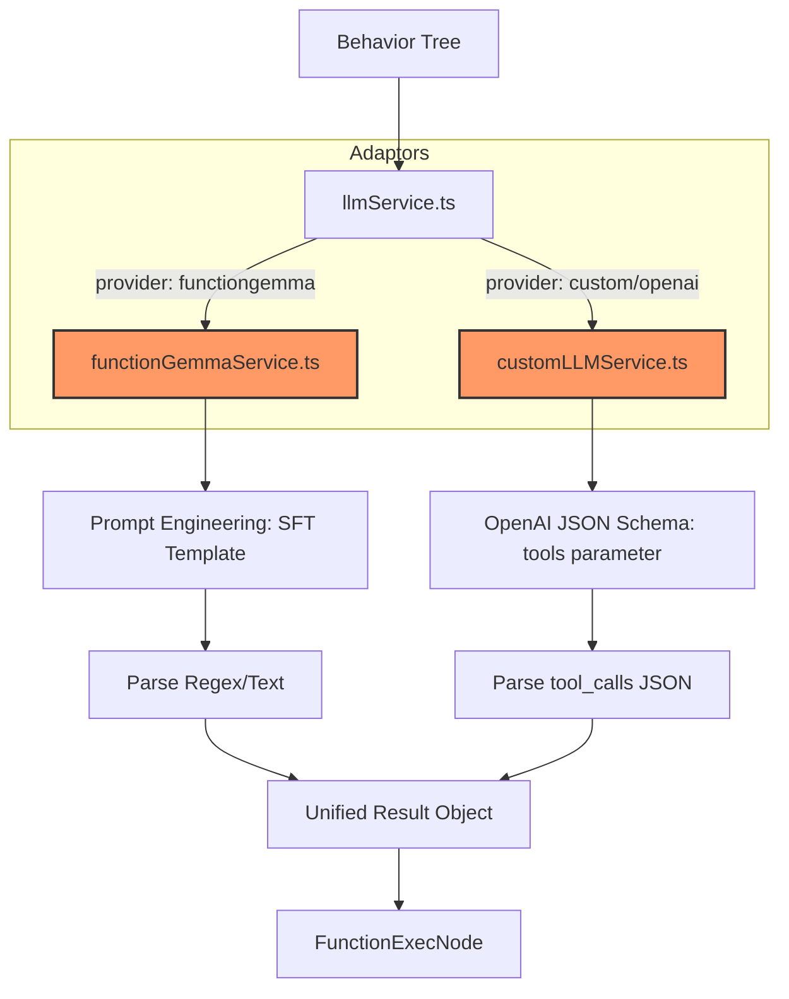

# 多模型兼容与协议适配架构设计 (Multi-Model Protocol Adaptation)

## 1. 核心背景
本项目目前拥有一个高度定制化的核心模型 **FunctionGemma**（基于 `single_turn_2000.jsonl` 微调）。该模型使用特定的 Prompt 模板和 SFT 格式。为了在不破坏该模型兼容性的前提下，接入 OpenAI 兼容的第三方模型（如 GPT-4, DeepSeek 等），我们需要实现一套“双轨制”适配架构。

## 2. 核心设计理念：协议解耦 (Protocol Decoupling)
行为树（BT）逻辑层不直接与模型通讯，而是通过 `llmService.ts` 进行路由分发。

- **Gemma 路径**：保持原有的 SFT 模板（`<start_of_turn>` 等）和正则解析逻辑。
- **OpenAI 路径**：使用标准的 `tools` 参数 (JSON Schema) 和 `tool_calls` 返回格式。

## 3. 架构方案

### 3.1 流程图


### 3.2 关键组件说明

#### A. 统一结果契约 (Unified Contract)
无论使用哪个模型，适配器层（Service）最终必须向 `FunctionExecNode` 返回一致的数据结构：
```typescript
{
  text: string;           // 模型回复的自然语言文本
  toolResult: {           // 结构化指令
    actions: string[];    // 肢体动作序列 (ActionType[])
    emotion: string;      // 表情类型 (ExpressionType)
  } | null;
}
```

#### B. 多轨道适配逻辑
1.  **FunctionGemma (SFT 轨道)**：
    *   **输入**：将工具定义以纯文本形式嵌入 Prompt。
    *   **解析**：利用微调时学习到的固定模式（如 `[Performing: ...]`），通过正则表达式提取指令。
2.  **OpenAI (Standard 轨道)**：
    *   **输入**：将工具定义通过 `tools` 数组传递，利用模型的原生 Tool Use 能力。
    *   **解析**：解析模型返回的 `tool_calls` 数组中的 `arguments` JSON 字符串。

## 4. 实现步骤建议

1.  **强化 `llmService.ts` 的路由能力**：根据 `LLMSettings.provider` 决定调用哪个 Service。
2.  **统一 `customLLMService.ts` 的返回格式**：确保其返回的 `toolResult` 结构与 `functionGemmaService` 完全一致。
3.  **在 `SettingsModal.tsx` 中物理隔离配置**：确保切换 Provider 时，API Key、URL 和模型名能够独立保存（**已完成**）。

## 5. 方案优势
*   **零破坏**：对 OpenAI 模型的适配完全在独立的文件中进行，不会修改任何影响 FunctionGemma 权重的 Prompt 或解析代码。
*   **高可靠**：针对自有微调模型，保留最原始的 SFT 格式，确保微调效果 100% 发挥。
*   **易扩展**：未来接入新的云端模型只需增加一个适配函数，行为树逻辑无需任何改动。

---
*Last Updated: 2026-01-01*

