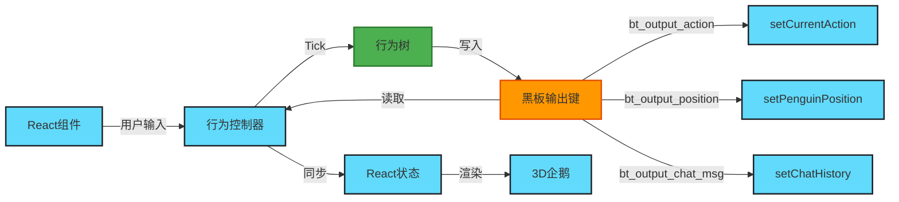
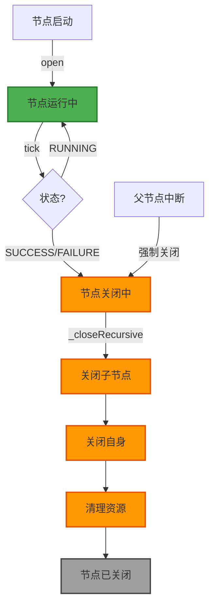
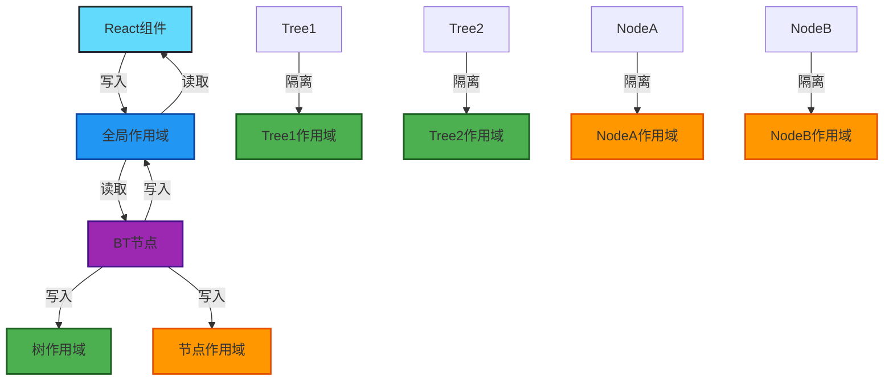
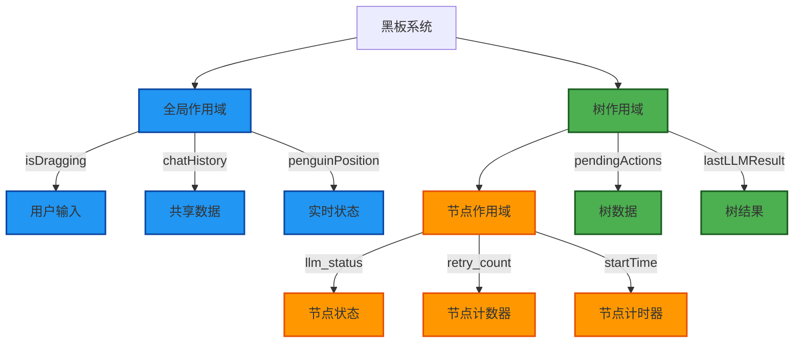
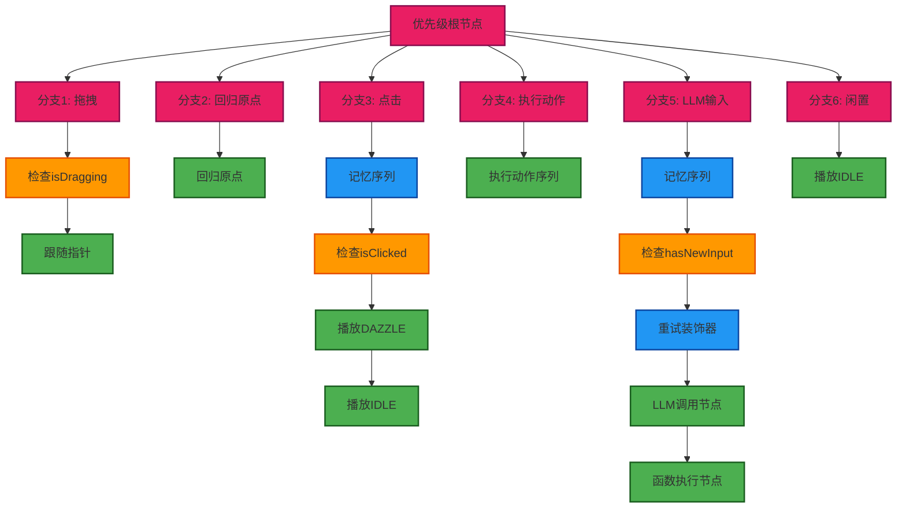
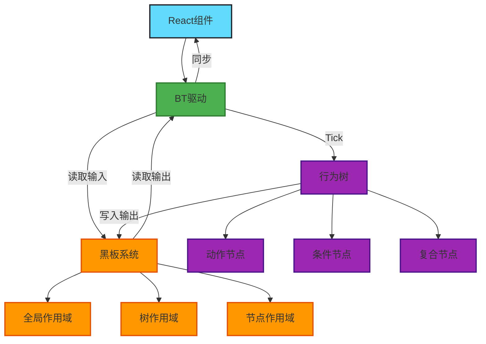

# Q-Penguin 当前 LLM 行为树架构

本文档详细介绍了 Q-Penguin 项目中行为树（Behavior Tree）系统的核心架构设计，包括完全解耦的 BT Driver 模式、生命周期管理机制以及高性能控制流优化。

## 一、架构概览

Q-Penguin 的行为树系统基于 `behavior3js` 核心框架，并参考 `py_trees` 的先进设计理念，实现了一套**完全解耦、可扩展、高鲁棒性**的数字生命控制系统。

### 核心设计原则

1. **逻辑与渲染完全分离**：行为树节点不直接操作 React 状态，而是通过标准化的黑板输出键进行通信
2. **生命周期严格管理**：所有节点支持递归关闭机制，确保中断时资源正确清理
3. **高性能控制流**：消除冗余计算，优化并发执行逻辑

## 二、BT Driver 模式：完全解耦架构

### 2.1 设计理念

**改进前的问题**：
- 行为树节点（如 `ReturnToOriginAction`）直接持有并调用 React 的 `setPosition` 等函数
- 导致逻辑与渲染层强耦合，难以测试和扩展
- 更换前端框架（如从 React 换到 Vue）需要修改所有节点代码

**改进后的方案**：
- 引入 **BT Driver** 模式，节点只负责向黑板（Blackboard）写入标准化的输出键
- 在 `App.tsx` 的 `BehaviorController` 中统一读取这些输出并应用到 React 状态
- 行为树逻辑代码与前端框架完全解耦

### 2.2 标准化输出键

所有行为树节点通过以下标准化的输出键与外部系统通信：

| 输出键 | 类型 | 说明 | 消费位置 |
|--------|------|------|----------|
| `bt_output_action` | `ActionType` | 当前要播放的动作（如 'FLY', 'DAZZLE'） | `BehaviorController` → `setCurrentAction` |
| `bt_output_position` | `[number, number, number]` | 企鹅的 3D 坐标 | `BehaviorController` → `setPenguinPosition` |
| `bt_output_chat_msg` | `ChatMessage` | 聊天消息（LLM 回复或动作确认） | `BehaviorController` → `setChatHistory` |

### 2.3 实现示例

#### 节点端（行为树内部）

```typescript
// services/bt/actions/PlayAnimationAction.ts
export default class PlayAnimationAction extends Action {
  tick(tick: Tick): number {
    const action = this.properties.action as ActionType;
    
    // 只写入黑板，不直接调用 React setter
    tick.blackboard?.set('bt_output_action', action);
    
    // 如果有持续时间，继续运行
    if (duration > 0) {
      // ... 计时逻辑
      return RUNNING;
    }
    
    return SUCCESS;
  }
}
```

#### 驱动端（React 组件）

```typescript
// App.tsx - BehaviorController
useFrame((state) => {
  // Tick the tree
  bt.tick(null, blackboard);

  // --- BT Driver: Sync Blackboard outputs to React state ---
  
  // 1. Handle Action Output
  const nextAction = blackboard.get('bt_output_action');
  if (nextAction) {
    setCurrentAction(nextAction);
    blackboard.set('bt_output_action', null); // Consume
  }

  // 2. Handle Position Output
  const nextPos = blackboard.get('bt_output_position');
  if (nextPos) {
    setPenguinPosition(nextPos);
    blackboard.set('bt_output_position', null); // Consume
  }

  // 3. Handle Chat Output
  const nextMsg = blackboard.get('bt_output_chat_msg');
  if (nextMsg) {
    setChatHistory((prev: any) => [...prev, nextMsg]);
    blackboard.set('bt_output_chat_msg', null); // Consume
  }
});
```

### 2.4 BT Driver 数据流图



### 2.5 架构优势

1. **可测试性**：节点逻辑可以独立测试，无需 Mock React 组件
2. **可扩展性**：新增输出类型只需定义新的输出键，无需修改节点代码
3. **框架无关**：行为树逻辑可以在任何前端框架中使用（React、Vue、Angular 等）
4. **调试友好**：所有输出都集中在黑板上，便于追踪和可视化

## 三、生命周期管理：Stop/Terminate 机制

### 3.1 设计背景

参考 `py_trees` 的设计，我们为所有节点实现了递归关闭机制。这解决了以下关键问题：

- **并发执行中断**：在 `Parallel` 节点中，如果父节点（如拖拽分支）突然中断，子节点需要被强制关闭
- **资源泄漏**：计时器、Promise 状态等临时数据需要正确清理
- **信号闪现**：防止因信号短暂出现导致的"动作卡死"或"逻辑风暴"

### 3.2 实现机制

#### BaseNode 核心方法

```typescript
// services/bt/core/BaseNode.ts
export default class BaseNode {
  /**
   * Helper to force close a node and its children (if any).
   * Inspired by py_trees terminate/stop logic.
   */
  public _closeRecursive(tick: Tick): void {
    if (tick.blackboard.get('isOpen', tick.tree.id, this.id)) {
      this._close(tick);
    }
  }
}
```

#### Composite 递归关闭

```typescript
// services/bt/core/Composite.ts
export default class Composite extends BaseNode {
  public _closeRecursive(tick: Tick): void {
    // 先关闭所有子节点
    for (const child of this.children) {
      child._closeRecursive(tick);
    }
    // 再关闭自身
    super._closeRecursive(tick);
  }
}
```

#### Parallel 节点应用

```typescript
// services/bt/composites/Parallel.ts
export default class Parallel extends Composite {
  public tick(tick: Tick): number {
    // ... 并发执行逻辑
    
    if (this.policy === 'SuccessOnAll' && successCount === childCount) {
      this._closeChildren(tick); // 强制关闭所有子节点
      return SUCCESS;
    }
    
    if (failureCount > 0) {
      this._closeChildren(tick); // 失败时也要关闭
      return FAILURE;
    }
    
    return RUNNING;
  }

  private _closeChildren(tick: Tick): void {
    for (const child of this.children) {
      child._closeRecursive(tick);
    }
  }
}
```

### 3.3 生命周期管理流程图



### 3.4 解决的问题

1. **动作卡死**：当拖拽分支被更高优先级分支中断时，`FollowPointerNode` 会被正确关闭，不会继续更新位置
2. **Promise 泄漏**：`LLMCallNode` 在中断时会清理黑板中的 Promise 状态，防止内存泄漏
3. **计时器清理**：`PlayAnimationAction` 和 `ExecuteActionSequence` 的计时器会在节点关闭时重置

## 四、黑板系统：Blackboard Pattern 核心机制

### 4.1 黑板模式（Blackboard Pattern）概述

**黑板模式**是一种经典的软件架构设计模式，广泛应用于人工智能、专家系统和行为树系统中。其核心思想是：

> **多个独立的组件（节点）通过共享的"黑板"（Blackboard）进行通信，而不是直接相互调用。**

#### 4.1.1 设计模式层面的解释

在传统的事件驱动或观察者模式中，组件之间需要显式地建立依赖关系：

```typescript
// 传统方式：直接依赖（紧耦合）
class NodeA {
  private nodeB: NodeB;
  execute() {
    this.nodeB.setValue(123); // 直接调用
  }
}
```

黑板模式通过引入一个**共享的数据存储**（黑板），让组件之间解耦：

```typescript
// 黑板模式：通过共享存储解耦
class NodeA {
  execute(tick: Tick) {
    tick.blackboard.set('value', 123); // 写入黑板
  }
}

class NodeB {
  execute(tick: Tick) {
    const value = tick.blackboard.get('value'); // 从黑板读取
  }
}
```

#### 4.1.2 黑板模式的核心功能

1. **数据共享**：所有节点都可以访问同一个黑板，实现数据共享
2. **解耦通信**：节点之间不需要知道彼此的存在，只需知道黑板的键名
3. **状态管理**：黑板作为系统的"全局状态存储"，统一管理所有状态
4. **异步协调**：支持异步操作，节点可以在不同时刻读写数据
5. **调试友好**：所有数据集中在黑板上，便于追踪和可视化

### 4.2 为什么需要三层作用域？

Q-Penguin 的黑板系统实现了**三层作用域**（Global、Tree、Node），这是为了解决以下关键问题：

#### 4.2.1 问题 1：变量命名冲突

**场景**：多个节点都使用 `status` 作为状态变量

```typescript
// 如果没有作用域隔离
LLMCallNode.set('status', 'processing');      // 写入
ExecuteActionSequence.set('status', 'running'); // 覆盖！
// 结果：LLMCallNode 的状态被意外覆盖
```

**解决方案**：使用节点作用域隔离

```typescript
// 节点作用域隔离
LLMCallNode.set('status', 'processing', treeId, 'LLMCallNode');
ExecuteActionSequence.set('status', 'running', treeId, 'ExecuteActionSequence');
// 结果：两个状态互不干扰
```

#### 4.2.2 问题 2：多树实例隔离

**场景**：未来可能同时运行多个行为树实例（如"主行为树"和"调试行为树"）

```typescript
// 如果没有树作用域隔离
Tree1.set('pendingActions', [action1, action2]);
Tree2.set('pendingActions', [action3]); // 覆盖 Tree1 的数据！
```

**解决方案**：使用树作用域隔离

```typescript
// 树作用域隔离
Tree1.set('pendingActions', [action1, action2], 'tree1');
Tree2.set('pendingActions', [action3], 'tree2');
// 结果：两个树的数据互不干扰
```

#### 4.2.3 问题 3：数据生命周期管理

不同作用域的数据有不同的生命周期：

- **全局作用域**：跨树共享，生命周期最长（如 `isDragging`、`chatHistory`）
- **树作用域**：树实例级别，树销毁时清理（如 `pendingActions`、`lastLLMResult`）
- **节点作用域**：节点级别，节点关闭时清理（如 `llm_status`、`retry_count`）

### 4.3 三层作用域详解

#### 4.3.1 Global Scope（全局作用域）

**用途**：跨树共享的数据，所有行为树实例都可以访问

**典型数据**：
- `isDragging`：拖拽状态（React → BT）
- `isClicked`：点击状态（React → BT）
- `penguinPosition`：企鹅当前位置（BT → React）
- `chatHistory`：对话历史（React ↔ BT）
- `lastUserInput`：最后用户输入（React → BT）
- `hasNewInput`：是否有新输入信号（React → BT）
- `bt_output_action`：动作输出（BT → React）
- `bt_output_position`：位置输出（BT → React）
- `bt_output_chat_msg`：聊天消息输出（BT → React）

**访问方式**：
```typescript
// 写入全局作用域
blackboard.set('isDragging', true);

// 读取全局作用域
const isDragging = blackboard.get('isDragging');
```

**使用场景**：
```typescript
// App.tsx - React 组件写入
blackboard.set('isDragging', true); // 用户开始拖拽

// FollowPointerNode - BT 节点读取
const isDragging = tick.blackboard?.get('isDragging');
if (isDragging) {
  // 执行跟随逻辑
}
```

#### 4.3.2 Tree Scope（树作用域）

**用途**：特定行为树实例的数据，不同树实例之间隔离

**典型数据**：
- `pendingActions`：待执行的动作序列（LLM 返回的动作列表）
- `lastLLMResult`：LLM 调用结果（工具调用结果）
- `openNodes`：当前打开的节点列表（系统自动管理）
- `nodeCount`：节点计数（系统自动管理）
- `traversalDepth`：遍历深度（系统自动管理）
- `traversalCycle`：遍历周期（系统自动管理）

**访问方式**：
```typescript
// 写入树作用域
blackboard.set('pendingActions', [action1, action2], treeId);

// 读取树作用域
const actions = blackboard.get('pendingActions', treeId);
```

**使用场景**：
```typescript
// FunctionExecNode - 解析 LLM 结果并存入树作用域
const toolCalls = llmResult.tool_calls;
const actions = parseToolCalls(toolCalls);
tick.blackboard?.set('pendingActions', actions, tick.tree?.id);

// ExecuteActionSequence - 从树作用域读取并执行
const actions = tick.blackboard?.get('pendingActions', tick.tree?.id);
if (actions && actions.length > 0) {
  // 执行动作序列
}
```

#### 4.3.3 Node Scope（节点作用域）

**用途**：节点内部的临时状态，不同节点之间完全隔离

**典型数据**：
- `llm_status`：LLM 调用状态（'idle' | 'processing' | 'success' | 'failed'）
- `llm_promise`：LLM 调用的 Promise 对象
- `llm_response`：LLM 响应结果
- `retry_count`：重试计数器
- `sequenceStartTime`：动作序列开始时间
- `currentSequenceIdx`：当前动作索引
- `startTime`：节点启动时间
- `runningChild`：MemSequence 记住的子节点索引

**访问方式**：
```typescript
// 写入节点作用域
blackboard.set('llm_status', 'processing', treeId, nodeId);

// 读取节点作用域
const status = blackboard.get('llm_status', treeId, nodeId);
```

**使用场景**：
```typescript
// LLMCallNode - 管理 LLM 调用状态
open(tick: Tick): void {
  const nodeId = this.id;
  const treeId = tick.tree?.id;
  
  // 设置状态为处理中
  tick.blackboard?.set('llm_status', 'processing', treeId, nodeId);
  
  // 发起 LLM 调用
  const promise = callLLM();
  tick.blackboard?.set('llm_promise', promise, treeId, nodeId);
}

tick(tick: Tick): number {
  const nodeId = this.id;
  const treeId = tick.tree?.id;
  
  // 检查状态
  const status = tick.blackboard?.get('llm_status', treeId, nodeId);
  if (status === 'success') {
    return SUCCESS;
  }
  // ...
}
```

### 4.4 黑板系统数据流图



### 4.5 黑板模式的优势

#### 4.5.1 解耦性

**传统方式**（紧耦合）：
```typescript
class NodeA {
  private nodeB: NodeB;
  private nodeC: NodeC;
  
  execute() {
    this.nodeB.setValue(123);
    this.nodeC.setValue(456);
  }
}
```

**黑板模式**（松耦合）：
```typescript
class NodeA {
  execute(tick: Tick) {
    tick.blackboard.set('valueB', 123);
    tick.blackboard.set('valueC', 456);
  }
}
// NodeB 和 NodeC 不需要知道 NodeA 的存在
```

#### 4.5.2 可扩展性

新增节点时，只需知道黑板的键名约定，无需修改现有节点：

```typescript
// 新增节点：TemperatureSensorNode
class TemperatureSensorNode extends Action {
  tick(tick: Tick): number {
    const temp = readTemperature();
    tick.blackboard?.set('temperature', temp); // 写入全局作用域
    return SUCCESS;
  }
}

// 现有节点：EnvironmentMonitorNode（无需修改）
class EnvironmentMonitorNode extends Action {
  tick(tick: Tick): number {
    const temp = tick.blackboard?.get('temperature'); // 读取全局作用域
    if (temp < 18) {
      // 触发寒冷反应
    }
    return SUCCESS;
  }
}
```

#### 4.5.3 可测试性

节点逻辑可以独立测试，只需 Mock 黑板：

```typescript
// 测试 LLMCallNode
test('LLMCallNode should set status to processing', () => {
  const blackboard = new Blackboard();
  const tick = createMockTick(blackboard);
  const node = new LLMCallNode();
  
  node.open(tick);
  
  const status = blackboard.get('llm_status', treeId, nodeId);
  expect(status).toBe('processing');
});
```

#### 4.5.4 调试友好

所有数据集中在黑板上，便于追踪和可视化：

```typescript
// 调试时打印所有黑板数据
console.log('Global:', blackboard._baseMemory);
console.log('Tree:', blackboard._treeMemory);
// 一目了然地看到所有状态
```

### 4.6 黑板系统实现细节

#### 4.6.1 内存结构

```typescript
// services/bt/core/Blackboard.ts
export default class Blackboard {
  private _baseMemory: any;      // 全局作用域：{ key: value }
  private _treeMemory: any;       // 树作用域：{ treeId: { nodeMemory: {...}, openNodes: [...] } }
  
  // 树作用域内部结构
  _treeMemory = {
    'tree-uuid-1': {
      'nodeMemory': {
        'node-uuid-A': { 'llm_status': 'processing' },
        'node-uuid-B': { 'retry_count': 2 }
      },
      'openNodes': [NodeA, NodeB],
      'traversalDepth': 3,
      'traversalCycle': 100
    }
  }
}
```

#### 4.6.2 作用域查找逻辑

```typescript
private _getMemory(treeScope?: string, nodeScope?: string): any {
  let memory = this._baseMemory; // 默认全局作用域

  if (treeScope) {
    memory = this._getTreeMemory(treeScope); // 切换到树作用域

    if (nodeScope) {
      memory = this._getNodeMemory(memory, nodeScope); // 切换到节点作用域
    }
  }

  return memory;
}
```

**查找优先级**：
1. 如果提供了 `nodeScope`，返回节点作用域
2. 如果只提供了 `treeScope`，返回树作用域
3. 如果都不提供，返回全局作用域

### 4.7 实际应用示例

#### 示例 1：拖拽交互流程

```typescript
// 1. React 组件检测到拖拽开始
// App.tsx
onPointerDown = (event) => {
  blackboard.set('isDragging', true); // 全局作用域
  blackboard.set('pointerPosition', [x, y, z]); // 全局作用域
}

// 2. BT 节点读取拖拽状态
// FollowPointerNode.ts
tick(tick: Tick): number {
  const isDragging = tick.blackboard?.get('isDragging'); // 全局作用域
  if (!isDragging) return FAILURE;
  
  const pointerPos = tick.blackboard?.get('pointerPosition'); // 全局作用域
  tick.blackboard?.set('bt_output_position', pointerPos); // 全局作用域（输出）
  
  return RUNNING;
}

// 3. React 组件读取位置输出
// BehaviorController
const nextPos = blackboard.get('bt_output_position'); // 全局作用域
if (nextPos) {
  setPenguinPosition(nextPos);
  blackboard.set('bt_output_position', null); // 消费
}
```

#### 示例 2：LLM 调用流程

```typescript
// 1. React 组件发送用户输入
// App.tsx
handleSendMessage = (text: string) => {
  blackboard.set('lastUserInput', text); // 全局作用域
  blackboard.set('hasNewInput', true); // 全局作用域（信号）
}

// 2. LLMCallNode 检测信号并调用 LLM
// LLMCallNode.ts
open(tick: Tick): void {
  const nodeId = this.id;
  const treeId = tick.tree?.id;
  
  tick.blackboard?.set('llm_status', 'processing', treeId, nodeId); // 节点作用域
  const userInput = tick.blackboard?.get('lastUserInput'); // 全局作用域
  
  const promise = callLLM(userInput);
  tick.blackboard?.set('llm_promise', promise, treeId, nodeId); // 节点作用域
}

tick(tick: Tick): number {
  const nodeId = this.id;
  const treeId = tick.tree?.id;
  
  const status = tick.blackboard?.get('llm_status', treeId, nodeId); // 节点作用域
  if (status === 'success') {
    return SUCCESS;
  }
  return RUNNING;
}

// 3. FunctionExecNode 解析结果
// FunctionExecNode.ts
tick(tick: Tick): number {
  const nodeId = this.id;
  const treeId = tick.tree?.id;
  
  const llmResponse = tick.blackboard?.get('llm_response', treeId, 'LLMCallNode'); // 读取 LLMCallNode 的节点作用域
  const actions = parseToolCalls(llmResponse);
  
  tick.blackboard?.set('pendingActions', actions, treeId); // 树作用域
  tick.blackboard?.set('hasNewInput', false); // 清除信号（全局作用域）
  
  return SUCCESS;
}

// 4. ExecuteActionSequence 执行动作
// ExecuteActionSequence.ts
tick(tick: Tick): number {
  const treeId = tick.tree?.id;
  const nodeId = this.id;
  
  const actions = tick.blackboard?.get('pendingActions', treeId); // 树作用域
  const currentIdx = tick.blackboard?.get('currentSequenceIdx', treeId, nodeId) || 0; // 节点作用域
  
  if (currentIdx < actions.length) {
    const action = actions[currentIdx];
    tick.blackboard?.set('bt_output_action', action); // 全局作用域（输出）
    tick.blackboard?.set('currentSequenceIdx', currentIdx + 1, treeId, nodeId); // 节点作用域
    return RUNNING;
  }
  
  return SUCCESS;
}
```

### 4.8 黑板系统最佳实践

1. **键名约定**：
   - 全局作用域：使用描述性键名（如 `isDragging`、`penguinPosition`）
   - 树作用域：使用业务相关键名（如 `pendingActions`、`lastLLMResult`）
   - 节点作用域：使用节点内部状态键名（如 `llm_status`、`retry_count`）

2. **输出键规范**：
   - 所有 BT → React 的输出统一使用 `bt_output_` 前缀
   - 输出键使用后应立即清除（消费模式）

3. **信号管理**：
   - 使用布尔值作为信号（如 `hasNewInput`）
   - 信号发送方负责清除信号，避免重复触发

4. **作用域选择**：
   - 跨树共享 → 全局作用域
   - 树实例级别 → 树作用域
   - 节点内部状态 → 节点作用域

## 五、高性能控制流优化

### 4.1 消除冗余 Tick

#### Parallel 节点优化

**优化前**：每一帧都会遍历所有子节点，即使某些节点已经完成

**优化后**：
- 支持 `synchronise` 策略（参考 `py_trees`）：已完成的子节点在后续 tick 中被跳过
- 只在必要时进行状态计算

```typescript
// services/bt/composites/Parallel.ts
public tick(tick: Tick): number {
  let successCount = 0;
  let failureCount = 0;
  
  // 并发执行所有子节点
  for (let i = 0; i < this.children.length; i++) {
    // 如果支持 synchronise，已完成的节点会被跳过
    const status = this.children[i]._execute(tick);
    
    if (status === SUCCESS) successCount++;
    if (status === FAILURE) failureCount++;
  }
  
  // 根据策略决定返回状态
  // ...
}
```

#### MemSequence 优化

`MemSequence` 节点会记住上次运行的子节点索引，避免重复执行已完成的节点：

```typescript
// services/bt/composites/MemSequence.ts
public tick(tick: Tick): number {
  let child = tick.blackboard?.get('runningChild', tick.tree!.id, this.id);
  if (child === undefined) {
    child = 0; // Initialize if not set
  }

  // 从上次中断的地方继续执行
  for (let i = child; i < this.children.length; i++) {
    const status = this.children[i]._execute(tick);

    if (status !== SUCCESS) {
      if (status === RUNNING) {
        tick.blackboard?.set('runningChild', i, tick.tree!.id, this.id);
      }
      return status;
    }
  }

  return SUCCESS;
}
```

### 5.1 作用域加固：三层黑板内存（补充说明）

黑板系统严格区分了三个作用域，防止不同节点间的变量污染：

#### 1. Global Scope（全局作用域）

用于跨树共享的数据，如：
- `chatHistory`：对话历史
- `llmSettings`：LLM 配置
- `penguinPosition`：企鹅当前位置（实时同步）
- `isDragging`：拖拽状态
- `isClicked`：点击状态

```typescript
// 全局作用域访问
blackboard.set('isDragging', true); // 不传 treeScope 和 nodeScope
blackboard.get('isDragging');
```

#### 2. Tree Scope（树作用域）

用于特定行为树实例的数据，如：
- `pendingActions`：待执行的动作序列
- `lastLLMResult`：LLM 调用结果
- `openNodes`：当前打开的节点列表

```typescript
// 树作用域访问
blackboard.set('pendingActions', actions, treeId);
blackboard.get('pendingActions', treeId);
```

#### 3. Node Scope（节点作用域）

用于节点内部的临时状态，如：
- `llm_status`：LLM 调用状态（'idle' | 'processing' | 'success' | 'failed'）
- `retry_count`：重试计数器
- `sequenceStartTime`：动作序列开始时间
- `currentSequenceIdx`：当前动作索引

```typescript
// 节点作用域访问
blackboard.set('llm_status', 'processing', treeId, nodeId);
blackboard.get('llm_status', treeId, nodeId);
```

### 5.2 黑板作用域结构图



### 5.3 内存管理实现

```typescript
// services/bt/core/Blackboard.ts
export default class Blackboard {
  private _baseMemory: any;      // Global scope
  private _treeMemory: any;      // Tree scope (包含 nodeMemory)

  private _getMemory(treeScope?: string, nodeScope?: string): any {
    let memory = this._baseMemory; // 默认全局作用域

    if (treeScope) {
      memory = this._getTreeMemory(treeScope); // 切换到树作用域

      if (nodeScope) {
        memory = this._getNodeMemory(memory, nodeScope); // 切换到节点作用域
      }
    }

    return memory;
  }
}
```

## 六、行为树结构

### 5.1 行为树结构图



### 5.2 优先级分支（Priority Selector）

Q-Penguin 的主行为树采用 `Priority` 根节点，按优先级从高到低执行：

```typescript
// services/bt/PenguinBT.ts
tree.root = new Priority({
  children: [
    // 1. 紧急中断 / 拖拽交互 (最高优先级)
    new Sequence({
      children: [
        new CheckBlackboardCondition({ key: 'isDragging', value: true, scope: 'global' }),
        new FollowPointerNode() // 位置跟随鼠标
      ]
    }),

    // 2. 自动回归原点分支
    new ReturnToOriginAction(),

    // 3. 点击互动分支
    new MemSequence({
      children: [
        new CheckBlackboardCondition({ key: 'isClicked', value: true, scope: 'global' }),
        new PlayAnimationAction({ action: 'DAZZLE', duration: 2 }),
        new PlayAnimationAction({ action: 'IDLE' })
      ]
    }),

    // 4. 处理 pendingActions 序列（LLM 命令执行）
    new ExecuteActionSequence(),

    // 5. 文本指令输入分支 (LLM 决策)
    new MemSequence({
      children: [
        new CheckBlackboardCondition({ key: 'hasNewInput', value: true, scope: 'global' }),
        new Retry({
          maxAttempts: 2,
          child: new LLMCallNode()
        }),
        new FunctionExecNode()
      ]
    }),

    // 6. 默认闲置行为
    new PlayAnimationAction({ action: 'IDLE' })
  ]
});
```

### 5.3 关键节点说明

#### LLMCallNode
- **功能**：异步调用 FunctionGemma LLM
- **状态管理**：使用 `llm_status`（节点作用域）跟踪调用状态
- **重试机制**：通过 `Retry` 装饰器支持最多 2 次重试

#### FunctionExecNode
- **功能**：解析 LLM 的工具调用结果，将动作序列存入 `pendingActions`
- **信号管理**：处理完成后清除 `hasNewInput` 信号，让行为树回到 IDLE 分支

#### ExecuteActionSequence
- **功能**：顺序播放 `pendingActions` 中的动作
- **状态记忆**：使用 `currentSequenceIdx` 和 `sequenceStartTime` 跟踪播放进度
- **防打断**：持续返回 `RUNNING` 直到所有动作播放完成

#### MemSequence
- **功能**：记忆序列，确保即使触发条件变为 false，序列也能完成
- **应用场景**：点击互动、LLM 指令处理等需要完整执行的流程

## 七、完整系统架构图



## 八、测试与质量保障

### 7.1 单元测试

使用 **Vitest** 对核心行为树逻辑进行自动化测试：

```bash
npx vitest run AVATAR/q_llm_pet/services/bt/__tests__/bt.test.ts
```

测试覆盖：
- ✅ 基础组件测试：Sequence, Priority, Parallel 逻辑验证
- ✅ 复杂状态测试：拖拽→释放→归位的完整流程
- ✅ 指令穿透测试：验证优先级分支的正确执行顺序

### 7.2 调试支持

- **低频率日志**：只在关键业务点输出日志（动作开始、完成、信号接收）
- **黑板可视化**：所有状态都集中在黑板上，便于追踪
- **节点状态追踪**：通过 `openNodes` 列表追踪当前运行的节点

## 九、未来扩展方向

1. **可视化调试工具**：开发行为树可视化界面，实时显示节点状态和黑板数据
2. **动态树加载**：支持从 JSON 配置文件动态加载行为树结构
3. **更多装饰器**：实现 `Inverter`、`Cooldown`、`Timeout` 等装饰器节点
4. **性能监控**：添加性能指标收集，分析每个节点的执行时间

## 十、总结

Q-Penguin 的行为树架构通过以下核心设计实现了**完全解耦、高鲁棒性、高性能**的系统：

1. **BT Driver 模式**：逻辑与渲染完全分离，支持框架无关的行为树逻辑
2. **生命周期管理**：递归关闭机制确保资源正确清理，防止内存泄漏和状态污染
3. **高性能控制流**：消除冗余计算，优化并发执行，严格的作用域管理

这套架构不仅解决了当前的功能需求，更为未来的扩展和演进奠定了坚实的基础。

