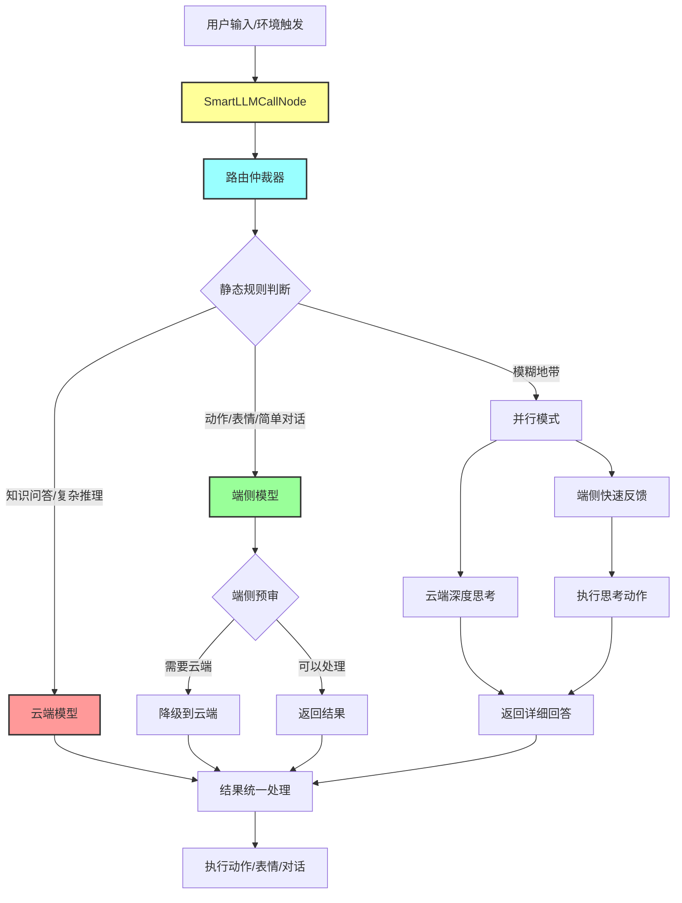
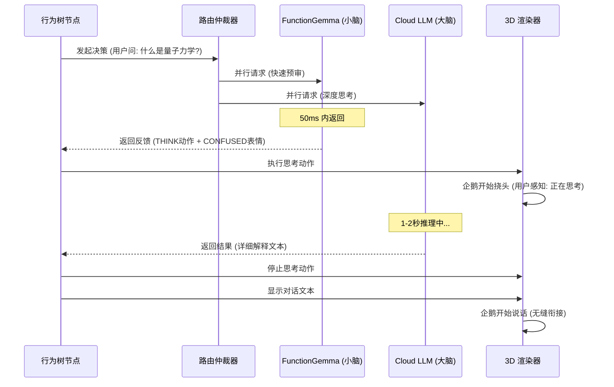
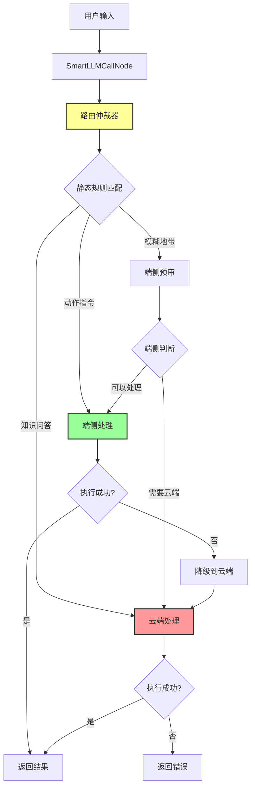

# 端云混合推理架构设计 v2.0：边缘反射 + 云端认知

## 目录
1. [核心设计：双脑协同模型](#1-核心设计双脑协同模型)
2. [行为树集成：智能决策节点](#2-行为树集成智能决策节点)
3. [路由仲裁服务：三层决策机制](#3-路由仲裁服务三层决策机制)
4. [进阶模式：异步并行推理与思考遮掩](#4-进阶模式异步并行推理与思考遮掩)
5. [数据透传标准：统一上下文格式](#5-数据透传标准统一上下文格式)
6. [实现细节：完整代码架构](#6-实现细节完整代码架构)
7. [性能优化与成本控制](#7-性能优化与成本控制)
8. [故障处理与降级策略](#8-故障处理与降级策略)
9. [调试与监控](#9-调试与监控)
10. [最佳实践与设计原则](#10-最佳实践与设计原则)
11. [与其他方案的对比](#11-与其他方案的对比)
12. [未来演进方向](#12-未来演进方向)

---

## 1. 核心设计：双脑协同模型 (Dual-Brain Model)

### 1.1 设计理念

我们将数字形象的智力划分为两个层次，模拟生物的"条件反射"与"高级认知"：

- **边缘小脑 (Edge Reflexes)**：由 **FunctionGemma 270M** 驱动。负责 3D 动画、面部表情、即时情绪反馈及简单日常对话。特点是：毫秒级响应、零成本、保护隐私。
- **云端大脑 (Cloud Cognition)**：由 **GPT-4/Gemini Pro** 驱动。负责知识百科、复杂推理、多轮逻辑规划。特点是：高智商、秒级延迟、按需调用。

### 1.2 架构公式

```
行为输出 = SmartLLMCallNode(统一快照) -> 路由仲裁(Arbiter) -> [边缘决策 | 云端决策 | 混合决策]
```

### 1.3 完整架构流程图



### 1.4 任务分类矩阵

| 任务类型 | 端侧处理 | 云端处理 | 判断依据 | 响应时间 |
| :--- | :--- | :--- | :--- | :--- |
| **动作/表情控制** | ✅ | ❌ | 结构化工具调用 | < 100ms |
| **简单对话** | ✅ | ❌ | 短文本，无知识需求 | < 200ms |
| **知识问答** | ❌ | ✅ | 包含"是什么"、"为什么" | 1-3s |
| **复杂推理** | ❌ | ✅ | 需要多步思考 | 2-5s |
| **创意生成** | ❌ | ✅ | 需要想象力 | 2-4s |
| **代码生成** | ❌ | ✅ | 需要编程知识 | 3-10s |
| **多轮对话理解** | ⚠️ | ✅ | 上下文复杂时 | 1-3s |
| **主动反应** | ✅ | ❌ | 环境快照触发 | < 200ms |

---

## 2. 行为树集成：智能决策节点

### 2.1 设计原则

为了减少行为树的臃肿，我们不再将"端侧调用"和"云端调用"拆分为两个节点，而是封装一个统一的 **`SmartLLMCallNode`**。

**核心优势**：
- **业务抽象**：行为树只关心"需要 AI 决策"，不关心技术实现
- **统一接口**：无论哪端返回，结果格式完全一致
- **自动降级**：端侧失败时自动切换到云端，对行为树透明

### 2.2 行为树视角 (Business Layer)

对于行为树来说，它不关心逻辑是在哪运行的，它只发起"决策请求"：

```typescript
// services/bt/PenguinBT.ts
import { Priority, Sequence, ReactiveSequence } from './composites';
import { CheckBlackboardCondition } from './conditions';
import { SmartLLMCallNode, FunctionExecNode } from './actions';
import { PlayAnimationAction } from './actions';

const masterBrain = new Priority({
  title: 'Hybrid Intelligence Brain',
  children: [
    // 1. 用户输入处理（智能路由）
    new Sequence({
      title: 'Handle User Input',
      children: [
        new CheckBlackboardCondition({ 
          key: 'hasNewInput', 
          value: true,
          title: 'Has User Input?'
        }),
        // 智能节点：内部集成路由仲裁
        new SmartLLMCallNode({ 
          title: 'Smart LLM Decision',
          preference: 'edge_first',
          thinkingAnimation: 'THINK', // 云端等待时的遮掩动作
          fallbackEnabled: true
        }),
        new FunctionExecNode({ title: 'Execute Result' })
      ]
    }),
    
    // 2. 主动反应（端侧优先，保证流畅）
    new ReactiveSequence({
      title: 'Proactive Interaction',
      children: [
        new CheckBlackboardCondition({ 
          key: 'shouldProactiveTick', 
          value: true,
          title: 'Should Proactive?'
        }),
        new SmartLLMCallNode({ 
          title: 'Proactive Response',
          mode: 'edge_only', // 主动反应强制用端侧，省钱
          proactiveMode: true
        }),
        new FunctionExecNode()
      ]
    }),
    
    // 3. 兜底
    new PlayAnimationAction({ 
      action: 'IDLE', 
      title: 'Default Idle' 
    })
  ]
});
```

### 2.3 SmartLLMCallNode 接口设计

```typescript
interface SmartLLMCallNodeOptions extends NodeOptions {
  preference?: 'edge_first' | 'cloud_first' | 'hybrid' | 'edge_only';
  thinkingAnimation?: ActionType; // 云端等待时的遮掩动作
  fallbackEnabled?: boolean; // 是否启用降级
  timeout?: number; // 超时时间
}
```

---

## 3. 路由仲裁服务：三层决策机制

### 3.1 路由仲裁器架构

仲裁器作为一个独立的 Service 组件，位于行为树节点之下，模型层之上。

```typescript
// services/routing/RoutingArbiter.ts
interface RoutingDecision {
  target: 'edge' | 'cloud' | 'hybrid';
  reason: string;
  confidence: number;
  estimatedLatency: number; // 预估延迟（ms）
  estimatedCost: number; // 预估成本（$）
}

class RoutingArbiter {
  private staticRules: StaticRuleMatcher;
  private performanceMonitor: PerformanceMonitor;
  private costTracker: CostTracker;
  
  constructor() {
    this.staticRules = new StaticRuleMatcher();
    this.performanceMonitor = new PerformanceMonitor();
    this.costTracker = new CostTracker();
  }
  
  async decide(
    input: string, 
    context: UnifiedContext,
    preference: 'edge_first' | 'cloud_first' | 'hybrid' | 'edge_only'
  ): Promise<RoutingDecision> {
    // 1. 强制模式检查
    if (preference === 'edge_only') {
      return {
        target: 'edge',
        reason: 'Force edge mode',
        confidence: 1.0,
        estimatedLatency: 100,
        estimatedCost: 0
      };
    }
    
    // 2. 静态规则路由（第一层）
    const staticDecision = this.staticRules.match(input, context);
    if (staticDecision.confidence > 0.9) {
      return staticDecision;
    }
    
    // 3. 端侧预审机制（第二层）
    if (preference === 'edge_first') {
      const edgePreCheck = await this.edgePreScreening(input, context);
      if (edgePreCheck.needsCloud) {
        return {
          target: 'cloud',
          reason: 'Edge pre-screening: too complex',
          confidence: 0.85,
          estimatedLatency: 2000,
          estimatedCost: 0.01
        };
      }
    }
    
    // 4. 动态性能仲裁（第三层）
    const performanceDecision = this.performanceAdaptive(context);
    if (performanceDecision) {
      return performanceDecision;
    }
    
    // 5. 默认决策
    return {
      target: preference === 'cloud_first' ? 'cloud' : 'edge',
      reason: 'Default routing',
      confidence: 0.7,
      estimatedLatency: preference === 'cloud_first' ? 2000 : 100,
      estimatedCost: preference === 'cloud_first' ? 0.01 : 0
    };
  }
}
```

### 3.2 第一层：静态规则路由 (Static Rules)

快速匹配明确的任务类型：

```typescript
class StaticRuleMatcher {
  match(input: string, context: UnifiedContext): RoutingDecision {
    // 知识问答关键词
    const knowledgePatterns = [
      /什么是|什么是|为什么|如何|怎么|解释|介绍|说明|告诉我|你知道|了解/,
      /\?|？/,
      /写.*代码|生成.*代码|实现.*功能/
    ];
    
    if (knowledgePatterns.some(pattern => pattern.test(input))) {
      return {
        target: 'cloud',
        reason: 'Knowledge query detected',
        confidence: 0.95,
        estimatedLatency: 2000,
        estimatedCost: 0.01
      };
    }
    
    // 动作指令关键词
    const actionKeywords = ['跳', '走', '飞', '睡', '舞', '转', '挥手', '点头', '摇头'];
    if (actionKeywords.some(keyword => input.includes(keyword))) {
      return {
        target: 'edge',
        reason: 'Action command detected',
        confidence: 0.95,
        estimatedLatency: 100,
        estimatedCost: 0
      };
    }
    
    // 输入长度过滤
    if (input.length > 200) {
      return {
        target: 'cloud',
        reason: 'Long input, likely complex',
        confidence: 0.8,
        estimatedLatency: 3000,
        estimatedCost: 0.02
      };
    }
    
    return {
      target: 'edge',
      reason: 'No specific pattern matched',
      confidence: 0.5,
      estimatedLatency: 100,
      estimatedCost: 0
    };
  }
}
```

### 3.3 第二层：端侧预审机制 (Edge Pre-screening)

**核心创新**：让 FunctionGemma 自己判断是否需要云端帮助。

#### 3.3.1 特殊工具定义

在 FunctionGemma 的工具集中，添加一个特殊的工具：

```typescript
const ASK_CLOUD_TOOL = {
  name: 'ask_cloud',
  description: 'Request cloud model assistance when the task is too complex',
  parameters: {
    type: 'object',
    properties: {
      reason: {
        type: 'string',
        enum: ['too_complex', 'needs_knowledge', 'needs_reasoning', 'needs_creativity']
      },
      user_query: { type: 'string' }
    }
  }
};
```

#### 3.3.2 预审实现

```typescript
class EdgePreScreener {
  async quickAnalyze(input: string, context: UnifiedContext): Promise<PreCheckResult> {
    // 发送一个极简的请求给端侧模型，只要求它判断是否需要云端
    const quickPrompt = `判断以下问题是否需要云端大模型帮助：\n"${input}"\n\n如果需要，调用 ask_cloud 工具。`;
    
    const result = await this.edgeService.process(quickPrompt, {
      ...context,
      tools: [ASK_CLOUD_TOOL, ANIMATE_AVATAR_TOOL]
    });
    
    // 检查是否调用了 ask_cloud
    const needsCloud = result.toolCalls?.some(
      tc => tc.name === 'ask_cloud'
    ) || false;
    
    return {
      needsCloud,
      confidence: needsCloud ? 0.9 : 0.7,
      edgeResponse: result
    };
  }
}
```

#### 3.3.3 微调数据增强

在数据集中加入端侧"自省"样本：

```json
{
  "messages": [
    {"role": "user", "content": "什么是量子纠缠？"},
    {"role": "assistant", "tool_calls": [{
      "name": "ask_cloud",
      "arguments": {"reason": "needs_knowledge", "user_query": "什么是量子纠缠？"}
    }]}
  ]
}
```

### 3.4 第三层：动态性能仲裁 (Performance Adaptive)

根据网络状态、成本限制、历史性能动态调整：

```typescript
class PerformanceAdaptiveRouter {
  async adaptiveDecision(
    input: string,
    context: UnifiedContext
  ): Promise<RoutingDecision | null> {
    // 1. 网络延迟检查
    const networkLatency = await this.measureNetworkLatency();
    if (networkLatency > 5000) {
      // 网络太慢，强制用端侧
      return {
        target: 'edge',
        reason: 'Network too slow, force edge',
        confidence: 0.9,
        estimatedLatency: 100,
        estimatedCost: 0
      };
    }
    
    // 2. 成本限制检查
    if (!this.costTracker.canMakeCloudCall(0.01)) {
      return {
        target: 'edge',
        reason: 'Cost limit reached',
        confidence: 0.95,
        estimatedLatency: 100,
        estimatedCost: 0
      };
    }
    
    // 3. 云端健康检查
    if (!await this.cloudHealthMonitor.isHealthy()) {
      return {
        target: 'edge',
        reason: 'Cloud service unhealthy',
        confidence: 0.9,
        estimatedLatency: 100,
        estimatedCost: 0
      };
    }
    
    return null; // 无特殊限制，返回 null 使用默认决策
  }
}
```

---

## 4. 进阶模式：异步并行推理与思考遮掩

### 4.1 并行补偿机制

为了彻底消除云端 1-2 秒的等待尴尬，我们引入**"并行补偿机制"**。

#### 4.1.1 流程设计

1. **同时发起**：`SmartLLMCallNode` 同时向端侧和云端发请求。
2. **端侧秒回**：端侧识别出这是一个复杂问题，先返回一个 `actions: ['THINK'], emotion: 'CONFUSED'`。
3. **视觉反馈**：企鹅立刻开始挠头思考，给用户"它正在想"的心理预期。
4. **云端接力**：1 秒后云端语音文本到达，企鹅停止挠头，开始说话。

#### 4.1.2 时序图



### 4.2 混合模式实现

```typescript
class HybridProcessor {
  async processHybrid(
    input: string,
    context: UnifiedContext
  ): Promise<HybridResult> {
    const startTime = Date.now();
    
    // 并行调用
    const [edgePromise, cloudPromise] = [
      this.edgeService.process(input, context),
      this.cloudService.process(input, context)
    ];
    
    // 等待端侧快速响应（最多 200ms）
    const edgeResult = await Promise.race([
      edgePromise,
      new Promise(resolve => setTimeout(() => resolve(null), 200))
    ]);
    
    // 如果端侧快速返回了思考动作，立即执行
    if (edgeResult && edgeResult.actions?.includes('THINK')) {
      this.executeThinkingAnimation(edgeResult);
    }
    
    // 等待云端结果
    const cloudResult = await cloudPromise;
    
    // 合并结果
    return {
      source: 'hybrid',
      // 动作和表情来自端侧（快速反馈）
      actions: edgeResult?.actions || [],
      emotion: edgeResult?.emotion || 'NEUTRAL',
      // 对话文本来自云端（深度内容）
      text: cloudResult.text,
      // 如果云端也返回了工具调用，合并
      toolCalls: this.mergeToolCalls(
        edgeResult?.toolCalls || [],
        cloudResult.toolCalls || []
      ),
      metadata: {
        latency: Date.now() - startTime,
        edgeLatency: edgeResult?.metadata?.latency || 0,
        cloudLatency: cloudResult.metadata?.latency || 0,
        cost: cloudResult.metadata?.cost || 0
      }
    };
  }
  
  private executeThinkingAnimation(result: any): void {
    // 立即执行思考动作，不等待云端
    const blackboard = this.getBlackboard();
    if (result.actions) {
      blackboard.set('pendingActions', result.actions);
    }
    if (result.emotion) {
      blackboard.set('pendingEmotion', result.emotion);
    }
  }
}
```

### 4.3 思考动作库

定义一套标准的"思考遮掩"动作序列：

```typescript
const THINKING_ANIMATIONS = {
  'THINK': ['THINK', 'CONFUSED'],
  'SEARCH': ['LOOK_LEFT', 'LOOK_RIGHT', 'THINK'],
  'CALCULATE': ['THINK', 'CONFUSED'],
  'READ': ['THINK', 'LOOK_LEFT', 'LOOK_RIGHT']
};

// 根据问题类型选择不同的思考动作
function selectThinkingAnimation(input: string): ActionType[] {
  if (input.includes('搜索') || input.includes('查找')) {
    return THINKING_ANIMATIONS.SEARCH;
  }
  if (input.includes('计算') || input.includes('算')) {
    return THINKING_ANIMATIONS.CALCULATE;
  }
  return THINKING_ANIMATIONS.THINK;
}
```

---

## 5. 数据透传标准：统一上下文格式

### 5.1 统一上下文接口

无论发给哪一端，数据格式必须高度一致，确保云端大脑也能感知 3D 状态。

```typescript
interface UnifiedContext {
  // 用户输入
  userInput: string;
  
  // 对话历史（最近 N 轮）
  chatHistory: ChatMessage[];
  
  // 环境快照（用于主动反应）
  environment?: {
    battery?: number;
    idleTime?: number;
    time?: string;
    hour?: number;
    timeOfDay?: 'morning' | 'afternoon' | 'evening' | 'night';
    mood?: string;
    mouseSpeed?: 'low' | 'medium' | 'high';
    userActivity?: 'idle' | 'working' | 'playing' | 'watching';
    activeApp?: string;
  };
  
  // 场景锚点（用于主动反应）
  context?: string;
  
  // 视觉状态（3D 模型当前状态）
  visual?: {
    currentAction?: ActionType;
    currentExpression?: ExpressionType;
    position?: [number, number, number];
  };
  
  // 元数据
  metadata: {
    sessionId: string;
    timestamp: number;
    source: 'user' | 'proactive';
    requestId: string; // 用于追踪
  };
}
```

### 5.2 上下文构建器

```typescript
class UnifiedContextBuilder {
  buildFromBlackboard(
    blackboard: Blackboard,
    userInput: string,
    source: 'user' | 'proactive' = 'user'
  ): UnifiedContext {
    return {
      userInput,
      chatHistory: blackboard.get('chatHistory') || [],
      environment: {
        battery: blackboard.get('battery'),
        idleTime: blackboard.get('idleTime'),
        time: this.getCurrentTime(),
        hour: new Date().getHours(),
        timeOfDay: this.getTimeOfDay(),
        mood: blackboard.get('currentMood'),
        mouseSpeed: blackboard.get('mouseSpeed'),
        userActivity: blackboard.get('userActivity'),
        activeApp: blackboard.get('activeApp')
      },
      context: blackboard.get('proactiveContext'),
      visual: {
        currentAction: blackboard.get('currentAction'),
        currentExpression: blackboard.get('currentExpression'),
        position: blackboard.get('penguinPosition')
      },
      metadata: {
        sessionId: blackboard.get('sessionId') || 'default',
        timestamp: Date.now(),
        source,
        requestId: this.generateRequestId()
      }
    };
  }
  
  private getCurrentTime(): string {
    const now = new Date();
    return `${now.getHours().toString().padStart(2, '0')}:${now.getMinutes().toString().padStart(2, '0')}`;
  }
  
  private getTimeOfDay(): 'morning' | 'afternoon' | 'evening' | 'night' {
    const hour = new Date().getHours();
    if (hour >= 6 && hour < 12) return 'morning';
    if (hour >= 12 && hour < 18) return 'afternoon';
    if (hour >= 18 && hour < 23) return 'evening';
    return 'night';
  }
  
  private generateRequestId(): string {
    return `req_${Date.now()}_${Math.random().toString(36).substr(2, 9)}`;
  }
}
```

### 5.3 上下文压缩（云端专用）

云端模型通常有 Token 限制，需要智能压缩：

```typescript
class ContextCompressor {
  compressForCloud(
    context: UnifiedContext,
    maxTokens: number = 2000
  ): UnifiedContext {
    const compressed: UnifiedContext = { ...context };
    
    // 1. 压缩对话历史
    if (compressed.chatHistory) {
      compressed.chatHistory = this.compressHistory(
        compressed.chatHistory,
        maxTokens * 0.6
      );
    }
    
    // 2. 精简环境快照（只保留关键字段）
    if (compressed.environment) {
      compressed.environment = {
        battery: compressed.environment.battery,
        idleTime: compressed.environment.idleTime,
        timeOfDay: compressed.environment.timeOfDay,
        mood: compressed.environment.mood
        // 删除非关键字段
      };
    }
    
    // 3. 简化视觉状态
    if (compressed.visual) {
      compressed.visual = {
        currentAction: compressed.visual.currentAction
        // 删除位置等细节
      };
    }
    
    return compressed;
  }
  
  private compressHistory(
    history: ChatMessage[],
    maxTokens: number
  ): ChatMessage[] {
    // 保留最近的对话
    let recent = history.slice(-10);
    
    // 如果还是太长，进一步压缩
    if (this.estimateTokens(recent) > maxTokens) {
      // 保留首尾，中间总结
      return [
        recent[0],
        {
          role: 'system',
          content: `... (省略了 ${recent.length - 2} 轮对话) ...`
        },
        ...recent.slice(-3)
      ];
    }
    
    return recent;
  }
  
  private estimateTokens(messages: ChatMessage[]): number {
    // 简单估算：1 token ≈ 4 字符
    const totalChars = messages.reduce(
      (sum, msg) => sum + (msg.content?.length || 0),
      0
    );
    return Math.ceil(totalChars / 4);
  }
}
```

---

## 6. 实现细节：完整代码架构

### 6.1 SmartLLMCallNode 完整实现

```typescript
// services/bt/actions/SmartLLMCallNode.ts
import Action from '../core/Action';
import { SUCCESS, FAILURE, RUNNING } from '../constants';
import Tick from '../core/Tick';
import { NodeOptions } from '../core/BaseNode';
import { RoutingArbiter } from '../../routing/RoutingArbiter';
import { UnifiedContextBuilder } from '../../routing/UnifiedContextBuilder';
import { ResultUnifier } from '../../routing/ResultUnifier';
import { ResultExecutor } from '../../routing/ResultExecutor';
import { sendToFunctionGemma } from '../../functionGemmaService';
import { sendToCloudLLM } from '../../cloudLLMService';

interface SmartLLMCallNodeOptions extends NodeOptions {
  preference?: 'edge_first' | 'cloud_first' | 'hybrid' | 'edge_only';
  thinkingAnimation?: ActionType;
  fallbackEnabled?: boolean;
  timeout?: number;
}

export default class SmartLLMCallNode extends Action {
  private routingArbiter: RoutingArbiter;
  private contextBuilder: UnifiedContextBuilder;
  private resultUnifier: ResultUnifier;
  private resultExecutor: ResultExecutor;
  
  public preference: 'edge_first' | 'cloud_first' | 'hybrid' | 'edge_only';
  public thinkingAnimation?: ActionType;
  public fallbackEnabled: boolean;
  public timeout: number;
  
  constructor(options: SmartLLMCallNodeOptions = {}) {
    const {
      preference = 'edge_first',
      thinkingAnimation,
      fallbackEnabled = true,
      timeout = 30000,
      ...rest
    } = options;
    
    super({ name: 'SmartLLMCallNode', ...rest });
    
    this.preference = preference;
    this.thinkingAnimation = thinkingAnimation;
    this.fallbackEnabled = fallbackEnabled;
    this.timeout = timeout;
    
    this.routingArbiter = new RoutingArbiter();
    this.contextBuilder = new UnifiedContextBuilder();
    this.resultUnifier = new ResultUnifier();
    this.resultExecutor = new ResultExecutor();
  }
  
  async tick(tick: Tick): Promise<number> {
    const blackboard = tick.blackboard;
    if (!blackboard) return FAILURE;
    
    // 构建统一上下文
    const userInput = blackboard.get('lastUserInput') || '';
    const source = blackboard.get('hasNewInput') ? 'user' : 'proactive';
    
    if (!userInput && source === 'user') {
      return FAILURE;
    }
    
    const context = this.contextBuilder.buildFromBlackboard(
      blackboard,
      userInput,
      source
    );
    
    // 路由决策
    const decision = await this.routingArbiter.decide(
      userInput,
      context,
      this.preference
    );
    
    console.log(`[SmartLLMCallNode] Routing decision:`, decision);
    
    const startTime = Date.now();
    let result: UnifiedResult;
    
    try {
      // 根据决策执行
      if (decision.target === 'edge') {
        result = await this.processEdge(context, startTime);
        
      } else if (decision.target === 'cloud') {
        result = await this.processCloud(context, startTime);
        
      } else {
        // 混合模式
        result = await this.processHybrid(context, startTime);
      }
      
      // 存储结果
      blackboard.set('llmResult', result);
      
      // 执行结果
      await this.resultExecutor.execute(result, blackboard);
      
      return SUCCESS;
      
    } catch (error) {
      console.error('[SmartLLMCallNode] Error:', error);
      
      // 降级处理
      if (this.fallbackEnabled && decision.target === 'edge') {
        console.warn('[Fallback] Edge failed, trying cloud...');
        try {
          result = await this.processCloud(context, startTime);
          blackboard.set('llmResult', result);
          await this.resultExecutor.execute(result, blackboard);
          return SUCCESS;
        } catch (fallbackError) {
          console.error('[Fallback] Cloud also failed:', fallbackError);
        }
      }
      
      return FAILURE;
    }
  }
  
  private async processEdge(
    context: UnifiedContext,
    startTime: number
  ): Promise<UnifiedResult> {
    const edgeResult = await sendToFunctionGemma(
      context.chatHistory,
      context.userInput,
      context.metadata // 包含 llmSettings
    );
    
    return this.resultUnifier.unifyEdgeResult(
      edgeResult,
      Date.now() - startTime
    );
  }
  
  private async processCloud(
    context: UnifiedContext,
    startTime: number
  ): Promise<UnifiedResult> {
    // 压缩上下文（云端有 Token 限制）
    const compressedContext = new ContextCompressor().compressForCloud(context);
    
    // 如果设置了思考动画，先执行
    if (this.thinkingAnimation) {
      const thinkingResult = {
        actions: [this.thinkingAnimation],
        emotion: 'CONFUSED' as ExpressionType
      };
      // 立即执行思考动作
      const blackboard = this.getBlackboard();
      blackboard?.set('pendingActions', thinkingResult.actions);
      blackboard?.set('pendingEmotion', thinkingResult.emotion);
    }
    
    const cloudResult = await sendToCloudLLM(
      compressedContext,
      context.metadata
    );
    
    return this.resultUnifier.unifyCloudResult(
      cloudResult,
      Date.now() - startTime,
      this.estimateCost(cloudResult)
    );
  }
  
  private async processHybrid(
    context: UnifiedContext,
    startTime: number
  ): Promise<UnifiedResult> {
    const hybridProcessor = new HybridProcessor();
    return await hybridProcessor.processHybrid(context.userInput, context);
  }
  
  private estimateCost(cloudResult: any): number {
    // 简单估算：$0.01 per 1000 tokens
    const tokens = cloudResult.tokensUsed || 0;
    return (tokens / 1000) * 0.01;
  }
  
  private getBlackboard(): Blackboard | null {
    // 通过某种方式获取当前 blackboard
    // 这里需要根据实际架构调整
    return null;
  }
}
```

### 6.2 云端模型服务实现

```typescript
// services/cloudLLMService.ts
import { UnifiedContext } from '../types/routing';

interface CloudLLMConfig {
  provider: 'openai' | 'anthropic' | 'google' | 'custom';
  apiKey: string;
  model: string;
  baseUrl?: string;
  maxTokens: number;
  temperature: number;
}

export const sendToCloudLLM = async (
  context: UnifiedContext,
  metadata: any
): Promise<CloudModelResult> => {
  const config: CloudLLMConfig = metadata.llmSettings?.cloud || getDefaultCloudConfig();
  
  // 构建消息列表
  const messages = buildMessages(context);
  
  // 根据 provider 调用不同的 API
  switch (config.provider) {
    case 'openai':
      return await callOpenAI(messages, config);
    case 'google':
      return await callGoogle(messages, config);
    case 'anthropic':
      return await callAnthropic(messages, config);
    default:
      return await callCustomAPI(messages, config);
  }
};

function buildMessages(context: UnifiedContext): any[] {
  const messages: any[] = [];
  
  // System prompt（包含环境上下文）
  const systemPrompt = buildSystemPrompt(context);
  messages.push({ role: 'system', content: systemPrompt });
  
  // 对话历史
  context.chatHistory.forEach(msg => {
    messages.push({
      role: msg.role === 'model' ? 'assistant' : msg.role,
      content: msg.content
    });
  });
  
  // 当前用户输入
  messages.push({ role: 'user', content: context.userInput });
  
  return messages;
}

function buildSystemPrompt(context: UnifiedContext): string {
  let prompt = `你是一个数字企鹅助手，具有以下特点：
- 你可以控制企鹅的动作和表情
- 你能够回答知识问题和进行复杂推理
- 你了解当前的环境状态
  
当前环境：`;
  
  if (context.environment) {
    prompt += `\n- 电量: ${context.environment.battery}%`;
    prompt += `\n- 空闲时间: ${context.environment.idleTime}秒`;
    prompt += `\n- 时间: ${context.environment.timeOfDay}`;
  }
  
  if (context.visual) {
    prompt += `\n- 当前动作: ${context.visual.currentAction}`;
    prompt += `\n- 当前表情: ${context.visual.currentExpression}`;
  }
  
  prompt += `\n\n请根据用户的问题，提供合适的回答。如果需要控制企鹅的动作，可以使用 animate_avatar 工具。`;
  
  return prompt;
}

async function callOpenAI(messages: any[], config: CloudLLMConfig): Promise<CloudModelResult> {
  const response = await fetch('https://api.openai.com/v1/chat/completions', {
    method: 'POST',
    headers: {
      'Content-Type': 'application/json',
      'Authorization': `Bearer ${config.apiKey}`
    },
    body: JSON.stringify({
      model: config.model,
      messages,
      max_tokens: config.maxTokens,
      temperature: config.temperature,
      tools: getCloudToolDefinitions()
    })
  });
  
  const data = await response.json();
  const message = data.choices[0].message;
  
  return {
    text: message.content || '',
    toolCalls: message.tool_calls?.map((tc: any) => ({
      id: tc.id,
      name: tc.function.name,
      arguments: JSON.parse(tc.function.arguments)
    })),
    tokensUsed: data.usage?.total_tokens || 0,
    confidence: 0.9
  };
}
```

---

## 7. 性能优化与成本控制

### 7.1 缓存策略

#### 7.1.1 云端结果缓存

```typescript
class CloudResultCache {
  private cache: Map<string, CacheEntry> = new Map();
  private ttl: number = 3600000; // 1小时
  
  get(key: string): UnifiedResult | null {
    const entry = this.cache.get(key);
    if (!entry) return null;
    
    if (Date.now() - entry.timestamp > this.ttl) {
      this.cache.delete(key);
      return null;
    }
    
    return entry.result;
  }
  
  set(key: string, result: UnifiedResult): void {
    this.cache.set(key, {
      result,
      timestamp: Date.now()
    });
  }
  
  generateKey(input: string, context: UnifiedContext): string {
    // 基于输入和关键上下文生成缓存键
    const keyData = {
      input: input.substring(0, 100), // 只取前100字符
      battery: context.environment?.battery,
      timeOfDay: context.environment?.timeOfDay
    };
    return btoa(JSON.stringify(keyData));
  }
}
```

#### 7.1.2 端侧结果缓存

端侧结果也可以缓存，特别是主动反应的快照：

```typescript
class EdgeResultCache {
  private cache: Map<string, CacheEntry> = new Map();
  private ttl: number = 5000; // 5秒（主动反应场景）
  
  get(snapshot: string): any | null {
    const entry = this.cache.get(snapshot);
    if (entry && Date.now() - entry.timestamp < this.ttl) {
      return entry.result;
    }
    return null;
  }
  
  set(snapshot: string, result: any): void {
    this.cache.set(snapshot, {
      result,
      timestamp: Date.now()
    });
  }
}
```

### 7.2 成本控制机制

#### 7.2.1 成本追踪器

```typescript
class CostTracker {
  private dailyCost: number = 0;
  private dailyLimit: number;
  private costHistory: CostRecord[] = [];
  
  constructor(dailyLimit: number = 10) {
    this.dailyLimit = dailyLimit;
    this.loadDailyCost();
  }
  
  canMakeCloudCall(estimatedCost: number): boolean {
    if (this.dailyCost + estimatedCost > this.dailyLimit) {
      console.warn(`[Cost] Daily limit reached: $${this.dailyCost.toFixed(2)}/${this.dailyLimit}`);
      return false;
    }
    return true;
  }
  
  recordCost(cost: number, reason: string): void {
    this.dailyCost += cost;
    this.costHistory.push({
      timestamp: Date.now(),
      cost,
      reason
    });
    this.saveDailyCost();
  }
  
  getDailyStats() {
    return {
      totalCost: this.dailyCost,
      remaining: this.dailyLimit - this.dailyCost,
      callCount: this.costHistory.length,
      avgCost: this.dailyCost / this.costHistory.length || 0
    };
  }
  
  private loadDailyCost(): void {
    const today = new Date().toDateString();
    const saved = localStorage.getItem(`cloud_cost_${today}`);
    if (saved) {
      this.dailyCost = parseFloat(saved);
    }
  }
  
  private saveDailyCost(): void {
    const today = new Date().toDateString();
    localStorage.setItem(`cloud_cost_${today}`, this.dailyCost.toString());
  }
}
```

#### 7.2.2 成本优化策略

```typescript
class CostOptimizer {
  // 批量处理：将多个简单问题合并为一次调用
  async batchProcess(queries: string[]): Promise<UnifiedResult[]> {
    if (queries.length === 0) return [];
    
    // 如果问题相似，合并为一个请求
    const combinedQuery = queries.join('\n\n');
    const result = await sendToCloudLLM(
      { userInput: combinedQuery, ... },
      metadata
    );
    
    // 解析批量结果（需要模型支持）
    return this.parseBatchResult(result);
  }
  
  // 延迟处理：非紧急问题可以延迟到批量处理
  queueForBatch(query: string, priority: 'high' | 'low'): void {
    if (priority === 'low') {
      this.batchQueue.push(query);
      // 每 10 秒或队列满 5 个时批量处理
      if (this.batchQueue.length >= 5) {
        this.processBatch();
      }
    } else {
      // 高优先级立即处理
      this.processImmediate(query);
    }
  }
}
```

### 7.3 性能监控

```typescript
class PerformanceMonitor {
  private metrics: PerformanceMetrics = {
    edgeCalls: 0,
    cloudCalls: 0,
    hybridCalls: 0,
    totalLatency: 0,
    totalCost: 0,
    edgeAvgLatency: 0,
    cloudAvgLatency: 0,
    cacheHits: 0,
    cacheMisses: 0
  };
  
  recordCall(
    source: 'edge' | 'cloud' | 'hybrid',
    latency: number,
    cost: number = 0,
    cached: boolean = false
  ): void {
    if (source === 'edge') {
      this.metrics.edgeCalls++;
      this.metrics.edgeAvgLatency = 
        (this.metrics.edgeAvgLatency * (this.metrics.edgeCalls - 1) + latency) / 
        this.metrics.edgeCalls;
    } else if (source === 'cloud') {
      this.metrics.cloudCalls++;
      this.metrics.cloudAvgLatency = 
        (this.metrics.cloudAvgLatency * (this.metrics.cloudCalls - 1) + latency) / 
        this.metrics.cloudCalls;
      this.metrics.totalCost += cost;
    } else {
      this.metrics.hybridCalls++;
    }
    
    this.metrics.totalLatency += latency;
    
    if (cached) {
      this.metrics.cacheHits++;
    } else {
      this.metrics.cacheMisses++;
    }
  }
  
  getStats(): PerformanceStats {
    const totalCalls = this.metrics.edgeCalls + 
                      this.metrics.cloudCalls + 
                      this.metrics.hybridCalls;
    
    return {
      ...this.metrics,
      totalCalls,
      edgeRatio: this.metrics.edgeCalls / totalCalls,
      cloudRatio: this.metrics.cloudCalls / totalCalls,
      cacheHitRate: this.metrics.cacheHits / 
                   (this.metrics.cacheHits + this.metrics.cacheMisses),
      avgLatency: this.metrics.totalLatency / totalCalls
    };
  }
}
```

---

## 8. 故障处理与降级策略

### 8.1 健康检查机制

```typescript
class CloudHealthMonitor {
  private isHealthy: boolean = true;
  private consecutiveFailures: number = 0;
  private maxFailures: number = 3;
  private lastCheckTime: number = 0;
  private checkInterval: number = 60000; // 1分钟检查一次
  
  async checkHealth(): Promise<boolean> {
    const now = Date.now();
    if (now - this.lastCheckTime < this.checkInterval) {
      return this.isHealthy;
    }
    
    this.lastCheckTime = now;
    
    try {
      // 发送一个极简的健康检查请求
      const startTime = Date.now();
      await fetch('https://api.openai.com/v1/models', {
        method: 'GET',
        headers: { 'Authorization': `Bearer ${this.apiKey}` }
      });
      
      const latency = Date.now() - startTime;
      
      // 如果延迟过高，也认为不健康
      if (latency > 5000) {
        throw new Error('High latency');
      }
      
      this.isHealthy = true;
      this.consecutiveFailures = 0;
      return true;
      
    } catch (error) {
      this.consecutiveFailures++;
      if (this.consecutiveFailures >= this.maxFailures) {
        this.isHealthy = false;
        console.error('[Cloud] Service unhealthy, falling back to edge');
      }
      return false;
    }
  }
  
  shouldUseCloud(): boolean {
    return this.isHealthy;
  }
  
  getHealthStatus(): HealthStatus {
    return {
      isHealthy: this.isHealthy,
      consecutiveFailures: this.consecutiveFailures,
      lastCheckTime: this.lastCheckTime
    };
  }
}
```

### 8.2 超时处理

```typescript
class TimeoutHandler {
  async withTimeout<T>(
    promise: Promise<T>,
    timeout: number,
    fallback?: () => Promise<T>
  ): Promise<T> {
    return Promise.race([
      promise,
      new Promise<T>((_, reject) => 
        setTimeout(() => reject(new Error('Timeout')), timeout)
      )
    ]).catch(async (error) => {
      if (error.message === 'Timeout' && fallback) {
        console.warn(`[Timeout] Operation timed out, using fallback`);
        return await fallback();
      }
      throw error;
    });
  }
}

// 使用示例
const result = await timeoutHandler.withTimeout(
  cloudService.process(input, context),
  5000, // 5秒超时
  async () => {
    // 超时后降级到端侧
    return await edgeService.process(input, context);
  }
);
```

### 8.3 错误恢复策略

```typescript
class ErrorRecovery {
  async processWithRetry<T>(
    operation: () => Promise<T>,
    maxRetries: number = 3,
    retryDelay: number = 1000
  ): Promise<T> {
    let lastError: Error | null = null;
    
    for (let i = 0; i < maxRetries; i++) {
      try {
        return await operation();
      } catch (error) {
        lastError = error as Error;
        console.warn(`[Retry] Attempt ${i + 1} failed:`, error);
        
        if (i < maxRetries - 1) {
          await this.delay(retryDelay * (i + 1)); // 指数退避
        }
      }
    }
    
    throw lastError || new Error('All retries failed');
  }
  
  private delay(ms: number): Promise<void> {
    return new Promise(resolve => setTimeout(resolve, ms));
  }
}
```

---

## 9. 调试与监控

### 9.1 路由决策日志

```typescript
class RoutingLogger {
  logDecision(
    decision: RoutingDecision,
    input: string,
    context: UnifiedContext
  ): void {
    const logEntry = {
      timestamp: new Date().toISOString(),
      decision: decision.target,
      reason: decision.reason,
      confidence: decision.confidence,
      input: input.substring(0, 50), // 只记录前50字符
      inputLength: input.length,
      contextSize: JSON.stringify(context).length,
      estimatedLatency: decision.estimatedLatency,
      estimatedCost: decision.estimatedCost
    };
    
    console.log('[Routing Decision]', logEntry);
    
    // 可选：发送到监控服务
    if (this.monitoringEnabled) {
      this.sendToMonitoring(logEntry);
    }
  }
  
  logResult(result: UnifiedResult, decision: RoutingDecision): void {
    const logEntry = {
      timestamp: new Date().toISOString(),
      source: result.source,
      actualLatency: result.metadata.latency,
      estimatedLatency: decision.estimatedLatency,
      actualCost: result.metadata.cost,
      estimatedCost: decision.estimatedCost,
      hasActions: !!result.actions?.length,
      hasText: !!result.text,
      hasToolCalls: !!result.toolCalls?.length
    };
    
    console.log('[Routing Result]', logEntry);
  }
}
```

### 9.2 可视化监控面板

```typescript
// components/HybridStatusPanel.tsx
import React from 'react';
import { PerformanceStats } from '../types/routing';

interface HybridStatusPanelProps {
  stats: PerformanceStats;
  healthStatus: HealthStatus;
  costStats: CostStats;
}

export const HybridStatusPanel: React.FC<HybridStatusPanelProps> = ({
  stats,
  healthStatus,
  costStats
}) => {
  return (
    <div className="hybrid-status-panel bg-slate-800 p-4 rounded-lg">
      <h3 className="text-lg font-bold mb-4">端云混合状态</h3>
      
      {/* 调用统计 */}
      <div className="stats-grid grid grid-cols-3 gap-4 mb-4">
        <div className="stat-card bg-green-900/30 p-3 rounded">
          <div className="text-sm text-slate-400">端侧调用</div>
          <div className="text-2xl font-bold text-green-400">{stats.edgeCalls}</div>
          <div className="text-xs text-slate-500">
            占比: {(stats.edgeRatio * 100).toFixed(1)}%
          </div>
        </div>
        
        <div className="stat-card bg-red-900/30 p-3 rounded">
          <div className="text-sm text-slate-400">云端调用</div>
          <div className="text-2xl font-bold text-red-400">{stats.cloudCalls}</div>
          <div className="text-xs text-slate-500">
            占比: {(stats.cloudRatio * 100).toFixed(1)}%
          </div>
        </div>
        
        <div className="stat-card bg-purple-900/30 p-3 rounded">
          <div className="text-sm text-slate-400">混合调用</div>
          <div className="text-2xl font-bold text-purple-400">{stats.hybridCalls}</div>
        </div>
      </div>
      
      {/* 性能指标 */}
      <div className="performance-metrics mb-4">
        <div className="metric flex justify-between mb-2">
          <span className="text-slate-400">端侧平均延迟</span>
          <span className="text-green-400">{stats.edgeAvgLatency.toFixed(0)}ms</span>
        </div>
        <div className="metric flex justify-between mb-2">
          <span className="text-slate-400">云端平均延迟</span>
          <span className="text-red-400">{stats.cloudAvgLatency.toFixed(0)}ms</span>
        </div>
        <div className="metric flex justify-between mb-2">
          <span className="text-slate-400">缓存命中率</span>
          <span className="text-blue-400">{(stats.cacheHitRate * 100).toFixed(1)}%</span>
        </div>
      </div>
      
      {/* 成本统计 */}
      <div className="cost-stats mb-4">
        <div className="metric flex justify-between">
          <span className="text-slate-400">今日成本</span>
          <span className="text-yellow-400">${costStats.totalCost.toFixed(2)}</span>
        </div>
        <div className="metric flex justify-between">
          <span className="text-slate-400">剩余额度</span>
          <span className="text-yellow-400">${costStats.remaining.toFixed(2)}</span>
        </div>
        <div className="progress-bar bg-slate-700 h-2 rounded mt-2">
          <div 
            className="bg-yellow-400 h-2 rounded transition-all"
            style={{ width: `${(costStats.totalCost / costStats.limit) * 100}%` }}
          />
        </div>
      </div>
      
      {/* 健康状态 */}
      <div className="health-status">
        <div className="flex items-center gap-2">
          <div className={`w-3 h-3 rounded-full ${
            healthStatus.isHealthy ? 'bg-green-500' : 'bg-red-500'
          }`} />
          <span className="text-slate-400">
            云端服务: {healthStatus.isHealthy ? '正常' : '异常'}
          </span>
        </div>
      </div>
    </div>
  );
};
```

---

## 10. 最佳实践与设计原则

### 10.1 路由决策原则

1. **默认端侧优先**：除非明确需要云端能力，否则优先使用端侧
2. **快速失败**：端侧超时（如 200ms）立即切换到云端
3. **成本意识**：知识问答等非关键功能可以延迟或批量处理
4. **用户体验**：动作/表情等即时反馈必须用端侧，对话可以异步用云端

### 10.2 数据透传原则

1. **最小化上下文**：只传递必要的上下文数据
2. **格式统一**：端侧和云端使用相同的上下文格式
3. **压缩优化**：长对话历史需要压缩或总结
4. **隐私保护**：敏感数据不上传到云端

### 10.3 成本控制原则

1. **设置每日限额**：防止意外超支
2. **缓存结果**：相同问题不重复调用云端
3. **批量处理**：多个问题可以合并为一次调用
4. **监控告警**：成本异常时及时通知

### 10.4 性能优化原则

1. **并行处理**：端侧和云端可以并行调用
2. **结果缓存**：相同输入缓存结果
3. **超时控制**：设置合理的超时时间
4. **降级策略**：云端不可用时自动降级

---

## 11. 与其他方案的对比

### 11.1 纯端侧方案

| 特性 | 纯端侧 | 端云混合 |
| :--- | :--- | :--- |
| **响应速度** | 极快 (< 100ms) | 快 (端侧) / 慢 (云端) |
| **知识能力** | 有限 | 强大 |
| **成本** | 零 | 可控 |
| **隐私** | 完全本地 | 部分上传 |
| **适用场景** | 简单交互 | 复杂交互 |

### 11.2 纯云端方案

| 特性 | 纯云端 | 端云混合 |
| :--- | :--- | :--- |
| **响应速度** | 慢 (1-3s) | 快 (端侧) / 慢 (云端) |
| **知识能力** | 强大 | 强大 |
| **成本** | 高 | 可控 |
| **离线能力** | 无 | 有 (端侧) |
| **适用场景** | 知识问答 | 全场景 |

### 11.3 混合方案的优势

1. **最佳性能**：端侧处理 90% 的请求，保证响应速度
2. **智能增强**：云端处理 10% 的复杂请求，提供高智商
3. **成本可控**：通过路由仲裁，将成本控制在合理范围
4. **用户体验**：通过并行推理和思考遮掩，消除等待感

---

## 12. 未来演进方向

### 12.1 模型升级路径

当端侧模型从 270M 升级到 4B/8B 时：
- 路由决策可以更智能（端侧能处理更多任务）
- 混合模式可以更精细（端侧负责推理，云端负责知识）
- 成本可以进一步降低（减少云端调用）

### 12.2 功能扩展

1. **多模态支持**：云端模型可以处理图像、音频输入
2. **长期记忆**：云端模型可以维护长期对话记忆
3. **个性化**：根据用户习惯动态调整路由策略
4. **A/B 测试**：测试不同的路由策略效果

### 12.3 架构优化

1. **边缘计算**：在边缘部署更大的模型（如 4B）
2. **模型蒸馏**：将云端模型知识蒸馏到端侧
3. **增量学习**：端侧模型可以持续学习用户偏好
4. **联邦学习**：多个设备协同训练模型

---

## 附录

### A. 完整路由决策流程图



### B. 工具定义示例

端侧工具（FunctionGemma）：
```json
{
  "name": "animate_avatar",
  "description": "控制企鹅的动作和表情",
  "parameters": {
    "actions": ["DANCE", "JUMP", ...],
    "emotion": ["HAPPY", "SAD", ...]
  }
}
```

端侧特殊工具（自省）：
```json
{
  "name": "ask_cloud",
  "description": "当任务过于复杂时，请求云端模型帮助",
  "parameters": {
    "reason": "too_complex | needs_knowledge | needs_reasoning",
    "user_query": "string"
  }
}
```

云端工具（GPT-4）：
```json
{
  "name": "search_knowledge",
  "description": "搜索知识库",
  "parameters": {
    "query": "string"
  }
}
```

### C. 相关文档链接

- [FunctionGemma 主动反应架构指南](./FunctionGemma_主动反应架构指南.md)
- [Autonomous Persona 8B 大模型方案](./Autonomous_Persona_8B_大模型方案.md)
- [行为树节点文档](./BT_Nodes.md)

---

*文档版本: v2.0 (Dual-Brain Architecture)*  
*最后更新: 2025-01-01*  
*作者: Gemini AI Assistant*
