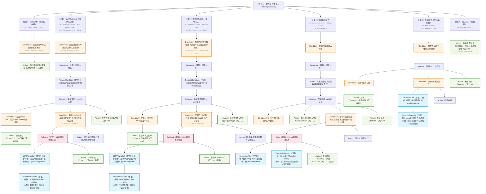

1. ## 工具调用与行为树对比

要理解**多智能体/工具调用（ReAct/Agentic架构）** 与**游戏行为树（Behavior Tree, BT）** 的异同，并找到可借鉴的思想，我们先从核心定义切入，再拆解异同，最后聚焦落地性的借鉴方向。

### 一、核心概念回顾

| 维度     | 多智能体/工具调用（ReAct/Agentic）                                                          | 游戏行为树（BT）                                                                                   |
| -------- | ------------------------------------------------------------------------------------------- | -------------------------------------------------------------------------------------------------- |
| 本质     | 基于大模型的**认知推理型决策** ，核心是“思考-行动-观察”循环，通过工具调用与外部交互 | 基于预定义规则的**层级化行为编排** ，核心是节点（条件/动作/组合/装饰），自上而下的确定性决策 |
| 目标     | 处理开放、模糊、动态的复杂任务（如“完成数据分析报告”）                                    | 处理封闭、明确、实时的游戏AI行为（如“攻击最近敌人”“血量低时逃跑”）                             |
| 核心依赖 | 大模型的语义理解、逻辑推理能力                                                              | 开发者编码的规则/条件-动作映射                                                                     |

### 二、核心异同分析

#### （一）相同点：底层决策逻辑的共性

两者都是为了解决 **复杂行为的有序执行** ，核心共性集中在：

1. **层级化/模块化分解** ：

BT将复杂行为拆分为“序列/选择/并行”的子节点（如“打怪”→“移动→攻击→捡装备”）；智能体也会将复杂目标拆分为子任务（如“写报告”→“调数据→分析→生成文本”），多智能体更是天然的层级分工（管理智能体→执行智能体）。

2. **条件触发的闭环** ：

BT通过“条件节点（Condition）”判断是否执行动作（如“血量<30%→逃跑”）；智能体工具调用前也会判断“是否需要调用工具/调用哪个工具”（ReAct的“思考”步骤本质是条件判断），且两者都依赖“执行-反馈”闭环调整后续行为。

3. **串行/并行执行逻辑** ：

BT的“序列节点（Sequence）”“并行节点（Parallel）”对应智能体的串行工具调用（如先查数据再分析）、多智能体的并行任务（如数据智能体+分析智能体同时工作）。

4. **失败容错的需求** ：

BT有“重试（Retry）”“回退（Fallback）”装饰节点；智能体工具调用也需要处理API失败、结果异常等问题，多智能体协作需应对单个智能体执行失败的情况。

#### （二）不同点：核心能力的互补性

| 对比维度     | 多智能体/工具调用                                  | 游戏行为树                                           |
| ------------ | -------------------------------------------------- | ---------------------------------------------------- |
| 决策灵活性   | 动态自适应，可处理未见过的开放任务（无预定义流程） | 固定层级结构，仅能处理预定义的封闭行为               |
| 不确定性处理 | 擅长模糊环境（如自然语言指令），通过推理试错调整   | 依赖预设分支，仅处理确定性游戏规则（如仇恨值、血量） |
| 抽象层级     | 工具是高抽象度外部接口（API、函数、人工）          | 动作是低抽象度游戏原子行为（移动、攻击、喊话）       |
| 实时性       | 推理耗时（大模型响应），实时性差                   | 毫秒级响应，适配游戏帧同步                           |
| 可解释性     | 推理链可解释，但逻辑隐式（大模型黑盒）             | 完全显式，节点流程可可视化调试                       |
| 学习能力     | 可通过Prompt/微调进化，自主适应新场景              | 无自主学习，需开发者手动修改节点                     |
| 多智能体协作 | 自主协商分工（如对话式任务分配）                   | 预设协作规则（如组队仇恨链、NPC交互逻辑）            |

### 三、可从行为树借鉴的核心思想（结合Agentic架构落地）

行为树的核心优势是 **结构化、确定性、可调试、高效率** ，而多智能体/工具调用的痛点是“大模型推理的不可控、工具调用混乱、调试难”——借鉴BT的思想，可弥补这些痛点，同时保留大模型的推理灵活性。

#### 1. 层级化行为分解：给智能体加“结构化决策骨架”

* BT的核心：将复杂行为拆分为“组合节点（序列/选择/并行）+ 原子节点（条件/动作）”，形成清晰的层级。
* 借鉴落地：
  * 给ReAct循环设计 **目标分解层级** ：将“思考”步骤从纯文本推理，拆为“判断目标是否完成→选择子目标→选择工具”的结构化节点（如SequenceNode串行执行工具、SelectorNode根据结果选工具）。
  * 多智能体分工层级化：设计“管理节点+执行节点”，比如“任务调度智能体（高层）”拆分任务为“数据抓取/分析/生成”，再分配给不同执行智能体（并行节点ParallelNode）。
  * 示例：把“生成营销方案”拆为：
    `SequenceNode(查竞品数据→分析用户画像→生成方案→审核方案)`，其中“审核失败”触发SelectorNode（重写方案/调整参数）。

#### 2. 显式条件判断：减少工具调用的“无效推理”

* BT的核心：Condition节点定义“前置条件”（如“血量<30%→逃跑”），且有优先级（逃跑>攻击）。
* 借鉴落地：
  * 构建 **工具触发规则库** ：用显式规则替代纯大模型推理，做工具调用的“第一层筛选”（如“问题含实时数据→调用搜索工具”“计算复杂→调用计算器”），并定义优先级（本地缓存>API>人工）。
  * 示例：工具调用前先执行ConditionCheck：
    `if 问题类型 == 实时天气 → 调用天气API；elif 问题类型 == 数学计算 → 调用计算器；else → 大模型直接回答`。

#### 3. 失败处理与回退：提升工具调用的容错性

* BT的核心：装饰节点（Retry/Fallback）处理失败（如“攻击失败→重试→再失败则逃跑”）。
* 借鉴落地：
  * 给工具调用加 **容错装饰器** ：RetryDecorator（API超时重试2次）、FallbackDecorator（工具A失败则切换工具B）。
  * 多智能体回退：某个执行智能体失败时，自动切换到备用智能体（如“数据抓取智能体挂了→切换到备用爬虫智能体”）。
  * 示例：`FallbackNode(调用主天气API → 调用备用天气API → 返回默认值)`。

#### 4. 模块化复用：降低智能体开发成本

* BT的核心：节点可复用（如“移动到目标”节点适配打怪/捡装备/对话）。
* 借鉴落地：
  * 构建 **通用智能体组件库** ：工具层（通用数据查询、文本生成工具）、行为层（复用的目标分解、失败重试节点）、推理层（通用ReAct模板）。
  * 示例：“数据清洗工具”可复用在“营销分析”“用户画像”等不同智能体中，无需重复开发。

#### 5. 可视化与可调试：解决大模型“黑盒”问题

* BT的核心：节点流程可可视化（如Unity的BT编辑器），开发者可直观定位“逃跑节点未触发”是因为血量条件错误。
* 借鉴落地：
  * 开发智能体行为可视化面板：将ReAct循环的“思考-行动-观察”映射为BT节点流程，展示每一步的“目标→条件→工具→反馈”。
  * 调试效率提升：通过可视化快速定位“工具调用错误”是因为条件节点逻辑错，而非大模型幻觉。

#### 6. 优先级与中断机制：提升智能体的响应性

* BT的核心：Interrupt节点支持高优先级行为中断低优先级行为（如“被攻击”中断“捡装备”）。
* 借鉴落地：
  * 给智能体任务/工具设置优先级：“紧急告警处理”优先级>“常规数据分析”，触发时中断当前流程。
  * 外部中断支持：用户实时指令、系统告警可中断智能体当前的工具调用，切换到高优先级任务。
  * 示例：`InterruptNode(高优先级：风控告警 → 低优先级：常规报表生成)`。

#### 7. 并行调度：提升多智能体/多工具效率

* BT的核心：Parallel节点支持多子行为并行（如“移动+喊话”），且可设置同步点。
* 借鉴落地：
  * 多智能体并行调度：同时启动“数据抓取”和“用户画像”智能体，设置同步点（等待两者完成后汇总结果）。
  * 多工具并行调用：批量执行API请求，设置超时控制，避免单工具阻塞整体流程。

### 四、总结：混合架构的最优解

行为树是“规则驱动的结构化框架”，多智能体/工具调用是“大模型驱动的灵活推理”——最佳实践是 **用BT的结构化骨架约束大模型的推理边界，用大模型的推理能力填充BT的条件判断和目标分解** ：

* 保留大模型的核心价值：处理模糊指令、复杂条件推理、开放场景自适应；
* 引入BT的结构化：解决工具调用混乱、调试难、实时性差的问题。

最终形成“ **结构化决策框架 + 灵活认知推理** ”的混合架构：

```Plain
高层目标（大模型理解）→ BT层级分解 → 条件节点（大模型+规则联合判断）→ 工具/智能体执行（带BT容错装饰器）→ 反馈闭环
```

这种架构既避免了纯大模型推理的“不可控”，也避免了纯行为树的“不灵活”，是多Agent/Deep Agent架构落地的关键优化方向。

2. ## 行为树做多任务管理

### 一、先回答核心问题

#### 1. 应用行为树（BT）的Agent≠“天然能做多任务管理”，但BT是**做多任务管理的最优结构化骨架**

BT本身提供了“多任务的调度规则（串行/并行/优先级/中断）”，但多任务管理的核心是“任务的理解、分解、动态适配”——这部分必须由大模型（functiongemma）完成，BT只负责“按规则执行”。

简单说：BT解决“多任务怎么有序执行”，大模型解决“多任务该拆成啥、该优先执行啥、遇到新任务该怎么适配”。

#### 2. 数字形象“动作+表情并行”= BT Parallel节点的典型场景

数字形象的“执行动作（如挥手）+ 同步表情（如微笑）”是典型的 **无依赖并行行为** ，完全契合BT Parallel节点的设计：

* Parallel节点可设置“所有子节点完成才算成功”或“任意一个完成即可”，适配不同场景（比如“挥手+微笑”需同时完成，“查天气+挥手”可异步并行）；
* 甚至可给并行节点加“超时控制”（比如表情播放超时则自动终止，避免阻塞整体流程）。

#### 3. 核心原则：不把大模型“退化”成BT，而是让BT做“执行骨架”，大模型做“认知大脑”

BT的价值是 **结构化、高效率、可调试** ，大模型（functiongemma）的价值是 **泛化性、语义理解、动态推理** ——两者不是“替代关系”，而是“分工关系”：

* 不让大模型做“无序的工具调用/任务调度”（这是BT的强项）；
* 不让BT做“开放指令理解/未见过的场景推理”（这是大模型的强项）。

### 二、结合functiongemma（端侧、微调后工具调用稳定）的落地方案

functiongemma的核心优势是“端侧低延迟+工具调用稳定”，结合BT的最优架构是「 **大模型认知层 + BT执行层** 」，以下是可落地的具体设计：

#### 整体架构分层（端侧轻量化，不冗余）

| 层级   | 核心职责（谁来做）        | 具体示例                                                                                                                                                                                                                                                                        |
| ------ | ------------------------- | ------------------------------------------------------------------------------------------------------------------------------------------------------------------------------------------------------------------------------------------------------------------------------- |
| 认知层 | functiongemma（泛化推理） | 1. 解析用户开放指令（如“边跳舞边说欢迎语，顺便查下本地气温”）；`<br>`2. 动态分解任务（动作+表情+工具调用）；`<br>`3. 复杂条件推理（如“用户说‘不高兴’→ 切换表情为撇嘴”）；`<br>`4. 工具调用的泛化选择（未见过的工具参数自适应）。                                   |
| 执行层 | 轻量化BT框架（端侧）      | 1. 多任务调度（Parallel节点执行“跳舞+表情”，Sequence节点执行“查气温→语音播报”）；`<br>`2. 优先级/中断（如“用户喊停”→ Interrupt节点中断所有行为）；`<br>`3. 工具调用的容错（Retry/Fallback节点处理API失败）；`<br>`4. 原子行为执行（调用数字形象的动作/表情SDK）。 |
| 交互层 | 两者协同                  | 1. BT执行结果反馈给functiongemma（如“查气温失败”）；`<br>`2. functiongemma动态调整BT节点（如“失败则切换为本地缓存气温”）。                                                                                                                                                |

#### 关键落地细节（避免大模型退化，发挥泛化性）

##### 1. 任务拆解：大模型“拆任务”，BT“管执行”（核心分工）

* 不让BT做“任务分解”（BT只能处理预定义规则，会丧失泛化），而是让functiongemma把开放指令拆成“BT可识别的结构化任务描述”（比如JSON格式）：
  ```JSON
  // functiongemma输出的结构化任务（端侧解析后传给BT）
  {
    "root_node": "Sequence",  // 根节点：串行执行
    "children": [
      {
        "type": "Parallel",    // 并行执行动作+表情
        "children": [
          {"type": "Action", "name": "play_animation", "params": {"anim": "dance"}},
          {"type": "Action", "name": "set_expression", "params": {"expr": "smile"}}
        ]
      },
      {
        "type": "Sequence",    // 串行执行工具调用+播报
        "children": [
          {"type": "Tool", "name": "get_weather", "params": {"city": "本地"}},  // functiongemma稳定调用的工具
          {"type": "Action", "name": "play_voice", "params": {"text": "当前气温{weather}"}}
        ]
      }
    ],
    "priority": 2,  // 任务优先级（BT的Interrupt节点用）
    "fallback": "use_local_weather"  // 失败回退（BT的Fallback节点）
  }
  ```
* BT只负责解析这个结构化描述，创建对应的节点并执行，**不干预“为什么拆成这些任务”** ——泛化性仍由functiongemma保障。

##### 2. 条件判断：“规则+大模型”混合（端侧高效，保留泛化）

BT的Condition节点容易陷入“纯规则硬编码”，导致丧失泛化；结合functiongemma做“混合条件判断”：

* 简单条件（端侧快速判断）：由BT直接处理（如“动画是否播放完成”“工具调用是否超时”）；
* 复杂/泛化条件（需语义推理）：由functiongemma处理（如“用户回复‘太冷了’→ 判断是否需要切换‘搓手’动画”）。

示例：

```Python
# BT的Condition节点逻辑（端侧）
def condition_check(node):
    if node.type == "simple":  # 简单条件：BT直接判断
        return check_animation_status()
    elif node.type == "complex":  # 复杂条件：调用functiongemma推理
        prompt = f"用户当前回复：{user_input}，是否需要触发{node.target_action}？仅返回True/False"
        return functiongemma.generate(prompt)  # 端侧推理低延迟
```

##### 3. 多任务管理：BT节点+functiongemma动态调整

* 优先级管理：BT的Interrupt节点+functiongemma判断优先级（如“用户说‘紧急’→ functiongemma标记任务优先级为1，BT中断低优先级任务”）；
* 并行/串行切换：functiongemma根据场景动态选择BT节点类型（如“数字形象需要边走路边说话→ Parallel节点；需要先说完再走路→ Sequence节点”）；
* 失败处理：BT的Retry/Fallback节点兜底，functiongemma推理失败原因（如“工具调用失败→ functiongemma判断是网络问题还是参数问题，BT执行对应回退策略”）。

##### 4. 数字形象动作+表情并行：定制化Parallel节点

针对数字形象的多模态并行需求，给BT扩展“轻量级Parallel节点”，结合functiongemma的动态适配：

* 基础并行：“动作（跳舞）+ 表情（微笑）”无依赖并行，BT同时调用动作和表情SDK；
* 动态同步：functiongemma推理“动作帧和表情帧的同步点”（如“跳舞到第5帧时切换为大笑表情”），BT按同步点执行；
* 中断适配：用户说“不跳了”→ BT的Interrupt节点中断动作，functiongemma推理“切换为停止表情+语音‘好的～’”。

##### 5. 端侧优化：轻量化BT+functiongemma协同（避免性能损耗）

functiongemma是端侧模型，BT框架也需轻量化（无需复杂的Unity BT编辑器，自研极简节点引擎）：

* 预编译常用BT节点模板（如“动作+表情并行”“工具调用+语音播报串行”），functiongemma只需输出“模板ID+参数”，减少端侧解析耗时；
* 工具调用缓存：functiongemma微调后工具调用稳定，BT可缓存高频工具结果（如“本地气温”），避免重复调用；
* 推理轻量化：functiongemma只做“核心认知推理”（任务分解、复杂条件），不参与执行调度，端侧推理耗时控制在100ms内。

#### 3. 避坑：避免大模型“退化”成BT的关键

* 不把大模型框死在“固定节点生成”：不让functiongemma只输出“Sequence/Parallel”等节点名称，而是让它输出“任务意图+结构化描述”，保留语义理解和泛化（比如未见过的指令“边弹钢琴边哭，顺便算1+2+3”，functiongemma仍能拆分成BT可执行的任务）；
* 不依赖BT做“推理决策”：BT只负责“执行规则”，所有“为什么做、怎么做泛化调整”都由functiongemma完成；
* 不硬编码所有场景：BT只处理“通用执行逻辑”（并行/串行/容错），场景化的决策（如“不同用户情绪对应不同表情”）由functiongemma通过微调/Prompt适配，保留端侧模型的进化能力。

### 三、极简落地示例（数字形象场景）

用户指令：“边挥手边说‘你好’，同时查下今天的天气，如果查不到就说‘抱歉没查到’”

1. functiongemma（端侧）解析指令，输出结构化任务（JSON）；
2. BT框架解析JSON，创建节点树：
   1. 根节点：Parallel（并行执行“挥手+说话”和“查天气+兜底”）；
   2. 子节点1：Parallel（Action(挥手) + Action(语音：你好)）；
   3. 子节点2：Sequence（Tool(查天气) + Fallback(Action(语音：{天气}) → Action(语音：抱歉没查到))）；
3. BT执行节点，实时反馈结果给functiongemma；
4. 若用户中途说“停”，BT的Interrupt节点中断所有行为，functiongemma推理“切换为停止动作+表情，语音‘好的’”。

### 四、总结

核心是「 **分工不替代** 」：

* functiongemma（端侧）：守住“泛化性底线”，负责开放指令理解、任务分解、复杂推理、稳定工具调用；
* 轻量化BT：守住“执行效率底线”，负责多任务调度、并行/串行、优先级/容错、原子行为执行。

这种架构既避免了纯大模型的“无序执行、调试难”，也避免了纯BT的“泛化差、不灵活”，同时适配functiongemma的端侧特性（低延迟、工具调用稳定），是数字形象多任务管理的最优解。

3. ## 行为树结合大模型

### 核心思路：**BT做“即时触发+执行骨架”，大模型做“泛化决策+工具调用”**

针对3D数字形象的实时交互（拖动、位置变化），核心是「 **分层响应+异步协同** 」：

* BT负责 **毫秒级即时触发** （比如“拖速>阈值”“高度>阈值”），但只做“触发判断”，不硬编码“该做什么反应”；
* 端侧大模型（functiongemma）负责 **泛化决策** （比如“拖速快→具体怕的表情/动作组合”“高处→视角+微表情的个性化调整”），并通过稳定的function calling输出结构化指令，让BT执行；
* 既保留BT的实时性，又用大模型避免“枚举所有规则”，同时利用function calling的稳定性保障交互的一致性。

### 一、先明确分工（避免重复造轮子）

| 模块     | 行为树（BT）负责                                                                                                                                                                | 端侧大模型（functiongemma）负责                                                                                                                                                                                                |
| -------- | ------------------------------------------------------------------------------------------------------------------------------------------------------------------------------- | ------------------------------------------------------------------------------------------------------------------------------------------------------------------------------------------------------------------------------ |
| 核心能力 | 实时感知判断、低延迟执行、容错兜底                                                                                                                                              | 泛化场景推理、个性化反应决策、稳定工具调用                                                                                                                                                                                     |
| 具体职责 | 1. 实时检测拖动参数（速度/位置/方向）；`<br>`2. 触发预定义“条件节点”（如速度>5m/s）；`<br>`3. 执行大模型输出的工具调用指令；`<br>`4. 兜底（大模型未返回时的默认反应）。 | 1. 接收BT的“触发条件+场景上下文”；`<br>`2. 推理该场景下的最优反应（无需枚举）；`<br>`3. 通过function calling输出结构化工具调用指令（如“切换表情/调整视角”）；`<br>`4. 处理模糊场景（如“拖到奇怪位置”的创意反应）。 |
| 响应时效 | 毫秒级（适配3D渲染帧速率）                                                                                                                                                      | 百毫秒级（端侧异步调用，不阻塞BT执行）                                                                                                                                                                                         |

### 二、落地架构（端侧轻量化，无阻塞）

#### 1. 核心流程（以“拖动数字形象”为例）

**暂时无法在飞书文档外展示此内容**

#### 2. 关键设计：BT节点扩展（适配大模型+function calling）

给传统BT新增3类核心节点，既保留BT的结构化，又能无缝调用大模型：

| 节点类型           | 作用                                                                           | 示例                                                                     |
| ------------------ | ------------------------------------------------------------------------------ | ------------------------------------------------------------------------ |
| 感知条件节点       | 实时采集3D交互数据，判断是否触发大模型（只判断“要不要调”，不判断“调什么”） | `ConditionNode(拖速>5m/s OR 高度>屏幕80% → 触发大模型调用)`           |
| 大模型异步调用节点 | 端侧异步调用functiongemma，传递上下文，不阻塞BT执行                            | `LLMCallNode(参数：拖速=6m/s, 位置=(x:100,y:800), 当前表情=neutral)`   |
| Function执行节点   | 执行大模型返回的function calling指令，带容错（BT的Retry/Fallback）             | `FunctionNode(名称：set_expression, 参数：type=scared, intensity=0.8)` |

### 三、具体落地细节（避免枚举，发挥大模型泛化性）

#### 1. 上下文传递：给大模型“最小有效信息”（端侧轻量化）

不需要把所有交互数据传给大模型，只传“关键特征+场景上下文”，减少推理耗时：

```Python
# BT传给functiongemma的prompt（端侧极简版）
prompt = f"""
你是数字形象的交互决策助手，接收以下交互上下文：
- 交互类型：拖动
- 关键参数：拖动速度={drag_speed}m/s，屏幕高度={screen_height}%，拖动轨迹={trajectory_type}（直线/乱晃）
- 当前状态：{current_state}（站立/移动/被悬停）

请输出function calling指令（JSON格式），决定数字形象的反应：
可选function：
1. set_expression(参数：type(表情类型), intensity(强度0-1))
2. set_action(参数：type(动作类型), duration(持续时间))
3. set_view(参数：direction(视角方向), angle(角度))

要求：
1. 反应符合交互逻辑，无需枚举所有情况，泛化适配参数；
2. 只输出JSON，不额外解释。
"""
# functiongemma返回的结构化结果（稳定工具调用）
{
  "functions": [
    {"name": "set_expression", "parameters": {"type": "scared", "intensity": 0.9}},
    {"name": "set_action", "parameters": {"type": "struggle", "duration": 1.5}},
    {"name": "set_view", "parameters": {"direction": "down", "angle": 30}}
  ]
}
```

#### 2. 触发策略：“阈值触发+泛化决策”（不枚举所有规则）

* BT只定义“触发阈值”（少量核心规则，比如拖速、高度、轨迹的基础阈值），不定义“阈值对应的反应”；
* 反应的细节（比如“怕”是皱眉还是张嘴、挣扎动作的幅度、视角角度）全部由大模型泛化决定：
  * 例1：拖速=3m/s（低阈值）→ 大模型输出“轻微害怕（intensity=0.3）+ 小幅度挣扎”；
  * 例2：拖速=8m/s（高阈值）→ 大模型输出“极度害怕（intensity=1.0）+ 快速挣扎 + 闭眼”；
  * 例3：拖到屏幕边缘（未枚举场景）→ 大模型输出“好奇表情 + 看向边缘方向 + 轻微移动”。

#### 3. 端侧优化：避免大模型推理阻塞实时交互

* 异步调用：BT触发大模型后，先执行“兜底默认反应”（如基础害怕表情），等大模型返回后再切换为个性化反应，用户无感知；
* 推理缓存：将高频场景（如“拖速5-6m/s”）的大模型输出结果缓存，下次触发时直接用，跳过推理；
* 轻量化推理：给functiongemma定制prompt模板，限定输出格式（仅JSON），减少推理耗时（端侧可控制在100-200ms）；
* 优先级中断：如果用户停止拖动，BT的Interrupt节点立即中断大模型推理和动作执行，避免无效消耗。

#### 4. 容错机制：BT兜底，大模型补位

* 大模型超时/出错：BT的Fallback节点自动执行默认反应（如“中性表情+无动作”）；
* function调用失败：BT的Retry节点重试1次（如切换表情失败→重试），仍失败则执行兜底；
* 极端未枚举场景：大模型基于泛化能力生成“合理反应”（如拖到屏幕角落→数字形象歪头看角落+疑惑表情），无需人工定义。

### 四、完整示例（拖动数字形象到高处）

1. **3D引擎** ：实时采集到“数字形象被拖到屏幕90%高度，拖速4m/s，当前状态悬停”；
2. **BT条件节点** ：判断“高度>80%”触发，异步调用大模型，同时执行兜底反应（“轻微向下看+中性表情”）；
3. **functiongemma** ：接收上下文后，输出function calling指令：

```JSON
   {
     "functions": [
       {"name": "set_view", "parameters": {"direction": "down", "angle": 45}},
       {"name": "set_expression", "parameters": {"type": "curious", "intensity": 0.7}},
       {"name": "set_action", "parameters": {"type": "lean_forward", "duration": 2.0}}
     ]
   }
```

1. **BT Function节点** ：执行上述指令，数字形象从“轻微向下看”切换为“45°向下看+好奇表情+前倾动作”；
2. **用户停止拖动** ：BT Interrupt节点中断所有动作，大模型推理“恢复默认站姿+微笑表情”，BT执行。

### 五、核心避坑点（不退化大模型，不冗余BT）

1. **不把大模型当“规则解释器”** ：不让大模型只输出“预定义的表情/动作名称”，而是让它基于上下文泛化生成参数（如强度、角度、持续时间），保留泛化性；
2. **不把BT当“推理器”** ：BT只做“触发+执行”，所有“为什么这么反应”的推理都交给大模型，避免硬编码；
3. **端侧资源控制** ：大模型只处理“决策”，不处理“渲染/执行”，BT负责和3D引擎的底层交互，保证性能；
4. **迭代优化** ：将大模型的泛化决策结果（如“拖速8m/s→极度害怕”）沉淀为“高频缓存规则”，逐步提升响应速度，同时保留低频次场景的泛化能力。

### 总结

这套方案的核心是： **BT守住“实时性底线”，大模型守住“泛化性底线”，通过function calling实现结构化衔接** 。

* 对于“拖快了怕、高处向下看”这类有明确触发条件的场景，BT负责“快速触发”，但“具体怕到什么程度、怎么看”由大模型泛化决定；
* 对于未枚举的场景（如拖到奇怪位置、不规则拖动轨迹），大模型通过泛化推理生成合理反应，无需人工补充BT规则；
* 结合functiongemma的端侧优势和稳定工具调用能力，既保证了3D交互的流畅性，又避免了行为树“枚举所有规则”的弊端。

4. ## 行为树JSON传递大模型示例

### 一、完整JSON调用示例（贴合3D数字形象拖动场景）

#### 1. 行为树（BT）传给端侧大模型（functiongemma）的「上下文+触发条件」JSON

（BT采集实时交互数据后，异步发给大模型的输入，极简且适配端侧推理）

```JSON
{
  "trigger_type": "drag_interaction",  // 触发类型：拖动交互
  "context": {
    "drag_params": {                   // BT实时检测的拖动参数（毫秒级采集）
      "speed": 6.2,                    // 拖动速度（m/s），超过阈值5m/s
      "screen_height_percent": 85,     // 数字形象在屏幕高度占比85%（超过80%阈值）
      "trajectory": "unstable",        // 拖动轨迹：不规则（乱晃）
      "direction": "up_right"          // 拖动方向：右上
    },
    "current_state": {                 // 数字形象当前状态（BT维护）
      "expression": "neutral",         // 当前表情：中性
      "action": "idle",                // 当前动作：闲置
      "view_direction": "forward"      // 当前视角：正前方
    },
    "fallback_flag": false             // 是否需要紧急兜底：否
  },
  "requirement": "output_only_function_calling"  // 要求仅输出function calling指令
}
```

#### 2. 端侧大模型（functiongemma）返回的「function calling」JSON

（大模型泛化推理后，输出的结构化工具调用指令，BT可直接解析执行）

```JSON
{
  "functions": [                       // 稳定的工具调用列表（functiongemma微调后输出）
    {
      "name": "set_expression",        // 工具名：设置表情
      "parameters": {
        "type": "scared",              // 表情类型：害怕（泛化决策，非硬编码）
        "intensity": 0.9,              // 表情强度：0.9（泛化适配拖速6.2m/s的程度）
        "duration": 2.0                // 持续时间：2秒
      }
    },
    {
      "name": "set_action",            // 工具名：设置动作
      "parameters": {
        "type": "struggle_light",      // 动作类型：轻微挣扎（区别于高速拖动的“剧烈挣扎”）
        "loop": true,                  // 是否循环：是（直到拖动停止）
        "blend_weight": 0.8            // 动作混合权重：0.8（和闲置动作平滑过渡）
      }
    },
    {
      "name": "set_view_direction",    // 工具名：设置视角方向
      "parameters": {
        "direction": "down",           // 视角方向：向下（适配85%屏幕高度）
        "angle": 40,                   // 视角角度：40°（泛化决策，非硬编码）
        "smooth_time": 0.3             // 平滑过渡时间：0.3秒（适配3D渲染帧率）
      }
    }
  ],
  "priority": 1,                       // 执行优先级：高（BT可优先执行）
  "fallback_function": {               // 容错兜底（BT执行失败时用）
    "name": "set_expression",
    "parameters": {"type": "surprised", "intensity": 0.6}
  }
}
```

#### 3. BT执行失败时的「兜底指令」JSON（BT自身维护）

```JSON
{
  "functions": [
    {
      "name": "set_expression",
      "parameters": {"type": "neutral", "intensity": 1.0}
    },
    {
      "name": "set_action",
      "parameters": {"type": "idle", "loop": true}
    }
  ]
}
```

### 二、行为树（BT）与工具调用型大模型结合的核心（关键结论）

#### 1. 核心本质：绝非“新增几个节点”，而是「 **分工协同+结构化衔接+异步兜底** 」

新增节点是“落地载体”（手段），而非核心逻辑；核心是通过三层底层逻辑，让BT的“实时性/确定性”和大模型的“泛化性/灵活性”互补，同时利用function calling保障衔接的稳定性：

| 核心维度   | 具体内涵                                                                                                                                                                                   | 新增节点的作用（落地手段）                                                                     |
| ---------- | ------------------------------------------------------------------------------------------------------------------------------------------------------------------------------------------ | ---------------------------------------------------------------------------------------------- |
| 分工协同   | 严格划分“实时/确定性任务”和“泛化/推理型任务”，不越界：`<br>`✅ BT只做“能毫秒级完成的事”（检测、触发、执行）；`<br>`✅ 大模型只做“需要泛化推理的事”（决策、工具调用参数生成）。 | 「感知条件节点」承接BT的实时检测，「LLM异步调用节点」承接分工后的调用逻辑，避免职责混叠。      |
| 结构化衔接 | 用“标准化JSON+function calling”作为BT和大模型的唯一交互语言：`<br>`✅ BT给大模型传“结构化触发条件”，而非模糊文本；`<br>`✅ 大模型给BT传“结构化工具调用指令”，而非自由文本。      | 「Function执行节点」承接结构化指令的解析与执行，避免大模型输出“非结构化文本”导致BT无法理解。 |
| 异步兜底   | 解决“大模型推理耗时”与“3D实时交互”的矛盾：`<br>`✅ BT异步调用大模型，先执行兜底反应；`<br>`✅ 大模型返回后无缝切换，用户无感知；`<br>`✅ 任何环节失败都有BT兜底，不中断交互。    | 「LLM异步调用节点」实现异步逻辑，「Fallback/Retry装饰节点」实现兜底容错，保障交互连续性。      |

#### 2. 新增节点的定位：核心逻辑的“具象化载体”

新增的「感知条件节点」「LLM异步调用节点」「Function执行节点」是为了把上述核心逻辑落地，而非核心本身：

* 没有这些节点，核心逻辑无法落地（比如无法异步调用大模型、无法解析function calling）；
* 但仅加节点，不做分工/结构化/兜底，只会让架构混乱（比如BT硬编码推理、大模型做实时检测）。

#### 3. 核心原则（避坑关键）

| 原则                 | 具体要求                                                                                                               |
| -------------------- | ---------------------------------------------------------------------------------------------------------------------- |
| 不退化大模型         | 不让大模型做“规则枚举”（比如让大模型输出“拖速>5→怕”），只让它做“泛化参数生成”（比如“拖速6.2→怕的强度0.9”）。 |
| 不冗余BT             | 不让BT做“推理决策”（比如判断“拖到奇怪位置该做什么”），只让它做“触发+执行+兜底”。                                 |
| 端侧轻量化           | 大模型只输出“工具调用指令”，不参与3D渲染/帧同步；BT只做“指令执行”，不处理复杂推理。                                |
| function calling保底 | 大模型必须输出标准化function calling格式（而非自由文本），BT只解析固定格式，保障稳定性。                               |

### 三、总结

* JSON示例的核心是“结构化”：BT和大模型的交互全程用标准化JSON，避免歧义，适配端侧functiongemma的稳定工具调用能力；
* 核心逻辑的关键是“不混岗”：BT守住“实时/执行”的底线，大模型守住“泛化/决策”的底线，通过新增节点做载体、function calling做桥梁，既避免枚举所有BT规则，又不牺牲3D交互的实时性。

5. ## 混合架构: 简单规则直接执行、复杂 / 未知规则走 LLM 泛化

### 一、核心观点确认：完全正确！

简单条件/环境 **绝对不需要过LLM** ，直接执行BT叶子节点即可——LLM的核心价值是解决「泛化性、未知场景、减少穷举」，而非处理“拖速>3m/s→轻微害怕”这类可被硬编码的简单规则。

* 直接执行的场景：有明确、可量化的规则，且反应固定（如“拖速≤3m/s→轻微挣扎（固定动作ID：1001）”）；
* 走LLM的场景：规则模糊/未枚举/需要个性化泛化（如“拖速>8m/s→怕的程度/动作组合需泛化”“拖到屏幕边缘→无预设规则，需LLM生成反应”）。

这样既避免了LLM的几百毫秒时延，又保留了LLM对复杂/未知场景的泛化能力，是端侧混合架构的最优解。

### 二、完整的混合行为树架构（文字可视化+节点说明）

以下行为树严格遵循「简单规则直接执行、复杂/未知规则走LLM泛化」，覆盖**拖动交互、文本指令、主动服务**三大核心场景，节点类型符合BT标准（标注扩展节点）：

以下是贴合你需求的  **Mermaid 行为树可视化图** （自上而下层级结构，标注所有节点类型+LLM/无LLM区分），可直接复制到 Mermaid 编辑器（如https://mermaid.live/）渲染：

**暂时无法在飞书文档外展示此内容**

### 渲染后核心特点说明：

1. **节点类型可视化** ：
2. 蓝色（llmNode）：涉及LLM调用/执行的扩展节点（异步调用、Function执行）；
3. 绿色（noLlmNode）：无LLM，直接执行的动作节点；
4. 橙色（condNode）：条件判断节点；
5. 粉色（decorNode）：容错装饰节点（Fallback/Retry）。
6. **逻辑完全匹配需求** ：
7. 严格区分「简单规则直接执行」和「复杂/未知规则走LLM泛化」；
8. 所有LLM调用均为异步，且带兜底节点（Fallback/Retry）；
9. 优先级层级清晰（紧急中断 > 拖动 > 文本 > 主动服务 > 默认行为）。
10. **可直接落地** ：

每个节点名称可直接映射为代码中的类/方法名（如 `LLMAsyncCall`对应端侧LLM异步调用函数，`FunctionExecute`对应解析function calling并执行的逻辑）。

### 使用建议：

* 若需简化渲染，可删除 `classDef`和 `class`相关样式代码，仅保留核心节点逻辑；
* 可根据实际业务扩展节点（如新增“语音指令交互”分支），只需复用现有LLM/无LLM的节点结构；
* 端侧实现时，可将每个节点封装为独立的类（如 `ConditionNode`/`LLMAsyncCallNode`），通过组合模式拼接成树。

### 三、行为树核心执行逻辑（贴合你的“阈值触发+泛化决策”）

以「拖动交互」为例，完整执行流程：

1. **实时检测** ：BT的「感知条件节点」毫秒级采集到“拖速=8m/s、屏幕高度90%、轨迹乱晃”；
2. **规则判断** ：「选择节点」判断不满足“简单阈值（≤3m/s）”，进入“LLM泛化分支”；
3. **异步调用** ：「LLM异步调用节点」将参数传给functiongemma，同时BT先执行兜底动作“中等害怕（ID：1002）”；
4. **LLM泛化** ：functiongemma返回结构化function calling指令：

```JSON
   {
     "functions": [
       {"name": "set_expression", "parameters": {"type": "scared", "intensity": 1.0}},
       {"name": "set_action", "parameters": {"type": "struggle_fast", "duration": 2.5}},
       {"name": "set_view", "parameters": {"direction": "down", "angle": 45}}
     ]
   }
```

1. **执行与兜底** ：「Function执行节点」解析指令并同步3D引擎，替换兜底动作；若LLM调用失败，BT始终执行“中等害怕（ID：1002）”，不中断交互；
2. **交互结束** ：用户停止拖动，「紧急中断分支」触发，BT执行“停止所有动作+恢复默认状态”。

### 四、关键设计亮点（贴合端侧LLM+BT的核心诉求）

1. **严格区分“直接执行”和“LLM泛化”** ：仅当规则未枚举/需要个性化/模糊场景时才调用LLM，避免无意义的时延；
2. **异步+兜底双保障** ：所有LLM调用都是异步的，BT先执行兜底动作，用户无感知时延；LLM失败/超时也有兜底，保证交互连续性；
3. **节点复用性高** ：「LLM异步调用节点」「Function执行节点」是通用扩展节点，可复用在拖动、文本、主动服务等所有分支；
4. **LLM只做“泛化决策”** ：不涉及实时检测、帧同步等BT擅长的领域，仅输出结构化工具调用指令，避免LLM退化。

这套行为树既保留了BT对简单规则的“低延迟、高确定性”，又通过LLM解决了“泛化性、减少穷举、未知场景响应”的问题，完全适配你的端侧functiongemma（稳定工具调用）和3D数字形象交互场景。

6. ## **环境感知交互分支**

### 一、核心调整说明

1. **新增「环境感知交互分支」** ：优先级介于「实时拖动交互」和「文本指令交互」之间（环境是被动交互，需及时响应但低于用户主动拖动），覆盖“空调开关、室温、光照、噪音”等环境信息；
2. **补充3类需LLM泛化的Action示例** （非简单逻辑可覆盖）：
3. 环境场景：空调开+室温低+用户穿短袖 → LLM生成“搓手+缩脖子+哈气+语音吐槽”（组合动作泛化）；
4. 拖动场景：拖到阳光照射区域 → LLM生成“眯眼+抬手挡阳光+调整站位角度”（个性化泛化）；
5. 文本场景：“根据今天天气穿衣服” → LLM生成“穿薄外套+整理衣领+互动语音”（场景适配泛化）；
6. 所有新增逻辑严格遵循「简单规则直接执行、复杂规则走LLM」的核心原则。

### 二、更新后的Mermaid行为树图（含环境感知+LLM泛化Action示例）

**暂时无法在飞书文档外展示此内容**

### 三、关键新增逻辑说明

#### 1. 环境感知交互分支（核心新增）

* **简单规则（无LLM）** ：空调开+室温<20℃ → 直接执行“冷搓手（固定ID5001）+轻微缩肩”，无需LLM；
* **复杂规则（LLM泛化）** ：空调开+室温<18℃+用户穿短袖 → LLM生成“打冷颤（强度1.0）+搓手+缩脖子（持续3s）+语音吐槽‘空调开太猛啦！’”，是 **动作+表情+语音的泛化组合** ，无法通过简单规则枚举；

#### 2. 补充的LLM泛化Action示例（非简单逻辑）

| 场景                       | LLM泛化Action示例（function calling输出）                                        | 为什么需要LLM？                                                    |
| -------------------------- | -------------------------------------------------------------------------------- | ------------------------------------------------------------------ |
| 拖动到阳光区域             | 眯眼（强度0.8）+抬手挡阳光（持续2s）+视角避开阳光（角度25°）                    | 阳光位置/强度不同，挡光的角度/抬手幅度需泛化，无法固定；           |
| 复杂环境（空调+短袖）      | 打冷颤（强度1.0）+搓手+缩脖子（持续3s）+语音“空调开太猛啦！”                   | 需结合“室温+着装+场景”生成动作+语音组合，规则复杂且需个性化；    |
| 文本指令“根据天气穿衣服” | 穿薄外套+整理衣领（持续2.5s）+疑惑表情（强度0.6）+语音“今天18℃，穿这个刚好～” | 需结合天气数据+用户形象生成“穿衣动作+互动语音”，无固定规则；     |
| 新场景主动服务             | 挥手+转圈（持续1.5s）+开心表情（强度0.9）+语音“哇～这里也太漂亮啦✨”           | 新场景无预设动作，需LLM根据场景风格生成个性化动作+语音，减少穷举； |

#### 3. 优先级设计合理性

* 紧急中断（最高）：保证用户退出/停止时立即响应；
* 实时拖动：用户主动交互，优先级高于被动环境感知；
* 环境感知：被动交互，需及时响应但低于用户主动操作；
* 文本指令：用户主动输入，优先级低于实时交互但高于主动服务；
* 主动服务：系统触发，优先级最低（不干扰用户主动交互）。

### 四、落地适配建议

1. **环境参数采集** ：通过传感器/系统API实时采集空调状态、室温、光照（摄像头/亮度传感器）、用户着装（可通过图像识别或用户设置），封装到 `PerceptCondition`节点；
2. **LLM输入轻量化** ：给functiongemma的输入仅传“核心环境参数+当前状态”（如 `{"aircon":"on_cool","temp":17,"clothes":"short_sleeve"}`），避免冗余信息，端侧推理耗时控制在200ms内；
3. **泛化Action缓存** ：将高频LLM生成的Action组合（如“空调18℃+短袖→打冷颤+搓手”）缓存，下次直接执行，减少LLM调用；
4. **工具调用扩展** ：给functiongemma新增“环境适配工具”（如 `set_voice`/`set_clothes`），完善function calling能力，覆盖动作+表情+语音+换装等多模态输出。
5. ## 决策频率

### 一、决策频率设计核心原则

决策频率的核心是「 **场景适配+分层解耦+动态自适应** 」——不同场景的实时性需求、资源消耗（端侧算力/LLM推理耗时）差异极大，因此不能用统一的“固定tick频率”，需区分  **BT基础执行层** （毫秒级，负责实时检测/动作执行）和  **LLM泛化决策层** （百毫秒/秒级，负责复杂推理），且优先用「事件驱动」替代「定时tick」，减少无意义的高频计算。

核心原则：

1. **事件驱动优先，定时tick兜底** ：能通过“交互事件/参数变化”触发决策的，绝不依赖定时tick（比如拖动开始、空调开关）；
2. **分层tick解耦** ：BT基础tick（毫秒级）负责实时检测，LLM决策tick（百毫秒/秒级）负责泛化推理，两者异步不阻塞；
3. **动态自适应** ：场景活跃时升频，静止/稳定时降频；算力不足时自动降级；
4. **资源约束优先** ：端侧LLM推理耗时（200-500ms）远高于BT执行（1-10ms），因此LLM调用频率必须远低于BT tick频率，避免卡顿。

### 二、决策频率分层定义

先明确两个核心频率维度（解耦是关键）：

| 层级            | 核心职责                     | 频率范围                 | 资源消耗 | 触发方式                   |
| --------------- | ---------------------------- | ------------------------ | -------- | -------------------------- |
| BT基础tick      | 实时检测条件、执行动作、兜底 | 1~100ms/次（10~1000Hz） | 极低     | 事件驱动（优先）+ 定时兜底 |
| LLM泛化决策tick | 复杂场景推理、生成泛化Action | 200ms~5s/次（0.2~5Hz）  | 较高     | 仅满足“复杂规则”时触发   |

### 三、分场景决策频率设计（贴合之前的行为树架构）

结合你之前的6大分支，每个场景的频率设计、调整逻辑如下：

| 行为树分支      | BT基础tick频率                                            | LLM泛化决策频率                                    | 触发方式                                   | 动态调整逻辑                                                                                                                   | 设计原因                                                                          |
| --------------- | --------------------------------------------------------- | -------------------------------------------------- | ------------------------------------------ | ------------------------------------------------------------------------------------------------------------------------------ | --------------------------------------------------------------------------------- |
| 1. 紧急中断     | 最高：10ms/次（100Hz）                                    | 0（无LLM）                                         | 事件驱动（停止/退出事件）+ 10ms定时兜底    | 触发后保持10ms/次，执行完“恢复默认”动作后，立即降为100ms/次                                                                  | 紧急场景需毫秒级响应，无LLM，纯BT高频检测，避免交互卡顿                           |
| 2. 实时拖动交互 | 拖动中：20ms/次（50Hz）`<br>`拖动停止：100ms/次（10Hz） | 拖动中：200ms/次（5Hz）`<br>`停止后：0           | 事件驱动（拖动参数变化）+ 20ms定时兜底     | ① 拖速>3m/s：BT升为10ms/次，LLM保持200ms/次（防抖：500ms内仅调用1次）；`<br>`② 拖速≤0：500ms后BT降为100ms/次，LLM停止调用 | 拖动是实时交互，BT需高频检测参数；LLM无需同频，200ms/次足够泛化，防抖避免重复调用 |
| 3. 环境感知交互 | 变化中：50ms/次（20Hz）`<br>`稳定后：1s/次（1Hz）       | 变化中：500ms/次（2Hz）`<br>`稳定后：0           | 事件驱动（空调/室温/光照变化）+ 1s定时兜底 | ① 室温变化≥2℃/空调开关：BT升为50ms/次，LLM调用1次后缓存（5s内复用）；`<br>`② 参数稳定≥5s：BT降为1s/次，LLM停止调用      | 环境参数变化慢，高频无意义；LLM结果缓存减少重复推理，降低算力消耗                 |
| 4. 文本指令交互 | 输入中：100ms/次（10Hz）`<br>`输入完成：1s/次（1Hz）    | 仅输入完成后触发1次（事件驱动）                    | 事件驱动（输入完成/回车）+ 100ms定时检测   | 输入中仅检测状态（不调用LLM）；输入完成后立即调用1次LLM，执行完Action后降频                                                    | 文本是一次性交互，无需高频决策；输入中高频仅为检测“输入完成”事件                |
| 5. 主动服务     | 固定低频：5s/次（0.2Hz）                                  | 仅“新场景进入”触发1次；`<br>`“整点问候”无LLM | 事件驱动（整点/新场景）+ 5s定时检测        | 触发后调用1次LLM（若需泛化），执行完后恢复5s/次                                                                                | 主动服务低频次触发，高频无意义；LLM仅处理“新场景”这类无预设规则的场景           |
| 6. 默认行为     | 最低：1s/次（1Hz）                                        | 0（无LLM）                                         | 仅1s定时tick                               | 无交互时保持1s/次；有任何交互触发后，立即升频至对应场景频率                                                                    | 无交互时仅维持闲置动作，高频会浪费端侧算力                                        |

### 四、动态调整核心机制（落地关键）

#### 1. 升频触发条件（立即提高tick频率）

* 拖动开始/拖速>3m/s；
* 空调开关/室温变化≥2℃/光照突变≥30%；
* 文本输入开始/紧急中断触发；
* 新场景进入/整点时刻到达。

#### 2. 降频触发条件（延迟降低tick频率）

* 拖动停止≥500ms；
* 环境参数稳定≥5s；
* 文本指令执行完成≥1s；
* 主动服务执行完成≥5s；
* 紧急中断动作执行完成≥100ms。

#### 3. 强制降级（端侧资源保护）

当端侧CPU占用>80%/内存不足时，触发全局降级：

* BT基础tick频率统一降为原频率的50%；
* 暂停所有LLM调用，仅执行BT兜底Action（如“冷搓手（固定ID）”“中等害怕”）；
* 资源恢复<60%后，自动恢复正常频率。

### 五、落地关键细节（避免高频坑）

#### 1. LLM调用防抖+缓存（核心优化）

* 防抖：同一场景/参数区间内，LLM 500ms内仅调用1次（比如拖动时拖速在7~8m/s波动，不会重复调用LLM）；
* 缓存：LLM生成的泛化Action组合（如“空调17℃+短袖→打冷颤+搓手”）缓存5s，期间重复触发直接用缓存，不调用LLM；
* 示例：拖动到阳光区域触发LLM生成“眯眼+挡阳光”，5s内再次拖到该区域，直接执行缓存的Action，无需重新推理。

#### 2. 事件驱动替代定时tick（减少空转）

* 高频场景（拖动、紧急中断）：通过“触摸事件/传感器事件/退出事件”直接触发BT tick，而非定时轮询；
* 示例：用户手指触碰屏幕开始拖动时，立即触发BT tick升为20ms/次，手指离开后500ms降频，避免定时轮询的空耗。

#### 3. LLM与BT异步解耦

* BT的高频tick和LLM调用完全异步：BT继续按20ms/次检测拖动参数，LLM在后台（另一个线程）推理，结果返回后更新Action，不阻塞BT执行；
* 示例：拖动时BT先执行兜底Action（中等害怕），LLM推理完成后，BT在下一个tick切换为泛化Action（眯眼+挡阳光），用户无感知时延。

#### 4. 频率粒度可配置

端侧预留配置项，可根据设备性能调整：

* 高性能设备（旗舰手机/平板）：拖动场景BT tick=10ms/次，LLM=200ms/次；
* 低性能设备（入门手机）：拖动场景BT tick=50ms/次，LLM=500ms/次，且LLM缓存有效期延长至10s。

### 六、总结

决策频率设计的核心是「 **场景适配+资源平衡** 」：

* BT的高频tick保障“实时性”（拖动、紧急中断的毫秒级响应）；
* LLM的低频决策保障“泛化性”且不耗资源（仅在复杂/未知场景触发，缓存+防抖减少调用）；
* 动态调整+事件驱动则解决了“固定频率”的资源浪费问题，适配端侧算力约束。

这套设计既满足了3D数字形象的实时交互体验（拖动、环境变化的瞬时响应），又避免了LLM高频调用导致的卡顿/耗电，完全适配functiongemma端侧模型的特性（稳定工具调用+推理耗时200-500ms）。

以下是  **含决策频率标注的完整Mermaid行为树图** ，基于之前的架构补充「BT基础tick频率+LLM泛化决策频率+动态调整说明」，所有节点逻辑、优先级不变，仅新增频率标注（标注在分支/关键节点旁），可直接复制渲染：

**暂时无法在飞书文档外展示此内容**

### 核心标注说明（不影响原有逻辑，仅补充频率信息）

1. **分支频率标注** ：每个分支名称下方用小字标注「BT基础tick频率+LLM泛化决策频率」，清晰区分不同场景的频率差异；
2. **动态调整说明** ：关键条件节点（如拖动、环境感知）旁补充小字，说明升频/降频触发条件（如“拖速>3m/s升为10ms/次”“稳定5s降频”）；
3. **LLM优化标注** ：复杂场景的条件节点旁标注「防抖/缓存策略」（如“LLM防抖：500ms内仅调用1次”“LLM缓存：结果缓存5s复用”），呼应之前的资源优化设计；
4. **样式保持一致** ：延续原有颜色区分（LLM节点蓝色、无LLM节点绿色），新增标注不破坏层级结构，渲染后可读性不受影响。

### 渲染后查看要点

* 重点关注「实时拖动交互」「环境感知交互」的频率动态调整（核心高频场景）；
* LLM调用频率均低于BT基础频率，且仅在复杂/未知场景触发，避免资源浪费；
* 所有频率标注均贴合端侧算力约束（如LLM最高5Hz，BT最高100Hz），无超资源设计。

可直接复制到 [Mermaid Live Editor](https://mermaid.live/) 渲染，支持缩放、导出PNG，适配文档/开发文档归档。

8. ## 行为树的分层设计

### 一、行为树的分层设计（类比分层状态机，贴合你的3D数字形象场景）

行为树（BT）的“分层”核心是  **“功能抽象分层+职责解耦”** ，和分层状态机（HSM）的“超状态-子状态”嵌套逻辑不同——BT不依赖状态嵌套，而是通过“节点抽象度+执行职责”划分层级，每层专注解决一类问题，且下层为上层提供“原子能力”。

结合你之前的3D数字形象行为树架构，落地时最实用的是  **“三层分层模型”** （从抽象到具体），每层节点职责清晰，可复用、可扩展：

#### 1. 分层定义（含你的场景示例）

| 分层           | 核心职责                               | 抽象度 | 节点类型&示例（对应你的行为树）                                                                                                                     |
| -------------- | -------------------------------------- | ------ | --------------------------------------------------------------------------------------------------------------------------------------------------- |
| 决策层（顶层） | 场景判断、任务选择、优先级排序         | 最高   | 优先级选择节点（根节点）、选择节点（简单规则vs LLM泛化）、序列节点（检测→判断→执行）`<br>`示例：根节点决定“紧急中断>拖动>环境感知”的优先级    |
| 行为层（中层） | 复杂行为组合、LLM泛化决策、失败兜底    | 中等   | 扩展节点（LLMAsyncCall/FunctionExecute）、装饰节点（Fallback/Retry）、并行节点（动作+表情）`<br>`示例：“复杂拖动”分支的“LLM调用+兜底动作”组合 |
| 执行层（底层） | 原子动作执行、实时参数采集、3D引擎交互 | 最低   | 动作节点（固定ID动作）、感知条件节点（采集拖速/室温）、条件节点（简单阈值判断）`<br>`示例：冷搓手（ID5001）、轻微害怕（ID1001）、同步3D引擎执行   |

#### 2. 分层核心原则（避免层级混乱）

* 上层不关心“怎么执行”，只关心“选什么、按什么顺序来”（如决策层决定“优先响应拖动”，不关心拖动的具体动作）；
* 下层不关心“为什么选”，只关心“执行到位、反馈结果”（如执行层执行“搓手动作”，不关心是空调冷还是用户指令触发）；
* 跨层仅通过“结构化数据”交互（如行为层给执行层传“动作ID+参数”，执行层给上层返回“执行成功/失败”），不直接依赖。

#### 3. 你的行为树分层映射（直观落地）

```Plain
# 决策层（顶层）
根节点（优先级选择）→ 各场景分支选择（紧急中断/拖动/环境感知）→ 每个场景的“选择节点”（简单vs复杂）

# 行为层（中层）
复杂场景分支 → LLMAsyncCall（扩展节点）→ FunctionExecute（扩展节点）→ Fallback/Retry（装饰节点）

# 执行层（底层）
感知条件节点（采集参数）→ 动作节点（固定ID动作）→ 3D引擎同步节点
```

这种分层的优势：比如你想新增“语音指令”场景，只需在**决策层**加一个分支（优先级介于文本和主动服务之间），在**行为层**复用“LLM调用+兜底”逻辑，在**执行层**新增“语音播放”原子动作，无需改动现有层级结构，扩展性极强。

### 二、机器学习决策树 vs 行为树：无“演进关系”，完全不同的技术

结论： **决策树不是行为树的演进，两者核心目标、设计逻辑、应用场景完全无关** ——决策树是“数据驱动的分类/回归模型”，行为树是“规则驱动的行为编排框架”，仅名称都带“树”，本质毫无关联。

| 对比维度       | 机器学习决策树（Decision Tree）                           | 行为树（Behavior Tree, BT）                                           |
| -------------- | --------------------------------------------------------- | --------------------------------------------------------------------- |
| 核心目标       | 从数据中学习“特征→结果”的映射（如“拖速>3m/s→害怕”） | 编排预定义的行为/动作，实现有序执行（如“检测拖速→选择动作→执行”） |
| 驱动方式       | 数据驱动（训练数据决定分支逻辑）                          | 规则驱动（开发者定义节点逻辑）                                        |
| 核心逻辑       | 自上而下的分类/回归（叶节点是结果）                       | 自上而下的行为执行（叶节点是动作/条件）                               |
| 灵活性         | 泛化性强（可处理未见过的数据），但不可控                  | 确定性强（执行结果可预期），但泛化性弱                                |
| 应用场景       | 预测、分类（如用户画像分类、风险评估）                    | 实时行为控制（游戏AI、机器人、3D数字形象）                            |
| 和你的架构关系 | 可作为“LLM泛化的辅助工具”（如用决策树预分类用户指令）   | 核心执行骨架（和LLM互补）                                             |

举个你的场景例子：

* 用 **决策树** ：你可以用用户交互数据（拖速、室温、指令关键词）训练一个决策树，输出“推荐动作类型”（如“拖速8m/s→极度害怕”），作为LLM泛化的“参考建议”；
* 用 **行为树** ：将决策树的输出作为“条件节点输入”，由BT决定“何时执行这个推荐动作、失败后怎么办”。

两者是“互补关系”，而非“演进替代”。

### 三、有大模型了，行为树是否过时？结论：**不过时，反而更重要**

核心逻辑：大模型和行为树是“互补关系”——大模型解决“泛化性、未知场景、减少穷举”，行为树解决“实时性、确定性、可调试、低资源消耗”，两者结合才能在端侧落地（你的3D数字形象场景正是如此）。

#### 1. 大模型的“痛点”，必须靠行为树弥补

* 大模型实时性差：端侧LLM推理需200-500ms，而拖动、紧急中断需毫秒级响应——BT的执行层（原子动作）可直接响应，无需等LLM；
* 大模型不可控：LLM可能输出不符合场景的动作（如空调冷时输出“大笑”）——BT的“条件节点+兜底动作”可过滤异常，确保行为合规；
* 大模型调试难：LLM推理链是黑盒，出问题无法定位——BT的节点流程可视化，可直接定位“哪个条件没触发、哪个动作执行失败”；
* 大模型资源消耗高：高频调用LLM会导致端侧CPU/内存过载——BT可通过“简单规则直接执行”减少LLM调用，仅在必要时触发。

#### 2. 你的场景中，行为树是大模型的“落地载体”

没有行为树，你的functiongemma再强也无法高效执行：

* LLM输出的function calling指令（如“眯眼+挡阳光”），需要BT的FunctionExecute节点解析、动作节点执行、3D引擎同步；
* 多场景并发（如拖动同时空调变冷），需要BT的优先级节点决定“先响应拖动还是环境”；
* LLM调用失败时，需要BT的Fallback节点立即执行兜底动作，避免用户感知卡顿。

#### 3. 反例：纯大模型不用行为树，会出现什么问题？

* 拖动时，用户快速拖动（10ms/帧），LLM需200ms返回结果——用户会看到数字形象“反应迟钝”；
* 环境参数稳定时（如室温25℃），LLM仍被高频调用——端侧耗电快、卡顿；
* LLM输出“无效动作ID”——数字形象无反应，用户体验差；
* 调试时，想改“拖动优先级高于文本”——需修改LLM Prompt/微调，成本远高于改BT节点顺序。

#### 4. 正确的定位：大模型是行为树的“智能升级包”，而非“替代者”

* 没有大模型：BT只能处理预定义规则，需枚举所有场景（如“拖速3m/s→动作A，拖速4m/s→动作B”），维护成本高；
* 有了大模型：BT只需定义“触发阈值”（如“拖速>3m/s→调用LLM”），由LLM泛化生成动作组合，减少穷举；
* 最终架构：**行为树做“执行骨架+安全兜底”，大模型做“泛化决策+智能补全”** ——这正是你当前架构的核心，也是端侧AI交互的最优解。

### 总结

1. 行为树分层：按“决策层→行为层→执行层”划分，核心是“抽象度+职责解耦”，贴合你的现有架构，可直接落地；
2. 决策树vs行为树：无演进关系，前者是数据驱动分类，后者是规则驱动编排，可互补使用；
3. 大模型与行为树：不过时，行为树是大模型的“落地载体”，解决大模型的实时性、可控性、资源消耗问题，两者结合才能在端侧实现“泛化且流畅”的3D数字形象交互。

你的现有架构（BT+LLM）已经踩中了这个核心逻辑，行为树不仅不过时，后续迭代（新增场景、优化性能）还会更依赖它的结构化和扩展性。

9. ## GOAP: 状态机和行为树后第三种架构

在游戏AI、3D数字形象交互等实时行为控制场景中，除了**状态机（FSM/HSM）** 和 **行为树（BT）** ，第三种核心架构是  **目标导向行为（Goal-Oriented Action Planning, GOAP）** ——它完美弥补了前两者的短板（状态机“状态爆炸”、BT“规则枚举冗余”），且能与你的端侧大模型（functiongemma）深度协同，形成“LLM定目标+GOAP做规划+BT做执行”的闭环架构。

### 一、第三种架构：GOAP（目标导向行为规划）核心解析

#### 1. 本质定义

GOAP是一种“ **目标驱动的动态动作规划架构** ”——核心逻辑是：

1. 先明确“目标”（如“找阴凉处休息”“躲避用户快速拖动”“适应空调冷风”）；
2. 基于当前“世界状态”（如“当前位置阳光直射”“拖速8m/s”“室温17℃”）；
3. 从“动作库”中动态规划出“最优动作序列”（如“移动到树荫下→坐下→放松表情”），而非依赖预定义规则。

#### 2. 核心组件（贴合你的3D数字形象场景）

| 组件                     | 作用（你的场景示例）                                                                                                                                                                                                                                                          |
| ------------------------ | ----------------------------------------------------------------------------------------------------------------------------------------------------------------------------------------------------------------------------------------------------------------------------- |
| 目标（Goal）             | 明确的行为结果（如“躲避快速拖动”“适应寒冷环境”“响应‘找阴凉’指令”）                                                                                                                                                                                                    |
| 世界状态（World State）  | 实时状态数据（拖速、位置、室温、光照、数字形象当前状态：表情/动作/能量值）                                                                                                                                                                                                    |
| 动作库（Action Library） | 可执行的原子动作（含“前置条件”和“执行后状态变化”），如：`<br>`- 动作1：移动到阴凉处（前置：当前在阳光区；后置：状态→在阴凉区）`<br>`- 动作2：搓手（前置：室温<18℃；后置：状态→体感温暖）`<br>`- 动作3：快速躲闪（前置：拖速>5m/s；后置：状态→远离用户拖动轨迹） |
| 规划器（Planner）        | 核心算法（如A*变种），根据“当前状态→目标状态”，从动作库中规划最优动作序列（端侧轻量实现）                                                                                                                                                                                  |

#### 3. 与BT/状态机的核心差异（为什么需要它？）

| 对比维度    | 状态机（FSM/HSM）                          | 行为树（BT）                       | GOAP                                   |
| ----------- | ------------------------------------------ | ---------------------------------- | -------------------------------------- |
| 核心驱动    | 状态转移（当前状态→触发条件→下一个状态） | 规则节点（预定义的序列/选择/并行） | 目标驱动（目标状态→动态规划动作序列） |
| 灵活性      | 差（状态爆炸，新增状态需改大量转移规则）   | 中（结构化，但复杂行为需枚举节点） | 高（无需预定义序列，动态生成动作组合） |
| 实时性      | 高（状态转移简单）                         | 高（节点执行快速）                 | 中-高（规划器微秒级，端侧无压力）      |
| 泛化性      | 差（仅能处理预定义状态）                   | 中（依赖LLM泛化）                  | 高（动态适配未枚举目标/状态）          |
| 与LLM协同性 | 弱（需LLM生成状态转移规则）                | 强（LLM生成动作指令，BT执行）      | 极强（LLM定目标/扩动作库，GOAP做规划） |

#### 4. 核心优势（解决BT/状态机的痛点）

* 无需枚举复杂行为序列：比如“找阴凉处休息”，BT需要预定义“移动→坐下→放松”的序列节点，而GOAP会根据实时位置（如树荫在东边/西边）动态规划，甚至在移动中遇到用户拖动时，重新规划“躲闪→继续移动→坐下”；
* 自适应动态场景：比如用户拖动轨迹突然改变、室温骤降同时遇到阳光直射，GOAP会重新评估状态，调整动作序列（如“先搓手→快速躲闪→移动到阴凉处”）；
* 减少规则维护成本：新增目标（如“响应‘喝口水’指令”），只需在动作库中加“拿水杯→喝水→放下”动作，无需改动整体架构，GOAP自动规划。

### 二、GOAP+LLM+BT：你的3D数字形象架构闭环（落地核心）

GOAP不是替代BT/状态机，而是作为“行为规划层”融入你的现有架构，与LLM、BT形成“目标→规划→执行”的三层闭环，完美适配端侧场景：

#### 1. 架构分层（新增GOAP规划层）

| 层级           | 核心职责（谁来做）                                                                                                                                                                                                                                                                                                                                    |
| -------------- | ----------------------------------------------------------------------------------------------------------------------------------------------------------------------------------------------------------------------------------------------------------------------------------------------------------------------------------------------------- |
| 目标层（LLM）  | functiongemma负责：`<br>`1. 解析模糊指令/场景，生成明确目标（如“用户说‘找舒服的地方’→目标：移动到阴凉且安静处”）；`<br>`2. 泛化新增动作（如“用户说‘打个冷颤’→LLM生成动作：打冷颤（前置：室温<18℃；后置：体感温暖），加入动作库”）；`<br>`3. 处理目标冲突（如同时收到“躲避拖动”和“适应寒冷”→LLM判断优先级：躲避拖动>适应寒冷）。 |
| 规划层（GOAP） | 轻量规划器负责：`<br>`1. 接收LLM的目标+实时世界状态；`<br>`2. 从动作库中动态规划最优动作序列（如“拖速8m/s+室温17℃→目标：躲避拖动→动作序列：快速躲闪→移动到阴凉处→搓手”）；`<br>`3. 状态变化时重新规划（如用户停止拖动→重新规划：继续搓手→放松）。                                                                                      |
| 执行层（BT）   | 原有BT负责：`<br>`1. 执行GOAP规划的动作序列（用BT的Sequence节点按顺序执行动作）；`<br>`2. 实时检测动作执行结果（成功/失败）；`<br>`3. 兜底容错（如“移动到阴凉处”失败→BT触发Fallback节点：执行“原地遮挡阳光”动作）；`<br>`4. 优先级控制（紧急中断>拖动交互>GOAP规划的动作序列）。                                                         |

#### 2. 完整执行流程示例（用户指令“找个阴凉处休息，顺便适应下空调”）

1. **LLM（目标层）** ：
2. 输入：用户文本指令+世界状态（室温17℃，当前在阳光区，拖速=0）；
3. 输出：明确目标（“状态→在阴凉区+体感温暖+休息状态”）+ 泛化动作（“打冷颤”加入动作库）；
4. **GOAP（规划层）** ：
5. 输入：目标状态+当前状态+动作库；
6. 规划动作序列：“移动到阴凉处（前置：在阳光区）→ 搓手（前置：室温<18℃）→ 坐下（前置：在阴凉区）→ 放松表情（前置：坐下）”；
7. **BT（执行层）** ：
8. 接收动作序列，用Sequence节点按顺序执行；
9. 执行“移动到阴凉处”时，检测到用户突然拖动（拖速=6m/s）→ BT触发优先级分支，中断当前序列，GOAP重新规划：“快速躲闪→ 移动到阴凉处→ 搓手→ 坐下”；
10. 若“移动到阴凉处”失败（无阴凉区）→ BT触发Fallback：执行“原地抬手挡阳光+搓手”。

#### 3. 端侧落地优化（适配functiongemma+轻量需求）

* GOAP规划器轻量化：端侧用“简化A*算法”，动作库控制在20-30个原子动作，规划耗时<1ms，不影响实时性；
* 动作库与LLM工具调用联动：LLM通过function calling生成新动作（如“用户说‘跳个舞取暖’→ 动作：跳舞（前置：室温<18℃；后置：体感温暖+开心表情）”），自动注册到GOAP动作库；
* 缓存高频规划结果：GOAP规划的常用动作序列（如“室温17℃+阳光区→ 挡阳光+搓手”）缓存为“状态→序列”映射，下次直接复用，跳过规划步骤。

### 三、为什么需要这三种架构？（你的场景闭环价值）

* 状态机：适合管理“核心状态”（如数字形象的“清醒/休息/紧张”状态），控制基础状态转移（如紧张→放松，需满足“无拖动/室温适宜”）；
* BT：适合“实时执行+优先级控制+容错兜底”（如拖动、紧急中断的毫秒级响应，LLM/GOAP失败时的兜底动作）；
* GOAP：适合“目标驱动的动态行为规划”（如用户模糊指令、复杂环境组合的动作序列生成）；
* LLM（functiongemma）：适合“目标生成+动作泛化+冲突解决”（如解析“找舒服地方”这种模糊指令，生成未预定义的动作）。

最终架构闭环： **LLM（定目标/泛化动作）→ GOAP（规划动作序列）→ BT（执行/兜底/优先级）→ 状态机（管理核心状态）** ，既保留实时性，又具备泛化性，还能应对动态场景。

### 四、总结：第三种架构的核心价值

GOAP作为“目标导向的动态规划层”，填补了BT/状态机“预定义规则无法覆盖复杂动态场景”的短板，且能与你的端侧大模型深度协同——LLM解决“目标和动作的泛化”，GOAP解决“动作序列的动态规划”，BT解决“执行和容错”，三者结合让你的3D数字形象既能“听懂模糊指令、适应未知场景”，又能“实时响应、行为连贯”，是端侧AI交互的最优架构组合。

对你而言，落地优先级：先完善BT+LLM的现有架构，再新增GOAP规划层（端侧轻量实现，复用现有动作库），最后用状态机管理核心状态——无需推翻重来，而是渐进式增强。

10. ## 端侧对规划能力的权衡

### 核心结论：你的判断完全正确！

结合「3D数字形象（游戏领域强规则/高确定性）+ functiongemma（规划能力弱、专为Function Calling微调）」的核心约束， **放弃Plan and Execute/GOAP，聚焦「行为树（BT）+ LLM（functiongemma）」的架构是最优解** ——核心逻辑是：用BT承接所有“确定性规则/动作执行/优先级/兜底”，用functiongemma承接“文字→动作序列的映射（泛化）”，把“规划”提前固化为“场景文本→动作序列”的数据集，而非依赖模型动态规划（适配functiongemma的特性）。

以下是针对“functiongemma规划能力弱、靠文本→动作序列映射微调”的落地解决方案，全程贴合你的场景和模型特性：

### 一、先明确架构核心：放弃“动态规划”，把“规划”提前固化

既然functiongemma删除了世界知识、规划能力弱，就不要让模型做“从目标生成动作序列”的规划，而是：

1. **规划逻辑提前固化** ：所有“动作序列”要么写死在BT的规则里（确定性场景），要么通过“文本→动作序列”的映射数据集喂给模型（泛化场景）；
2. **LLM仅做“映射器”** ：functiongemma的唯一职责是“输入场景/指令文本 → 输出标准化动作序列（Function Calling格式）”，不做任何动态规划；
3. **BT做“全流程掌控者”** ：负责优先级、规则判断、动作执行、容错兜底，LLM的输出仅作为BT的“动作序列输入源”之一。

架构闭环简化为：

```Plain
用户交互/环境变化 → BT条件节点判断 → 
  ✅ 简单场景：BT直接执行预定义动作序列（无LLM） → 3D引擎执行；
  ❌ 泛化场景：BT调用functiongemma（输入场景文本） → LLM输出标准化动作序列 → BT解析执行（含规则校验/兜底） → 3D引擎执行。
```

### 二、核心落地步骤：适配functiongemma的“文本→动作序列”微调+BT改造

#### 步骤1：设计“文本→动作序列”的微调数据集（核心适配）

既然规划靠“映射”而非模型生成，数据集是关键——需贴合3D数字形象的场景，且输出格式严格对齐Function Calling（和BT的执行层兼容）。

##### 1.1 数据集结构（输入+输出）

| 输入（场景/指令文本）                    | 输出（标准化动作序列，Function Calling格式）                                                                                                                                                                                                                                               | 场景类型  |
| ---------------------------------------- | ------------------------------------------------------------------------------------------------------------------------------------------------------------------------------------------------------------------------------------------------------------------------------------------ | --------- |
| 简单规则（BT直接执行，仅作为数据集基线） | ``                                                                                                                                                                                                                                                                                         | ``        |
| “拖速2.5m/s，屏幕高度70%，轨迹规则”    | {"functions": [{"name":"set_action","parameters":{"id":1001,"intensity":0.3}},{"name":"set_view","parameters":{"angle":15}}]}                                                                                                                                                              | 拖动-简单 |
| “空调开制冷，室温19℃”                 | {"functions": [{"name":"set_action","parameters":{"id":5001,"duration":2}}]}                                                                                                                                                                                                               | 环境-简单 |
| “文本指令：你好”                       | {"functions": [{"name":"set_action","parameters":{"id":2001}},{"name":"set_voice","parameters":{"text":"你好呀～"}}]}                                                                                                                                                                      | 文本-简单 |
| 泛化场景（LLM负责映射）                  | ``                                                                                                                                                                                                                                                                                         | ``        |
| “拖速8m/s，拖到阳光直射位置，室温17℃” | {"functions": [{"name":"set_expression","parameters":{"type":"scared","intensity":1.0}},{"name":"set_action","parameters":{"id":1002,"duration":2.5}},{"name":"set_view","parameters":{"direction":"down","angle":40}},{"name":"set_action","parameters":{"id":5001,"blend_weight":0.8}}]} | 拖动-泛化 |
| “空调开制冷，室温17℃，用户穿短袖”     | {"functions": [{"name":"set_expression","parameters":{"type":"shiver","intensity":1.0}},{"name":"set_action","parameters":{"id":5001,"loop":true}},{"name":"set_voice","parameters":{"text":"空调开太猛啦！"}}]}                                                                           | 环境-泛化 |
| “文本指令：根据今天18℃的天气穿衣服”   | {"functions": [{"name":"set_action","parameters":{"id":6001,"duration":2.5}},{"name":"set_expression","parameters":{"type":"doubt","intensity":0.6}},{"name":"set_voice","parameters":{"text":"今天18℃，穿这个刚好～"}}]}                                                                 | 文本-泛化 |
| 未知/模糊场景（泛化核心）                | ``                                                                                                                                                                                                                                                                                         | ``        |
| “拖到屏幕右下角边缘，轨迹不规则”       | {"functions": [{"name":"set_expression","parameters":{"type":"curious","intensity":0.7}},{"name":"set_action","parameters":{"id":1003,"duration":2}},{"name":"set_view","parameters":{"direction":"right_down","angle":30}}]}                                                              | 拖动-未知 |
| “文本指令：跳个开心的舞取暖”           | {"functions": [{"name":"set_action","parameters":{"id":7001,"loop":true}},{"name":"set_expression","parameters":{"type":"happy","intensity":0.9}},{"name":"set_voice","parameters":{"text":"边跳舞边取暖～"}}]}                                                                            | 文本-模糊 |

##### 1.2 数据集设计原则（适配functiongemma）

* **输出绝对结构化** ：只输出Function Calling格式的JSON，无自由文本，确保BT能直接解析；
* **动作序列原子化** ：所有动作复用BT执行层的原子动作ID（如1001=轻微害怕、5001=搓手），避免模型生成未知动作；
* **覆盖核心场景** ：拖动、环境、文本、主动服务4大类，每类分“简单（BT直接执行）+泛化（LLM映射）”，比例约7:3；
* **规则注入文本** ：输入文本中明确关键规则（如“拖速>5m/s→强度≥0.8”），让模型学映射而非规划。

#### 步骤2：微调functiongemma（聚焦“映射”，放弃规划）

针对functiongemma的特性，微调只做一件事：让模型“输入场景文本→输出标准化动作序列”，不训练任何规划能力。

* **微调目标** ：仅优化“文本→Function Calling格式动作序列”的映射准确率，不引入世界知识/规划相关数据；
* **Prompt约束** ：固定Prompt模板，强制模型输出结构化JSON，拒绝其他格式：

```Plain
  你是3D数字形象的动作序列生成器，仅输出JSON格式的Function Calling指令，无任何多余文字。
  输入：{场景/指令文本}
  输出：{"functions": [{"name":"动作名","parameters":{"参数名":"参数值"}}]}
```

* **轻量化微调** ：用小批量数据集（1k-5k条）微调，因为functiongemma已裁剪，避免过拟合；
* **效果验证** ：仅验证“输入泛化文本→输出有效动作序列（ID/参数合规）”，不验证规划逻辑。

#### 步骤3：改造BT架构，适配LLM的“动作序列输入”

保留你之前的BT三层架构（决策层+行为层+执行层），仅新增/改造2个核心节点，适配LLM输出：

##### 3.1 新增：动作序列解析节点（行为层）

* 职责：解析LLM输出的Function Calling格式动作序列，拆分为BT能执行的原子动作节点；
* 逻辑：
  * 校验动作ID/参数是否有效（如ID是否在原子动作库中、强度是否0-1）；
  * 无效则自动替换为兜底动作（如ID无效→替换为中性表情）；
  * 有效则按顺序生成原子动作执行队列，传给执行层。

##### 3.2 改造：LLM调用节点（行为层）

* 职责：异步调用functiongemma，传入“场景文本”（如“拖速8m/s+阳光直射+室温17℃”），接收动作序列输出；
* 优化：
  * 防抖：同一场景500ms内仅调用1次；
  * 缓存：高频泛化场景的动作序列缓存到端侧，下次直接取，不走LLM；
  * 超时兜底：LLM调用超时（>500ms），直接执行预设兜底动作序列。

##### 3.3 BT核心执行逻辑（改造后）

以“拖动泛化场景”为例：

1. BT感知条件节点采集“拖速8m/s+阳光直射+室温17℃”，判断为“泛化场景”；
2. LLM调用节点将上述文本传入functiongemma；
3. LLM输出标准化动作序列JSON；
4. 动作序列解析节点校验：动作ID/参数有效→拆分为“设置害怕表情→快速躲闪→搓手→调整视角”的原子动作队列；
5. 执行层按顺序执行原子动作，同步3D引擎；
6. 若LLM输出无效（如动作ID错误）→ 解析节点自动替换为“中等害怕+搓手”的兜底序列。

#### 步骤4：端侧落地优化（贴合游戏领域实时性）

* **规则优先** ：所有能走BT规则的场景，绝不走LLM（如拖速≤3m/s、空调开+室温≥20℃），确保毫秒级响应；
* **LLM异步调用** ：BT继续高频tick（10-50ms），LLM在后台线程调用，不阻塞实时交互；
* **缓存复用** ：将LLM输出的有效动作序列缓存（如“阳光直射+室温17℃→眯眼+挡阳光+搓手”），5s内重复触发直接用缓存；
* **资源保护** ：端侧CPU占用>80%时，暂停LLM调用，所有泛化场景临时走BT兜底动作序列。

### 三、为什么这套方案比Plan and Execute更适合你？

| 维度              | 你的方案（BT+LLM做映射）                                | Plan and Execute/GOAP                         |
| ----------------- | ------------------------------------------------------- | --------------------------------------------- |
| 适配functiongemma | ✅ 仅要求模型做“文本→动作序列”映射，贴合其裁剪后特性 | ❌ 要求模型做规划，超出其能力范围，输出不可控 |
| 游戏领域确定性    | ✅ BT掌控所有规则，行为可预期、可调试                   | ❌ 动态规划易导致行为混乱，不符合游戏规则要求 |
| 端侧实时性        | ✅ LLM异步调用+BT高频tick，毫秒级响应                   | ❌ 规划层增加复杂度，可能影响实时性           |
| 落地成本          | ✅ 复用现有BT架构，仅新增解析节点+微调数据集            | ❌ 需新增GOAP规划层，重构架构，成本高         |
| 泛化性            | ✅ 靠数据集覆盖泛化场景，效果可控                       | ❌ 模型规划能力弱，泛化效果差且不可控         |

### 四、总结：落地优先级&迭代路径

1. **短期（1-2周）** ：
2. 固化BT的确定性规则（拖动、环境、文本的简单场景）；
3. 构建核心场景的“文本→动作序列”数据集（1k条左右）；
4. 微调functiongemma，验证映射准确率；
5. 新增BT的动作序列解析节点，完成闭环。
6. **中期（1个月）** ：
7. 扩充数据集（覆盖更多泛化/未知场景）；
8. 优化LLM缓存/防抖逻辑，降低端侧消耗；
9. 完善BT的容错兜底（如LLM输出异常的处理）。
10. **长期（可选）** ：
11. 若后续需要更强泛化，可引入轻量GOAP层，但仅作为“BT的动作序列生成器”（而非核心规划），复用现有LLM映射的动作库；
12. 逐步将高频泛化场景的动作序列固化到BT规则里，减少LLM调用。

这套方案完全贴合你的场景和模型特性：既保留了游戏领域所需的“确定性规则”（BT），又通过LLM的“文本→动作序列”映射实现了泛化，同时避开了functiongemma规划能力弱的短板，是当前最优的落地路径。


以下是 **含决策频率标注的完整Mermaid行为树图**，基于之前的架构补充「BT基础tick频率+LLM泛化决策频率+动态调整说明」，所有节点逻辑、优先级不变，仅新增频率标注（标注在分支/关键节点旁），可直接复制渲染：



### 核心标注说明（不影响原有逻辑，仅补充频率信息）

1. **分支频率标注**：每个分支名称下方用小字标注「BT基础tick频率+LLM泛化决策频率」，清晰区分不同场景的频率差异；
2. **动态调整说明**：关键条件节点（如拖动、环境感知）旁补充小字，说明升频/降频触发条件（如“拖速>3m/s升为10ms/次”“稳定5s降频”）；
3. **LLM优化标注**：复杂场景的条件节点旁标注「防抖/缓存策略」（如“LLM防抖：500ms内仅调用1次”“LLM缓存：结果缓存5s复用”），呼应之前的资源优化设计；
4. **样式保持一致**：延续原有颜色区分（LLM节点蓝色、无LLM节点绿色），新增标注不破坏层级结构，渲染后可读性不受影响。

### 渲染后查看要点

- 重点关注「实时拖动交互」「环境感知交互」的频率动态调整（核心高频场景）；
- LLM调用频率均低于BT基础频率，且仅在复杂/未知场景触发，避免资源浪费；
- 所有频率标注均贴合端侧算力约束（如LLM最高5Hz，BT最高100Hz），无超资源设计。

可直接复制到 [Mermaid Live Editor](https://mermaid.live/) 渲染，支持缩放、导出PNG，适配文档/开发文档归档。
