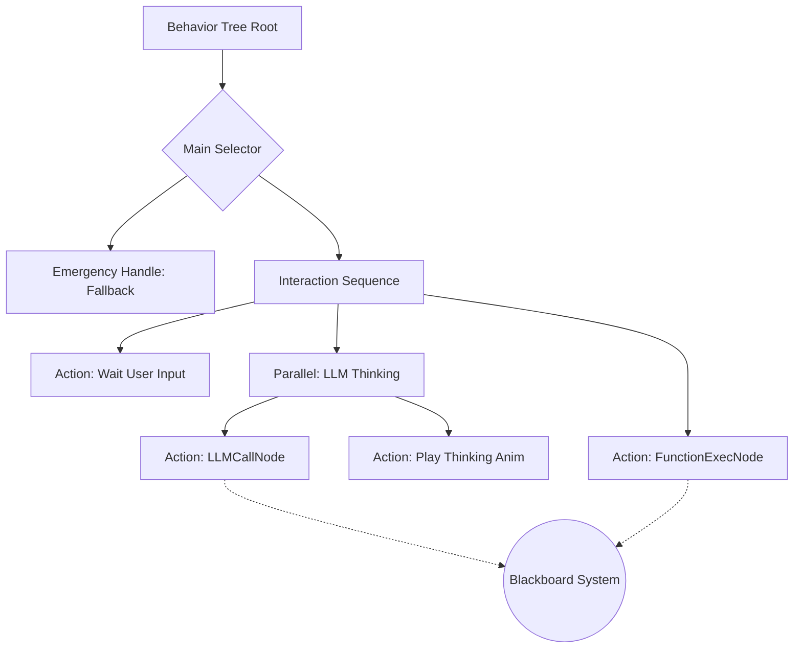

# Q-Penguin 行为树架构演进设计方案 (DONE)

## 一、概述

当前 Q-Penguin 使用简单的 `animationQueue` 处理动作。随着交互逻辑复杂化（如：异步 LLM 调用、多动作并发、错误重试），引入行为树可以提供更强的逻辑控制能力和可扩展性。

我们将基于 `behavior3js` 进行二次开发，并引入 `py_trees` 的 **Parallel** 并发控制和高级装饰器。

## 二、核心架构图



## 三、核心组件扩展

### 3.1 Parallel 节点（参考 py_trees）

`behavior3js` 原生缺乏复杂的并发控制。我们需要实现 `Parallel` 复合节点。

**核心策略**：
- **SuccessOnAll**: 只有当所有子节点都成功时，才返回 `SUCCESS`。
- **SuccessOnOne**: 只要有一个子节点成功，就返回 `SUCCESS`。
- **子节点并发**: 每一帧（Tick）都会遍历并 Tick 所有的子节点，而不像 Sequence 会在第一个 RUNNING 处中断。

**实现草案**：

```typescript
// services/bt/composites/Parallel.ts
import Composite from 'behavior3js/src/core/Composite';
import { SUCCESS, FAILURE, RUNNING } from 'behavior3js/src/constants';

export default class Parallel extends Composite {
  constructor({policy = 'SuccessOnAll', children = []} = {}) {
    super({name: 'Parallel', children});
    this.policy = policy; // 'SuccessOnAll' | 'SuccessOnOne'
  }

  tick(tick) {
    let successCount = 0;
    let failureCount = 0;
    let childCount = this.children.length;

    // 并发执行所有子节点
    for (let i = 0; i < childCount; i++) {
      let status = this.children[i]._execute(tick);

      if (status === SUCCESS) successCount++;
      if (status === FAILURE) failureCount++;
    }

    // 根据策略决定返回状态
    if (this.policy === 'SuccessOnOne' && successCount > 0) {
      return SUCCESS;
    }
    if (this.policy === 'SuccessOnAll' && successCount === childCount) {
      return SUCCESS;
    }
    if (failureCount > 0 && (this.policy === 'SuccessOnAll' || successCount + failureCount === childCount)) {
      return FAILURE;
    }

    return RUNNING;
  }
}
```

### 3.2 LLM 专用节点

#### LLMCallNode (Action)

**功能**: 异步调用 FunctionGemma。

**状态处理**:
- `ENTER`: 初始化 API 请求，并将 Promise 存入 Blackboard。
- `TICK`: 检查 Promise 状态。若未完成返回 `RUNNING`；成功则将结果存入 Blackboard 并返回 `SUCCESS`；失败返回 `FAILURE`。

**实现草案**：

```typescript
// services/bt/actions/LLMCallNode.ts
import Action from 'behavior3js/src/core/Action';
import { RUNNING, SUCCESS, FAILURE } from 'behavior3js/src/constants';
import { sendToFunctionGemma } from '../../functionGemmaService';

export default class LLMCallNode extends Action {
  constructor({settings = null} = {}) {
    super({name: 'LLMCallNode'});
    this.settings = settings; // LLMSettings
  }

  enter(tick) {
    // 初始化 API 请求
    const chatHistory = tick.blackboard.get('chat_history', tick.tree.id) || [];
    const userInput = tick.blackboard.get('last_user_input', tick.tree.id);
    
    // 异步调用，Promise 存入 Blackboard
    const promise = sendToFunctionGemma(chatHistory, userInput, this.settings);
    tick.blackboard.set('llm_promise', promise, tick.tree.id, this.id);
    tick.blackboard.set('llm_status', 'pending', tick.tree.id, this.id);
  }

  tick(tick) {
    const promise = tick.blackboard.get('llm_promise', tick.tree.id, this.id);
    
    if (!promise) {
      return FAILURE;
    }

    // 检查 Promise 状态（简化示例，实际需用 async/await 或状态机）
    if (promise.status === 'pending') {
      return RUNNING;
    } else if (promise.status === 'resolved') {
      // 将结果存入 Blackboard
      tick.blackboard.set('raw_llm_response', promise.result, tick.tree.id);
      tick.blackboard.set('llm_status', 'success', tick.tree.id, this.id);
      return SUCCESS;
    } else {
      tick.blackboard.set('llm_status', 'failed', tick.tree.id, this.id);
      return FAILURE;
    }
  }
}
```

#### FunctionExecNode (Action)

**功能**: 解析 LLMCallNode 存入 Blackboard 的 `tool_calls`。

**行为**: 将解析出的动作序列（如 `['FLY', 'DANCE']`）推送到渲染引擎，执行完毕后返回 `SUCCESS`。

**实现草案**：

```typescript
// services/bt/actions/FunctionExecNode.ts
import Action from 'behavior3js/src/core/Action';
import { SUCCESS, FAILURE } from 'behavior3js/src/constants';

export default class FunctionExecNode extends Action {
  constructor({actionQueueSetter = null} = {}) {
    super({name: 'FunctionExecNode'});
    this.actionQueueSetter = actionQueueSetter; // React setState 函数
  }

  tick(tick) {
    const rawResponse = tick.blackboard.get('raw_llm_response', tick.tree.id);
    
    if (!rawResponse || !rawResponse.toolResult) {
      return FAILURE;
    }

    // 解析工具调用结果
    const actions = rawResponse.toolResult.actions || [];
    
    if (actions.length === 0) {
      return FAILURE;
    }

    // 推送到渲染引擎（通过 React setState）
    if (this.actionQueueSetter) {
      this.actionQueueSetter(actions);
    }

    // 将动作序列存入 Blackboard（供后续节点使用）
    tick.blackboard.set('pending_actions', actions, tick.tree.id);
    
    return SUCCESS;
  }
}
```

## 四、装饰器与容错机制

### 4.1 Retry（重试装饰器）

当 LLM 接口超时或网络波动时，自动重试。

**属性**: `maxAttempts` (最大尝试次数)。

**逻辑**: 如果子节点返回 `FAILURE`，计数并重新 Tick，直到成功或超过最大次数。

**实现草案**：

```typescript
// services/bt/decorators/Retry.ts
import Decorator from 'behavior3js/src/core/Decorator';
import { SUCCESS, FAILURE, RUNNING } from 'behavior3js/src/constants';

export default class Retry extends Decorator {
  constructor({maxAttempts = 3, child = null} = {}) {
    super({child, name: 'Retry'});
    this.maxAttempts = maxAttempts;
  }

  open(tick) {
    tick.blackboard.set('retry_count', 0, tick.tree.id, this.id);
  }

  tick(tick) {
    if (!this.child) {
      return FAILURE;
    }

    let retryCount = tick.blackboard.get('retry_count', tick.tree.id, this.id) || 0;

    while (retryCount < this.maxAttempts) {
      let status = this.child._execute(tick);

      if (status === SUCCESS) {
        return SUCCESS;
      } else if (status === FAILURE) {
        retryCount++;
        tick.blackboard.set('retry_count', retryCount, tick.tree.id, this.id);
      } else {
        // RUNNING 状态，等待下次 tick
        return RUNNING;
      }
    }

    return FAILURE;
  }
}
```

### 4.2 Fallback（兜底机制）

集成 `Selector`（在 `behavior3js` 中称为 `Priority`）。

**用法**: 在树的高层级放置一个 Selector。

**逻辑**: 如果 LLM 流程失败（如网络错误），Selector 会滑向下一个子节点——执行"兜底动作"（如企鹅做出困惑的动作，并提示"网络开小差了"）。

**示例结构**：

```typescript
// 在行为树中使用 Fallback
const fallbackNode = new Selector({
  name: 'LLM_Fallback',
  children: [
    llmCallNode,        // 优先尝试 LLM 调用
    fallbackActionNode  // 失败则执行兜底动作
  ]
});
```

## 五、黑板系统（Blackboard）

我们将使用 `behavior3js` 提供的 `Blackboard` 来解耦数据与逻辑。

**核心数据键值表**：

| Key | 类型 | 说明 |
| :--- | :--- | :--- |
| `chat_history` | Array | 存储对话上下文 |
| `last_user_input` | String | 用户当前发送的消息 |
| `raw_llm_response` | Object | LLM 返回的原始 JSON |
| `pending_actions` | Array | 待执行的工具调用序列 |
| `is_animating` | Boolean | 当前企鹅是否正在进行 3D 动作 |
| `llm_promise` | Promise | LLM 异步调用的 Promise（节点级别） |
| `llm_status` | String | LLM 调用状态：'pending' | 'success' | 'failed'（节点级别） |

**使用示例**：

```typescript
// 在节点中访问 Blackboard
const chatHistory = tick.blackboard.get('chat_history', tick.tree.id);
tick.blackboard.set('last_user_input', userInput, tick.tree.id);

// 节点级别的数据（作用域隔离）
const nodeData = tick.blackboard.get('retry_count', tick.tree.id, nodeId);
```

## 六、命名与调试系统（Naming System）

- **Node Title**: 每个节点应有唯一的 Title（如 `Call_Gemini_API`），方便在调试时追踪哪个节点正在 `RUNNING`。
- **Blackboard Scoping**: 利用 `behavior3js` 的 Tree/Node 作用域，防止不同树实例之间的数据污染。

**调试建议**：

```typescript
// 在节点中添加调试日志
tick(tick) {
  console.log(`[${this.name}] Tick - Status: ${status}`);
  tick._tickNode(this); // behavior3js 内置的调试追踪
  return this.tick(tick);
}
```

## 七、集成步骤建议

### 步骤 1: 引入库

将 `behavior3js` 源码引入项目，或通过 npm 安装：

```bash
npm install behavior3js
# 或
# 将 behavior3js 源码复制到 services/bt/core/
```

### 步骤 2: 定义自定义节点

在 `services/bt/nodes/` 目录下创建自定义节点：

```
services/bt/
├── core/              # behavior3js 核心（或从 npm 引入）
├── composites/
│   └── Parallel.ts    # 并行节点
├── actions/
│   ├── LLMCallNode.ts
│   └── FunctionExecNode.ts
├── decorators/
│   ├── Retry.ts
│   └── Fallback.ts
└── BehaviorTreeManager.ts  # 行为树管理器
```

### 步骤 3: 构建树

编写一个 JSON 或 DSL 来定义行为树结构，或通过代码构建：

```typescript
// services/bt/BehaviorTreeManager.ts
import { BehaviorTree, Blackboard } from 'behavior3js';
import Parallel from './composites/Parallel';
import LLMCallNode from './actions/LLMCallNode';
import FunctionExecNode from './actions/FunctionExecNode';
import Retry from './decorators/Retry';

export class BehaviorTreeManager {
  private tree: BehaviorTree;
  private blackboard: Blackboard;

  constructor(llmSettings: LLMSettings, actionQueueSetter: Function) {
    this.blackboard = new Blackboard();
    
    // 构建行为树
    const root = new Selector({
      name: 'Root',
      children: [
        // 紧急中断分支
        new Condition({
          name: 'CheckEmergency',
          // ... 条件逻辑
        }),
        
        // 交互分支
        new Sequence({
          name: 'InteractionSequence',
          children: [
            new Parallel({
              name: 'LLMThinking',
              policy: 'SuccessOnAll',
              children: [
                new Retry({
                  maxAttempts: 3,
                  child: new LLMCallNode({settings: llmSettings})
                }),
                new Action({
                  name: 'PlayThinkingAnim',
                  // ... 播放思考动画
                })
              ]
            }),
            new FunctionExecNode({actionQueueSetter})
          ]
        })
      ]
    });

    this.tree = new BehaviorTree({
      id: 'penguin_bt',
      root: root
    });
  }

  tick() {
    // 每帧调用
    const status = this.tree.tick(null, this.blackboard);
    return status;
  }
}
```

### 步骤 4: 循环执行

在 `App.tsx` 的 `requestAnimationFrame` 或 `useEffect` 中，每帧调用 `tree.tick()`：

```typescript
// App.tsx
useEffect(() => {
  const btManager = new BehaviorTreeManager(llmSettings, addToQueue);
  
  const tick = () => {
    btManager.tick();
    requestAnimationFrame(tick);
  };
  
  const frameId = requestAnimationFrame(tick);
  return () => cancelAnimationFrame(frameId);
}, [llmSettings]);
```

### 步骤 5: 解耦渲染

`FunctionExecNode` 不直接操作 DOM，而是修改状态机或调用已有的 `addToQueue`。

## 八、下一步行动建议

- [ ] 在 `AVATAR/q_llm_pet/services/` 下创建 `bt` 文件夹。
- [ ] 移植 `behavior3js` 核心代码并转换为 TypeScript。
- [ ] 实现首个 `LLMCallNode` 以替换 `handleSendMessage` 中的直接 API 调用。
- [ ] 实现 `Parallel` 节点，支持 `SuccessOnAll` 和 `SuccessOnOne` 策略。
- [ ] 实现 `Retry` 和 `Fallback` 装饰器。
- [ ] 集成 Blackboard 系统，解耦数据与逻辑。
- [ ] 编写行为树可视化调试工具（可选）。

## 九、总结

本设计方案将 Q-Penguin 从简单的队列动作架构演进为基于行为树的架构，核心优势：

1. **结构化控制**: 通过节点组合实现复杂的交互逻辑。
2. **并发支持**: Parallel 节点支持多动作并发执行。
3. **容错机制**: Retry 和 Fallback 提升系统鲁棒性。
4. **可扩展性**: 新增场景只需添加节点，无需修改现有逻辑。
5. **可调试性**: Blackboard 和命名系统便于问题定位。

结合 `py_trees` 的先进特性和 `behavior3js` 的轻量实现，既保留了实时性，又提供了强大的逻辑控制能力。

