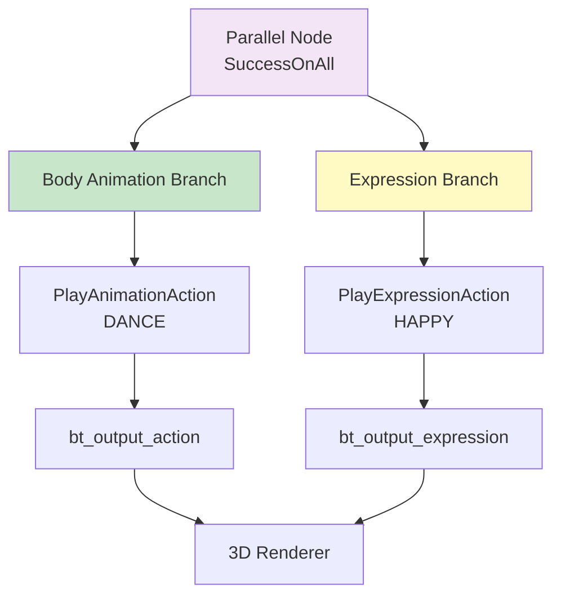

# 表情与动作并行执行指南

## 概述

在数字形象系统中，**表情（Facial Expression）**和**肢体动作（Body Animation）**是两个独立的维度，可以同时执行。本文档详细说明如何在行为树中使用 `Parallel` 节点实现表情和动作的并行控制。

---

## 一、设计理念

### 1.1 为什么需要并行？

**表情和动作是独立的系统**：
- **表情**：控制面部表情（开心、悲伤、惊讶等），持续时间通常较短（1-3秒）
- **动作**：控制肢体动作（走路、跳舞、飞行等），持续时间通常较长（2-10秒）

**并行执行的优势**：
- ✅ 企鹅可以**一边跳舞一边笑**（动作：DANCE，表情：HAPPY）
- ✅ 企鹅可以**一边飞一边惊讶**（动作：FLY，表情：SURPRISED）
- ✅ 表情可以**随时切换**，不打断正在进行的动作

### 1.2 架构设计



---

## 二、实现细节

### 2.1 表情节点：PlayExpressionAction

我们新增了 `PlayExpressionAction` 节点，专门用于控制表情：

```typescript
// services/bt/actions/PlayExpressionAction.ts
export default class PlayExpressionAction extends Action {
  constructor({ expression = 'NEUTRAL', duration = 0, ...options } = {}) {
    super({ 
      name: 'PlayExpressionAction',
      properties: { expression, duration },
      ...options
    });
  }

  tick(tick: Tick): number {
    const expression = this.properties.expression as ExpressionType;
    tick.blackboard?.set('bt_output_expression', expression);
    // ... 持续时间逻辑
    return SUCCESS;
  }
}
```

**关键特性**：
- 输出到独立的黑板键：`bt_output_expression`
- 与 `bt_output_action` 完全独立
- 支持持续时间控制（可选）

### 2.2 表情类型定义

```typescript
export type ExpressionType = 
  | 'NEUTRAL'    // 中性
  | 'HAPPY'      // 开心
  | 'SAD'        // 悲伤
  | 'ANGRY'      // 生气
  | 'SURPRISED'  // 惊讶
  | 'EXCITED'    // 兴奋
  | 'SLEEPY'     // 困倦
  | 'LOVING'     // 爱心
  | 'CONFUSED'   // 困惑
  | 'BLINK';     // 眨眼
```

### 2.3 黑板输出键扩展

| 输出键 | 类型 | 说明 | 消费位置 |
|--------|------|------|----------|
| `bt_output_action` | `ActionType` | 肢体动作 | `BehaviorController` → `setCurrentAction` |
| `bt_output_expression` | `ExpressionType` | 面部表情 | `BehaviorController` → `setCurrentExpression` |
| `bt_output_position` | `[number, number, number]` | 3D 坐标 | `BehaviorController` → `setPenguinPosition` |

---

## 三、使用 Parallel 节点实现并行

### 3.1 基础并行模式

**场景**：企鹅一边跳舞，一边保持开心的表情。

```typescript
new Parallel({
  title: 'Dance with Happy Expression',
  policy: 'SuccessOnAll', // 两个分支都必须成功
  children: [
    // 分支 1：肢体动作
    new PlayAnimationAction({ 
      title: 'Dance Animation',
      action: 'DANCE',
      duration: 5 // 跳舞 5 秒
    }),
    // 分支 2：表情
    new PlayExpressionAction({ 
      title: 'Happy Face',
      expression: 'HAPPY',
      duration: 5 // 保持开心 5 秒
    })
  ]
})
```

**执行流程**：
1. `Parallel` 节点同时 tick 两个子节点
2. `PlayAnimationAction` 设置 `bt_output_action = 'DANCE'`
3. `PlayExpressionAction` 设置 `bt_output_expression = 'HAPPY'`
4. 两个输出同时被 `BehaviorController` 读取并应用到 3D 模型
5. 5 秒后，两个节点都返回 `SUCCESS`，`Parallel` 返回 `SUCCESS`

### 3.2 不同持续时间的并行

**场景**：动作持续 10 秒，但表情只持续 3 秒。

```typescript
new Parallel({
  title: 'Long Action with Short Expression',
  policy: 'SuccessOnAll',
  children: [
    new PlayAnimationAction({ 
      action: 'FLY',
      duration: 10 // 飞行 10 秒
    }),
    new PlayExpressionAction({ 
      expression: 'EXCITED',
      duration: 3 // 兴奋表情只持续 3 秒
    })
  ]
})
```

**执行流程**：
1. 前 3 秒：动作 = FLY，表情 = EXCITED
2. 3 秒后：`PlayExpressionAction` 返回 `SUCCESS`，但 `Parallel` 继续运行
3. 4-10 秒：动作 = FLY，表情 = NEUTRAL（默认）
4. 10 秒后：`PlayAnimationAction` 返回 `SUCCESS`，`Parallel` 返回 `SUCCESS`

**注意**：当表情节点完成后，表情会回到默认值（NEUTRAL），除非有其他节点继续设置表情。

### 3.3 持续表情 + 动作序列

**场景**：保持开心表情，同时执行一系列动作。

```typescript
new Parallel({
  title: 'Continuous Expression with Action Sequence',
  policy: 'SuccessOnAll',
  children: [
    // 分支 1：持续的表情（不设置 duration，一直保持）
    new PlayExpressionAction({ 
      title: 'Keep Happy',
      expression: 'HAPPY'
      // 不设置 duration，会立即返回 SUCCESS，但表情会保持
    }),
    // 分支 2：动作序列
    new Sequence({
      title: 'Action Sequence',
      children: [
        new PlayAnimationAction({ action: 'WAVE', duration: 2 }),
        new PlayAnimationAction({ action: 'JUMP', duration: 1 }),
        new PlayAnimationAction({ action: 'SPIN', duration: 2 })
      ]
    })
  ]
})
```

**执行流程**：
1. `PlayExpressionAction` 立即返回 `SUCCESS`（因为没有 duration），但表情已设置
2. `Sequence` 依次执行 WAVE → JUMP → SPIN
3. 整个过程中，表情始终保持 HAPPY
4. 当 `Sequence` 完成后，`Parallel` 返回 `SUCCESS`

---

## 四、高级模式

### 4.1 表情跟随动作

**场景**：根据动作自动切换表情。

```typescript
new Sequence({
  title: 'Action-Driven Expression',
  children: [
    new Parallel({
      title: 'Fly with Surprised',
      policy: 'SuccessOnAll',
      children: [
        new PlayAnimationAction({ action: 'FLY', duration: 3 }),
        new PlayExpressionAction({ expression: 'SURPRISED', duration: 3 })
      ]
    }),
    new Parallel({
      title: 'Land with Happy',
      policy: 'SuccessOnAll',
      children: [
        new PlayAnimationAction({ action: 'IDLE', duration: 2 }),
        new PlayExpressionAction({ expression: 'HAPPY', duration: 2 })
      ]
    })
  ]
})
```

### 4.2 表情作为装饰

**场景**：在动作执行过程中，表情可以随时被更高优先级的节点覆盖。

```typescript
new Priority({
  title: 'Expression as Decoration',
  children: [
    // 高优先级：用户点击时，立即切换表情
    new Sequence({
      children: [
        new CheckBlackboardCondition({ key: 'isClicked' }),
        new PlayExpressionAction({ expression: 'EXCITED', duration: 1 })
      ]
    }),
    // 低优先级：默认表情 + 动作
    new Parallel({
      policy: 'SuccessOnAll',
      children: [
        new PlayAnimationAction({ action: 'IDLE' }),
        new PlayExpressionAction({ expression: 'NEUTRAL' })
      ]
    })
  ]
})
```

### 4.3 表情序列

**场景**：表情也可以有序列变化。

```typescript
new Parallel({
  title: 'Action with Expression Sequence',
  policy: 'SuccessOnAll',
  children: [
    // 动作：持续跳舞
    new PlayAnimationAction({ action: 'DANCE', duration: 6 }),
    // 表情：变化序列
    new Sequence({
      title: 'Expression Sequence',
      children: [
        new PlayExpressionAction({ expression: 'HAPPY', duration: 2 }),
        new PlayExpressionAction({ expression: 'EXCITED', duration: 2 }),
        new PlayExpressionAction({ expression: 'LOVING', duration: 2 })
      ]
    })
  ]
})
```

---

## 五、在 3D 渲染器中应用

### 5.1 React 状态管理

```typescript
// App.tsx
const [currentAction, setCurrentAction] = useState<ActionType>('IDLE');
const [currentExpression, setCurrentExpression] = useState<ExpressionType>('NEUTRAL');

// BehaviorController
useFrame(() => {
  bt.tick(null, blackboard);
  
  // 读取动作
  const nextAction = blackboard.get('bt_output_action');
  if (nextAction) {
    setCurrentAction(nextAction);
    blackboard.set('bt_output_action', null);
  }
  
  // 读取表情
  const nextExpression = blackboard.get('bt_output_expression');
  if (nextExpression) {
    setCurrentExpression(nextExpression);
    blackboard.set('bt_output_expression', null);
  }
});
```

### 5.2 3D 模型应用

```typescript
// Penguin3D.tsx
<Penguin3D 
  currentAction={currentAction}
  currentExpression={currentExpression} // 新增
  position={penguinPosition}
/>
```

在 `Penguin3D` 组件中，你可以：
- 根据 `currentAction` 控制肢体动画
- 根据 `currentExpression` 控制面部表情（通过材质、贴图或混合形状）

---

## 六、实战案例

### 案例 1：开心的舞蹈

```typescript
new Parallel({
  title: 'Happy Dance',
  policy: 'SuccessOnAll',
  children: [
    new PlayAnimationAction({ action: 'DANCE', duration: 5 }),
    new PlayExpressionAction({ expression: 'HAPPY', duration: 5 })
  ]
})
```

### 案例 2：惊讶的飞行

```typescript
new Parallel({
  title: 'Surprised Flight',
  policy: 'SuccessOnAll',
  children: [
    new PlayAnimationAction({ action: 'FLY', duration: 8 }),
    new Sequence({
      title: 'Expression Changes',
      children: [
        new PlayExpressionAction({ expression: 'SURPRISED', duration: 2 }),
        new PlayExpressionAction({ expression: 'EXCITED', duration: 3 }),
        new PlayExpressionAction({ expression: 'HAPPY', duration: 3 })
      ]
    })
  ]
})
```

### 案例 3：LLM 驱动的表情 + 动作

```typescript
new MemSequence({
  title: 'LLM Command with Expression',
  children: [
    new CheckBlackboardCondition({ key: 'hasNewInput' }),
    new LLMCallNode(), // FunctionGemma 返回动作和表情
    new FunctionExecNode() // 解析并设置 pendingActions 和 pendingExpression
  ]
})

// FunctionExecNode 可以同时设置：
blackboard.set('pendingActions', ['DANCE', 'JUMP']);
blackboard.set('pendingExpression', 'HAPPY');

// 然后在 ExecuteActionSequence 中使用 Parallel：
new Parallel({
  children: [
    new ExecuteActionSequence(), // 执行动作序列
    new PlayExpressionAction({ expression: blackboard.get('pendingExpression') })
  ]
})
```

---

## 七、注意事项

### 7.1 Parallel 策略选择

- **SuccessOnAll**：两个分支都必须成功（推荐用于表情+动作）
- **SuccessOnOne**：只要有一个成功就返回（不推荐用于表情+动作）

### 7.2 表情的持久性

- 如果 `PlayExpressionAction` 没有设置 `duration`，它会立即返回 `SUCCESS`，但表情会**保持**直到被其他节点覆盖
- 如果设置了 `duration`，到期后表情会回到默认值（除非有其他节点继续设置）

### 7.3 性能考虑

- `Parallel` 节点会同时 tick 所有子节点，确保它们都是**轻量级**的
- 表情切换应该很快（< 1ms），不会影响性能

---

## 八、总结

通过 `Parallel` 节点，我们可以轻松实现表情和动作的并行执行：

1. **创建表情节点**：`PlayExpressionAction`
2. **使用 Parallel 组合**：将动作和表情放在 `Parallel` 的两个分支中
3. **独立输出**：通过不同的黑板键（`bt_output_action` vs `bt_output_expression`）实现解耦
4. **灵活控制**：表情可以随时切换，不打断动作

这样，你的数字形象就能**一边做动作，一边表达情绪**，变得更加生动和智能！

---

*文档版本: v1.0*  
*最后更新: 2025-01-XX*

