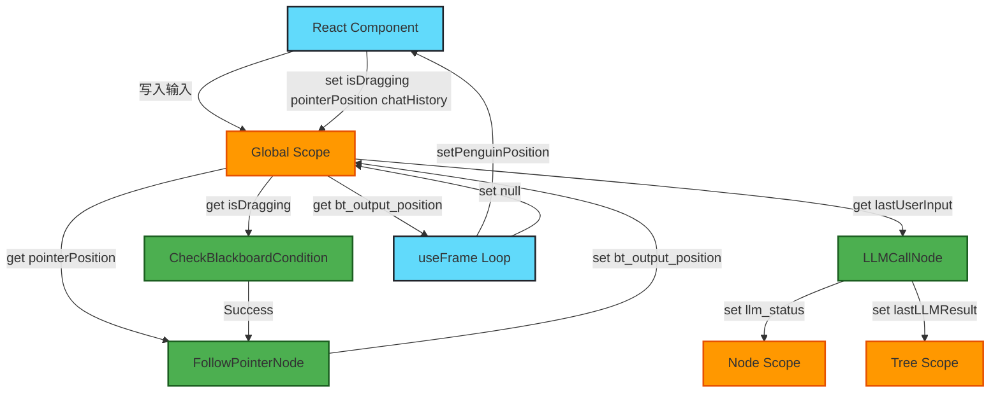

## 使用流程说明

### 典型流程：拖拽交互

1. React 写入输入：用户右键拖拽时，App.tsx 向黑板全局作用域写入 isDragging: true，并持续更新 pointerPosition。
2. BT 读取输入：CheckBlackboardCondition 检查 isDragging，条件满足则进入 FollowPointerNode。
3. BT 处理并输出：FollowPointerNode 读取 pointerPosition，计算后写入 bt_output_position。
4. React 读取输出：BehaviorController 的 useFrame 读取 bt_output_position，更新 penguinPosition，并清空该值（消费模式）。

### LLM 调用流程（多作用域）

1. 全局输入：用户输入后，写入全局作用域的 lastUserInput 和 hasNewInput。
2. 节点作用域状态：LLMCallNode 在节点作用域（treeId, nodeId）维护 llm_status（idle → processing → success/failed），避免多实例冲突。
3. 树作用域结果：LLM 响应成功后，写入树作用域（treeId）的 lastLLMResult，供后续节点使用。
4. 输出回全局：处理完成后，通过全局作用域输出动作序列或聊天消息。

### 作用域选择规则

* 全局作用域：React ↔ BT 双向通信，如用户输入、UI 状态、BT 输出。
* 树作用域：树内共享数据，如 pendingActions、lastLLMResult。
* 节点作用域：节点私有状态，如 llm_status、retry_count。

### 核心特点

* 解耦：React 与 BT 节点通过黑板通信，不直接依赖。
* 作用域隔离：三层作用域避免命名冲突和数据污染。
* 消费模式：输出数据读取后清空，避免重复处理。
