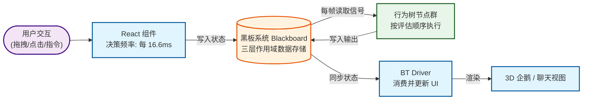
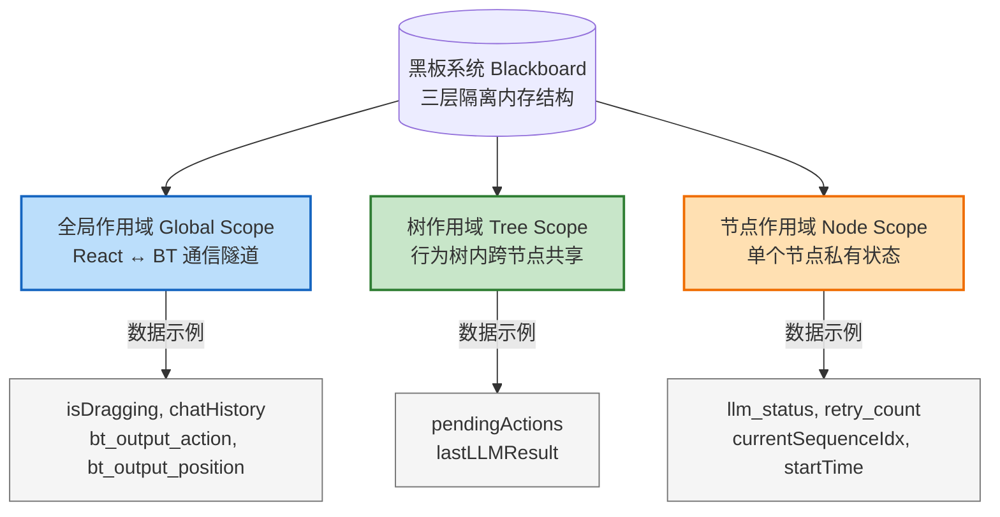
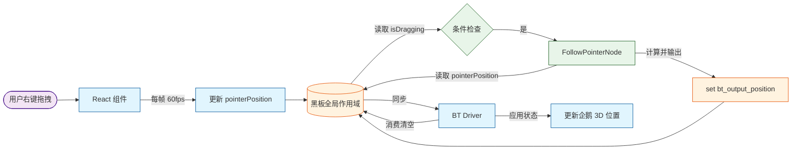
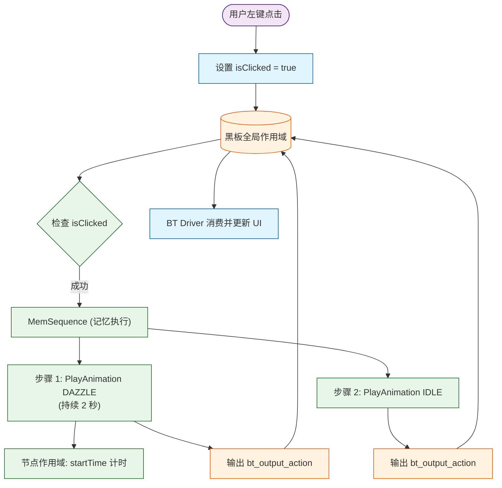
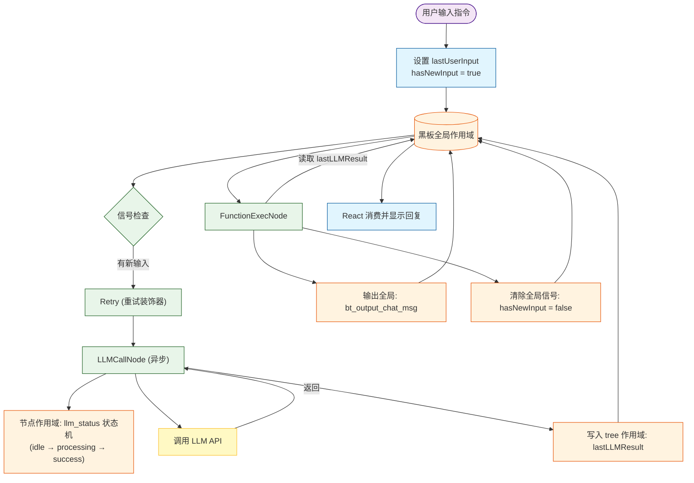
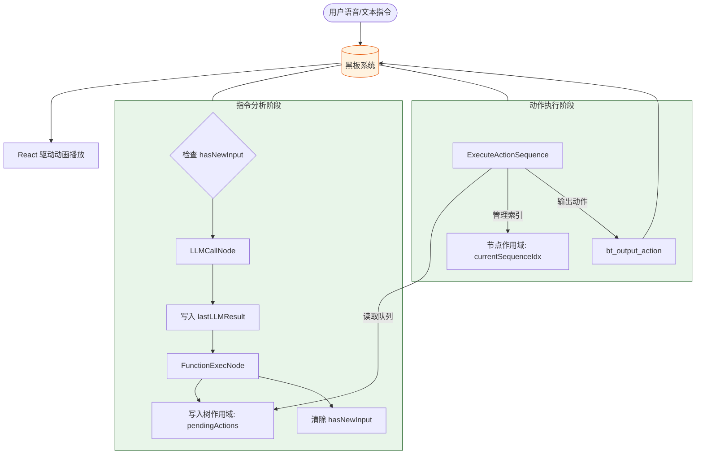
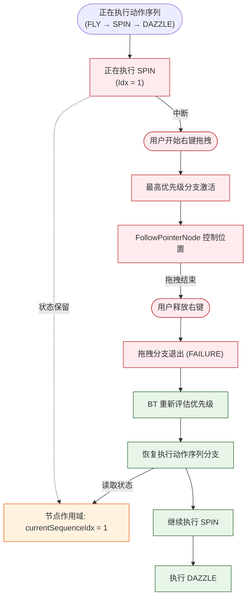

## 黑板系统概述

黑板系统（Blackboard Pattern）是行为树架构中的核心通信机制，它采用三层作用域设计，实现了 React 组件与行为树节点之间的完全解耦。

### 三层作用域架构



**作用域选择规则：**
- **全局作用域**：React 与 BT 双向通信，所有节点可访问。
- **树作用域**：同一行为树实例内的节点共享，隔离不同树实例。
- **节点作用域**：节点私有状态，防止多实例冲突。

### 核心 API

```typescript
// 全局作用域（默认）
blackboard.set('key', value);
blackboard.get('key');

// 树作用域
blackboard.set('key', value, treeId);
blackboard.get('key', treeId);

// 节点作用域
blackboard.set('key', value, treeId, nodeId);
blackboard.get('key', treeId, nodeId);
```

---

## 案例一：拖拽交互（右键拖拽企鹅）

### 场景描述
用户右键按住企鹅并拖动鼠标，企鹅应该实时跟随鼠标位置移动。

### 行为树分支

```typescript
// Priority 分支 1（最高优先级）
Sequence({
  children: [
    CheckBlackboardCondition({ key: 'isDragging', value: true, scope: 'global' }),
    FollowPointerNode()
  ]
})
```

### 数据流程图



### 黑板操作步骤

| 步骤 | 操作者 | 操作 | 作用域 | 键名 | 值 |
|------|--------|------|--------|------|-----|
| 1 | React | `set` | Global | `isDragging` | `true` |
| 2 | React (每帧) | `set` | Global | `pointerPosition` | `{x, y, z}` |
| 3 | CheckBlackboardCondition | `get` | Global | `isDragging` | `true` |
| 4 | FollowPointerNode | `get` | Global | `pointerPosition` | `{x, y, z}` |
| 5 | FollowPointerNode | `set` | Global | `bt_output_position` | `[x, y, z]` |
| 6 | React (useFrame) | `get` | Global | `bt_output_position` | `[x, y, z]` |
| 7 | React (useFrame) | `set` | Global | `bt_output_position` | `null` (消费) |
| 8 | React | `set` | Global | `isDragging` | `false` |

### 关键代码片段

**React 组件写入输入：**
```typescript
// App.tsx - onPointerDown
onPointerDown={(e) => {
  if (e.button === 2) { // 右键
    blackboard.set('isDragging', true);
  }
}}

// BehaviorController - useFrame (每帧更新鼠标位置)
useFrame((state) => {
  if (blackboard.get('isDragging')) {
    // 将 2D 鼠标坐标投影到 3D 空间
    blackboard.set('pointerPosition', { 
      x: state.pointer.x * factorX, 
      y: state.pointer.y * factorY + 1.5, 
      z: 0 
    });
  }
});
```

**行为树节点读取并输出：**
```typescript
// FollowPointerNode.ts
tick(tick: Tick): number {
  const isDragging = tick.blackboard?.get('isDragging');
  const pointerPosition = tick.blackboard?.get('pointerPosition');
  
  if (isDragging && pointerPosition) {
    // 输出到全局作用域供 React 消费
    tick.blackboard?.set('bt_output_position', [
      pointerPosition.x, 
      pointerPosition.y, 
      pointerPosition.z
    ]);
    return RUNNING;
  }
  return SUCCESS;
}
```

**React 读取输出（消费模式）：**
```typescript
// App.tsx - BehaviorController.useFrame
const nextPos = blackboard.get('bt_output_position');
if (nextPos) {
  setPenguinPosition(nextPos);
  blackboard.set('bt_output_position', null); // 立即清除，防止重复处理
}
```

---

## 案例二：点击交互（左键点击触发动画）

### 场景描述
用户左键点击企鹅，企鹅播放 DAZZLE（炫技）动画 2 秒后恢复 IDLE。

### 行为树分支

```typescript
// PenguinBT.ts
Priority({
  children: [
    // ...
    MemSequence({
      children: [
        new CheckBlackboardCondition({ key: 'isClicked', value: true, scope: 'global' }),
        new PlayAnimationAction({ action: 'DAZZLE', duration: 2 }),
        new PlayAnimationAction({ action: 'IDLE' })
      ]
    }),
    // ...
  ]
})
```

**注意**：使用 `MemSequence` 而不是普通 `Sequence`，确保动画序列不会被高优先级分支中断后重新开始。

### 数据流程图



### 黑板操作步骤

| 步骤 | 操作者 | 操作 | 作用域 | 键名 | 值 |
|------|--------|------|--------|------|-----|
| 1 | React | `set` | Global | `isClicked` | `true` |
| 2 | CheckBlackboardCondition | `get` | Global | `isClicked` | `true` |
| 3 | PlayAnimationAction (DAZZLE) | `set` | Node | `startTime` | `Date.now()` |
| 4 | PlayAnimationAction (DAZZLE) | `set` | Global | `bt_output_action` | `'DAZZLE'` |
| 5 | PlayAnimationAction (DAZZLE) | `get` | Node | `startTime` | `开始时间` |
| 6 | PlayAnimationAction (IDLE) | `set` | Global | `bt_output_action` | `'IDLE'` |
| 7 | React (500ms后) | `set` | Global | `isClicked` | `false` |

### 关键代码片段

**React 写入交互信号：**
```typescript
// App.tsx
<Penguin3D 
  onClick={(e) => {
    if (e.button === 0) { // 左键点击
      blackboard.set('isClicked', true);
      // 500ms 后自动清除信号，防止触发两次
      setTimeout(() => blackboard.set('isClicked', false), 500);
    }
  }}
/>
```

**行为树节点处理：**
```typescript
// PlayAnimationAction.ts
open(tick: Tick): void {
  // 在节点私有作用域存储开始时间，支持多实例并行
  tick.blackboard?.set('startTime', Date.now(), tick.tree?.id, this.id);
}

tick(tick: Tick): number {
  const { action, duration } = this.properties;
  
  // 持续输出动画指令
  tick.blackboard?.set('bt_output_action', action);

  if (duration > 0) {
    const startTime = tick.blackboard?.get('startTime', tick.tree?.id, this.id);
    if (Date.now() - startTime < duration * 1000) {
      return RUNNING; // 时间未到，继续执行
    }
  }
  return SUCCESS;
}
```

---

## 案例三：文本指令（纯文本响应）

### 场景描述
用户输入文本指令 "你好"，LLM 返回纯文本回复，不触发任何动作。

### 行为树分支

```typescript
// PenguinBT.ts
MemSequence({
  children: [
    new CheckBlackboardCondition({ key: 'hasNewInput', value: true, scope: 'global' }),
    new Retry({ maxAttempts: 2, child: new LLMCallNode() }),
    new FunctionExecNode()
  ]
})
```

### 数据流程图



### 黑板操作步骤

| 步骤 | 操作者 | 操作 | 作用域 | 键名 | 值 |
|------|--------|------|--------|------|-----|
| 1 | React | `set` | Global | `lastUserInput` | `'你好'` |
| 2 | React | `set` | Global | `hasNewInput` | `true` |
| 3 | LLMCallNode | `set` | Node | `llm_status` | `'idle'` |
| 4 | LLMCallNode | `get` | Global | `lastUserInput` | `'你好'` |
| 5 | LLMCallNode | `set` | Node | `llm_status` | `'processing'` |
| 6 | LLMCallNode | `set` | Tree | `lastLLMResult` | `{text: '...'}` |
| 7 | FunctionExecNode | `get` | Tree | `lastLLMResult` | `{text: '...'}` |
| 8 | FunctionExecNode | `set` | Global | `bt_output_chat_msg` | `{content: '...'}` |
| 9 | FunctionExecNode | `set` | Global | `hasNewInput` | `false` |

### 关键代码片段

**React 发送指令：**
```typescript
// App.tsx
const handleSendMessage = () => {
  blackboard.set('lastUserInput', inputText);
  blackboard.set('hasNewInput', true); // 激活 BT 逻辑分支
};
```

**异步节点状态管理：**
```typescript
// LLMCallNode.ts
tick(tick: Tick): number {
  const status = tick.blackboard?.get('llm_status', tick.tree?.id, this.id);

  if (status === 'idle') {
    // 发起异步调用，切换状态为 processing
    tick.blackboard?.set('llm_status', 'processing', tick.tree?.id, this.id);
    callLLM(input).then(res => {
      tick.blackboard?.set('llm_response', res, tick.tree?.id, this.id);
      tick.blackboard?.set('llm_status', 'success', tick.tree?.id, this.id);
    });
    return RUNNING;
  }

  if (status === 'processing') return RUNNING;

  if (status === 'success') {
    const res = tick.blackboard?.get('llm_response', tick.tree?.id, this.id);
    tick.blackboard?.set('lastLLMResult', res, tick.tree?.id); // 存入树作用域供后续节点使用
    return SUCCESS;
  }
}
```

**消费信号并输出：**
```typescript
// FunctionExecNode.ts
tick(tick: Tick): number {
  const result = tick.blackboard?.get('lastLLMResult', tick.tree?.id);
  if (result.text) {
    tick.blackboard?.set('bt_output_chat_msg', { role: 'model', content: result.text });
  }
  // 重要：流程结束，清除输入信号，防止进入死循环
  tick.blackboard?.set('hasNewInput', false);
  return SUCCESS;
}
```

---

## 案例四：文本指令（工具调用 - 动作序列）

### 场景描述
用户输入 "Fly around the stage!"，LLM 返回动作序列 `['FLY', 'SPIN', 'DAZZLE']`，企鹅按顺序执行。

### 行为树分支

```typescript
// PenguinBT.ts
Priority({
  children: [
    // 分支 A: 指令解析 (见案例三)
    // 分支 B: 动作执行 (优先级高于 IDLE)
    new ExecuteActionSequence(),
    // 分支 C: 默认行为
    new PlayAnimationAction({ action: 'IDLE' })
  ]
})
```

### 数据流程图



### 关键代码片段

**FunctionExecNode 分发动作队列：**
```typescript
// FunctionExecNode.ts
if (result.toolResult?.actions) {
  // 将动作列表存入树作用域，解耦执行过程
  tick.blackboard?.set('pendingActions', result.toolResult.actions, tick.tree?.id);
}
```

**ExecuteActionSequence 状态机执行：**
```typescript
// ExecuteActionSequence.ts
tick(tick: Tick): number {
  const actions = tick.blackboard?.get('pendingActions', tick.tree?.id) || [];
  if (actions.length === 0) return FAILURE;

  // 从节点作用域获取当前执行到第几个动作
  const currentIdx = tick.blackboard?.get('currentSequenceIdx', tick.tree?.id, this.id) || 0;
  const startTime = tick.blackboard?.get('sequenceStartTime', tick.tree?.id, this.id) || 0;

  if (currentIdx >= actions.length) {
    tick.blackboard?.set('pendingActions', [], tick.tree?.id); // 清空队列
    return SUCCESS;
  }

  const action = actions[currentIdx];
  const duration = ACTION_DURATIONS[action] * 1000;

  if (startTime === 0) {
    tick.blackboard?.set('bt_output_action', action);
    tick.blackboard?.set('sequenceStartTime', Date.now(), tick.tree?.id, this.id);
    return RUNNING;
  }

  if (Date.now() - startTime >= duration) {
    // 当前动作完成，步进到下一个
    tick.blackboard?.set('currentSequenceIdx', currentIdx + 1, tick.tree?.id, this.id);
    tick.blackboard?.set('sequenceStartTime', 0, tick.tree?.id, this.id);
  }
  return RUNNING;
}
```

---

## 案例五：复杂场景 - 拖拽中断动作序列

### 场景描述
企鹅正在执行动作序列 `['FLY', 'SPIN', 'DAZZLE']`（正在 SPIN），用户突然右键拖拽企鹅。拖拽结束后，企鹅应继续完成 SPIN 和后续的 DAZZLE。

### 行为树分支优先级

```typescript
// PenguinBT.ts
Priority({
  children: [
    // 1. 拖拽交互 (最高优先级)
    Sequence({
      children: [
        new CheckBlackboardCondition({ key: 'isDragging', value: true }),
        new FollowPointerNode()
      ]
    }),
    
    // 2. 动作序列执行 (MemSequence 保护)
    new ExecuteActionSequence(),
    
    // 3. 默认行为
    new PlayAnimationAction({ action: 'IDLE' })
  ]
})
```

### 中断恢复流程图



### 关键代码片段

**节点作用域的数据持久性：**
```typescript
// ExecuteActionSequence.ts (逻辑片段)
// 即使节点因为优先级被跳过（不再被 tick），
// 存储在节点作用域中的 currentSequenceIdx = 1 依然存在。
// 当高优先级分支失效，ExecuteActionSequence 重新获得 tick 机会时，
// 它会从 1 而不是 0 开始。

const currentIdx = tick.blackboard?.get('currentSequenceIdx', tick.tree?.id, this.id) || 0;
```

**黑板系统作用域设计优势：**
1. **隔离性**：`currentSequenceIdx` 存放在 `(treeId, nodeId)` 下，即使有多个企鹅实例，也不会互串。
2. **持久性**：只要行为树实例不销毁，节点作用域数据一直保留，完美支持“中断-恢复”语义。
3. **解耦**：React 层完全不知道动作序列的存在，它只负责在 `isDragging` 为 true 时提供坐标。

---

## 黑板系统最佳实践

### 1. 键名约定

| 前缀 | 用途 | 示例 |
|------|------|------|
| `bt_output_*` | 行为树输出给 React | `bt_output_action`, `bt_output_position`, `bt_output_chat_msg` |
| `is*` | 布尔状态标志 | `isDragging`, `isClicked`, `hasNewInput` |
| `last*` | 最后的值 | `lastUserInput`, `lastLLMResult` |
| `pending*` | 待处理队列 | `pendingActions` |
| `*_status` | 状态枚举 | `llm_status`, `execution_status` |
| `*_count` | 计数器 | `retry_count`, `attempt_count` |

### 2. 作用域选择指南

```typescript
// ✅ 全局作用域：React 与 BT 通信
blackboard.set('userInput', text);           // 用户输入
blackboard.set('bt_output_action', 'FLY');   // BT 输出
blackboard.set('chatHistory', [...]);        // 共享历史

// ✅ 树作用域：树内共享数据
blackboard.set('pendingActions', [...], treeId);  // 动作队列
blackboard.set('lastLLMResult', {...}, treeId);   // LLM 结果

// ✅ 节点作用域：节点私有状态
blackboard.set('llm_status', 'processing', treeId, nodeId);
blackboard.set('retry_count', 2, treeId, nodeId);
blackboard.set('startTime', Date.now(), treeId, nodeId);
```

### 3. 消费模式

对于 BT 输出给 React 的数据，采用消费模式，读取后立即清空：

```typescript
// React useFrame
const output = blackboard.get('bt_output_action');
if (output) {
  handleOutput(output);
  blackboard.set('bt_output_action', null); // 立即消费
}
```

### 4. 信号管理

布尔信号应该有明确的设置和清除时机：

```typescript
// 设置信号
blackboard.set('hasNewInput', true);

// 在处理完成后清除（由处理节点负责）
// FunctionExecNode.ts
blackboard.set('hasNewInput', false); // 流程结束时清除

// 或者设置超时自动清除
setTimeout(() => {
  blackboard.set('isClicked', false);
}, 500);
```

### 5. 异步操作的状态管理

对于异步操作（如 LLM 调用），使用节点作用域管理状态：

```typescript
// LLMCallNode.ts
open(tick: Tick) {
  // 初始化状态
  tick.blackboard.set('llm_status', 'idle', treeId, this.id);
}

tick(tick: Tick) {
  const status = tick.blackboard.get('llm_status', treeId, this.id);
  
  if (status === 'idle') {
    // 发起异步请求
    tick.blackboard.set('llm_status', 'processing', treeId, this.id);
    apiCall().then((result) => {
      tick.blackboard.set('llm_status', 'success', treeId, this.id);
      tick.blackboard.set('llm_response', result, treeId, this.id);
    });
    return RUNNING;
  }
  
  if (status === 'processing') {
    return RUNNING; // 等待中
  }
  
  if (status === 'success') {
    // 处理结果
    return SUCCESS;
  }
}
```

---

## 总结

黑板系统通过三层作用域设计，实现了：

1. **完全解耦**：React 组件与行为树节点无需直接引用
2. **作用域隔离**：避免命名冲突和数据污染
3. **状态持久化**：节点状态在中断后能够恢复
4. **清晰的职责划分**：每个作用域有明确的用途

通过以上案例，我们可以看到黑板系统如何在实际应用中协调复杂的交互逻辑，确保系统的可维护性和可扩展性。
